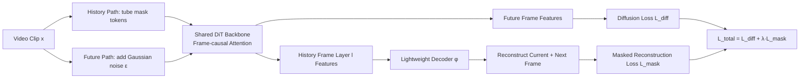

# Improving Autoregressive Video Modeling with History Understanding

**Conference**: ICLR 2026  
**OpenReview**: [https://openreview.net/forum?id=kd2V5Bkw1D](https://openreview.net/forum?id=kd2V5Bkw1D)  
**Code**: To be confirmed  
**Area**: Video Generation / Autoregressive Video Modeling  
**Keywords**: VideoAR, Diffusion Models, Masked Modeling, History Representation, Self-supervised Representation Learning  

## TL;DR
This paper identifies the "quality of internal representations of historical frames" as an overlooked key variable in diffusion-based autoregressive video generation (VideoAR). It proposes **MiMo (Masked History Modeling)**, which performs masked reconstruction of clean historical frames alongside the diffusion denoising objective. This approach learns stronger history representations in a self-supervised manner, significantly improving convergence speed and generation quality without relying on Visual Foundation Models (VFM).

## Background & Motivation
- **Background**: VideoAR sequentially predicts future frames given historical ones, naturally fitting the causal structure of videos and supporting variable-length generation. While early AR methods lagged behind non-AR ones, recent diffusion-based VideoAR models (DFoT, ACDiT, MAGI, FAR) have returned to competitiveness by approximating complex conditional distributions through iterative denoising.
- **Limitations of Prior Work**: In T2I/T2V and class-conditional generation, "stronger conditional representations" almost always improve generation quality. However, in VideoAR, historical frame representations used as condition signals are learned passively via the diffusion objective and have not been specifically optimized. The diffusion objective focuses on modeling low-level details of future frames, which can **disturb representation learning**, preventing high-quality history representations from "emerging spontaneously."
- **Key Challenge**: A shortcut is distilling features from VFMs (e.g., REPA), but VFM training is expensive and carries OOD risks in new video domains. The challenge is enabling the model to learn semantically aligned, predictive, and robust history representations **without introducing VFMs or significantly altering the architecture**.
- **Goal**: Systematically verify the causal relationship between "history representation quality" and "VideoAR performance," and design a VFM-free, lightweight representation learning objective for diffusion VideoAR.
- **Core Idea**: **Utilize historical frames for dual purposes**—as clean conditions for denoising future frames and as inputs for masked self-supervised reconstruction. By performing masked modeling on clean history (rather than noisy inputs), the model learns strong representations without interfering with diffusion denoising.

## Method

### Overall Architecture
MiMo adopts the Complete Teacher Forcing (CTF) training paradigm, providing the model with **clean (noise-free) historical frames** during training to eliminate the train-test distribution shift of diffusion forcing. A video sequence is split into two paths: one path masks tokens of historical frames $h$ using random tube masking; the other path adds Gaussian noise to future frames $f$. Beyond the standard diffusion denoising loss, a lightweight decoder reconstructs the current and next frames from the intermediate features of the masked history. The two objectives are trained jointly. During inference, the decoder is discarded, and the model generates frames via standard AR denoising with KV caching.

### Key Designs

**1. History representation as a lever: Controlled experiments.** The method is grounded in preliminary analysis. Quantifying history representation quality via linear probing accuracy and CKNNA (measuring similarity to VFM representations) on Kinetics-600 reveals a positive correlation with FVD. Notably, a significant gap remains compared to pre-trained representations during training. A controlled study (Table 1) using ACDiT-B shows that while enhancing future frame representations helps, **enhancing history frame representations** specifically reduces FVD from 54.8 to 40.0, validating the design.

**2. Masked modeling on clean history, not noisy inputs.** This is the fundamental difference between MiMo and prior "masked diffusion" works. Applying masking to noisy diffusion inputs often degrades denoising performance. MiMo applies tube masking (ratio $r$) only to clean history frames $h^{\mathcal{M}}_{1:t}$, while the diffusion loss acts normally on future frames:

$$\mathcal{L}_{\text{diff}}=\mathbb{E}\big[\lVert \alpha_\tau\epsilon_t-\sigma_\tau f_t-v_\theta(f^{(\tau)}_t;\tau,h^{\mathcal{M}}_{1:t})\rVert_2^2\big]$$

Since masking occurs on condition signals rather than denoising targets, it causes minimal interference, requiring only minor modifications like QK normalization, RoPE, and independent LayerNorm for history frames.

**3. Flexible reconstruction targets: Predicting "Current + Next."** Unlike the diffusion loss which only recovers the clean version of the current noisy frame, masked history modeling allows masked tokens to reconstruct a set of target frames $\mathcal{T}_t=\{t,\,t+1\}$:

$$\mathcal{L}_{\text{mask}}=\mathbb{E}\Big[\tfrac{1}{|\mathcal{T}_t|}\sum_{t'\in\mathcal{T}_t}\lVert h_{t'}-\varphi_\theta(t'-t,\,v^{h,l}_\theta(f^{(\tau)}_t;\tau,h^{\mathcal{M}}_{1:t}))\rVert_2^2\Big]$$

Predicting the "next frame" forces historical representations to be **predictive and dynamic** rather than just reconstructing the present. Ablations show this outperforms reconstructing only the current frame (37.8 vs 36.6).

**4. Unified objective and seamless inference.** The final objective is $\mathcal{L}_{\text{total}}=\mathcal{L}_{\text{diff}}+\lambda\mathcal{L}_{\text{mask}}$ (optimal $\lambda=0.5$). Training computation is slightly reduced due to token masking. During inference, the decoder is discarded, and the model functions as a standard diffusion-based AR model, naturally supporting variable-length generation with increased robustness to historical perturbations.

## Key Experimental Results

### Main Results (Systematic Comparison, FVD↓)

| Method | Type | Kinetics Prediction | UCF Uncond. | UCF Class-Cond. |
|---|---|---|---|---|
| DFoT-XL† | AR | 11.1 | – | – |
| MAGI-XL | AR | 11.5 | 298 | – |
| ACDiT-XL | AR | – | – | 111 |
| FAR-XL | AR | – | 279 | 108 |
| **MiMo-XL** | AR | **8.3** | **240** | **98** |
| VAE Recon (Upper) | – | 3.7 | 15 | 15 |

MiMo achieves new AR SOTA across all tasks, notably improving UCF unconditional FVD by nearly 40 points compared to FAR and 58 points compared to MAGI.

### Ablation Study (DiT-B, Kinetics 100K steps)

| Dimension | Configuration | FVD↓ |
|---|---|---|
| Baseline | ACDiT (No Masked History Modeling) | 54.8 |
| vs. REPA | REPA-History / Future / Both | 40.0 / 40.3 / 36.5 |
| | **MiMo (No VFM)** | 36.6 |
| | MiMo + REPA-Both | **34.1** |
| Target | Current / Next / Current+Next(MiMo) | 41.8 / 37.8 / 36.6 |
| Position $l$ | 12 / 11 / 10 / 9 | 36.6 / 35.8 / 35.8 / 37.6 |
| Architecture | Vanilla / +RoPE / +Indep. LN | 37.8 / 37.3 / 36.6 |

### Key Findings
- **Competitive with VFM distillation**: MiMo (36.6) matches REPA-Both (36.5) without requiring VFM. They are complementary; MiMo+REPA further reduces FVD to 34.1.
- **Accelerated Convergence**: Achieves 1.77× to 2.14× faster convergence relative to the baseline.
- **Efficiency**: MiMo-XL wall-clock time is 0.750s, 5% faster than ACDiT due to masking during training.
- **Robustness**: Performance is stable across various decoder positions, $\lambda$ values, and mask ratios (0.25 to 0.5).

## Highlights & Insights
- **Right Question**: Shifting focus from "how to denoise future frames" to the "quality of condition signals (history representations)" provides a significant performance lever.
- **Clever Target**: Applying masked modeling to **clean history conditions** avoids the interference issues common in masked diffusion on noisy targets.
- **Point of Innovation**: "Predicting the next frame" ensures history representations capture temporal dynamics, aligning with the causal nature of video.
- **Practicality**: Serves as a plug-and-play alternative in domains where VFMs are unavailable and scales well when combined with existing methods like REPA.

## Limitations & Future Work
- Primarily validated on controlled benchmarks (K600, UCF-101); lacks evaluation on large-scale open-domain text-to-video scenarios.
- Failed attempts to apply MAE objectives to noisy future frames suggest this path remains difficult.
- Higher mask ratios (>0.5) require additional "unmasked fine-tuning" to recover performance.
- Introduces extra training-time branches and hyperparameter $\lambda$.

## Related Work & Insights
- **Diffusion-based VideoAR**: Evolves from DFoT/diffusion forcing (noisy history) to CTF (clean history); MiMo fills the gap in history representation learning within CTF.
- **Representation Alignment**: While REPA distills VFM features, MiMo provides a self-supervised alternative that is mutually beneficial.
- **Masked Modeling**: Successfully adapts the masked reconstruction concepts of BERT/MAE to the "conditional signal" rather than the "generation target."

## Rating
- **Novelty**: ⭐⭐⭐⭐ — The insight of performing masked self-supervision specifically on clean history conditions is novel and avoids typical diffusion-masking conflicts.
- **Experimental Thoroughness**: ⭐⭐⭐⭐ — Strong SOTA results across three tasks, supported by depth-wise analysis (linear probing, CKNNA) and detailed ablations.
- **Writing Quality**: ⭐⭐⭐⭐ — Logical progression from problem identification to rigorous verification and solution design.
- **Value**: ⭐⭐⭐⭐ — A practical, VFM-free improvement for diffusion-based VideoAR with negligible computational overhead.

<!-- RELATED:START -->

## Related Papers

- [\[CVPR 2026\] Accelerating Autoregressive Video Diffusion via History-Guided Cache and Residual Correction](../../CVPR2026/video_generation/accelerating_autoregressive_video_diffusion_via_history-guided_cache_and_residua.md)
- [\[CVPR 2025\] Mimir: Improving Video Diffusion Models for Precise Text Understanding](../../CVPR2025/video_generation/mimir_improving_video_diffusion_models_for_precise_text_understanding.md)
- [\[CVPR 2026\] STARFlow-V: End-to-End Video Generative Modeling with Autoregressive Normalizing Flows](../../CVPR2026/video_generation/starflow-v_end-to-end_video_generative_modeling_with_autoregressive_normalizing_.md)
- [\[ICLR 2026\] Flow Caching for Autoregressive Video Generation](flow_caching_for_autoregressive_video_generation.md)
- [\[ICLR 2026\] Streaming Autoregressive Video Generation via Diagonal Distillation](streaming_autoregressive_video_generation_via_diagonal_distillation.md)

<!-- RELATED:END -->
