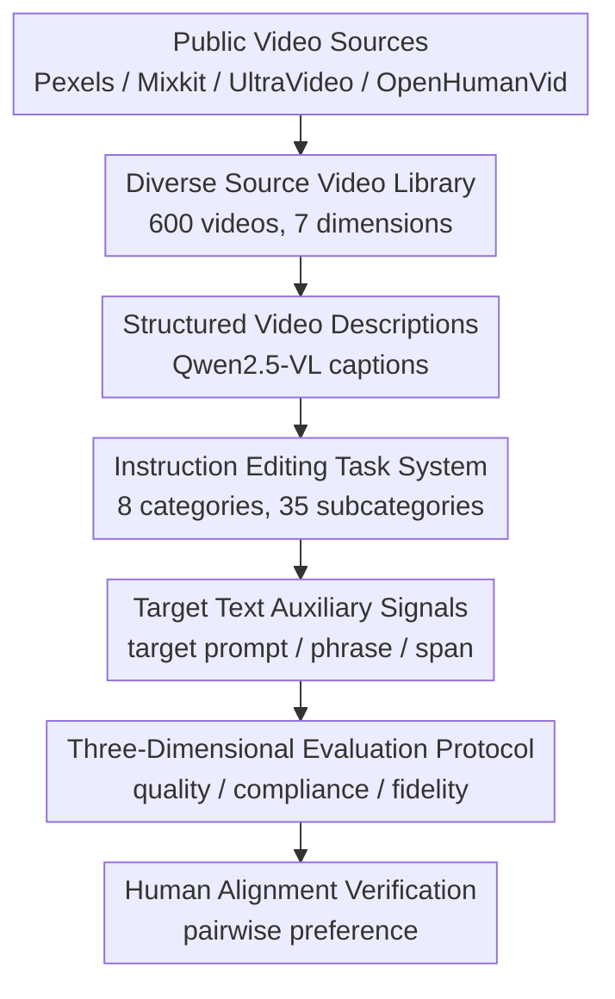

# IVEBench: Modern Benchmark Suite for Instruction-Guided Video Editing Assessment

**Conference**: ICLR 2026  
**OpenReview**: [https://openreview.net/forum?id=n0wVbCxcob](https://openreview.net/forum?id=n0wVbCxcob)  
**Code**: To be released  
**Area**: Video Generation / Instruction-Guided Video Editing Evaluation  
**Keywords**: Instruction-guided video editing, Video editing evaluation, MLLM evaluation, Video fidelity, Benchmark  

## TL;DR
IVEBench constructs a modern evaluation suite specifically for instruction-guided video editing (IVE), utilizing 600 high-quality source videos, 35 subcategories across 8 major editing instruction types, and a three-dimensional metric system (Video Quality, Instruction Compliance, and Video Fidelity) to systematically expose the weaknesses of existing models in complex instruction following and high-fidelity editing.

## Background & Motivation
**Background**: Video editing is shifting from the paradigm of "source video + target text prompt" to "direct natural language instructions." This instruction-guided video editing is more aligned with real-world usage, where users typically provide operational instructions like "change to a high-angle shot," "make the person stand up," or "replace the water bottle with a newspaper," rather than drafting full target captions.

**Limitations of Prior Work**: Evaluation systems remain stuck in the old paradigm. While recent benchmarks like VE-Bench, EditBoard, FiVE, and TDVE-Assessor have advanced video editing quality assessment, most are designed for source-target prompt-based editing. Their task coverage is concentrated on subject replacement, attribute changes, and style transfer—tasks close to image editing. They lack coverage for video-specific demands such as subject motion, camera movement, camera angle changes, visual transitions, and quantity changes, allowing models that perform only simple edits to appear competent.

**Key Challenge**: The difficulty of instruction-guided video editing is not just "generating a good-looking video" but simultaneously satisfying three criteria: the target video must be natural and clear, the editing instructions must be executed, and unedited content must remain consistent with the source video. Traditional metrics often focus solely on image quality or global text-video similarity, failing to distinguish between failure modes like "beautiful but incorrect editing," "instruction satisfied but background destroyed," or "stable video but minimal editing."

**Goal**: The authors aim to establish a benchmark closer to the IVE task itself. This involves diverse source videos (covering various semantic themes, durations, and resolutions), editing instructions that reflect real-world user operations, and multi-dimensional metrics that decouple video quality, instruction compliance, and video fidelity.

**Key Insight**: Video editing evaluation requires a simultaneous upgrade across "data, tasks, and metrics." Increasing video counts without instruction diversity fails to test editing boundaries; increasing tasks without source video diversity leads to scene-dependent conclusions; and relying solely on CLIP similarity makes it hard to judge if complex motion or perspective edits were actually performed. IVEBench integrates data collection, instruction generation, and MLLM-assisted evaluation as a holistic design.

**Core Idea**: IVEBench advances instruction-guided video editing from "scattered examples" to a comparable, diagnostic benchmark highly consistent with human preferences through a systematic video library, fine-grained instruction categories, and a three-dimensional evaluation protocol.

## Method

### Overall Architecture
IVEBench is a complete evaluation suite rather than a new editing model. It collects and filters 600 high-quality source videos, designs an instruction-style edit prompt for each, generates auxiliary text (target prompts, target phrases), and evaluates models using 12 metrics across three dimensions.

The workflow follows: "Source Video Diversification → Instruction Task Systematization → Dimensional Metric Diagnosis → Human Alignment Verification." Each layer addresses a core risk in IVE: narrow source data overestimates generalization, narrow instructions overestimate editing capability, and coarse metrics confuse quality, compliance, and fidelity.

Regarding data, 7 semantic dimensions and 30 topics were defined to collect high-resolution videos from Pexels, Mixkit, UltraVideo, and OpenHumanVid. Candidates underwent automatic preprocessing and manual filtering to ensure quality and editability. The final dataset includes 400 short videos (32-128 frames) and 200 long videos (129-1024 frames), allowing the benchmark to assess both standard clips and long-sequence editing.

For instructions, Qwen2.5-VL-72B generates structured captions describing editable elements. Doubao-1.5-pro then selects editing categories and generates edit prompts and auxiliary fields (target prompt, target phrase, target span) based on these captions. All categories and prompts are manually reviewed to ensure clarity and balance.

### Key Designs
**1. Diverse Source Video Library: Expanding Evaluation to Real-World Distributions**
IVEBench addresses the limitation of narrow scenes in prior benchmarks by defining 7 semantic dimensions and 30 fine-grained topics. By including human-centric videos (OpenHumanVid) and high-resolution/long-sequence materials, it forces models to handle memory constraints, temporal consistency, and detailed fidelity, testing if they can execute edits on complex videos rather than just curated clips.

**2. 8 Categories & 35 Subcategories: Including Video-Specific Editing**
Recognizing that core video operations involve time and camera movement, IVEBench expands tasks beyond style and attributes to include: style editing, subject editing, attribute editing, quantity editing, subject motion editing, visual effect editing, camera motion editing, and camera angle editing. Each instruction is paired with target prompts and spans, making the benchmark compatible with both instruction-guided and text-driven editing methods.

**3. Three-Dimensional Evaluation Protocol: Decoupling Quality, Compliance, and Fidelity**
IVEBench splits evaluation into three relations:
- **Video Quality**: Focuses on the output video itself, including Subject Consistency (SC), Background Consistency, Temporal Flickering, Motion Smoothness (MS), and Video Training Suitability Score (VTSS).
- **Instruction Compliance**: Focuses on "was it edited as requested?". OSC uses VideoCLIP-XL2 for global semantics, PSC focuses on local editing via phrases, IS (Instruction Satisfaction) uses Qwen2.5-VL for 1-5 scoring of complex motions, and Quantity Accuracy (QA) uses Grounding DINO for counting tasks.
- **Video Fidelity**: Focuses on "was what wasn't supposed to change preserved?". SF uses VideoCLIP-XL2 for semantic comparison, MF (Motion Fidelity) uses CoTracker3 for trajectory similarity, and CF uses Qwen2.5-VL to judge if unedited content was maintained.

**4. Human Alignment and Weighted Aggregation**
To ensure automated metircs align with human judgment, the authors conducted pairwise comparisons with 30 participants. Spearman correlations showed high alignment (e.g., VTSS $\rho=0.9985$, IS $\rho=0.9834$, CF $\rho=0.9892$). Dimensional scores are calculated via weighted averages: $S_D=\frac{\sum_i w_i m_i}{\sum_i w_i}$, where weights reflect human importance ratings (e.g., VTSS=5, IS/CF=3).

## Loss & Training
As a benchmark, this paper provides no new training loss. Instead, it defines a scoring and validation strategy where metrics are aggregated based on task applicability. For **Motion Fidelity**, CoTracker3 extracts grid point trajectories from source and target videos, interpolating to synchronous length $T=\min(T_1,T_2)$. Trajectories are matched via Hungarian matching, and similarity is computed based on position and velocity distances: $s_t=0.7s^{pos}_t+0.3s^{vel}_t$.

The final score $S_{total}$ is a weighted average of the three dimensions. Since human participants assigned equal weights (4/5) to each dimension, they are treated with equal weighting in the default total score.

## Key Experimental Results

### Main Results
IVEBench evaluated 8 methods: InsV2V, AnyV2V, StableV2V, VACE, Lucy-Edit-Dev, Omni-Video, ICVE, and Ditto.

| Subset | Method | Video Quality | Instruction Compliance | Video Fidelity | Total Score |
|------|----------|---------------|------------------------|----------------|------|
| Short | InsV2V | 0.67 | 0.80 | 0.39 | 0.82 |
| Short | Lucy-Edit-Dev | 0.64 | 0.82 | 0.34 | 0.75 |
| Short | Ditto | 0.67 | 0.78 | 0.49 | 0.73 |
| Short | VACE | 0.63 | 0.80 | 0.25 | 0.83 |
| Long | InsV2V | 0.66 | 0.80 | 0.37 | 0.79 |
| Long | Lucy-Edit-Dev | 0.65 | 0.82 | 0.32 | 0.81 |
| Long | Ditto | 0.66 | 0.78 | 0.48 | 0.72 |
| Long | VACE | 0.62 | 0.80 | 0.27 | 0.78 |

Existing models show relatively small gaps in Video Quality, but Video Fidelity is consistently low, indicating that editing often destroys unedited source content. Instruction Compliance generally does not exceed 0.5, highlighting it as the primary bottleneck.

| Subset | Method | Time per Frame | Peak Memory | Output Resolution | Note |
|------|------|----------|----------|------------|------|
| Short | Lucy-Edit-Dev | 1.52s | 32.21GB | 832×480 | Fastest |
| Short | InsV2V | 3.96s | 12.81GB | 512×512 | Low memory/balanced |
| Short | VACE | 27.03s | 122.18GB | 1280×720 | High res/Very costly |
| Long | AnyV2V | 11.47s | 63.15GB | 512×512 | 65 long videos OOM |
| Long | StableV2V | 3.72s | 49.82GB | 512×512 | 102 long videos OOM |

Efficiency data shows that many methods suffer from OOM on long sequences. InsV2V's chunked inference proves more stable for long-sequence scalability.

### Ablation Study
The "ablation" consists of verifyng coverage against other benchmarks and validating metric-human alignment.

| Benchmark | Videos | Prompts | Quantity | Subject Motion | Camera | Visual FX | MLLM Metrics |
|-----------|--------|-----------|----------|----------|----------|----------|-----------|
| VE-Bench | 169 | 148 | ✘ | ✘ | ✘ | ✘ | ✘ |
| FiVE | 100 | 420 | ✘ | ✘ | ✘ | ✘ | ✔ |
| IVEBench | 600 | 600 | ✔ | ✔ | ✔ | ✔ | ✔ |

Spearman $\rho$ results confirm that while traditional metrics are useful, MLLM-assisted metrics (IS, CF) are significantly closer to human judgment for complex semantics.

### Key Findings
- **Quality vs. Fidelity**: Models maintain temporal consistency but struggle with detail fidelity (e.g., geometric distortion, semantic leakage).
- **Instruction Followability**: Most models handle style/subject edits well but fail on quantity, motion, and camera angles.
- **Model Tendencies**: StableV2V is aggressive (high compliance, low fidelity); InsV2V is conservative (high fidelity, lower compliance).
- **Scalability**: Memory and latency grow linearly for most models; chunked inference is necessary for handling hundreds of frames.
- **Resolution**: Most outputs (512p or 480p) are lower than real user footage, leading to texture blurring and edge degradation.

## Highlights & Insights
- IVEBench's primary contribution is the simultaneous upgrade of data, tasks, and metrics, allowing for precise pinpointing of where models fail.
- The 3D metric split (Quality, Compliance, Fidelity) provides far more diagnostic value to developers than a single leaderboard rank.
- Hybrid metrics (using specialized tools like DINO/CoTracker alongside MLLM) strike a better balance than pure LLM-as-a-judge approaches.
- The inclusion of long-sequence videos brings engineering scalability into the evaluation scope, which is often ignored in research demos.

## Limitations & Future Work
- The scale (600 videos), while larger than predecessors, remains limited compared to the rapidly growing video ecosystem.
- Reliance on strong evaluators (Qwen2.5-VL, etc.) may introduce its own biases if the evaluators fail to understand specific cultures or subjects.
- Instructions are LLM-generated; while diverse, they may not perfectly capture the ambiguity or multi-turn nature of real human requests.
- The benchmark focuses on offline evaluation rather than the interactive workflows (undo/redo, local adjustments) common in real-world use.

## Related Work & Insights
- **Comparison**: Unlike **VE-Bench/EditBoard**, IVEBench covers video-specific tasks (camera/motion). Unlike **VBench**, it focuses on source-target fidelity rather than just generation quality.
- **Implication**: Progress in video editing requires explicit modeling of "what changes vs. what stays" rather than just more powerful generators. IVEBench provides the diagnostic tools to guide such architectural improvements.

## Rating
- Novelty: ⭐⭐⭐⭐ 
- Experimental Thoroughness: ⭐⭐⭐⭐⭐ 
- Writing Quality: ⭐⭐⭐⭐ 
- Value: ⭐⭐⭐⭐⭐ 

<!-- RELATED:START -->

## Related Papers

- [\[CVPR 2026\] VIVA: VLM-Guided Instruction-Based Video Editing with Reward Optimization](../../CVPR2026/video_generation/viva_vlm-guided_instruction-based_video_editing_with_reward_optimization.md)
- [\[ICLR 2026\] DrivingGen: A Comprehensive Benchmark for Generative Video World Models in Autonomous Driving](drivinggen_a_comprehensive_benchmark_for_generative_video_world_models_in_autono.md)
- [\[CVPR 2026\] EasyV2V: A High-quality Instruction-based Video Editing Framework](../../CVPR2026/video_generation/easyv2v_a_high-quality_instruction-based_video_editing_framework.md)
- [\[CVPR 2026\] Scaling Instruction-Based Video Editing with a High-Quality Synthetic Dataset](../../CVPR2026/video_generation/scaling_instruction-based_video_editing_with_a_high-quality_synthetic_dataset.md)
- [\[CVPR 2026\] CoT-Edit: Let CoT Guide Instruction Video Editing](../../CVPR2026/video_generation/cot-edit_let_cot_guide_instruction_video_editing.md)

<!-- RELATED:END -->
