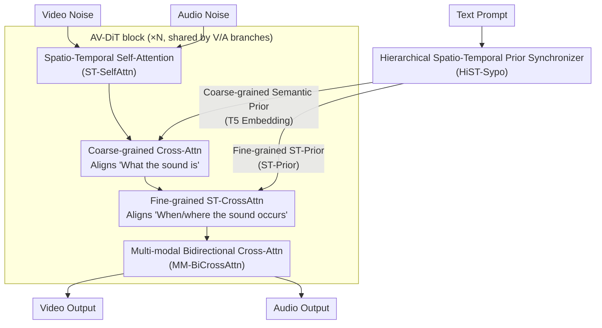

# JavisDiT: Joint Audio-Video Diffusion Transformer with Hierarchical Spatio-Temporal Prior Synchronization

**Conference**: ICLR 2026  
**arXiv**: [2503.23377](https://arxiv.org/abs/2503.23377)  
**Code**: [https://javisverse.github.io/JavisDiT-page/](https://javisverse.github.io/JavisDiT-page/)  
**Area**: Diffusion Models / Video Generation  
**Keywords**: Joint Audio-Video Generation, DiT, Spatio-Temporal Synchronization, Contrastive Learning, Benchmark  

## TL;DR

Ours proposes JavisDiT, a Joint Audio-Video Diffusion Transformer model that achieves fine-grained audio-visual spatio-temporal alignment through a Hierarchical Spatio-Temporal Prior Synchronizer (HiST-Sypo). Additionally, a new benchmark, JavisBench (comprising 10K complex scene samples), and a new evaluation metric, JavisScore, are introduced.

## Background & Motivation

**Rise of Joint Audio-Video Generation (JAVG)**: Audio and video are naturally coupled in real-world scenarios; joint generation is of significant value for film production and short video creation.

**Limitations of Asynchronous Cascade Methods**: Generating audio first then synthesizing video (or vice-versa) leads to accumulated noise; end-to-end approaches are more promising.

**Insufficient Spatio-Temporal Modeling in Existing DiT Backbones**: AV-DiT and MM-LDM utilize image-based DiTs, which struggle to model intricate spatio-temporal relationships.

**Coarse Synchronization Strategies**: Existing methods only achieve coarse-grained temporal alignment (parameter sharing) or semantic alignment (embedding alignment), lacking fine-grained synchronization in the spatial dimension.

**Simplicity of Evaluation Benchmarks**: Datasets like AIST++ and Landscape feature single-event scenes and fail to reflect complex, multi-event real-world scenarios.

**Defects in Evaluation Metrics**: AV-Align relies on optical flow and audio onset detection, which are unreliable in complex scenes.

## Method

### Overall Architecture

JavisDiT addresses the "misalignment" problem in joint audio-video generation (JAVG), particularly in the spatial dimension. It formulates generation as a symmetric dual-branch DiT: the video and audio branches maintain independent denoising flows while sharing a unified AV-DiT block design. In the workflow, a text prompt is first fed into a Hierarchical Spatio-Temporal Prior Synchronizer (HiST-Sypo), which simultaneously generates "coarse-grained semantic priors" (reusing T5 embeddings) and "fine-grained spatio-temporal priors" (ST-Prior). Within each AV-DiT block, the two modalities first perform Spatio-Temporal Self-Attention (ST-SelfAttn) to model intra-modal structures. Then, coarse-grained semantic priors are used via cross-attention to align "what the sound is," followed by fine-grained spatio-temporal priors via ST-CrossAttn to align "when and where in the frame the sound occurs." Finally, Multi-modal Bidirectional Cross-Attention (MM-BiCrossAttn) allows the two modalities to inject information into each other. The core of this design is decomposing "synchronization" from crude parameter sharing into two hierarchical layers: semantic alignment and fine-grained spatio-temporal prior alignment.

### Key Designs

**1. Hierarchical Spatio-Temporal Prior Synchronizer (HiST-Sypo): Addressing the Lack of Spatial Synchronization**

Previous methods could only align temporal information like "when a sound occurs," lacking spatial constraints for "where it occurs in the frame," leading to audio-visual spatial misalignment. HiST-Sypo splits synchronization priors into two layers: the coarse-grained layer reuses semantic embeddings from the T5 encoder to describe overall sound events; the fine-grained layer estimates a separate set of spatio-temporal priors. Specifically, 77 hidden states from the ImageBind text encoder are fed into a 4-layer Transformer encoder-decoder $\mathcal{P}$. Using $N_s = 32$ spatial query tokens and $N_t = 32$ temporal query tokens, it decodes the mean and variance of a Gaussian distribution, from which stochastic spatio-temporal priors are sampled: $(p_s, p_t) \leftarrow \mathcal{P}_\phi(s; \epsilon)$. Sampling instead of deterministic output is intentional—the sounding location and timing for the same text description are inherently uncertain, and distribution modeling covers this diversity.

To ensure these priors capture "synchronization" rather than arbitrary information, the synchronizer is trained using contrastive learning: positive samples are naturally synchronized audio-video pairs, while negative samples are constructed as asynchronous pairs (temporally or spatially shifted). A dedicated contrastive loss pulls synchronized pairs together and pushes asynchronous pairs apart, forcing the priors to learn cross-modal spatio-temporal consistency representations.

**2. Multi-modal Bidirectional Cross-Attention (MM-BiCrossAttn): Addressing Unidirectional Info Flow**

Unidirectional cross-attention only allows one modality to look at the other, creating asymmetric information flow. Here, video and audio are made to read each other: the video query $q_v$ and audio key $k_a$ calculate an attention matrix $A$; then $A \times v_a$ represents the audio-to-video injection, while the transpose $A^T \times v_v$ represents the video-to-audio injection. A single attention calculation bridges the information flow in both directions, allowing intensive coupling of the two features in every block rather than simple late-stage concatenation.

### Loss & Training

Ours adopts a three-stage progressive training strategy, transitioning from single-modality capabilities to joint generation. In the first stage, audio pre-training is conducted on 0.8M audio-text pairs, and the audio branch is initialized with OpenSora video branch weights to avoid the cost of learning acoustic structures from scratch. In the second stage, the HiST-Sypo synchronizer is trained independently on 0.6M synchronized audio-video triplets, enabling it to estimate reliable spatio-temporal priors from text. In the third stage, joint generation training is performed on 0.6M samples. At this point, the stable single-modal self-attention (SA) blocks and ST-Prior synchronizer are frozen, while only the ST-CrossAttn and Bi-CrossAttn responsible for alignment and fusion are trained, saving compute while preserving learned representations.

Three types of signals are used: diffusion denoising loss (FlowMatching or DDPM format) for generation quality, contrastive loss for the ST-Prior synchronizer (sync positive vs. async negative) for prior synchronization, and dynamic temporal masking to allow the model to support multiple conditional tasks like text-to-AV or audio-to-video generation.

## Key Experimental Results

### Main Results on JavisBench

| Method | FVD ↓ | FAD ↓ | TV-IB ↑ | AV-IB ↑ | JavisScore ↑ |
|------|-------|-------|---------|---------|-------------|
| TempoToken (T2A→A2V) | 539.8 | - | 0.084 | - | - |
| MM-Diffusion (JAVG) | - | - | - | - | - |
| **JavisDiT (Ours)** | **Best** | **Best** | **Best** | **Best** | **Best** |

### JavisBench Dataset Characteristics

| Dimension | Number of Categories | Characteristics |
|------|--------|------|
| Event Scenario | Multiple | Natural, industrial, indoor, etc. |
| Spatial Composition | 2 | Single/multiple sounding objects |
| Temporal Composition | 3 | Single event / sequential / concurrent |
| Total Samples | 10,140 | 75% contain multi-events, 57% contain concurrent events |

### Ablation Study on AIST++ and Landscape

JavisDiT significantly outperforms MM-Diffusion and cascade methods on traditional benchmarks (FVD, KVD, FAD metrics).

## Highlights & Insights

1. **Fine-grained Spatio-Temporal Alignment**: Aligns not just "when" but also "where in the frame" a sound occurs—a spatial dimension ignored by previous works.
2. **Randomized Prior Sampling**: The same text can correspond to different spatio-temporal prior distributions, modeling the uncertainty of event location and timing.
3. **Challenge of JavisBench**: With 75% multi-event and 57% concurrent event samples, the complexity far exceeds existing benchmarks.
4. **Robustness of JavisScore**: Calculates ImageBind synchronization scores via windowing and selects the 40% most out-of-sync frames, proving more reliable than AV-Align.
5. **Modular Design**: Freezing single-modal SA blocks while training only cross-modal modules ensures parameter efficiency.

## Limitations & Future Work

1. Video generation resolution remains relatively low (240P/24fps) compared to state-of-the-art video models.
2. Reliance on OpenSora pre-trained weights; the feasibility of independent training has not been verified.
3. ImageBind audio-visual embedding spaces may not be sufficiently fine-grained for extreme scenarios.
4. Whether the setting of $N_s = 32, N_t = 32$ for the HiST-Sypo synchronizer is optimal has not been explored in depth.
5. Lack of discussion regarding the controllability of generated audio (e.g., specific instrument timbres).
6. While JavisBench contains 10K samples, it still needs expansion to more linguistic and cultural contexts.

## Related Work & Insights

- **MM-Diffusion (Ruan et al.)**: The first end-to-end JAVG model, using simple parameter sharing for alignment.
- **SyncFlow (Liu et al.)**: Uses STDiT3 blocks but lacks bidirectional information exchange.
- **Seeing-Hearing (Xing et al.)**: Employs simple embedding alignment, lacking fine-grained spatial information.
- **OpenSora (Zheng et al.)**: The source of the video branch pre-training and provider of dynamic temporal masking techniques.
- Insight: Audio-visual synchronization is essentially a conditional consistency problem. The paradigm of hierarchical prior estimation combined with contrastive learning can be generalized to other multi-modal alignment scenarios.

## Rating

- Novelty: ⭐⭐⭐⭐ — The fine-grained spatio-temporal prior estimation in HiST-Sypo is innovative.
- Experimental Thoroughness: ⭐⭐⭐⭐ — New benchmark + new metric + multi-method comparisons, though some baselines are not open-sourced.
- Writing Quality: ⭐⭐⭐⭐ — Complete structure and clear diagrams, though some details reside in the appendix.
- Value: ⭐⭐⭐⭐ — JAVG is a significant but immature field; ours advances the standardization of the domain.

<!-- RELATED:START -->

## Related Papers

- [\[ICLR 2026\] JavisDiT++: Unified Modeling and Optimization for Joint Audio-Video Generation](javisdit_unified_modeling_and_optimization_for_joint_audio-video_generation.md)
- [\[ICLR 2026\] TPDiff: Temporal Pyramid Video Diffusion Model](tpdiff_temporal_pyramid_video_diffusion_model.md)
- [\[ICLR 2026\] Syncphony: 用扩散 Transformer 实现音画同步的音频到视频生成](syncphony_synchronized_audio-to-video_generation_with_diffusion_transformers.md)
- [\[ICLR 2026\] Neodragon: Mobile Video Generation Using Diffusion Transformer](neodragon_mobile_video_generation_using_diffusion_transformer.md)
- [\[ICLR 2026\] SANA-Video: Efficient Video Generation with Block Linear Diffusion Transformer](sana-video_efficient_video_generation_with_block_linear_diffusion_transformer.md)

<!-- RELATED:END -->
