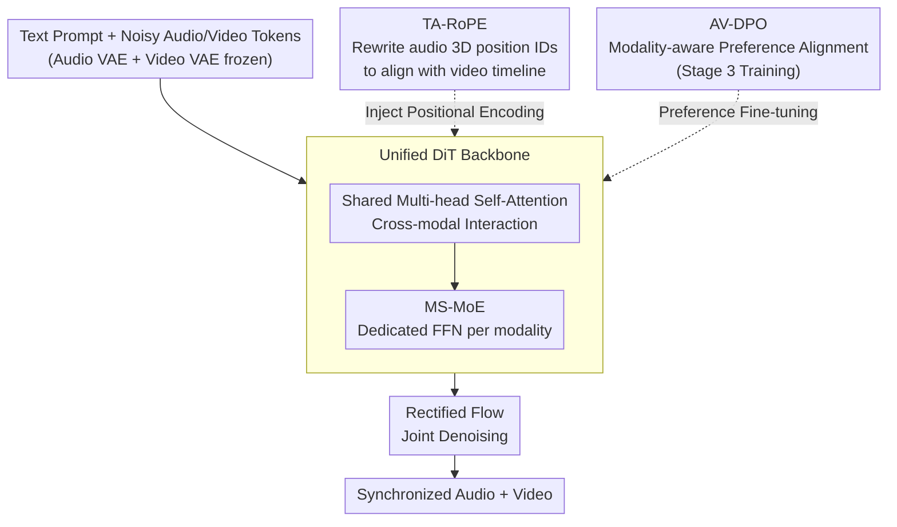

# JavisDiT++: Unified Modeling and Optimization for Joint Audio-Video Generation

**Conference**: ICLR 2026  
**arXiv**: [2602.19163](https://arxiv.org/abs/2602.19163)  
**Code**: [GitHub](https://JavisVerse.github.io/JavisDiT2-page)  
**Area**: Video Generation  
**Keywords**: Joint Audio-Video Generation, DiT, Mixture-of-Experts, RoPE, DPO

## TL;DR

JavisDiT++ is proposed as a concise and unified framework for Joint Audio-Video Generation (JAVG). It enhances generation quality via modality-specific MoE, achieves frame-level synchronization through time-aligned RoPE, and aligns with human preferences via audio-video DPO. Based on Wan2.1-1.3B, it achieves SOTA performance using only approximately 1M public data samples.

## Background & Motivation

Joint Audio-Video Generation (JAVG) requires models to simultaneously generate time-synchronized and semantically aligned video and audio from text descriptions. Current open-source methods lag behind commercial models (e.g., Veo3) in three aspects:

**Generation Quality**: Existing methods either process both modalities with a single FFN (UniForm), leading to modality information loss, or utilize dual-stream DiT (JavisDiT, UniVerse-1), which results in complex architectures and poor scalability.

**Temporal Synchronization**: JavisDiT uses ST-Prior while UniVerse-1 employs stitching strategies; both are implicit synchronization methods that are imprecise and increase inference overhead.

**Human Preference Alignment**: Current JAVG methods have not introduced preference optimization, leading to a gap between model outputs and human expectations in aesthetics and harmony. JavisDiT++ is the first work to introduce preference alignment to JAVG.

## Method

### Overall Architecture

JavisDiT++ addresses the issues of poor generation quality, lack of temporal synchronization, and misalignment with human preferences in JAVG without the complexity of dual-stream architectures. It utilizes a single DiT backbone: using Wan2.1-1.3B-T2V as the video backbone, noisy audio tokens and video tokens are concatenated into a single sequence and fed into the same DiT. Rectified Flow is employed for joint denoising to recover synchronized audio and video. Three modifications are integrated into this backbone: **MS-MoE**, which allows modalities to utilize dedicated FFNs after shared attention (addressing quality); **TA-RoPE**, which modifies audio token position IDs to anchor them to the video timeline (addressing synchronization); and **AV-DPO**, used in the final training stage for preference alignment. The video VAE (from Wan2.1) and audio VAE (from AudioLDM2) remain frozen throughout the three-stage training process: audio pre-training, audio-video SFT, and audio-video DPO.

### Key Designs

**1. Modality-Specific MoE (MS-MoE): Avoiding Modality Interference in a Unified Architecture**

The dilemma in joint modeling is that shared FFNs cause heterogeneous modality information to contaminate each other, while dual-stream DiTs are bulky and less scalable. MS-MoE adopts a middle ground: audio and video tokens first pass through a shared multi-head self-attention layer for cross-modal interaction, then proceed to their respective FFNs for intra-modality aggregation (using deterministic routing based on modality). This approach is similar to BAGEL but allocates tokens by modality rather than task. By isolating modality interference within dedicated FFNs after sufficient attention interaction, each branch can focus on modeling its specific features. Total parameters increase from 1.3B to 2.1B, but since each token only activates its own FFN branch, the active parameters per token remain 1.3B, ensuring no increase in inference overhead. Ablations show simpler alternatives are inferior: Shared-DiT + LoRA lacks the capacity for high audio quality, while Shared-DiT + Full-FT causes excessive parameter shift during audio pre-training, which significantly degrades video quality.

**2. Time-Aligned RoPE (TA-RoPE): Frame-Level Synchronization via Position IDs**

Previous mechanisms like ST-Prior in JavisDiT or frame-level cross-attention in UniVerse-1 relied on implicit alignment, which is imprecise and increases inference cost. TA-RoPE directly anchors audio to the video timeline in the temporal dimension (dimension 0) of the 3D position IDs before tokens enter the DiT. Video token position IDs are $(t, h, w)$, while audio tokens are mapped to $R_a(t, m) = \left(\left[t \cdot \frac{T_v}{T_a}\right], t + H, m + W\right)$, where $[\cdot]$ converts audio timestamps to video timesteps. Offsets $H$ and $W$ ensure that position IDs do not overlap. Since alignment happens at the positional encoding level, it achieves absolute frame-level synchronization within the full-attention framework at nearly zero additional inference cost. In evaluations, its DeSync metric outperformed the computationally expensive ST-Prior.

**3. Audio-Video DPO (AV-DPO): Introducing Human Preference Alignment to Joint Generation**

Existing JAVG methods lack preference optimization, leading to results that fall short of human expectations in aesthetics and harmony. AV-DPO addresses this by making rewards, data, and losses modality-aware. The reward model scores samples across three dimensions: audio quality (AudioBox + ImageBind), video quality (VideoAlign + ImageBind), and audio-video alignment (ImageBind + Syncformer). For data, 3 samples plus ground truth are generated for 30K prompts; winner-loser pairs are selected by normalized ranking per modality, ensuring the winner is not inferior to the loser in any dimension (approx. 25K pairs). The loss separately calculates audio and video branches before weighting them, combined with Flow Matching regularization to prevent overfitting:

$$\mathcal{L}_{\mathrm{DPO}}^{av} = -\mathbb{E}\left[\log\sigma\left(-\beta_v(\mathrm{Diff}_{\mathrm{policy}}^v - \mathrm{Diff}_{\mathrm{ref}}^v) - \beta_a(\mathrm{Diff}_{\mathrm{policy}}^a - \mathrm{Diff}_{\mathrm{ref}}^a)\right)\right]$$

### Loss & Training

A three-stage training strategy is employed: Audio Pre-training uses 780K audio-text pairs; Audio-Video SFT uses 330K triplets for joint alignment using Flow Matching; Audio-Video DPO uses the 25K preference pairs for final tuning with Flow Matching regularization. The system supports various aspect ratios for 2-5 second, 240p-480p outputs.

## Key Experimental Results

### Main Results (JavisBench, 240p4s)

| Model | Params | FVD↓ | FAD↓ | AV-IB↑ | JavisScore↑ | DeSync↓ | Inference Time |
|------|--------|------|------|--------|-------------|---------|----------|
| JavisDiT | 3.1B | 204.1 | 7.2 | 0.197 | 0.154 | 1.039 | 30s |
| UniVerse-1 | 6.4B | 194.2 | 8.7 | 0.104 | 0.077 | 0.929 | 13s |
| **Ours (JavisDiT++)** | **2.1B** | **141.5** | **5.5** | **0.198** | **0.159** | **0.832** | **10s** |

### Ablation Study (JavisBench-mini)

| Configuration | FVD↓ | FAD↓ | JavisScore↑ | DeSync↓ | Description |
|------|------|------|-------------|---------|------|
| Shared-DiT + LoRA | 227.6 | 6.51 | 0.098 | 0.934 | Insufficient LoRA capacity |
| Shared-DiT + Full-FT | 269.3 | 5.66 | 0.137 | 0.945 | Video quality degradation |
| **MS-MoE** | **221.3** | **5.51** | **0.153** | **0.807** | Best architecture |
| No Sync Mechanism | - | - | 0.142 | 0.942 | Baseline |
| ST-Prior | - | - | 0.145 | 0.863 | +6s Latency |
| **TA-RoPE** | - | - | **0.153** | **0.807** | Zero extra cost |
| No DPO | 221.3 | 5.51 | 0.153 | 0.807 | SFT Baseline |
| Modality-Micro DPO | **198.5** | 5.32 | **0.156** | **0.776** | Best DPO strategy |

### Key Findings

- MS-MoE significantly improves audio quality while maintaining video quality, proving the necessity of modality-specific FFNs.
- TA-RoPE achieves better synchronization than the computationally expensive ST-Prior or FrameAttn at zero inference cost.
- AV-DPO shows modest objective improvements but leads to over 25% human preference gains, capturing aesthetic preferences difficult to measure with metrics.
- Modality-aware preference pair construction is critical; modality-inconsistent winner selection causes DPO degradation.

## Highlights & Insights

- Outperformed dual-stream architectures with fewer parameters (2.1B vs 6.4B) and less data (1M vs massive scale), demonstrating that a unified architecture with carefully designed modules is more effective than brute-force stacking.
- The TA-RoPE position ID manipulation is elegant—leveraging the symmetry of the full-attention framework to achieve temporal alignment without physical sequence rearrangement.
- First to introduce DPO to multimodal joint generation with a modality-aware preference data construction pipeline.
- Inference overhead is only 1.6% higher than pure video generation, making it highly practical.

## Limitations & Future Work

- Current video resolution and duration are limited (240-480p, 2-5s), which is far from commercial standards.
- Objective improvements from AV-DPO are limited; the evaluation capability of the reward model may be a bottleneck.
- The audio VAE (AudioLDM2) was not designed for joint generation, potentially limiting audio diversity.
- Validation was only performed on Wan2.1-1.3B; scalability to larger or different model series remains unknown.
- Gaps remain compared to commercial models like Veo3, particularly in semantic alignment for complex scenes.

## Related Work & Insights

- The dual-stream DiT approach of JavisDiT and UniVerse-1 is effectively replaced by MS-MoE, suggesting shared attention + modality-specific FFNs is a more efficient paradigm.
- The modality-aware preference data strategy in AV-DPO could be generalized to other multimodal alignment scenarios (e.g., audio+3D, video+haptics).
- TA-RoPE's temporal alignment concept could be applied to other tasks requiring cross-modal synchronization.

## Rating

- Novelty: ⭐⭐⭐⭐ TA-RoPE and AV-DPO are innovative; MS-MoE is relatively standard.
- Experimental Thoroughness: ⭐⭐⭐⭐⭐ Comprehensive comparisons across architectures, sync mechanisms, DPO strategies, and human evaluations.
- Writing Quality: ⭐⭐⭐⭐ Clear structure and rich visualizations, though some descriptions are verbose.
- Value: ⭐⭐⭐⭐ Sets a new SOTA for open-source JAVG; AV-DPO provides valuable insights for the community.

<!-- RELATED:START -->

## Related Papers

- [\[ICLR 2026\] JavisDiT: Joint Audio-Video Diffusion Transformer with Hierarchical Spatio-Temporal Prior Synchronization](javisdit_joint_audio-video_diffusion_transformer_with_hierarchical_spatio-tempor.md)
- [\[ICLR 2026\] Dual-IPO: Dual-Iterative Preference Optimization for Text-to-Video Generation](dual-ipo_dual-iterative_preference_optimization_for_text-to-video_generation.md)
- [\[ICLR 2026\] Lumos-1: On Autoregressive Video Generation with Discrete Diffusion from a Unified Model Perspective](lumos-1_on_autoregressive_video_generation_with_discrete_diffusion_from_a_unifie.md)
- [\[CVPR 2026\] UniAVGen: Unified Audio and Video Generation with Asymmetric Cross-Modal Interactions](../../CVPR2026/video_generation/uniavgen_unified_audio_and_video_generation_with_asymmetric_cross-modal_interact.md)
- [\[ICML 2026\] T2AV-Compass: Towards Unified Evaluation for Text-to-Audio-Video Generation](../../ICML2026/video_generation/t2av-compass_towards_unified_evaluation_for_text-to-audio-video_generation.md)

<!-- RELATED:END -->
