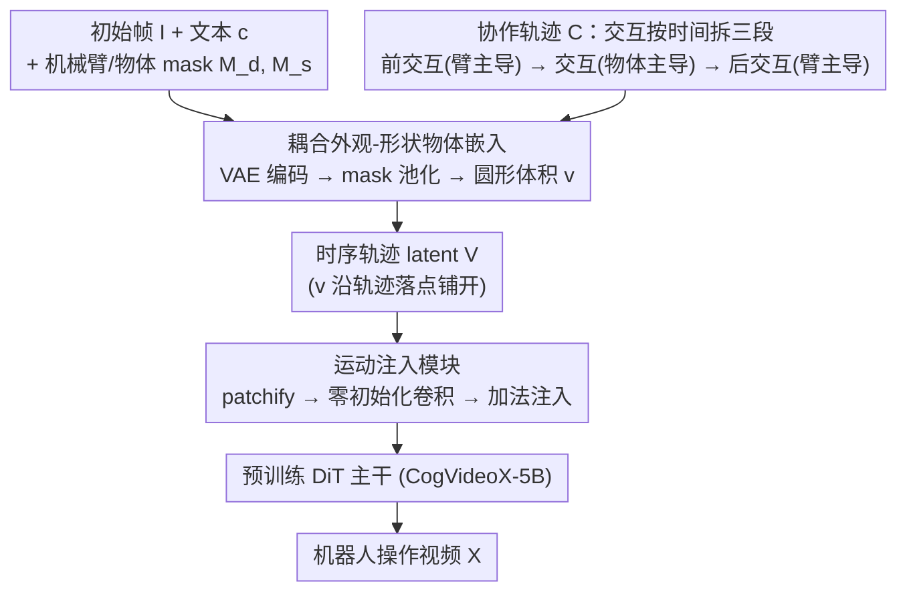

# Learning Video Generation for Robotic Manipulation with Collaborative Trajectory Control

**Conference**: ICLR 2026  
**arXiv**: [2506.01943](https://arxiv.org/abs/2506.01943)  
**Code**: [Project Page](https://fuxiao0719.github.io/projects/robomaster/)  
**Area**: Video Generation  
**Keywords**: Video Generation, Robotic Manipulation, Collaborative Trajectory, Diffusion Models, Interaction Modeling

## TL;DR

The RoboMaster framework is proposed, which decomposes the robot-object interaction process into three phases—pre-interaction, during-interaction, and post-interaction—via collaborative trajectories. Combined with appearance- and shape-aware object embeddings, it achieves high-quality video generation for robotic manipulation.

## Background & Motivation

1. **Background**: Video diffusion models have shown great potential in generating robotic decision-making data, with trajectory condition control enabling fine-grained control over robot movements.

2. **Limitations of Prior Work**: Existing trajectory control methods (e.g., Tora, DragAnything) primarily focus on the independent motion of single objects, using separate trajectories to control the robotic arm and the manipulated object. This leads to feature entanglement in interaction regions (overlap areas), resulting in degraded generation quality.

3. **Key Challenge**: Robotic manipulation is inherently a multi-object interaction process, but existing methods simplify it into independent motion control, failing to capture physically plausible interactions. If synthetic videos cannot accurately represent interaction phases, inverse dynamics models will extract unreliable action labels.

4. **Goal**: To design a video generation framework that can accurately model robot-object interaction dynamics, ensuring the generated videos serve as high-quality demonstration data for robot learning.

5. **Key Insight**: Rather than decomposing objects, the interaction process itself is decomposed. The manipulation process is divided into three sub-phases, each guided by a dominant subject and unified into a single collaborative trajectory.

6. **Core Idea**: By decomposing the interaction process instead of the objects, multi-object trajectories are unified into a collaborative trajectory representation, fundamentally avoiding feature entanglement in overlapping regions.

## Method

### Overall Architecture

RoboMaster performs conditional control on the pre-trained CogVideoX-5B: given an initial frame $\mathbf{I}$, text prompt $\mathbf{c}$, masks for the robotic arm and target object $\mathbf{M}_d, \mathbf{M}_s$, and a collaborative trajectory $\mathcal{C}$, it outputs the manipulation video $\mathbf{X}$. The workflow centers on a core choice—instead of controlling the arm and object separately, the interaction process is segmented into three stages carried by a single unified trajectory. Specifically, the collaborative trajectory provides movement coordinates for each frame, and object embeddings are expanded into circular volumes $v$ at each point, following the trajectory. These together form the temporal trajectory latent, which is integrated into the DiT hidden states via a motion injection module to guide the pre-trained backbone in generating the final video.

### Key Designs

**1. Coupled Appearance-Shape Object Embedding: Maintaining Identity Consistency**

Trajectory control methods (e.g., Tora) often abstract the controlled object as a single point, informing the model "where the pixel goes" while losing information about its appearance and scale, which often leads to object deformation or identity drift. This work utilizes masks to carry object information: a VAE encoder projects the initial frame into latent features $\mathbf{z}$, and the object mask is downsampled to the latent resolution to extract and pool features from the covered area, yielding a compact object embedding $\tilde{\mathbf{v}}$. At each time step, $\tilde{\mathbf{v}}$ is expanded into a circular volume representation $\mathbf{v} \in \mathbb{R}^{c \times h \times w}$, centered at the current trajectory point with a radius based on the mask area ratio. Consequently, the trajectory encodes both object appearance (from masked features) and spatial scale (from the circle's radius), which accelerates convergence and significantly improves identity consistency across frames compared to point-based representations.

**2. Collaborative Trajectory Representation: Temporally Decomposing Interactions to Avoid Entanglement**

In robotic manipulation, the trajectories of the robotic arm and the object overlap in the contact zone. Assigning independent trajectories to each leads to entangled features at the overlap, causing generation failure. This method decomposes the interaction temporally rather than spatially, splitting the operation into three phases dominated by different subjects: the pre-interaction phase $\mathcal{C}_1$ dominated by the arm (approaching the object), the interaction phase $\mathcal{C}_2$ dominated by the manipulated object (contact and movement), and the post-interaction phase $\mathcal{C}_3$ dominated again by the arm (retraction). These phases are concatenated into a single collaborative trajectory. Since only one dominant subject exists at any moment, overlap ambiguity is naturally eliminated. Mathematically, causal representations propagate the latent from the previous time step to subsequent frames, decomposing the distribution into the product of three object-aware sub-distributions. This is effective because the object's motion in the interaction phase implicitly constrains the arm's relative motion (as their dynamics are coupled by contact); switching the dominant feature $\mathbf{v}_d \rightarrow \mathbf{v}_s \rightarrow \mathbf{v}_d$ provides clear signals to the model regarding behavioral transitions.

**3. Motion Injection Module: Preserving Pre-trained Capabilities with Lightweight Branches**

The collaborative trajectory is organized into a temporal latent $\mathbf{V} \in \mathbb{R}^{f \times c \times h \times w}$. It is first "patchified," then passed through a zero-initialized 2D spatial convolution and 1D temporal convolution to encode $\tilde{\mathbf{V}}$. Finally, it is integrated into the DiT block hidden states via additive injection: $\mathbf{h} = \mathbf{h} + \text{norm}(\tilde{\mathbf{V}}) + \tilde{\mathbf{V}}$. Zero-initialization ensures that the injection branch output is zero during early training, preserving the original generation capabilities of the DiT. The model gradually learns trajectory guidance during training. Additive injection is "plug-and-play" and proved more stable than cross-attention injection in ablation studies (FVD 147.31 vs. 163.56).

### Loss & Training

The training objective follows the standard diffusion denoising loss $\mathcal{L}(\boldsymbol{\theta}) = \mathbb{E}[\|\boldsymbol{\epsilon} - \hat{\boldsymbol{\epsilon}}_{\boldsymbol{\theta}}(\mathbf{x}_t, \mathbf{c}, \mathbf{M}_d, \mathbf{M}_s, \mathcal{C}, t)\|_2^2]$, incorporating both masks and the collaborative trajectory as conditions. Implementation involved 8 A800 GPUs using the AdamW optimizer. The DiT backbone learning rate was $2 \times 10^{-5}$, while the new motion injector used a higher rate of $1 \times 10^{-4}$. The model was trained for 30K steps with a batch size of 16. Inference used 50-step DDIM with a CFG scale of 6.0.

## Key Experimental Results

### Main Results

Comparison of video generation quality and trajectory accuracy (Bridge dataset, all baselines retrained on the same data):

| Method | FVD↓ | PSNR↑ | SSIM↑ | TrajError_robot↓ | TrajError_obj↓ |
|------|------|-------|-------|------------------|----------------|
| TesserAct | 261.84 | 18.99 | 0.778 | 37.34 | 54.64 |
| IRASim | 159.04 | 20.88 | 0.782 | 19.25 | 34.39 |
| DragAnything | 158.42 | 21.13 | 0.792 | 18.97 | 27.41 |
| Tora | 152.28 | 21.24 | 0.788 | 18.14 | 26.43 |
| **Ours (RoboMaster)** | **147.31** | **21.55** | **0.803** | **16.47** | **24.16** |

Robotic action planning success rate (RLBench + SIMPLER, average success rate over 100 trials):

| Method | pick up cup | put knife | open microwave | close box | pick coke can |
|------|-------------|-----------|----------------|-----------|---------------|
| OpenVLA | 0.55 | 0.46 | 0.35 | 0.45 | 0.59 |
| Tora | 0.79 | 0.82 | 0.61 | 0.72 | 0.89 |
| **Ours (RoboMaster)** | **0.83** | 0.76 | 0.54 | **0.79** | **0.91** |

### Ablation Study

| Configuration | FVD↓ | PSNR↑ | TrajError_obj↓ | Description |
|------|------|-------|----------------|------|
| Without Causal Embedding | 151.62 | 21.30 | 27.15 | Decreased temporal coherence |
| Point instead of Mask | 157.49 | 20.87 | 31.41 | Significant drop in identity consistency |
| Separate Trajectories | 152.01 | 21.08 | 25.84 | Feature entanglement in interaction areas |
| Cross-attention Injection | 163.56 | 19.38 | 29.16 | Inferior to additive injection |
| **Full Model** | **147.31** | **21.55** | **24.16** | Optimal synergy of all components |

### Key Findings

- The collaborative trajectory design outperforms Tora in 8 out of 10 robotic tasks, proving the importance of accurate interaction modeling for downstream policy learning.
- Mask representation maintains 99.81% PSNR even at 90% sparsity, showing strong robustness to coarse user inputs.
- Even when 40% of prompts are replaced with imprecise descriptions, the model maintains over 96% of its PSNR performance.
- In a user study, the preference rate reached 45.16%, significantly exceeding all baselines (second-place Tora only reached 17.74%).

## Highlights & Insights

- The core mechanism of **"decomposing interactions rather than objects"** is simple yet effective, fundamentally solving the feature entanglement issue.
- Collaborative trajectory design simplifies user interaction—users only need to define segmented paths rather than complete trajectories for multiple objects.
- The circular volume representation elegantly balances appearance and shape information.
- Downstream robotic planning experiments validate the positive correlation between video generation quality and policy learning effectiveness.

## Limitations & Future Work

- Currently operates in 2D pixel space; integrating depth cues could enable more precise 3D control.
- Out-of-distribution (OOD) inputs may still result in incomplete or distorted objects.
- Generalization across different robot morphologies requires expanded training data.
- Collaborative trajectories require predefined temporal split points for interaction phases; automatic detection would be more practical.

## Related Work & Insights

- Contrasts sharply with separate-trajectory methods like Tora, highlighting the importance of the "interaction modeling" perspective in video generation.
- Compared to 4D methods like TesserAct, the 2D approach offers superior data efficiency.
- The paradigm of video generation as a world simulator demonstrates immense potential in robot learning.

## Rating

- Novelty: ⭐⭐⭐⭐ Innovative interaction decomposition via collaborative trajectories.
- Experimental Thoroughness: ⭐⭐⭐⭐⭐ Comprehensive evaluation across video quality, trajectory precision, robot planning, ablation, and user studies.
- Writing Quality: ⭐⭐⭐⭐ Clear structure with excellent illustrations.
- Value: ⭐⭐⭐⭐ Provides practical guidance for robotic video generation and data augmentation.

<!-- RELATED:START -->

## Related Papers

- [\[ICLR 2026\] MIMIC: Mask-Injected Manipulation Video Generation with Interaction Control](mimic_mask-injected_manipulation_video_generation_with_interaction_control.md)
- [\[ICLR 2026\] Geometry-aware 4D Video Generation for Robot Manipulation](geometry-aware_4d_video_generation_for_robot_manipulation.md)
- [\[CVPR 2026\] FlexTraj: Image-to-Video Generation with Flexible Point Trajectory Control](../../CVPR2026/video_generation/flextraj_image-to-video_generation_with_flexible_point_trajectory_control.md)
- [\[ICLR 2026\] Streaming Drag-Oriented Interactive Video Manipulation: Drag Anything, Anytime!](streaming_drag-oriented_interactive_video_manipulation_drag_anything_anytime.md)
- [\[ICLR 2026\] Video-As-Prompt: Unified Semantic Control for Video Generation](video-as-prompt_unified_semantic_control_for_video_generation.md)

<!-- RELATED:END -->
