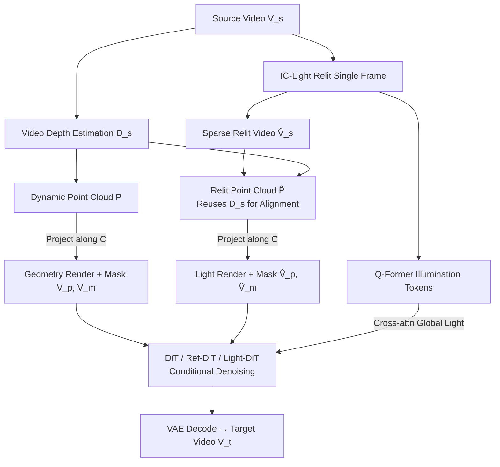

# Light-X: Generative 4D Video Rendering with Camera and Illumination Control

**Conference**: ICLR 2026  
**OpenReview**: [https://openreview.net/forum?id=VBew6vESGL](https://openreview.net/forum?id=VBew6vESGL)  
**Project Page**: [https://lightx-ai.github.io/](https://lightx-ai.github.io/)  
**Code**: TBD  
**Area**: Video Generation / Controllable Video Rendering  
**Keywords**: Video relighting, camera trajectory control, 4D video generation, video diffusion model, geometry-illumination decoupling  

## TL;DR
Light-X unifies two previously separate research paths of controllable video generation—"camera viewpoint" and "scene illumination"—into a single diffusion model for the first time. By projecting geometry/motion and illumination into two sets of point clouds as fine-grained conditions, it achieves decoupling. Furthermore, it introduces "Light-Syn," a "degradation + inverse mapping" data synthesis pipeline to create "multi-view × multi-light" paired training data, which is virtually impossible to collect in the real world.

## Background & Motivation
**Background**: "Re-rendering" real scenes from monocular videos has followed two largely disjoint paths. One is video relighting, which mostly extends single-image methods (like IC-Light) to video via training-free cross-frame fusion (Light-A-Video) or architectural modifications for temporal attention (RelightVid). The other is camera-controllable video generation (e.g., TrajectoryCrafter), which precisely controls viewpoints and maintains spatiotemporal consistency but ignores lighting.

**Limitations of Prior Work**: Relighting methods are hindered by a fundamental "lighting fidelity vs. temporal consistency" trade-off—relighting single frames looks good, but the sequence flickers; suppressing flicker often weakens the lighting effects. Camera-controllable methods can change viewpoints but cannot modify lighting.

**Key Challenge**: Visual dynamics in real scenes are **jointly** shaped by geometry, motion, and illumination, yet existing methods control only one dimension. Realizing "joint control" requires both **decoupling** geometry/motion/illumination for independent manipulation and ensuring they remain **coordinated** in the final frame. Movement of the viewpoint further amplifies lighting imbalances. Critically, training such a model requires paired videos of the same dynamic scene under "different viewpoints × different lighting," which is nearly non-existent in real-world datasets.

**Goal**: Construct the first video generation model capable of **simultaneously** controlling camera trajectory and illumination from monocular video.

**Core Idea**:
- **Fine-grained conditions for geometry-light decoupling**: Use dynamic point clouds projected along the user trajectory to provide geometry/motion cues, and project "relit single frames" into the same geometry to provide lighting cues. This allows the model to receive complementary, decoupled explicit prompts in a geometrically aligned space.
- **Data synthesis via degradation + inverse mapping (Light-Syn)**: Treat existing in-the-wild videos as "targets," actively degrade them into "inputs" while recording the transformation, and then use the inverse mapping to "transport" the target's geometry and illumination back to the input viewpoint, synthesizing paired training data.

## Method

### Overall Architecture
Given a monocular source video $V^s=\{I^s_i\}_{i=1}^f$, the goal is to render a video $V^t$ of the same dynamic scene under a user-specified camera trajectory $C=\{[R_i,t_i]\}$ and lighting condition $L$ (text, HDR map, or reference image). Light-X first relights a single frame using IC-Light to create a "sparse relit video." It then estimates depth from the source video to back-project frames into **dynamic point clouds** and **relit point clouds**. Both sets are projected along the target trajectory to produce geometrically aligned renders and visibility masks. These, along with illumination tokens extracted by a Q-Former, are fed into a DiT for conditional denoising, followed by VAE decoding to produce high-fidelity video faithful to the target trajectory and lighting.

### Key Designs

**1. Camera-Light Decoupling: Dual point clouds for geometry and illumination.** This is the foundation of the method. Camera control follows the "geometry" branch: depth $D^s$ is estimated from the source video, each frame is back-projected into a 3D dynamic point cloud $P_i=\Phi^{-1}(I^s_i, D^s_i; K)$, and then projected back to the target viewpoint to obtain aligned views and visibility masks $I^p_i, M^p_i=\Phi(R_iP_i+t_i; K)$. This serves as a strong geometry prior for viewpoint motion. Illumination control follows the "relighting" branch: IC-Light relights an arbitrary frame based on text prompts to construct a sparse relit video $\hat V^s$ (only the relit frame has content). Crucially, it **reuses the source depth** $D^s$ to project the relit frame into a relit point cloud $\hat P_i=\Phi^{-1}(\hat I^s_i, D^s_i; K)$. Reusing depth ensures that the relit content and original content correspond to the **exact same geometry**, making them naturally pixel-aligned after projection.

**2. Fine-grained Cues + Global Illumination Control.** The four projected cues $V^p, V^m, \hat V^p, \hat V^m$ are VAE-encoded, channel-concatenated with noise, and patchified into visual tokens for the DiT. $V^p$ carries scene content/geometry/motion, while $\hat V^p$ carries lighting. To address the issue where illumination weakens as synthesized frames move further from the "relit frame," the authors add **Global Illumination Control**. A Q-Former extracts a global illumination representation $T_{illum}$ from the relit frame, injected into the new Light-DiT layers via cross-attention: $T'_{vision}=\mathrm{CrossAttn}(Q=T_{vision}, K=V=T_{illum})$. This ensures lighting fidelity and stability across the entire sequence.

**3. Light-Syn: Degradation + Inverse Mapping.** To overcome the lack of "multi-view × multi-light" paired data, Light-Syn treats high-quality in-the-wild videos as the **target** $V^t$. It actively **degrades** them (e.g., lighting changes, edits) to get the **input** $V^s$ and records the transformations. By applying the **inverse mapping**, the geometry and lighting of $V^t$ are "transported" to the $V^s$ viewpoint, generating spatially aligned conditional cues. Supervision comes naturally from the original high-fidelity video.

**4. Soft Masks for Universal Lighting Conditions.** The decoupling and masking mechanism naturally supports independent tasks. For pure camera control, the relit frame is replaced with the original frame. For pure relighting, $V^p=V^s$ and $V^m$ is set to full visibility. Furthermore, the framework handles HDR maps and reference images by assigning different **soft mask** strengths $(\hat V^p,\hat V^m)=(V_k,\alpha_k\mathbf{1})$ (e.g., $\alpha_{ref}=0.25$, $\alpha_{hdr}=0.50$). These act as domain indicators, allowing a single model to generalize across diverse lighting prompts.

## Key Experimental Results

### Main Results: Joint Camera-Illumination Control
Comparing against combined baselines (TC=TrajectoryCrafter, LAV=Light-A-Video, TL-Free=Training-free):

| Method | FID ↓ | Aesthetic ↑ | Motion Pres. ↓ | CLIP ↑ | User Pref. (Ours %) | Time ↓ |
|---|---|---|---|---|---|---|
| TC+IC-Light | / | 0.573 | 6.558 | 0.976 | 88~92 | 3.25 min |
| TC+LAV | 138.89 | 0.574 | 4.327 | 0.986 | 84~89 | 4.33 min |
| LAV+TC | 144.61 | 0.596 | 5.027 | 0.987 | 85~89 | 4.33 min |
| TL-Free | 122.73 | 0.595 | 3.356 | 0.987 | 88~89 | 5.50 min |
| **Ours** | **101.06** | **0.623** | **2.007** | **0.989** | / | **1.83 min** |

Evaluation using real in-the-wild videos as ground truth (GT): Ours achieves PSNR 13.96 / SSIM 0.582 / FVD 45.91, outperforming the strongest baseline TL-Free.

### Ablation Study

| Ablation Item | FID ↓ | Aesthetic ↑ | Motion Pres. ↓ |
|---|---|---|---|
| (b.i) w/o Fine-grained light cues | 143.02 | 0.602 | 2.242 |
| (b.ii) w/o Global light control | 103.13 | 0.612 | 2.348 |
| (c.ii) Relight all frames | 71.10 | 0.571 | 4.238 |
| (c.iii) w/o Soft mask | 148.51 | 0.545 | 2.879 |
| **Ours** | **101.06** | **0.623** | **2.007** |

### Key Findings
- **Fine-grained lighting cues are vital**: Removing them causes FID to spike from 101 to 143.
- **"Relighting one frame" outperforms "Relighting all frames"**: While relighting all frames (c.ii) yields lower FID, the Motion Preservation score (4.238) indicates broken temporal consistency. This validates the "sparse relighting + point cloud propagation" strategy.
- **Soft masks are indispensable**: Without them, lighting domains interfere, leading to an FID of 148.51.

## Highlights & Insights
- **Depth Reuse is a masterstroke**: Borrowing the source video's depth for the relit point cloud perfectly aligns the relit content with the original geometry, serving as the hidden pivot for decoupling.
- **Transforming scarcity into "reversible degradation"**: Light-Syn's inverse mapping is an elegant solution to the lack of paired data, allowing for clean supervision from high-quality target videos.
- **High Efficiency**: As a diffusion-based method, it is surprisingly faster than combined baselines (1.83 min vs 3~5.5 min) because joint control is handled in one step, avoiding serial overhead.

## Limitations & Future Work
- **Dependency on single-image relighting priors**: If IC-Light fails in a specific scene, the quality of the generated video suffers.
- **Geometric constraints of point clouds**: Inaccurate depth estimation leads to artifacts; sparse 3D cues make 360° movements difficult to handle.
- **Long-video generation**: Authors look toward stronger backbones (e.g., Wan2.1) and techniques like Diffusion Forcing to extend video length and improve fine details.

## Related Work & Insights
- **Unified Path**: Light-X bridges video relighting (focusing on light, not camera) and camera-controllable generation (focusing on geometry, not light). It proves that explicit point cloud conditions in a geometrically aligned space can carry both dimensions.
- **Insight for Controllable Generation**: When factors are hard to model jointly, rendering them into explicit, fine-grained, spatially aligned cues is often more effective than relying on abstract latent embeddings.

## Rating
- **Novelty**: ⭐⭐⭐⭐⭐ First to unify camera and light control; original dual point cloud decoupling and Light-Syn pipeline.
- **Experimental Thoroughness**: ⭐⭐⭐⭐ Comprehensive testing across various relighting modes and thorough ablation.
- **Writing Quality**: ⭐⭐⭐⭐ Clear motivation and logical self-consistency.
- **Value**: ⭐⭐⭐⭐ Significant for AR/VR and post-production by providing a unified framework for re-rendering real footage.

<!-- RELATED:START -->

## Related Papers

- [\[CVPR 2026\] LaVR: Scene Latent Conditioned Generative Video Trajectory Re-Rendering using Large 4D Reconstruction Models](../../CVPR2026/video_generation/lavr_scene_latent_conditioned_generative_video_trajectory_re-rendering_using_lar.md)
- [\[ICCV 2025\] ReCamMaster: Camera-Controlled Generative Rendering from A Single Video](../../ICCV2025/video_generation/recammaster_camera-controlled_generative_rendering_from_a_single_video.md)
- [\[ICLR 2026\] MoCa: Modeling Object Consistency for 3D Camera Control in Video Generation](moca_modeling_object_consistency_for_3d_camera_control_in_video_generation.md)
- [\[ICLR 2026\] Geometry-aware 4D Video Generation for Robot Manipulation](geometry-aware_4d_video_generation_for_robot_manipulation.md)
- [\[CVPR 2026\] VerseCrafter: Dynamic Realistic Video World Model with 4D Geometric Control](../../CVPR2026/video_generation/versecrafter_dynamic_realistic_video_world_model_with_4d_geometric_control.md)

<!-- RELATED:END -->
