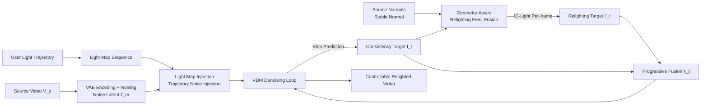

# LightCtrl: Training-free Controllable Video Relighting

**Conference**: ICLR 2026  
**OpenReview**: [https://openreview.net/forum?id=5ft8vd9rwc](https://openreview.net/forum?id=5ft8vd9rwc)  
**Code**: [https://github.com/GVCLab/LightCtrl](https://github.com/GVCLab/LightCtrl)  
**Area**: Video Generation / Controllable Video Relighting  
**Keywords**: Video Relighting, Light Trajectory Control, Training-free, Diffusion Prior, Frequency Domain Fusion  

## TL;DR
LightCtrl extends the training-free paradigm of "per-frame image relighting + video diffusion prior for temporal consistency" into the first controllable video relighting method supporting **user-defined light trajectories**. By utilizing two modules, Light Map Injection and Geometry-Aware Relighting, it enables the generated lighting to follow user-drawn paths while suppressing interference from the original illumination in the source video.

## Background & Motivation
**Background**: Diffusion models are mature in image relighting; IC-Light achieves SOTA by fine-tuning pre-trained T2I generators for specific lighting conditions. This success was ported to video through methods like RelightVid, which trains Video Diffusion Models (VDMs) on high-quality multi-light datasets, and Light-A-Video, a training-free approach that progressively fuses per-frame image relighting into the VDM denoising process for consistency.

**Limitations of Prior Work**: These methods only allow changing the "lighting style" and **cannot explicitly control how light moves within the video**. Training-based methods like RelightVid depend on expensive data; training-free methods like Light-A-Video, while cost-effective, impose strong temporal consistency constraints that "flatten" lighting, showing poor control over diverse trajectories (e.g., left-to-right, circular). Crucially, prior work ignores the **role of local dynamic lighting in storytelling and emotional expression**—a spotlight in a corner can emphasize character tension, or a sudden flash can highlight key plot points.

**Key Challenge**: Controllability $\leftrightarrow$ Temporal Consistency. Per-frame IC-Light offers strong control but suffers from flickering; adding VDM priors suppresses flickering but may erase the user's intended light movement due to over-constrained consistency.

**Goal**: To define the **controllable video relighting** task—given a source video, a relighting prompt, and a user-defined light trajectory, generate a video where the lighting accurately follows the trajectory frame-by-frame while preserving content and maintaining temporal consistency, all **without any training**.

**Core Idea**: **[Trajectory as Control Signal]** User-drawn trajectories are synthesized into per-frame light map sequences and injected via two paths: first, as a noise prior into the VDM's initial latent to guide light movement; second, using source video normal maps in the frequency domain to suppress original light leakage. This achieves explicitly controllable lighting dynamics at zero training cost.

## Method

### Overall Architecture
LightCtrl follows the training-free video editing paradigm (SDEdit-style): the $l$-frame source video $V_s$ is encoded into latent $\hat z_0$ and noised for $T_m$ steps to obtain noise latent $\hat z_m$. The **Light Map Injection module** then injects the user trajectory to produce $z_m$, providing the denoising process with an inherent prior for the intended lighting. During the VDM denoising loop, at each step $t$, the model predicts the clean latent $\hat z_{0\leftarrow t}$ and decodes it into a consistency target $I_t=D(z_{0\leftarrow t})$. This is sent to the **Geometry-Aware Relighting module** for per-frame relighting to obtain $I'_t$. Finally, a progressive fusion $\bar I_t=(1-\lambda_t)I_t+\lambda_t I'_t$ is performed with a decreasing weight $\lambda_t$, and re-encoded back to latent to guide the next step. VDM ensures temporal consistency, while IC-Light provides high-quality relighting.

### Key Designs

**1. Light Map Injection: Writing trajectories into initial noise.** Relying solely on IC-Light using light maps as background references provides only weak frame-level control, which is easily "washed away" by VDM denoising. Inspired by FreeTraj's use of noise to guide object motion, the authors adapt this to "guide light motion." Specifically, per-frame masks $M$ are synthesized from user trajectories (e.g., linear interpolation of radius and position for a circular source). Random Gaussian noise $\epsilon_{random}$ is sampled and injected into the masked areas of the initial latent. To avoid visual artifacts, a weighted fusion is used:

$$
z^k_m = \begin{cases} \hat z^k_m & M_k[i,j]=0 \\ \omega\cdot\epsilon_{random} + (1-\omega)\cdot\hat z^k_m & M_k[i,j]=1 \end{cases}
$$

Where $\omega$ is a tuned fusion weight. This injects trajectory information into both the image and video models simultaneously.

**2. Geometry-Aware Relighting: Suppressing light leakage with normals in the frequency domain.** While injection controls movement, the original light environment can leak (e.g., lingering brightness on the wrong side of a face). The authors introduce surface normal maps as geometric priors. To preserve detail while removing original light distribution, fusion is performed in the frequency domain. At each step, Stable Normal predicts normals $N$. The normal latent $z_{normal}$ and consistency latent $z_{0\leftarrow t}$ are processed via 3D FFT and separated using a dynamic 3D Butterworth filter $H_\alpha(t)$ with a cutoff frequency $\alpha$:

$$
\tilde z_t = \text{IFFT}_{3D}\big(\text{FFT}_{3D}(z_{normal})\odot H_\alpha(t) + \text{FFT}_{3D}(z_{0\leftarrow t})\odot(1-H_\alpha(t))\big)
$$

Throughout the loop, $\alpha$ decreases linearly. Early denoising relies heavily on the normal latent to "erase" original light distributions, while later stages retain only low-frequency structure to restore high-frequency details from the consistency latent.

**3. Progressive Fusion and Initial Detail Residual.** To prevent detail loss during VDM denoising, an initial detail residual $\Delta d$ is calculated between the first decoded image $I_m$ and source $V_s$, then added back to the consistency target. The fusion weight $\lambda_t=1-t/T_m$ decreases as denoising progresses (also used as the frequency cutoff $\alpha=\lambda_t$), balancing relighting strength in early stages with content stability in later stages.

## Key Experimental Results

Setup: Test set of 50 videos (primarily from Pixabay) with 6 predefined light trajectories. IC-Light is used as the image model and AnimateDiff as the VDM, with $T_m=25$. Baselines include per-frame IC-Light, IC-Light+SDEdit, and LAV-Traj (Light-A-Video with trajectory light maps as background). Metrics include video quality (AQ↑, FVD↓), controllability (PSNR$_y$↑, PSNR$_{light}$↑), and a 40-person user study across four dimensions.

### Main Results

| Method | AQ↑ | FVD↓ | PSNR$_y$↑ | PSNR$_{light}$↑ | VS↑ | LC↑ | LQ↑ | ALT↑ |
|------|-----|------|-----------|------------------|-----|-----|-----|------|
| IC-Light | 0.5937 | 1018.5 | 11.059 | 15.850 | 1.00% | 15.00% | 3.00% | 9.73% |
| IC-Light+SDEdit-0.2 | 0.5907 | 1134.8 | 11.009 | 16.249 | 2.50% | 2.00% | 0.50% | 3.00% |
| IC-Light+SDEdit-0.6 | 0.5681 | 1630.9 | 10.980 | 16.385 | 4.75% | 1.09% | 0.50% | 3.27% |
| LAV-Traj | **0.6157** | 1077.4 | 11.043 | 17.755 | 23.50% | 4.00% | 20.00% | 10.27% |
| **LightCtrl (Ours)** | 0.6114 | **993.1** | **11.768** | **18.532** | **68.25%** | **77.91%** | **74.86%** | **73.73%** |

### Ablation Study

| Configuration | Effect (Qualitative) |
|------|------|
| LAV-Traj (Baseline) | Strong consistency → Failure to handle continuously moving trajectories. |
| + Geometry-Aware Relighting | Face lighting becomes more realistic; removes incorrect highlights from the source video (e.g., on grass). |
| + Light Map Injection | Enhanced controllability of lighting movement while retaining global details. |

### Key Findings
- **Superior Controllability**: LightCtrl achieves the highest PSNR$_y$ and PSNR$_{light}$, indicating that illumination in masked areas is most accurate and consistent with the light map.
- **Balance Between Quality and Control**: LAV-Traj has the highest AQ due to consistency constraints but fails in control; LightCtrl achieves the lowest FVD and near-optimal AQ.
- **Overwhelming User Preference**: LightCtrl is preferred in 68%–78% of cases across all four dimensions (smoothness, controllability, light quality, light-text consistency).
- **SDEdit is Insufficient**: Simple noising/denoising smooths the video but fails to enforce lighting consistency or control.

## Highlights & Insights
- **Contribution in Task Definition**: Defining "controllable video relighting" addresses a genuine creative need where dynamic local lighting serves narrative goals.
- **Explicit Control without Training**: Achieving precise control over "how light moves" purely through noise injection and frequency-domain correction is highly efficient.
- **Transfer of "Noise-Guided Motion"**: Moving the FreeTraj concept from object motion to light movement reveals the strong prior effect of diffusion initial noise on generative dynamics.
- **Decoupling via Frequency Filtering**: Using a Butterworth filter that transitions from all-pass to low-pass effectively "cleans" original lighting before "restoring" details.

## Limitations & Future Work
- **Dependence on Foundation Models**: Performance is capped by the underlying image relighting and VDM models; flickers can occur when light paths cross foreground objects.
- **Lack of 3D Scene Awareness**: The current method does not understand 3D light paths, making it difficult to handle complex light-shadow occlusions in physical space.
- **Persistent Strong Shadows**: Original shadows can remain even with geometric priors (e.g., shadows on the right side of a "cat").
- **Future Work**: Plans to integrate newer video diffusion bases and design more advanced architectures for higher-quality controllable lighting.

## Related Work & Insights
- **Image Relighting**: IC-Light, DiLightNet, SwitchLight.
- **Video Relighting**: RelightVid (training-based), Light-A-Video (training-free baseline).
- **Controllable Video Generation**: FreeTraj (inspired the noise injection approach), Trailblazer, ControlNet.
- **Insights**: The "initial noise" of diffusion models is an undervalued entry point for controllability. Transferring noise/frequency domain tricks from object control to light control is a cost-effective path to new capabilities.

## Rating
- **Novelty**: ⭐⭐⭐⭐ First to solve user-defined light trajectories. The LMI + GAR combination is clever for a training-free setting.
- **Experimental Thoroughness**: ⭐⭐⭐ Good qualitative and user study results; however, the test set is relatively small and direct quantitative comparison with training-based RelightVid is absent.
- **Writing Quality**: ⭐⭐⭐⭐ The motivation is well-articulated, and the frequency-domain scheduling is clearly explained with formulas.
- **Value**: ⭐⭐⭐⭐ Highly practical for content creation tools due to its training-free and plug-and-play nature.

<!-- RELATED:START -->

## Related Papers

- [\[CVPR 2026\] FlowPortal: Residual-Corrected Flow for Training-Free Video Relighting and Background Replacement](../../CVPR2026/video_generation/flowportal_residual-corrected_flow_for_training-free_video_relighting_and_backgr.md)
- [\[ICLR 2026\] FreeViS: Training-free Video Stylization with Inconsistent References](freevis_training-free_video_stylization_with_inconsistent_references.md)
- [\[ICLR 2026\] Frame Guidance: Training-Free Guidance for Frame-Level Control in Video Diffusion Models](frame_guidance_training-free_guidance_for_frame-level_control_in_video_diffusion.md)
- [\[CVPR 2026\] FlowMotion: Training-Free Flow Guidance for Video Motion Transfer](../../CVPR2026/video_generation/flowmotion_training-free_flow_guidance_for_video_motion_transfer.md)
- [\[CVPR 2026\] FlowDirector: Training-Free Flow Steering for Precise Text-to-Video Editing](../../CVPR2026/video_generation/flowdirector_training-free_flow_steering_for_precise_text-to-video_editing.md)

<!-- RELATED:END -->
