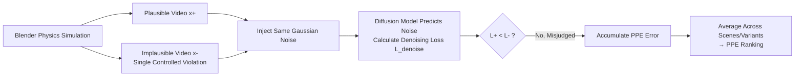

# LikePhys: Evaluating Intuitive Physics Understanding in Video Diffusion Models via Likelihood Preference

**Conference**: ICLR 2026  
**OpenReview**: [https://openreview.net/forum?id=6UJf6B8RZ8](https://openreview.net/forum?id=6UJf6B8RZ8)  
**Code**: [https://yuanjianhao508.github.io/LikePhys/](https://yuanjianhao508.github.io/LikePhys/)  
**Area**: Video Generation / Intuitive Physics Evaluation  
**Keywords**: Video Diffusion Models, Intuitive Physics, Likelihood Preference, Violation-of-Expectation Paradigm, World Models, Training-free Evaluation  

## TL;DR
LikePhys utilizes the denoising loss of diffusion models as a proxy for ELBO likelihood to compare "physically plausible vs. implausible" synthetic video pairs. This facilitates a training-free quantification of the intuitive physics understanding in video diffusion models, providing the PPE evaluation metric which aligns highly with human preferences.

## Background & Motivation
- **Background**: Video Diffusion Models (VDMs) can generate visually realistic videos and are expected to serve as general "world models" for robotics and autonomous driving. However, they frequently produce content violating physical common sense (e.g., super-elastic bouncing, object interpenetration, shadow misalignment).
- **Limitations of Prior Work**: Objectively measuring a VDM's "understanding of physics" is difficult. One category uses VLMs for QA-style scoring (e.g., VideoPhy series), but is contaminated by visual style bias, prompt template variations, and judge subjectivity. Another (e.g., Physics-IQ, Morpheus) relies on real videos for pixel/physical quantity alignment but depends on image-conditioned generation, making it untransferable to pure text-to-video VDMs.
- **Key Challenge**: **Physical correctness** and **visual appearance** are entangled during evaluation—a visually stunning video may be physically implausible and vice-versa. Existing metrics fail to decouple these factors.
- **Goal**: Propose a model-agnostic, appearance-agnostic, and training-free protocol to directly probe the physical distribution learned by VDMs rather than measuring their generations.
- **Key Insight**: **[Likelihood as Understanding]** Borrowing the "Violation-of-Expectation" paradigm from cognitive science, it is hypothesized that a model truly understanding physics should assign higher likelihood to plausible samples and lower likelihood to implausible ones. Since denoising loss serves as an ELBO proxy for negative log-likelihood, "lower denoising loss for plausible samples" becomes a measurable signal of physical understanding.

## Method

### Overall Architecture
LikePhys uses Blender to render "plausible/implausible" video pairs (differing only in physical validity, with strictly identical appearances). Identical Gaussian noise is injected into both videos, fed into the target diffusion model to predict noise and calculate denoising loss. By comparing which video yields lower loss and calculating the ratio where the model assigns higher likelihood to the implausible sample, a single scalar metric PPE (Plausibility Preference Error, lower is better) is derived. The entire process is zero-shot and requires no fine-tuning.

### Key Designs

**1. Denoising Loss as Likelihood Proxy for Physics Preference:** The paper defines physical understanding from a distributional perspective. Let $p_{\rm phys}(x)$ be the video distribution strictly following physical laws, where plausible samples $x^+$ fall within its support and implausible samples $x^-$ fall outside. A perfectly understanding model $p_\theta$ should satisfy $p_\theta(x^+) > p_\theta(x^-)$ for every pair. Based on the diffusion training objective, the denoising loss acts as an ELBO proxy for negative log-likelihood: $\mathcal{L}_{\rm denoise}(\theta;x_t) = \mathbb{E}_{t,\epsilon}\|\epsilon - \epsilon_\theta(x_t,t)\|^2 \ge \mathbb{E}_{x_0}[-\log p_\theta(x_0)] + \text{const}$. Thus, likelihood comparison is equivalent to loss comparison: $p_\theta(x^+) > p_\theta(x^-) \Longleftrightarrow \mathcal{L}_{\rm denoise}(\theta;x^+) < \mathcal{L}_{\rm denoise}(\theta;x^-)$. This maps abstract "physics understanding" to a computable loss difference without requiring discriminative heads or image conditioning.

**2. Plausibility Preference Error (PPE) Metric:** For each physical scene, $R=10$ variants are constructed (varying physical parameters and appearance distractors), with $M$ plausible and $N$ implausible samples per variant. By injecting the same noise at the same timestep and averaging denoising losses across multiple DDIM timesteps, the ratio of misassigning higher likelihood (lower loss) to implausible samples is calculated: $\text{PPE} = \frac{1}{R}\sum_{r=1}^{R}\frac{1}{M_r N_r}\sum_{j,k}\mathbf{1}[\mathcal{L}_{\rm denoise}(\theta;x_{r,j}^+) \ge \mathcal{L}_{\rm denoise}(\theta;x_{r,k}^-)]$. A value of 50% represents the random guess threshold; values below this indicate a genuine preference for physically plausible videos. Since pairs share identical appearances, likelihood biases from visual styles cancel out, decoupling physical correctness from appearance.

**3. Appearance-controlled Pairwise Synthetic Benchmark:** Since "physically-implausible-only" pairs do not exist in the real world, the paper uses Blender to render 12 scenes at 512×512, 60 FPS, covering four physical domains: rigid body mechanics, continuum mechanics, fluid mechanics, and optical effects. Within each variant, camera, lighting, texture, and geometry are fixed. Plausible samples conserve momentum/energy or follow free fall, while implausible samples introduce a single controlled violation (e.g., super-elastic bounce, teleportation, reverse flow, shadow misalignment). This "single-variable" design ensures measured likelihood differences are attributable solely to physical violations.

## Key Experimental Results

### Main Results: PPE Rankings of 12 VDMs (%, lower is better, selected)

| Model | Architecture | Average PPE |
|------|------|---------|
| Hunyuan T2V | DiT | **43.6** |
| Wan2.1-T2V-14B | DiT | 43.8 |
| CogVideoX1.5-5B | DiT | 43.8 |
| LTX v0.9.5 | DiT | 44.7 |
| CogVideoX-2B | DiT | 48.2 |
| Mochi | DiT | 51.9 |
| ModelScope | UNet | 52.9 |
| ZeroScope | UNet | 53.3 |
| AnimateDiff | UNet | 60.8 |

→ DiT architectures generally outperform early UNet architectures, yet even the best model's PPE remains near 44%, close to the 50% random threshold, indicating physical understanding is far from mature.

### Consistency with Human Preference (Kendall's $\tau$, higher is better)

| Evaluator | Overall $\tau$ |
|--------|--------|
| VideoPhy | 38.9 |
| VideoPhy2 | -8.5 |
| Qwen2.5-VL | 33.3 |
| **LikePhys (PPE)** | **44.4** |

→ PPE achieves the highest correlation with human physical consistency ratings without using downstream models to generate videos.

### Decoupling from Visual Quality (Pearson Correlation between PPE and VBench)

| Visual Metric | Correlation Coeff. |
|---------|---------|
| Aesthetic Quality | -0.05 |
| Subject Consistency | -0.01 |
| Background Consistency | -0.01 |
| Motion Smoothness | 0.15 |
| Temporal Flickering | 0.12 |

→ PPE shows nearly zero correlation with aesthetics/consistency, proving it measures a physical dimension orthogonal to visual quality.

### Key Findings
- **Model/Data/Frame Scaling is Effective**: Larger models, more training data, and more output frames lead to lower PPE; the top models are almost exclusively DiT-based.
- **CFG Strength has Negligible Impact**: Physical understanding is primarily determined by the learned distribution; CFG calibration during inference only plays a marginal role.
- **Significant Domain Disparities**: Fluid mechanics exhibits the highest error and variance (complex rivers often exceed 70%), while optical effects show the lowest error (large-scale image priors strongly constrain geometric/photometric laws).
- **Physical Law Level**: Temporal continuity shows the highest variance, while energy/mass conservation errors are high (lack of global constraints in standard training objectives). Geometric invariance and optical consistency are handled best.
- **Protocol Robustness**: Uniform sampling of 10 timesteps allows stable estimation; discriminative performance remains stable across 8 prompt variants.

## Highlights & Insights
- **Novel Perspective**: Instead of the mainstream "generate then score" approach, this method directly reads the model's internal likelihood distribution, treating the generative model as a density estimator and bypassing generation quality interference.
- **Elegant Decoupling**: Using "appearance-identical pairs + pairwise comparison" to naturally cancel visual style likelihood biases is a clever insight for isolating physics from appearance.
- **Training-free and Model-agnostic**: No fine-tuned judges or image conditions are required; it can be applied zero-shot to any text-to-video diffusion model with low engineering overhead.
- **Diagnostic Value**: Beyond ranking, it decomposes performance into physical domains and laws, highlighting systematic shortcomings in fluids, temporal continuity, and conservation laws, providing direction for "physics-aware training."

## Limitations & Future Work
- **Dependency on Synthetic Data**: The benchmark is rendered entirely in Blender with simplified scenes and single violations. Real-world physics understanding—complex, multi-violation, and chaotic—may not extrapolate linearly.
- **Bound to Diffusion Framework**: The method uses denoising loss as a likelihood proxy, requiring further validation for non-diffusion generators (e.g., autoregressive video models or non-standard flow matching objectives).
- **Metric Ceiling**: PPE measures "direction of preference" rather than the severity of errors and does not directly translate into actionable signals for fixing physical errors.
- **Future Work**: The authors suggest moving towards longer context training, multi-scale memory, and explicit physics-aware training objectives to promote conservation and continuity.

## Related Work & Insights
- **Violation-of-Expectation (VoE)**: Originating from cognitive science (Spelke, Baillargeon) and IntPhys1/2, utilizing controlled pairs to measure physics. LikePhys migrates this to generative VDMs and removes the dependency on conditional generation/pixel alignment.
- **VLM Scoring Path**: VideoPhy1/2 and Qwen-VL use QA templates for physics; LikePhys demonstrates that "reading likelihood" is more stable and efficient with higher human correlation.
- **Pixel/Physical Quantity Alignment**: Physics-IQ and Morpheus align physical quantities with real videos but require image conditioning; LikePhys's pure-text, appearance-agnostic design fills this gap.
- **Inspiration**: Treating denoising loss as a likelihood proxy can be extended to evaluate whether generative models have learned other structural priors, such as geometric consistency, causality, or affordance.

## Rating
- **Novelty**: ⭐⭐⭐⭐⭐ Treating denoising loss as a likelihood proxy via the VoE paradigm to decouple "physics vs. appearance" is a fresh perspective.
- **Experimental Thoroughness**: ⭐⭐⭐⭐ Covers 12 SOTA models, 4 physical domains, human preference alignment, visual decoupling, scaling factors, and protocol robustness; though the benchmark is restricted to simple synthetic scenes.
- **Writing Quality**: ⭐⭐⭐⭐ Logical flow from motivation to formalization, metrics, and benchmarks. Analyses of physical domains/laws provide good insights.
- **Value**: ⭐⭐⭐⭐⭐ Provides a training-free, decoupled, and human-aligned benchmark for "VDMs as world models," offering direct guidance for physics-aware video generation research.

<!-- RELATED:START -->

## Related Papers

- [\[CVPR 2026\] LocalDPO: Direct Localized Detail Preference Optimization for Video Diffusion Models](../../CVPR2026/video_generation/mind_the_generative_details_direct_localized_detail_preference_optimization_for_.md)
- [\[ICLR 2026\] Vid2World: Crafting Video Diffusion Models to Interactive World Models](vid2world_crafting_video_diffusion_models_to_interactive_world_models.md)
- [\[ICLR 2026\] Target-Aware Video Diffusion Models](target-aware_video_diffusion_models.md)
- [\[ICLR 2026\] VMoBA: Mixture-of-Block Attention for Video Diffusion Models](vmoba_mixture-of-block_attention_for_video_diffusion_models.md)
- [\[AAAI 2026\] OmniVDiff: Omni Controllable Video Diffusion for Generation and Understanding](../../AAAI2026/video_generation/omnivdiff_omni_controllable_video_diffusion_for_generation_and_understanding.md)

<!-- RELATED:END -->
