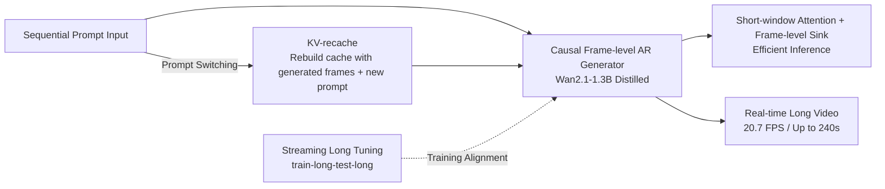

# LongLive: Real-time Interactive Long Video Generation

**Conference**: ICLR 2026  
**Code**: [https://github.com/NVlabs/LongLive](https://github.com/NVlabs/LongLive)  
**Area**: Video Generation / Autoregressive Long Video / Real-time Interactive Generation  
**Keywords**: Long video generation, frame-level autoregression, KV-recache, streaming long training, attention sink, real-time interaction  

## TL;DR
LongLive utilizes a frame-level causal autoregressive framework combined with a trio of features—KV-recache, streaming long training (train-long-test-long), and short-window attention with frame-level attention sinks. It fine-tunes a 1.3B short-video model within 32 GPU-days into an interactive long-video generator capable of real-time generation (20.7 FPS) on a single H100, supporting real-time prompt switching and video lengths up to 240 seconds.

## Background & Motivation
**Background**: Long video generation is valuable for storytelling, education, and film, but existing paradigms have critical weaknesses. Diffusion models and diffusion-forcing models offer high quality but rely on bidirectional attention and cannot use KV caching, resulting in extremely slow inference—SkyReels-V2 requires approximately 50 minutes on an H100 to generate a 60-second video. Autoregressive (AR) models with causal attention can reuse KV caches to accelerate inference; however, constrained by memory pressure during long video training, they generally adopt a "train-short-test-long" strategy, leading to quality collapse as the video length increases.

**Limitations of Prior Work**: Beyond "length," practical long video generation requires "interactivity"—allowing users to stream new prompts during generation to guide the narrative in real-time. However, prompt switching introduces a dilemma: either discard the entire KV cache to align with the new prompt (causing visual jumps and temporal breakage) or retain the entire cache to maintain continuity (causing the model to be "captured" by the semantic inertia of the old prompt, delaying the response to the new prompt). Both cannot be satisfied simultaneously.

**Key Challenge**: Interactive long video generation is squeezed by both **quality** (prompt switching smoothness vs. alignment, long-range consistency) and **efficiency** (attention complexity grows quadratically with length, with token counts exceeding one million for 180-second videos). Additionally, the training-inference gap in AR models causes continuous long-range quality decay.

**Goal**: To build a truly real-time, interactive, and long-range stable video generation framework. **Core Idea**: Use causal frame-level AR as the backbone to inherit KV cache efficiency, then introduce three targeted designs to resolve the conflicts of prompt switching, the long-training gap, and inference acceleration: **KV-recache for the smoothness-alignment trade-off during switching, Streaming Long Tuning to align training with inference, and Short-Window Attention + Frame-Level Sink to accelerate inference while maintaining consistency.**

## Method

### Overall Architecture
LongLive is based on the Wan2.1-T2V-1.3B causal frame-level AR generator. It first uses an improved self-forcing DMD process to distill it into a few-step causal model, then layers three key modules. Their roles are distinct: KV-recache handles interactive switching, Streaming Long Tuning manages the "long sequence training," and Short-Window Attention + Frame Sink handles inference acceleration. The latter two are deeply coupled—sinks only become effective once long training eliminates long-range collapse.

### Key Designs

**1. KV-recache: Rebuilding cache at switching boundaries using "old frames + new prompt" to break the smoothness-alignment dilemma.** The authors diagnose the cause: in DiT architectures, cross-attention and self-attention alternate. Information from the previous prompt is repeatedly injected via cross-attention and propagated via self-attention, eventually being written into the running KV cache. Consequently, after switching prompts, residual semantics from the old prompt remain in the cache, causing inertia or delayed response. KV-recache addresses this by: at the switching boundary, taking the **previously generated video prefix as visual context** and **recalculating the KV cache paired with the new prompt**. This erases residual semantics while preserving motion and visual cues for temporal continuity. For interactive inference with $n+1$ prompts and $n$ switching points, the generator rolls causally and performs a recache at each boundary (training involves only one switch per sample). To eliminate training-inference mismatch, recache is integrated into the training loop: if an iteration contains a switch, the model (i) performs a recache, (ii) continues rollout with the updated cache, and (iii) provides the new prompt to the teacher during distillation so the student is supervised under the "post-switch conditions" it will face during inference. The overhead is minimal—a 10-second video with one switch increases time by only about 6%.

**2. Streaming Long Tuning: Rolling reuse of historical KV cache for segment-wise supervision to achieve train-long-test-long.** AR models trained only on short clips must repeatedly feed their own outputs through a fixed window during inference; error accumulation makes the context increasingly "dirty," leading to content drift. Direct training on long sequences faces two hurdles: the teacher itself is only proficient at short clips and cannot provide reliable supervision for long sequences, and naive backpropagation through long sequences easily causes OOM. LongLive splits long training into rolling local steps: the first iteration samples a 5-second clip from zero with DMD supervision; each subsequent iteration continues generating the next 5-second clip based on the KV cache stored from the previous round, applying DMD only to this **newly generated segment**. The key technique is **detaching already generated frames as constant causal context**, with gradients calculated only on the current segment. Thus, memory usage is limited by the segment duration ($O(W+T+S)$ and does not grow with total length), avoiding OOM while allowing the teacher to provide reliable supervision on short segments. The authors also found that long training is not only critical for long video quality but is a prerequisite for the effective use of efficient inference strategies like window attention and sinks.

**3. Short-Window Attention + Frame-Level Attention Sink: Recovering long-range consistency with global anchors under short windows.** Since videos exhibit temporal locality (neighboring frames contribute more to predicting the next), both inference and streaming training adopt local window attention. This reduces attention complexity from quadratic relative to sequence length to linear relative to window size, and the KV cache needs only to store the window. However, shorter windows improve efficiency but degrade consistency. The authors' insight is that while prior work found sink tokens alone could not prevent collapse in long rollouts, **sinks become effective once long-range collapse is eliminated via Streaming Long Tuning**. Specifically, the **first frame block of the video is fixed as a global sink token**, permanently retained in the KV cache and concatenated to the key/value of every attention block. This makes it globally visible even to local window attention, while the rest of the cache is managed via a short rolling window. Training and inference are unified: retaining the last $W$ frames of previous context (no gradient) + $T$ frames of the current supervised segment (with gradient) + $S$ permanent sink frames (the first two frames). Testing confirms that 9 local frames + 3 sink frames (effective window of 12) can approximate the consistency of a 21-frame window while reducing end-to-end computation time by 28% and peak memory by 17%.

## Key Experimental Results

### Main Results
Short video generation (VBench official prompts, 5-second clips, FPS on single H100):

| Model | #Params | Throughput (FPS)↑ | Total↑ | Quality↑ | Semantic↑ |
|---|---|---|---|---|---|
| Wan2.1 (Diffusion) | 1.3B | 0.78 | 84.26 | 85.30 | 80.09 |
| SkyReels-V2 (AR) | 1.3B | 0.49 | 82.67 | 84.70 | 74.53 |
| CausVid | 1.3B | 17.0 | 81.20 | 84.05 | 69.80 |
| Self-Forcing (chunk) | 1.3B | 17.0 | 84.31 | 85.07 | 81.28 |
| **Ours** | 1.3B | **20.7** | **84.34** | **85.72** | 79.62 |

Single prompt 30-second long video (VBench-Long):

| Model | Total↑ | Quality↑ | Semantic↑ | FPS↑ |
|---|---|---|---|---|
| SkyReels-V2 | 75.29 | 80.77 | 53.37 | 0.49 |
| FramePack | 81.95 | 83.61 | 75.32 | 0.92 |
| Self-Forcing | 81.59 | 83.82 | 72.70 | 17.0 |
| **Ours** | **83.52** | **85.44** | **75.82** | **20.7** |

Interactive 60-second long video (Total Quality + Segmented CLIP):

| Method | Quality↑ | CLIP 0–10s | CLIP 30–40s | CLIP 50–60s |
|---|---|---|---|---|
| SkyReels-V2 | 79.85 | 21.34 | 17.95 | 19.25 |
| Self-Forcing | 82.15 | 27.92 | 22.45 | 23.55 |
| **Ours** | **85.02** | **29.45** | **24.85** | **24.65** |

### Ablation Study
KV-recache ablation (10-second video, switch at 5s):

| Strategy | Background Consistency↑ | Subject Consistency↑ | CLIP↑ | FPS↑ |
|---|---|---|---|---|
| No KV cache (Clear) | 92.75 | 89.59 | **28.95** | 22.8 |
| Retain KV cache | 94.77 | 93.69 | 25.92 | 21.9 |
| **KV-recache** | **94.81** | **94.04** | 27.87 | 20.7 |

Short Window + Frame Sink ablation: 9 local + 3 sink (effective window 12) achieves consistency close to a 21-frame window while maintaining the speed and memory profile of a short window.

### Key Findings
- **Efficiency**: Training took 32 GPU-days (64×H100 for ~12 hours) to fine-tune a 1.3B model for minute-level video; inference reaches 20.7 FPS, 41× faster than SkyReels-V2.
- **No Quality Degradation**: Short video quality is on par with the strongest baselines, while significantly leading in long video and interactive scenarios, with minimal CLIP score decay over 60 seconds.
- **KV-recache Trade-off**: Clearing the cache yields the highest CLIP (best alignment with new prompt) but worst consistency; recache achieves the best consistency with almost no loss in alignment.
- **Long Training as Prerequisite for Sink**: Only after eliminating long-range collapse via training can frame sinks restore short-window consistency to levels near large windows.
- **Additional Capabilities**: Supports 240-second videos, INT8 quantized inference (2.7GB→1.4GB with marginal quality loss), and verified transferability on the linear-attention AR model SANA-Video.

## Highlights & Insights
- **Diagnosis of prompt switching difficulty**: Specifically identifying how cross/self-attention writes old semantics into the KV cache and targetedly using recache to erase residual semantics while retaining visual cues.
- **Counter-intuitive Insight**: The discovery that "long training is a prerequisite for efficient inference" is highly valuable. Sinks failing is not a problem with the sink itself but a failure to address long-range collapse first. This upgrades the three modules from a collection of "parallel tricks" to a "causally dependent system design."
- **Pragmatic Engineering**: Streaming Long Tuning uses detaching and segment-wise supervision to keep memory usage at segment-level, bypassing OOM and teacher limitations.
- **True End-to-end Real-time Interaction**: 20.7 FPS plus the ability to switch prompts at any time moves long video generation from "offline rendering" to a "real-time guidable creative tool."

## Limitations & Future Work
- The base model is 1.3B at 832×480/16FPS; whether it scales losslessly to larger models or higher resolutions remains to be verified.
- Training samples contained only one prompt switch; multiple switches rely on inference generalization, and stability under dense rapid switching has not been fully stress-tested.
- Frame sinks fix the first frame block as a global anchor; for long videos requiring drastic scene or identity changes, the sink might become a constraint.
- Interactive long video generation lacks a standard evaluation protocol; the authors built a 160-item 60-second validation set, but cross-work comparability requires a unified community benchmark.

## Related Work & Insights
- **AR Long Video & Train-Test Gap**: Self-Forcing simulates inference conditions during training by using KV cache rollout conditioned on its own output, which serves as the direct foundation for the short-training control and distillation pipeline. MAGI-1 scales AR to large models but requires manual KV window tuning for prompt switching. LongLive systematizes these points.
- **Diffusion × AR Hybrid Paradigms**: SkyReels-V2 (diffusion forcing + structure planning) and FramePack have strong quality but are slow, highlighting the efficiency cost of bidirectional attention that cannot utilize KV caching.
- **Rediscovery of Attention Sinks**: Borrowing the attention sink concept from LLMs but correcting the old conclusion that "sinks are ineffective in video"—the key is providing a foundation through long training. This is insightful for future work on long-context video and world models.
- **Streaming Generation**: StreamDiT (windowed diffusion) and AAPT (adversarial post-training for 1-NFE interaction) take the GAN or diffusion routes, while LongLive adheres to distribution-matching and long-training distillation for text-driven multi-minute generation.

## Rating
- Novelty: ⭐⭐⭐⭐ — Both KV-recache and the "long training as prerequisite" insight are novel; the three modules form a system design rather than a stack of tricks.
- Experimental Thoroughness: ⭐⭐⭐⭐ — Covers short/long/interactive scenarios, multiple baselines, component ablation, user studies, and INT8/SANA-Video transfers; slightly less a star due to the lack of a standardized interactive benchmark.
- Writing Quality: ⭐⭐⭐⭐ — Clear logic from motivation to diagnosis to method, with effective diagrams (KV-recache, streaming pipeline, window/sink comparisons).
- Value: ⭐⭐⭐⭐⭐ — 20.7 FPS real-time interactive 240-second generation on a single H100 with open-source code; high engineering and product value.

<!-- RELATED:START -->

## Related Papers

- [\[ICLR 2026\] MotionStream: Real-Time Video Generation with Interactive Motion Controls](motionstream_real-time_video_generation_with_interactive_motion_controls.md)
- [\[CVPR 2026\] Endless World: Real-Time 3D-Aware Long Video Generation](../../CVPR2026/video_generation/endless_world_real-time_3d-aware_long_video_generation.md)
- [\[NeurIPS 2025\] Autoregressive Adversarial Post-Training for Real-Time Interactive Video Generation](../../NeurIPS2025/video_generation/autoregressive_adversarial_posttraining_for_realtime_interac.md)
- [\[ICLR 2026\] Real-Time Motion-Controllable Autoregressive Video Diffusion](real-time_motion-controllable_autoregressive_video_diffusion.md)
- [\[ICLR 2026\] Mixture of Contexts for Long Video Generation](mixture_of_contexts_for_long_video_generation.md)

<!-- RELATED:END -->
