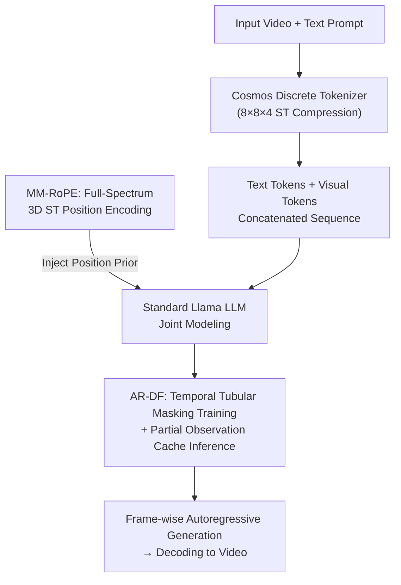

# Lumos-1: On Autoregressive Video Generation with Discrete Diffusion from a Unified Model Perspective

**Conference**: ICLR 2026  
**arXiv**: [2507.08801](https://arxiv.org/abs/2507.08801)  
**Code**: [https://github.com/alibaba-damo-academy/Lumos](https://github.com/alibaba-damo-academy/Lumos)  
**Area**: Diffusion Models / Video Generation  
**Keywords**: Autoregressive, Discrete Diffusion, RoPE, Unified Model, Video Generation  

## TL;DR

Ours proposes Lumos-1, a unified video generation model based on the LLM architecture. It addresses visual spatio-temporal encoding issues via MM-RoPE (Distributed Multimodal RoPE) and solves inter-frame loss imbalance via AR-DF (Autoregressive Discrete Diffusion Forcing). With training on only 48 GPUs, it achieves competitive results on GenEval, VBench-I2V, and VBench-T2V.

## Background & Motivation

**Rise of Autoregressive Video Generation**: The massive success of LLMs in linguistic tasks has inspired explorations into autoregressive video generation.

**Limitations of Prior Work**:
   - Architectures deviate from standard LLMs (e.g., NOVA, Phenaki).
   - Dependence on external text encoders (e.g., LlamaGen, Fluid).
   - Extremely low efficiency in token-by-token decoding (e.g., Loong).

**1D RoPE Unsuitability**: The one-dimensional position encoding of LLMs cannot model the three-dimensional spatio-temporal correlations in video.

**Unbalanced 3D RoPE Spectrum**: In naive 3D RoPE, the temporal dimension occupies high-frequency bands while spatial dimensions are compressed to near-zero frequencies, leading to insufficient spatial modeling.

**Loss Imbalance in Random Mask Prediction**: High spatial redundancy between frames causes the mask prediction loss of subsequent frames to be significantly lower than the first frame, leading the model to optimize simpler tasks over complex ones.

**Goal**: Achieve competitive performance within limited resources (48 GPUs) and data.

## Method

### Overall Architecture

Lumos-1 is a unified video generation model that adheres to the standard Llama architecture. It first employs the Cosmos discrete tokenizer with a $8\times8\times4$ spatio-temporal compression ratio to quantize video into discrete tokens. Text tokens and visual tokens are then concatenated into a single sequence for joint modeling by the same LLM. It introduces two video-specific modifications to the standard LLM: **MM-RoPE**, which injects 3D spatio-temporal priors into position encodings, and **AR-DF**, which re-aligns discrete diffusion training and inference with the causal structure of autoregression.

### Key Designs

**1. MM-RoPE (Distributed Multimodal RoPE): Enabling Full-Spectrum Encoding for Time and Space**

Directly extending 1D RoPE to 3D introduces an obscure but fatal spectrum issue. Naive 3D RoPE splits $d/2$ rotation dimensions across time, height, and width in a $2:3:3$ ratio. Consequently, low-index channels with the highest rotation frequencies are assigned captured by the time axis, while height and width are pushed to high indices where frequencies approach zero. This results in the temporal dimension dominating high frequencies while spatial dimensions lack resolution. MM-RoPE solves this via a "scatter-and-redistribute" strategy: the entire channel is split into several meta-blocks (16 dimensions each), and **within each block**, frequencies are re-assigned to T/H/W. This ensures each axis covers the full spectrum from high to low frequencies. Text tokens bypass this and use standard 1D RoPE, while 3D latent coordinates are mapped back to RGB pixel space via compression ratios to keep text and visual scales comparable.

| RoPE Type | Text Compatible | 3D Structure | Full-Spectrum Allocation | Strategic Scaling |
|-----------|-----------------|--------------|--------------------------|-------------------|
| M-RoPE | ✔ | ✔ | ✗ | ✗ |
| VideoRoPE | ✔ | ✔ | ✗ | ✔ |
| **MM-RoPE** | **✔** | **✔** | **✔** | **✔** |

**2. AR-DF (Autoregressive Discrete Diffusion Forcing): Eliminating Loss Imbalance and Aligning Inference**

Applying random mask prediction to video causes "loss bias." High redundancy between adjacent frames allows subsequent frames to "copy" visible tokens from previous frames to predict masks, leading to much lower loss than the first frame. AR-DF blocks this via **temporal tubular masking** during training: a single mask pattern $\bm{M}\sim\text{Bernoulli}(1-\rho)$ is sampled for the first frame and replicated across all frames: $\widetilde{\bm{X}}_v^{(t)}=\bm{M}\odot\bm{X}_v^{(t)}+(1-\bm{M})\odot[\text{MASK}]$. Since masked positions are perfectly aligned, subsequent frames cannot find visible shortcuts in previous frames, forcing genuine prediction and balancing loss. Inference utilizes **partial observation caching**: frames are generated autoregressively. After generating a frame, tokens are randomly replaced with [MASK] at a ratio $\rho_{\text{inf}}$ before writing to the KV cache. This ensures the model sees partially masked historical frames during inference, matching the training distribution.

### Loss & Training

The training objective is standard cross-entropy, calculated only at masked token positions $\mathcal{L}(\widehat{\bm{X}},\bm{X},\bm{M})$, ensuring gradients derive from the positions the model truly needs to predict.

## Key Experimental Results

### Main Results (GenEval - T2I)

| Model | Parameters | Training Data | Representation | Overall ↑ |
|-------|------------|---------------|----------------|-----------|
| EMU3 | 8B | - | Discrete | 0.66 |
| Show-o2 | 7B | 66M | Continuous | 0.76 |
| Fluid | 10.5B+4.7B | 680M | Continuous | 0.69 |
| **Lumos-1 (3.6B, 512×512)** | **3.6B** | **60M** | **Discrete** | **0.791** |

### VBench-I2V

| Model | Parameters | Video Data | Total ↑ | I2V Score |
|-------|------------|------------|---------|-----------|
| COSMOS | 5B+11B | 100M | 84.16 | 92.51 |
| CogVideoX | 5.6B+4.8B | - | 86.70 | 94.79 |
| VideoMAR | 1.4B+1.5B | 0.5M | 84.82 | 94.02 |
| **Lumos-1 (3.6B)** | **3.6B** | **10M** | **84.72** | **93.34** |

**Key Findings**: Trained with only 48 GPUs, 60M images, and 10M videos, Lumos-1 matches or exceeds EMU3 (8B), demonstrating the effectiveness of MM-RoPE and AR-DF.

## Highlights & Insights

1.  **3D RoPE Spectrum Analysis**: Provides the first systematic analysis of frequency imbalance in 3D RoPE for video and offers an elegant distributed solution.
2.  **Attribution of Loss Imbalance**: Clearly explains that inter-frame loss imbalance stems from spatial redundancy rather than simple data imbalance.
3.  **Inference-Training Consistency**: AR-DF introduces partial observation masks during inference to align with training conditions, a concise and effective approach.
4.  **Resource Efficiency**: Competitive performance achieved with 48 GPUs validates training efficiency.
5.  **Pure LLM Architecture**: No external text encoders are required; standard Llama architecture handles multimodal tokens directly.

## Limitations & Future Work

1.  The use of a discrete tokenizer (Cosmos) limits reconstruction quality compared to continuous tokenizers.
2.  Training data scale (60M images + 10M videos) is significantly smaller than commercial models.
3.  The position scaling strategy (multiplying by compression ratio) is heuristic and may not be optimal.
4.  Video resolution and duration are limited (672×384×25); scalability to long or high-res video remains unverified.
5.  While better than next-token AR, specific inference latency data is not fully reported.

## Related Work & Insights

- **Chameleon / EMU3**: Pioneers in unified multimodal LLMs; Lumos-1 optimizes specifically for video.
- **M-RoPE (Qwen2-VL)**: Early work extending RoPE to 3D; MM-RoPE improves its frequency allocation.
- **Diffusion Forcing (Chen et al.)**: Tubular masking is adapted here for causal (autoregressive) scenarios.
- **Insight**: Frequency allocation is a critical design point for any RoPE-based multimodal model; tubular masking is generalizable to other AR+mask prediction paradigms.

## Rating

- Novelty: ⭐⭐⭐⭐⭐
- Experimental Thoroughness: ⭐⭐⭐⭐
- Writing Quality: ⭐⭐⭐⭐⭐
- Value: ⭐⭐⭐⭐⭐

<!-- RELATED:START -->

## Related Papers

- [\[CVPR 2026\] Archon: A Unified Multimodal Model for Holistic Digital Human Generation](../../CVPR2026/video_generation/archon_a_unified_multimodal_model_for_holistic_digital_human_generation.md)
- [\[ICLR 2026\] JavisDiT++: Unified Modeling and Optimization for Joint Audio-Video Generation](javisdit_unified_modeling_and_optimization_for_joint_audio-video_generation.md)
- [\[CVPR 2026\] CubeComposer: Spatio-Temporal Autoregressive 4K 360° Video Generation from Perspective Video](../../CVPR2026/video_generation/cubecomposer_spatio-temporal_autoregressive_4k_360_video_generation_from_perspec.md)
- [\[ICLR 2026\] TPDiff: Temporal Pyramid Video Diffusion Model](tpdiff_temporal_pyramid_video_diffusion_model.md)
- [\[ICLR 2026\] EchoMotion: Unified Human Video and Motion Generation via Dual-Modality Diffusion Transformer](echomotion_unified_human_video_and_motion_generation_via_dual-modality_diffusion.md)

<!-- RELATED:END -->
