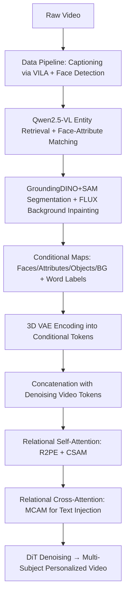

# LumosX: Relate Any Identities with Their Attributes for Personalized Video Generation

**Conference**: ICLR 2026  
**OpenReview**: [https://openreview.net/forum?id=r5o6PWgzav](https://openreview.net/forum?id=r5o6PWgzav)  
**Code**: [Project Page](https://jiazheng-xing.github.io/lumosx-home/)  
**Area**: Video Generation / Personalized Multi-Subject Customization  
**Keywords**: Multi-subject video generation, face-attribute binding, DiT, Rotary Positional Encoding, Attention Mask, Wan2.1  

## TL;DR
LumosX introduces "Relational Self-Attention" and "Relational Cross-Attention" into the Wan2.1 video DiT. By utilizing Relational Rotary Positional Encoding (R2PE), Causal Self-Attention Mask (CSAM), and Multi-level Cross-Attention Mask (MCAM), it explicitly binds each face with its attributes (clothing, accessories, hairstyle) into independent subject groups. Combined with a data pipeline featuring face-attribute dependency annotations, it addresses the long-standing "attribute entanglement" issue in personalized multi-subject video generation.

## Background & Motivation
**Background**: Diffusion models and DiT architectures have pushed text-to-video generation to new heights. Personalized customization has evolved from single-subject face fidelity to high-degree-of-freedom generation capable of simultaneously controlling multiple foreground subjects and backgrounds (e.g., Phantom, SkyReels-A2).

**Limitations of Prior Work**: Current multi-subject methods simply concatenate conditional signals for different subjects (face exemplars + attribute descriptions, e.g., "man: blonde hair, white T-shirt, sunglasses") and feed them into the DiT. These methods lack an explicit mechanism to guarantee "which face matches which attributes." When identical nouns appear in a caption ("the man on the left... the man on the right..."), subject-attribute associations easily confuse, leading to **attribute entanglement** or **face–attribute misalignment**.

**Key Challenge**: Implicit modeling via text captions cannot eliminate ambiguity between identical subjects. Explicit constraints require both public datasets with face-attribute dependency annotations and architectural mechanisms to enforce "intra-group binding and inter-group isolation"—**both data and models are currently lacking**.

**Goal**: Achieve open-set, identity-consistent, and semantically-aligned personalized multi-subject video generation where each subject's face is accurately paired with its attributes while maintaining temporal coherence and identity fidelity.

**Core Idea**: The authors propose **"explicitly binding face-attribute dependencies"** as the core logic. On the data side, MLLMs are used to infer and annotate attribute ownership for each face, building a training set and benchmark with dependency structures. On the model side, each face-attribute pair is bound into an independent subject group, using **positional encodings and attention masks to simultaneously enhance intra-group correlation and suppress inter-group interference**.

## Method

### Overall Architecture
LumosX uses Wan2.1 T2V (1.3B) as the backbone. All conditional maps (faces, attributes, objects, background) are encoded by a 3D VAE into image tokens, concatenated with denoising video tokens, and fed into DiT blocks. Within each block, **Relational Self-Attention** (incorporating R2PE and CSAM) establishes dependencies during positional encoding and spatio-temporal self-attention. **Relational Cross-Attention** (incorporating MCAM) injects text conditions, enhances the semantic representation of visual tokens, and aligns face-attribute relations. The entire system is supported by a three-step data pipeline providing training data with face-attribute dependency annotations.

### Key Designs

**1. Data Pipeline: Automated Annotation of Face–Attribute Dependencies using MLLMs**
Public datasets lack dependency structure labels. The authors designed a three-step pipeline using raw videos (Panda70M). First, VILA generates rich captions, and human subjects are extracted via face detection at 5%/50%/95% frames. Second, Qwen2.5-VL retrieves entity words from captions categorized into "human subjects with attributes (man: black shirt, black watch)," "objects (tableware)," and "background (lush garden)." Using visual priors from face detection, each attribute is precisely assigned to its subject—eliminating ambiguity even with multiple identical nouns. Third, attributes are masked using SAM, objects segmented by GroundingDINO+SAM, and clean backgrounds inpainted via FLUX. Finally, one frame per entity is randomly selected as a condition (consistent with inference). This yields 1.57M samples (1.31M single-subject / 230k dual-subject / 30k triple-subject) and defines two evaluation tasks: identity-consistent and subject-consistent.

**2. Relational Rotary Positional Encoding (R2PE): Shared Temporal Indices for Intra-group Tokens**
The original 3D-RoPE assigns sequential position indices $(i,j,k)$ to video tokens $z \in \mathbb{R}^{T \times HW \times C}$. For conditional maps, the authors enforce **face-attribute dependency preservation**. For concatenated tokens $z' = [z; z_c]$, background and object tokens extend along the $i$-axis. However, for subject tokens (face $z_{face}$ + attribute $z_{attr}$), the face and its attributes within the same group **share the same $i$ index**, expanding only across $j$ and $k$ indices:

$$
(i', j', k') = \begin{cases} (i_{bg/obj} + T,\ j,\ k), & z_{bg}, z_{obj} \\ (i_{sub} + T + N_{bg/obj},\ j + W\!\cdot\!N^g_{i_{sub}},\ k + H\!\cdot\!N^g_{i_{sub}}), & z_{sub} \end{cases}
$$

Sharing the $i$ index "pulls" intra-group faces and attributes together at the level of implicit relative positions in RoPE. The model recognizes they belong to the same subject from the start, avoiding face confusion. Ablations show R2PE alone increases ArcSim from 0.316 to 0.363.

**3. Causal Self-Attention Mask (CSAM): Intra-group Binding and Unidirectional Aggregation**
CSAM is a Boolean matrix following two rules: first, computation is restricted within each conditional branch (face and its attributes are treated as a unified subject branch); second, denoising video tokens perform **unidirectional attention** toward conditional tokens. The mask is defined as:

$$
M^{SA}_{q,k} = \begin{cases} \text{True}, & q \in z \ \text{or}\ q = k \ \text{or}\ q,k \in z^g_{sub} \\ \text{False}, & \text{otherwise} \end{cases}
$$

Where $z^g_{sub}$ represents face/attribute tokens in the same subject group. This allows the denoising branch to aggregate conditional signals independently while efficiently binding face-attribute dependencies within the condition branch and blocking reverse interference. This is accelerated using MagiAttention. While R2PE "pulls groups together," CSAM "isolates groups and enables unidirectional signaling." Together, they are complementary; adding CSAM restores CLIP-T from 0.178 to 0.182.

**4. Multi-level Cross-Attention Mask (MCAM): Strengthening Semantic Alignment and Dynamic Scaling**
In cross-attention, all visual tokens interact with text tokens. However, in customization, each visual condition corresponds to specific text (face image → "man"). MCAM is a numerical mask defining three levels of correlation: Strong (+1) for visual conditions matched to their text and intra-group visual tokens to all group text; Weak (−1) for subject visual tokens matched to different group text; and Neutral (0) for others:

$$
M^{CA}_{q,k} = \begin{cases} +1, & q,k \ \text{belong to same semantic entity or subject group} \\ -1, & q,k \ \text{belong to different subject groups} \\ 0, & \text{otherwise} \end{cases}
$$

The mask is injected as $\text{Softmax}\!\left(\frac{QK^\top + M^{CA}_{q,k}\cdot s\cdot r}{\sqrt{d_K}}\right)V$, where $r$ controls constraint strength. Since similarity magnitudes vary across positions, the authors introduce a **dynamic scaling factor** $s$ for per-position calibration. To avoid expensive recalculation, $s$ is approximated outside the attention module: $s = \text{Repeat}(Q_{ds}K^\top, \text{shape}(QK^\top))$, where $Q_{ds}$ is a spatially downsampled version of $Q$ using local average pooling. In ablations, ArcSim reaches 0.429 at $r=0.5$ (vs. 0.316 without mask), making it the most significant single module for improvement.

## Key Experimental Results

### Main Results

Identity-consistent generation for single subjects (220 videos):

| Method | ArcSim ↑ | CurSim ↑ | ViCLIP-T ↑ |
|------|----------|----------|------------|
| ConsisID (CogVideoX-5B) | 0.458 | 0.474 | 0.263 |
| Concat-ID (Wan2.1-1.3B) | 0.467 | 0.485 | 0.261 |
| **LumosX (1.3B)** | **0.542** | **0.575** | 0.262 |

Identity-consistent generation for multiple subjects (Full test set, 500 videos):

| Method | ArcSim ↑ | CurSim ↑ | ViCLIP-T ↑ |
|------|----------|----------|------------|
| SkyReels-A2 (Wan2.1-14B) | 0.382 | 0.401 | 0.261 |
| Phantom (Wan2.1-1.3B) | 0.508 | 0.536 | 0.264 |
| **LumosX (1.3B)** | **0.510** | **0.540** | 0.262 |

Subject-consistent generation (Full video + two-tier subject extraction evaluation):

| Method | Dynamic ↑ | ViCLIP-T ↑ | ViCLIP-V ↑ | CLIP-T ↑ | CLIP-I ↑ | DINO-I ↑ | ArcSim ↑ | CurSim ↑ |
|------|-----------|------------|------------|----------|----------|----------|----------|----------|
| SkyReels-A2 | 0.671 | 0.251 | 0.839 | 0.178 | 0.606 | 0.192 | 0.271 | 0.290 |
| Phantom | 0.661 | 0.254 | 0.865 | 0.185 | 0.647 | 0.216 | 0.444 | 0.477 |
| **LumosX** | **0.723** | **0.260** | **0.932** | **0.201** | **0.692** | **0.261** | **0.454** | **0.483** |

LumosX leading consistently in subject-consistent tasks with only 1.3B parameters, even outperforming the 14B SkyReels-A2.

### Ablation Study

Subject-consistent generation ablation (Lightweight setting: 300K samples, 240p):

| Configuration | CLIP-T ↑ | ArcSim ↑ |
|------|----------|----------|
| None | 0.184 | 0.316 |
| +R2PE | 0.178 | 0.363 |
| +R2PE+CSAM | 0.182 | 0.363 |
| +R2PE+CSAM+MCAM (r=0.1) | 0.182 | 0.364 |
| **+R2PE+CSAM+MCAM (r=0.5)** | 0.186 | **0.429** |
| +R2PE+CSAM+MCAM (r=1.0) | **0.187** | 0.384 |

### Key Findings
- **R2PE primarily improves identity fidelity**: Adding R2PE significantly increases ArcSim (0.316→0.363), though sharing T-indices slightly reduces single-entity semantic expression, reflected in a minor CLIP-T drop.
- **CSAM restores semantic loss**: Isolating inter-group conditions allows CLIP-T to recover, proving inter-group interference is a source of semantic confusion.
- **Trade-off between MCAM and $r$**: ArcSim peaks at $r=0.5$ while CLIP-T peaks at $r=1.0$. Since ArcSim better reflects face-attribute ownership accuracy, $r=0.5$ is chosen.
- **Training Cost**: Two-stage training (15k single-subject + 16k mixed multi-subject) requires approximately 883 GPU-days (H20).

## Highlights & Insights
- **Treating "face-attribute binding" as a first-order problem**: While prior multi-subject methods relied on concatenation, this paper identifies the neglected failure mode of identical subject ambiguity and models it explicitly across data and architecture.
- **Double orthogonal constraints via Positional Encoding + Attention Masks**: R2PE "pulls groups together" at the relative position level, while CSAM/MCAM "isolate groups and strengthen semantics" at the attention level. Each component serves a distinct, separable purpose.
- **Efficiency over scale**: The 1.3B LumosX outperforms the 14B SkyReels-A2 in subject-consistent tasks, suggesting explicit relational modeling is more effective than parameter scaling for solving misalignment.
- **Data pipeline as a benchmark**: The MLLM annotation pipeline produces both training data and evaluation sets, introducing fine-grained metrics like ArcSim/DINO-I to measure face-attribute ownership accurately.

## Limitations & Future Work
- **Attribute count limits**: Training and inference recommend a maximum of 3 attributes per subject; exceeding this may degrade consistency.
- **Dependence on MLLM annotation quality**: Errors in Qwen2.5-VL's face-attribute matching could pollute training data; robustness in highly complex open-set scenes requires further discussion.
- **Limited resolution and duration**: Main experiments use 480p / 81 frames (5 seconds), with ablations at 240p. Robustness for longer, high-definition scenes is yet to be verified.
- **MCAM approximation scaling factor**: Using downsampled similarity for $s$ is a precision-efficiency trade-off; the impact of approximation errors in extreme cases is not quantified.

## Related Work & Insights
- **Multi-subject customization lineage**: LumosX fills the missing gap of "explicitly modeling intra-subject dependency structures," moving from ID-consistent (Magic-Me, ConsisID) to arbitrary subjects (VideoBooth, DreamVideo) and to multi-subject DiT (Phantom, SkyReels-A2).
- **Inspiration for attention-controlled generation**: Using structured masks (Boolean + multi-level numerical) within attention to encode semantic relations is a lightweight, plug-and-play approach for controllable generation, transferable to multi-concept image synthesis and layout control.
- **Positional Encoding as semantic binding**: Sharing RoPE indices to group tokens suggests positional encoding can function as more than just a geometric tool; it can encode semantic ownership.

## Rating
- **Novelty**: ⭐⭐⭐⭐ — Transitioning face-attribute binding from implicit to explicit using the R2PE/CSAM/MCAM combination is a clear and original contribution to multi-subject video customization.
- **Experimental Thoroughness**: ⭐⭐⭐⭐ — Comprehensive main results and ablations with a self-built benchmark, two task types, and fine-grained metrics; however, lacks scalability validation for higher resolutions or more subjects.
- **Writing Quality**: ⭐⭐⭐⭐ — Motivations and failure modes are well-defined. Figures for the data pipeline and masks are intuitive, and the logic between formulas and ablations is consistent.
- **Value**: ⭐⭐⭐⭐ — Addresses a real pain point in multi-subject personalized generation; 1.3B model achieving SOTA performance and the data pipeline/benchmark provide significant value to the community.

<!-- RELATED:START -->

## Related Papers

- [\[ICLR 2026\] ReactID: Synchronizing Realistic Actions and Identity in Personalized Video Generation](reactid_synchronizing_realistic_actions_and_identity_in_personalized_video_gener.md)
- [\[CVPR 2026\] Lynx: Towards High-Fidelity Personalized Video Generation](../../CVPR2026/video_generation/lynx_towards_high-fidelity_personalized_video_generation.md)
- [\[ICLR 2026\] MAGREF: Masked Guidance for Any-Reference Video Generation with Subject Disentanglement](magref_masked_guidance_for_any-reference_video_generation_with_subject_disentang.md)
- [\[CVPR 2026\] DreamShot: Personalized Storyboard Synthesis with Video Diffusion Prior](../../CVPR2026/video_generation/dreamshot_storyboard_synthesis.md)
- [\[ICLR 2026\] Any-to-Bokeh: Arbitrary-Subject Video Refocusing with Video Diffusion Model](any-to-bokeh_arbitrary-subject_video_refocusing_with_video_diffusion_model.md)

<!-- RELATED:END -->
