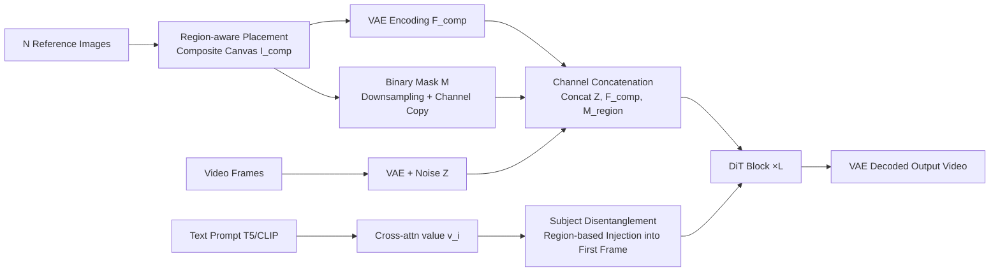

# MAGREF: Masked Guidance for Any-Reference Video Generation with Subject Disentanglement

**Conference**: ICLR 2026  
**OpenReview**: [https://openreview.net/forum?id=Nbl43eAVaE](https://openreview.net/forum?id=Nbl43eAVaE)  
**Code**: TBD (Demo included in supplementary materials)  
**Area**: Video Generation / Subject-Driven Generation  
**Keywords**: any-reference video generation, masked guidance, subject disentanglement, multi-subject, identity preservation  

## TL;DR
MAGREF utilizes "region-aware masking + pixel-level channel concatenation" to inject an arbitrary number and category of reference subjects into a pre-trained I2V backbone. By employing "subject disentanglement" to inject semantic values of individual text tokens into corresponding visual regions, it achieves high-fidelity and controllable any-reference video generation without modifying the underlying architecture.

## Background & Motivation
**Background**: While diffusion models can generate temporally coherent videos based on text or single reference images, there is a rapidly increasing demand for fine-grained control over appearance and identity using multiple reference images. This has given rise to the "any-reference video generation" task—synthesizing consistent and personalized videos given an arbitrary combination of reference subjects (humans, animals, clothing, accessories, environments) and text prompts.

**Limitations of Prior Work**: Conditioning video generation on both text and multiple reference images significantly expands the conditional space, leading to three major issues: (1) **Identity inconsistency**, where details like facial structures or accessories drift across frames; (2) **Multi-subject entanglement**, where identities from different reference images are confused or blended; (3) **Copy-paste artifacts**, where reference images are abruptly pasted into the scene, undermining realism. Existing works either rely on external identity modules supporting only single images (e.g., ConsisID), which lack scalability, or concatenate visual tokens along the token dimension (e.g., ConcatID, VACE, Phantom), which requires massive data and suffers from poor identity preservation or generalization. SkyReels-A2 uses channel-wise concatenation with temporal masks but still fails to resolve these issues holistically.

**Key Challenge**: The core challenge lies in balancing the "retention of strong priors from pre-trained backbones without structural changes" against the "precise distinction of an arbitrary number of unknown subjects while binding each subject to the correct text." Concatenation along the token dimension requires relearning identity consistency from scratch, while temporal concatenation disrupts the first-frame consistency inherent in I2V models.

**Goal**: To build a unified framework that requires no architectural modifications and simultaneously addresses identity consistency, subject disentanglement, and the elimination of copy-paste artifacts.

**Core Idea**: **[Pixel-level Conditioning]** Arrange multiple reference images into a single synthetic canvas, encode it via VAE, and concatenate it with noisy latent variables along the channel dimension (instead of the token dimension) to maximize the reuse of the pre-trained I2V backbone's image preservation capabilities. **[Semantic Anchoring]** Inject cross-attention values of individual text tokens into the spatial regions of corresponding subjects to establish a tight coupling between "image regions ↔ text tokens" from the very first diffusion step. **[Data Governance]** Implement a four-stage data pipeline to construct cross-paired training samples to suppress copy-paste artifacts.

## Method

### Overall Architecture
MAGREF is built upon the Wan2.1 I2V backbone without structural modifications. At the input stage, $N$ reference images are positioned on a blank canvas to form a composite image $I_{comp}$, which, along with a binary region mask, is encoded by a VAE and concatenated channel-wise with the noisy video latent variables for input into the DiT. Within each DiT layer, a subject disentanglement module injects text token value embeddings into the first-frame latent variables by region, forcing alignment between each subject and its text label. Training data is generated via a four-stage pipeline producing cross-paired samples.

### Key Designs

**1. Region-aware Masking: Compressing multi-subjects into an I2V-friendly composite reference frame.** The difficulty of the any-reference setting lies in the unknown number and distribution of subjects. MAGREF avoids stacking reference images chronologically (vanilla masking), which disrupts first-frame consistency. Instead, it places $N$ reference images $\{I_k\}_{k=1}^N$ at specific positions $p_k=(x_k,y_k)$ on a canvas: $I_{comp}(i,j)=\sum_{k=1}^N I_k(i-y_k,j-x_k)\cdot\mathbb{1}_{(i,j)\in R_k}$, where $R_k$ is the rectangular region of the $k$-th image. This composite is treated as a single reference frame, leveraging native I2V capabilities. A binary mask $M(i,j)=\mathbb{1}_{(i,j)\in\bigcup_k R_k}$ provides precise spatial priors. Subject positions are randomized during training to mitigate positional bias.

**2. Pixel-level Channel Concatenation: Preserving fine-grained appearance by reusing backbone capabilities.** Concatenating along the token dimension or using visual tokens after patchling forces the model to relearn identity consistency from scratch. MAGREF operates at the pixel level: $I_{comp}\in\mathbb{R}^{1\times C_{in}\times H\times W}$ is zero-padded along the temporal axis to the video frame dimension $\tilde I_{comp}$ and encoded as $F_{comp}=\mathcal{E}(\tilde I_{comp})\in\mathbb{R}^{T\times C\times H\times W}$. The binary mask $M$ is downsampled and copied across channels to form $M_{region}\in\mathbb{R}^{T\times C_m\times H\times W}$. These are concatenated with the noisy video latents $Z$: $F_{input}=\mathrm{Concat}(Z,F_{comp},M_{region})\in\mathbb{R}^{T\times(2C+C_m)\times H\times W}$. This aligns reference representations temporally with video frames, maintaining fine-grained appearance without modifying the DiT architecture.

**3. Subject Disentanglement: Injecting text token semantic values into the first-frame latent vriables.** Visual separation via region masks is insufficient; multi-subject generation requires stronger coupling between image and text to prevent attribute leakage. MAGREF parses word labels $\{w_i\}$ corresponding to each reference subject and retrieves their cross-attention value embeddings $V=\{v_i\}_{i=1}^K, v_i\in\mathbb{R}^D$. For each subject, a regional mask $M_{sub}^k(i,j)=\mathbb{1}_{(i,j)\in R_k}$ is used to inject the values into the first-frame latent $z_0$: $z_0'=z_0+\alpha\sum_{i=1}^K(M_{sub}^i\odot v_i)$, where $\odot$ denotes element-wise multiplication with broadcasting. Binding specific image regions to associated text tokens at the start of diffusion effectively suppresses cross-subject interference.

**4. Four-stage Data Pipeline: Constructing cross-paired samples to suppress copy-paste artifacts.** Stage 1 segments scenes and generates motion-oriented captions using Qwen2.5-VL. Stage 2 identifies objects from captions and localizes/segments them into clean reference images using GroundingDINO and SAM2. Stage 3 detects faces via InsightFace, filters by pose, and ranks by quality. Stage 4 uses SOTA image generation models to perform generative augmentation (varying pose, appearance, and context). Samples are structured as $R_i=\{V_i,C_i,(I_i^{Face},I_i^{Face'}),(I_{i,1}^{Obj},I_{i,1}^{Obj'}),\dots,I_i^{Bg}\}$, where variants are "cross-paired" to force the model to learn essence rather than direct copying.

## Key Experimental Results

The evaluation set includes 120 reference-text pairs (half single-ID, half multi-subject). Metrics include ID-Sim/Aesthetic/Motion/GmeScore for single-ID, and Subj-Sim/Bg-Sim for multi-subject. Backbone is Wan2.1, trained on H100 80GB with FusedAdam.

### Main Results

Single-ID Evaluation (Selected):

| Model | ID-Sim | Aesthetic | Motion | GmeScore | Total |
|---|---|---|---|---|---|
| HunyuanCustom | 0.592 | 0.497 | 0.848 | 0.697 | 0.659 |
| Phantom | 0.492 | 0.504 | **0.952** | 0.722 | 0.668 |
| VACE | 0.577 | 0.524 | 0.949 | 0.696 | 0.687 |
| Hailuo (Closed) | 0.537 | **0.527** | 0.941 | 0.714 | 0.680 |
| **MAGREF** | **0.595** | 0.516 | **0.956** | 0.710 | **0.694** |

Multi-subject Evaluation (Selected):

| Model | ID-Sim | Subj-Sim | Bg-Sim | Aesthetic | Motion | GmeScore | Total |
|---|---|---|---|---|---|---|---|
| Phantom | 0.481 | 0.364 | 0.460 | 0.458 | **0.976** | 0.713 | 0.575 |
| VACE | 0.345 | 0.463 | 0.615 | 0.467 | 0.968 | 0.680 | 0.590 |
| Kling1.6 (Closed) | 0.387 | 0.411 | 0.571 | 0.458 | 0.864 | 0.655 | 0.558 |
| **MAGREF** | **0.542** | **0.496** | **0.622** | **0.478** | 0.945 | 0.681 | **0.627** |

MAGREF achieves the highest Total Score in both single-ID and multi-subject settings, significantly leading in subject consistency (ID-Sim, Subj-Sim).

### Ablation Study

Training Paradigm and Masking Strategy (Table 3):

| Method | ID-Sim | Subj-Sim | Bg-Sim | Total |
|---|---|---|---|---|
| Training from T2V Backbone | 0.428 | 0.403 | 0.468 | 0.550 |
| I2V + Vanilla Masking | 0.458 | 0.431 | 0.492 | 0.558 |
| **I2V + Region-aware Masking** | **0.504** | **0.452** | **0.526** | **0.587** |

Pipeline Component Ablation (Table 4):

| Method | ID-Sim | Subj-Sim | Bg-Sim | Total |
|---|---|---|---|---|
| w/o Region-aware Masking | 0.470 | 0.452 | 0.530 | 0.570 |
| w/o Cross-pair Strategy | 0.462 | 0.447 | 0.524 | 0.574 |
| w/o Subject Disentanglement | 0.493 | 0.417 | 0.518 | 0.580 |
| **Full MAGREF** | **0.542** | **0.496** | **0.622** | **0.627** |

### Key Findings
- Training from T2V backbones or using vanilla masks significantly harms identity/subject consistency; region-aware masking combined with I2V reuse serves as the performance foundation.
- Removing any of the three components leads to a performance drop. Removing region-aware masking causes the largest decline, while subject disentanglement is crucial for ID-Sim and Subj-Sim.

## Highlights & Insights
- **No structural modification is the primary strength**: The combination of channel-wise concatenation and I2V reuse allows any-reference capabilities to leverage strong pre-trained priors without needing massive in-domain data.
- **The synthetic canvas is a clever adaptation**: It reframes the "unknown number of subjects" problem into a standard "single-reference I2V" paradigm, replacing complex conditional branches with architectural reuse.
- **Subject disentanglement prioritizes alignment at the diffusion start**: By injecting values into $z_0$, the model cuts off attribute leakage at the source rather than relying on gradual convergence through cross-attention.

## Limitations & Future Work
- The evaluation set is limited to 120 pairs with $\le 3$ reference images per case; robustness under dense crowds or heavy occlusion remains unverified.
- Subject disentanglement relies on accurate text parsing of labels; if labels are missing or ambiguous, the binding may fail.
- The use of a synthetic canvas dilutes spatial resolution as the number of reference images increases, potentially limiting fine-grained detail.
- Motion metrics are slightly lower than Phantom, indicating room for improvement in the trade-off between strong subject constraints and large-scale motion.

## Related Work & Insights
- **Single ID Preservation**: ConsisID, EchoVideo, and FantasyID rely on external ID modules or single-image conditioning, limiting scalability.
- **Multi-concept Customization**: ConceptMaster and VideoAlchemy use CLIP/Q-Former for fusion; HunyuanCustom introduces MLLMs for enhanced prompt-reference interaction.
- **Reference Conditioning (Wan2.1-based)**: Unlike ConcatID (token-wise) or SkyReels-A2 (temporal masking), MAGREF relies on pixel-level channel concatenation and region-based value injection.
- **Insight**: Fitting conditional signals into the input format that pre-trained paradigms excel at (e.g., a composite reference frame) is often more data-efficient and stable than adding new conditional branches.

## Rating
- **Novelty**: ⭐⭐⭐⭐ — The combination of pixel-level channel concatenation, composite canvas for I2V reuse, and first-frame value injection is novel and well-engineered.
- **Experimental Thoroughness**: ⭐⭐⭐⭐ — Covers single/multi-subject settings against SOTA; the small evaluation set is a minor drawback.
- **Writing Quality**: ⭐⭐⭐⭐ — Clear mapping between challenges and components with robust visualizations.
- **Value**: ⭐⭐⭐⭐ — High potential for industrial application in controllable video generation as a "plug-and-play" any-reference capability.

<!-- RELATED:START -->

## Related Papers

- [\[ICLR 2026\] Any-to-Bokeh: Arbitrary-Subject Video Refocusing with Video Diffusion Model](any-to-bokeh_arbitrary-subject_video_refocusing_with_video_diffusion_model.md)
- [\[ICLR 2026\] DreamSwapV: Mask-guided Subject Swapping for Any Customized Video Editing](dreamswapv_mask-guided_subject_swapping_for_any_customized_video_editing.md)
- [\[ICLR 2026\] Frame Guidance: Training-Free Guidance for Frame-Level Control in Video Diffusion Models](frame_guidance_training-free_guidance_for_frame-level_control_in_video_diffusion.md)
- [\[ICLR 2026\] Phantom-Data: Towards a General Subject-Consistent Video Generation Dataset](phantom-data_towards_a_general_subject-consistent_video_generation_dataset.md)
- [\[ICLR 2026\] BindWeave: Subject-Consistent Video Generation via Cross-Modal Integration](bindweave_subject-consistent_video_generation_via_cross-modal_integration.md)

<!-- RELATED:END -->
