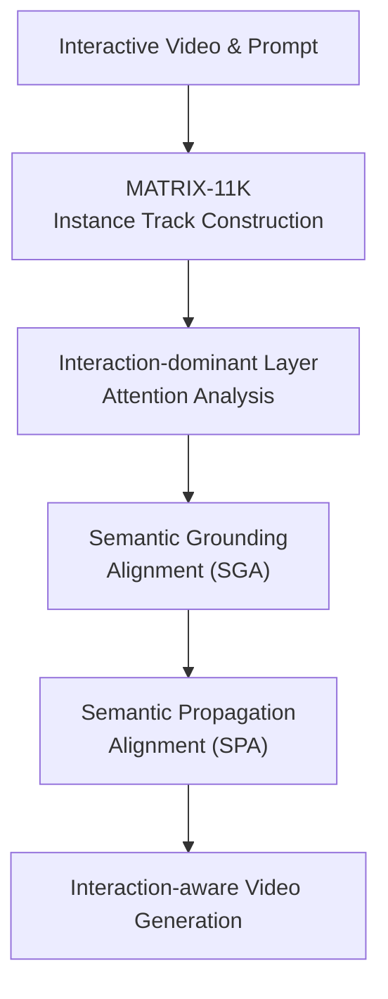

# MATRIX: Mask Track Alignment for Interaction-aware Video Generation

**Conference**: ICLR2026  
**OpenReview**: [https://openreview.net/forum?id=lhVrFEssk5](https://openreview.net/forum?id=lhVrFEssk5)  
**Code**: TBD  
**Area**: Video Generation  
**Keywords**: Interaction-aware Video Generation, Video Diffusion Transformer, Attention Alignment, Instance Mask Track, Semantic Propagation

## TL;DR
MATRIX discovers that the relationships between subjects, objects, and actions in Video DiTs are primarily encoded within a few interaction-dominant attention layers. It employs multi-instance mask tracks to regularize the grounding and propagation attention of these layers, significantly enhancing interaction fidelity and temporal consistency in text-to-video generation.

## Background & Motivation
**Background**: Text-to-video generation has evolved from early UNet diffusion to Video DiTs. Models such as CogVideoX, Open-Sora, and Wan use 3D full attention to simultaneously model text tokens and video tokens, enabling the generation of longer, clearer, and more coherent videos. Concurrently, image-to-video and controllable video generation have introduced control signals like initial frames, trajectories, depth, bounding boxes, and masks to allow users to specify objects or motion trends.

**Limitations of Prior Work**: While these models perform well at "making an object move" or "a person performing an action," they often fail when prompts involve multi-instance interactions. Typical failures include misaligned subject/object positions, verbs not grounding between the two participants, duplicate objects (e.g., an extra cup), identity drifting mid-video, or intended contact actions resulting in floating proximities. In essence, the model may recognize "boy," "green lid bottle," and "reaches for" in the prompt, but it fails to consistently answer "who is doing what to whom."

**Key Challenge**: Interaction generation is not merely a global text-video similarity problem; it is a binding problem. Noun tokens must be bound to corresponding instance regions, and verb tokens must be bound to the joint interaction region of the subject and object. This binding must also be maintained across frames. Relying solely on CLIPScore, video quality, or overall caption matching allows the model to generate plausible-looking videos with incorrect interaction relationships. Furthermore, first-frame control alone cannot guarantee that identities and relationships do not drift in subsequent frames.

**Goal**: The authors aim to answer two questions. First, where are subjects, objects, and action interactions represented internally within Video DiTs? Second, if these representations can be localized, can instance mask tracks with temporal IDs be used to supervise these attentions to make the generation interaction-aware? Consequently, the paper introduces a dataset, internal representation analysis, training regularization, and an evaluation protocol.

**Key Insight**: The authors observe that 3D full attention inherently contains four blocks of relationships. Among these, video-to-text attention can be viewed as the grounding of video tokens to text tokens, while video-to-video attention represents internal cross-frame propagation. If successful samples show these attentions concentrated on correct instances and interaction regions while failed samples show them scattered or misaligned, then attention serves not just as a visualization tool but also as an alignment target for supervision during training.

**Core Idea**: Using mask tracks with stable instance IDs as a reference, the model identifies the specific attention layers in the Video DiT that truly influence interaction success. It then applies semantic grounding and semantic propagation alignment losses exclusively to these layers.

## Method
The MATRIX method comprises three stages: constructing MATRIX-11K, where each video has both an interaction caption and multi-instance mask tracks; analyzing Video DiT attention to identify layers responsible for subject/object grounding and cross-frame propagation; and finally, regularizing only these interaction-dominant layers using SGA and SPA losses. The key is not to feed masks as standard conditioning maps but to align internal attention responsible for interaction binding with actual instance trajectories.

### Overall Architecture
The input consists of an initial frame image, a text prompt, a first-frame multi-instance ID map, and the full-video mask tracks available during training. The backbone is CogVideoX-5B-I2V, fine-tuned via LoRA in selected layers. During the forward pass, video-to-text and video-to-video attentions are extracted from interaction-dominant layers, upsampled to pixel-level mask track resolution via a lightweight causal decoder, and aligned to subject, object, and interaction regions using SGA and SPA, respectively.

The first-frame ID map aggregates binary masks for each instance using palette-indexing to ensure stable IDs. During training, most backbone parameters are frozen; only the LoRA in selected layers, input projection layers, and the lightweight decoder are updated. At inference, users can provide an initial frame instance mask via an off-the-shelf segmenter to generate stable subject-action-object interaction videos.

### Key Designs
**1. MATRIX-11K: Aligning Interaction Captions and Mask Tracks in a Shared Supervision Space**

The paper addresses a critical gap: the need for both structured interaction captions and spatial-temporal tracks for every participating instance. MATRIX-11K captioning is handled by an LLM to identify interaction verbs and assign stable IDs to subjects and objects, yielding triplets like $\langle k_{sub}, verb, k_{obj}\rangle$. Relations are filtered based on Contactness and Dynamism. Finally, appearance descriptions are extracted for each ID to distinguish between similar instances.

Mask tracks are initiated via GroundingDINO candidates, validated by a VLM against "category + appearance," and propagated via SAM2. The value lies in the tracks having persistent IDs across frames; subject and object tracks define an interaction region as their per-frame union, providing a precise reference for attention analysis and losses.

**2. Interaction-dominant Layer Analysis: Quantifying Interaction Understanding**

The authors decompose 3D full attention into four segments: video-to-video, video-to-text, text-to-video, and text-to-text. This work focuses on $A_{v2t}$ and $A_{v2v}$. For grounding, $A_{v2t}$ for noun tokens should fall on the corresponding subject/object mask, while the verb token $A_{v2t}$ should fall on the subject-object union. For propagation, queries within the first-frame mask should continuously attend to the same instance track via $A_{v2v}$ in subsequent frames.

An Attention Alignment Score (AAS) is defined by multiplying the attention heatmap with the target mask: $AAS=\sum_{f,h,w}(A\odot m)(f,h,w)$. The authors analyze four types of AAS across 42 layers and 50 denoising timesteps in CogVideoX-5B-I2V. Layers are selected if they frequently appear in the top-10 AAS or show a significant AAS gap between successful and failed samples. This concentrates supervision on interaction-dominant layers rather than averaging across all layers.

**3. SGA: Grounding Text Tokens to Subject, Object, and Interaction Regions**

Semantic Grounding Alignment (SGA) supervises video-to-text attention. For subjects and objects, the authors aggregate attention from head nouns and their modifiers ($A^{v2t}_{sub}, A^{v2t}_{obj}$); for verbs, attention from verb tokens and auxiliaries is aggregated ($A^{v2t}_{verb}$). The targets are individual masks and their union mask. This forces internal attention to bind "man," "wine glass," and "takes a sip" to the correct spatial regions.

To resolve scale discrepancies between latent attention and pixel masks, a lightweight causal decoder $D_\phi$ mimics the 3D VAE's spatial-temporal upsampling, predicting $\hat{A}^{v2t}_e=D_\phi(A^{v2t}_e)$. SGA uses a combination of BCE, soft DICE, and L2 losses to ensure attention covers the correct area without collapsing into sharp points.

**4. SPA: Maintaining Cross-frame Identity to Prevent Drifting or Duplication**

Semantic Propagation Alignment (SPA) supervises video-to-video attention. The first-frame subject/object mask is downsampled to the latent grid, and positions where the mask is 1 are taken as the query set $Q_e$. The average attention of these queries toward all spatial-temporal tokens yields $A^{v2v}_e\in\mathbb{R}^{F\times H\times W}$. If the model maintains identity, this propagation map should follow the target instance's mask track rather than diffusing into the background or duplicating onto other instances.

SPA uses the same alignment loss as SGA but focuses on $e\in\{sub,obj\}$ to stabilize identity tracks. While SGA ensures correct per-frame grounding, SPA ensures that the bound identity is preserved over time.

### Loss & Training
The individual mask alignment loss is defined as:

$$
\ell(X,Y)=\beta_{bce}BCE(X,Y)+\beta_{dice}(1-Dice(X,Y))+\beta_2\lVert X-Y\rVert_2^2.
$$

Where $X$ is the predicted mask and $Y$ is the ground truth. SGA and SPA are:

$$
L_{SGA}=\sum_{e\in\{sub,obj,verb\}}\ell(\hat{A}^{v2t}_e,M_e),\quad
L_{SPA}=\sum_{e\in\{sub,obj\}}\ell(\hat{A}^{v2v}_e,M_e).
$$

The total training objective adds these regularization terms to the diffusion loss:

$$
L_{total}=L_{DM}+\lambda_{SGA}L_{SGA}+\lambda_{SPA}L_{SPA}.
$$

Implementation-wise, LoRA is used on CogVideoX-5B-I2V. Only selected LoRA layers, input projections, and the decoder are updated. LoRA rank is 128 with $\alpha=64$. SGA supervises blocks 7 and 11 ($A_{v2t}$), while SPA supervises block 12 ($A_{v2v}$), corresponding to the interaction-dominant layers identified earlier.

## Key Experimental Results

### Main Results
Evaluation is performed on synthetic (60 pairs) and real-world (58 pairs) sets. InterGenEval uses structural QA to check interactions: KISA assesses temporal phases, SGI assesses spatial grounding, and SPI acts as a temporal consistency factor. The final Interaction Fidelity (IF) is the average of KISA and SGI.

| Method | KISA ↑ | SGI ↑ | IF ↑ | HA ↑ | MS ↑ | IQ ↑ |
|------|--------|-------|------|------|------|------|
| CogVideoX-2B-I2V | 0.420 | 0.470 | 0.445 | 0.937 | 0.993 | 69.69 |
| CogVideoX-5B-I2V | 0.406 | 0.491 | 0.449 | 0.936 | 0.987 | 69.66 |
| Open-Sora-11B-I2V | 0.453 | 0.508 | 0.480 | 0.891 | 0.992 | 63.32 |
| TaVid | 0.465 | 0.522 | 0.494 | 0.917 | 0.991 | 68.90 |
| **Ours (MATRIX)** | **0.546** | **0.641** | **0.593** | **0.954** | **0.994** | **69.73** |

*Note: HA=Human Articulation, MS=Motion Smoothness, IQ=Image Quality.*

MATRIX significantly leads in interaction metrics. Compared to CogVideoX-5B-I2V, KISA improves from 0.406 to 0.546, SGI from 0.491 to 0.641, and IF from 0.449 to 0.593, without sacrificing image quality (IQ) or smoothness (MS).

### Ablation Study
| Configuration | KISA ↑ | SGI ↑ | IF ↑ | HA ↑ | MS ↑ | IQ ↑ | Description |
|------|--------|-------|------|------|------|------|------|
| Baseline CogVideoX-5B-I2V | 0.406 | 0.491 | 0.449 | 0.936 | 0.987 | 69.66 | No interaction supervision |
| LoRA + MATRIX-11K | 0.445 | 0.526 | 0.486 | 0.940 | 0.994 | 69.77 | Data fine-tuning alone gives moderate gain |
| + SPA loss | 0.451 | 0.540 | 0.496 | 0.937 | 0.995 | 70.26 | Improves propagation, limited grounding gain |
| + SGA loss in $A_{t2v}$ | 0.486 | 0.578 | 0.531 | 0.935 | 0.993 | 70.03 | $A_{t2v}$ is less stable than $A_{v2t}$ |
| + SGA loss in $A_{v2t}$ | 0.509 | 0.592 | 0.550 | 0.952 | 0.994 | 69.62 | Stable grounding gain |
| + SPA + SGA (MATRIX) | 0.546 | 0.641 | 0.593 | 0.954 | 0.994 | 69.73 | Complementary alignment, best performance |

### Key Findings
- Fine-tuning on MATRIX-11K alone improves IF from 0.449 to 0.486, but attention supervision is required to solve binding and propagation fully.
- SGA is more effective in $A_{v2t}$ than in $A_{t2v}$. Using spatial tokens as queries (video-to-text) provides more stable supervision for specific generation regions.
- Combining SGA and SPA achieves the best IF (0.593), proving that interaction generation requires solving both per-frame grounding and cross-frame identity tracking.
- Qualitative results on Wan2.1-14B-I2V suggest that the framework is transferable to various 3D full attention Video DiT backbones.

## Highlights & Insights
- The loop between attention explainability and training regularization is the paper's strongest point. Instead of just visualizing attention to show the model "understands," MATRIX identifies specific layers sensitive to success/failure and regularizes them.
- Mask tracks are perfectly suited for interaction. Single-frame masks only show position; tracks show temporal continuity. The union of subject/object masks naturally represents the action locale.
- SGA performance in $A_{v2t}$ vs $A_{t2v}$ reveals that query selection in multi-modal attention determines whether supervision is grounded in latent spatial tokens or abstract text tokens.
- The method does not retrain the backbone from scratch, making it a modular "plug-in" for large-scale Video DiTs via LoRA and lightweight adapters.

## Limitations & Future Work
- Dependency on high-quality mask tracks and captions. Errors in GroundingDINO, VLM, or SAM2 propagation can introduce noisy supervision.
- Current mask representations may not fully capture implicit or psychological interactions (e.g., social relations) that lack clear physical contact regions.
- The reliance on an initial frame ID map means the model has a strong starting point. Pure text-to-video interaction control remains an open challenge.
- The InterGenEval protocol relies on VLM evaluators, which may have biases. Future work could include more fine-grained metrics for hand contacts and object state changes.

## Related Work & Insights
- **Vs. Base Video DiTs**: MATRIX adds explicit spatio-temporal binding to models like CogVideoX and Open-Sora which otherwise rely on implicit learning.
- **Vs. Controllable Generation**: While bbox/trajectory methods improve geometry, they often ignore the "interaction" semantics between instances. MATRIX aligns text tokens directly to these trajectories.
- **Vs. Human-Object Interaction (HOI)**: Unlike domain-specific HOI models, MATRIX uses LLM-extracted triplets and attention alignment to handle open-vocabulary interactions.

## Rating
- Novelty: ⭐⭐⭐⭐⭐ 
- Experimental Thoroughness: ⭐⭐⭐⭐ 
- Writing Quality: ⭐⭐⭐⭐ 
- Value: ⭐⭐⭐⭐⭐ 

<!-- RELATED:START -->

## Related Papers

- [\[ICLR 2026\] MIMIC: Mask-Injected Manipulation Video Generation with Interaction Control](mimic_mask-injected_manipulation_video_generation_with_interaction_control.md)
- [\[AAAI 2026\] Mask2IV: Interaction-Centric Video Generation via Mask Trajectories](../../AAAI2026/video_generation/mask2iv_interaction-centric_video_generation_via_mask_trajectories.md)
- [\[ICLR 2026\] Controllable First-Frame-Guided Video Editing via Mask-Aware LoRA Fine-Tuning](controllable_first-frame-guided_video_editing_via_mask-aware_lora_fine-tuning.md)
- [\[ICLR 2026\] ConsisDrive: Identity-Preserving Driving World Models for Video Generation by Instance Mask](consisdrive_identity-preserving_driving_world_models_for_video_generation_by_ins.md)
- [\[CVPR 2026\] Open-world Hand-Object Interaction Video Generation Based on Structure and Contact-aware Representation](../../CVPR2026/video_generation/open-world_hand-object_interaction_video_generation_based_on_structure_and_conta.md)

<!-- RELATED:END -->
