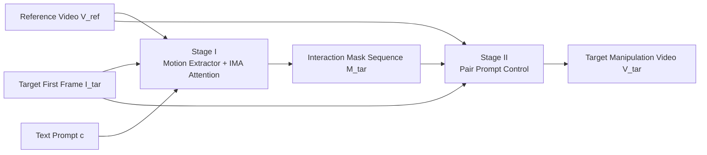

# MIMIC: Mask-Injected Manipulation Video Generation with Interaction Control

**Conference**: ICLR 2026  
**OpenReview**: [https://openreview.net/forum?id=COrUdVuInH](https://openreview.net/forum?id=COrUdVuInH)  
**Code**: To be confirmed  
**Area**: Video Generation / Embodied Manipulation / Controllable Video Diffusion  
**Keywords**: Manipulation Video Generation, Reference Video-Driven, Interaction Mask, Image-to-Video Diffusion, Motion Decoupling  

## TL;DR
MIMIC decomposes "generating manipulation videos" into two stages: first, an Interaction-Motion-Aware (IMA) attention mechanism learns a sequence of semantic masks from a reference video to serve as motion trajectories; second, Pair Prompt Control renders these masks into frames, generating high-fidelity and controllable manipulation videos while preserving contact-rich interaction semantics.

## Background & Motivation
**Background**: Embodied intelligence is constrained by the scarcity of large-scale interaction data. Since manipulation videos naturally encode rich hand-object interaction cues, using video generation models to synthesize new manipulation videos is considered a viable path to expand training data and improve robot generalization. While language prompts can describe high-level semantics like "folding clothes," they fail to characterize the subtle motion and force changes in contact dynamics.

**Limitations of Prior Work**: Current I2V (Image-to-Video) diffusion models struggle to balance abstract semantic understanding with fine-grained visual details in manipulation scenarios. To constrain motion, one category of methods explicitly injects strong control signals (drag points, object depth, hand meshes, bounding boxes), which lack flexibility and often yield physically implausible results. Another category (e.g., FlexiAct) extracts global motion representations from reference videos but faces inaccurate scales and interaction modeling errors when dealing with complex multi-object motions. This occurs because reference and target scenes are often severely misaligned in terms of manipulated objects, initial poses, and backgrounds, and models rigidly follow control signals while ignoring causal dependencies in real interactions.

**Key Challenge**: Manipulation video generation requires both cross-scene structural alignment (transferring semantics from reference to misaligned targets) and explicit reasoning about interactive physical dynamics. Single-stage black-box generation fails to address both effectively.

**Goal**: To open the single-stage generation black box and explicitly inject "manipulation-centric" understanding, enhancing interpretability and controllability so the model can identify which object to manipulate and synthesize temporally coherent, physically plausible interactive motions.

**Core Idea**: **Provide the model with a reference example**—the reference video carries both high-level semantics (folding clothes) and fine-grained interaction cues to drive the diffusion model alongside text. The process decouples "understanding motion" from "rendering frames" into two stages, using a sequence of masks as a controllable, pixel-level motion trajectory representation that tolerates non-rigid deformation.

## Method

### Overall Architecture
MIMIC uses DynamiCrafter (a UNet-based I2V diffusion model) as its base. It takes a reference manipulation video $V_{ref}$, the first frame of the target scene $I_{tar}$, and a text prompt $c$ as input to output the target manipulation video $V_{tar}$. Generation is explicitly split: Stage I combines "identifying the manipulated object in the target first frame" with "synthesizing temporally coherent motion trajectories," representing the trajectory as a mask sequence $M_{tar}$. Stage II renders the final high-fidelity video conditioned on the predicted masks, the target first frame, and Pair Prompt Control.

### Key Designs

**1. Interaction-Motion-Aware (IMA) Attention: Injecting Interaction Semantics into Mask Generation**  
Stage I addresses how to feed both abstract and concrete manipulation intent from the reference video into the diffusion model. The authors use a frozen CLIP visual encoder $\Phi$ to extract semantic embeddings $f^V_{ref}$ and $f^M_{ref}$ from the reference video and reference interaction masks, respectively, paired with a lightweight Motion Extractor for motion cues. Crucially, a learnable query $q$ is added element-wise to the mask embedding to obtain $q_m = q + f^M_{ref}$, giving the query a prior on "which interaction regions to focus on." Cross-attention is then performed with frozen video embeddings to obtain the IMA embedding:

$$f^{IMA}_{ref} = \mathrm{FFN}(\mathrm{CA}(q_m, f^V_{ref}, f^V_{ref}))$$

This $f^{IMA}_{ref}$ is injected into the denoising UNet via another cross-attention layer to guide the diffusion process with manipulation semantics. To stabilize training, the output projection of this layer is zero-initialized with residual connections. Training follows a two-step approach: first, "repeating the first frame into a static video" to force the model to learn hand-object interaction recognition, then restoring temporal dynamics to learn motion generation, optimizing the same diffusion loss in both phases.

**2. Pair Prompt Control: Decoupling Object and Camera Motion via Reference Pairs**  
Stage II faces a core difficulty: using masks alone as control signals is inherently ambiguous. Masks indicate "where interaction occurs" but cannot distinguish between object motion and camera motion, nor can they characterize how manipulation unfolds, often leading to poor interaction trajectory consistency or distorted hand/gripper rendering. The authors propose Pair Prompt Control, where rendering is conditioned on both the target mask sequence $M_{tar}$ and a reference pair $\langle M_{ref}, V_{ref}\rangle$. The target masks provide spatial alignment, while the reference pair provides semantic and motion priors to resolve mask ambiguity. Architecturally, a ControlNet-style branch uses a lightweight Query Encoder and Pair Encoder to process target masks and reference pairs, respectively, injecting multi-scale guidance into the UNet backbone after fusion. This allows background completion and enables the model to decouple object motion from camera motion, generating coherent videos that respect global scene dynamics.

**3. Masked-Image Conditioning + Adaptive Region Loss: Enhancing Fidelity via Interaction Focus**  
To ensure clarity and consistency in interaction zones, the predicted Stage I masks are multiplied with the target image to create a masked image $I_{masked} = I^1_{tar} \odot m^1_{tar}$ that preserves only the interaction area. This is concatenated with the original target image as explicit appearance guidance for the diffusion model. Simultaneously, the diffusion loss is reweighted using the current frame mask $m^f_{tar}$ and the first frame mask $m^1_{tar}$ (temporally replicated) to construct a region loss, emphasizing mask alignment over time:

$$L_{region} = \left(\frac{S}{S_{M_{tar}}}M_{tar} + \frac{S}{S_{M^1_{tar}}}M^1_{tar}\right) \odot L_{diff}$$

The final objective weights non-interaction and interaction regions separately:

$$L_{final} = (1 - M_{tar} - M^1_{tar}) \odot L_{diff} + \lambda L_{region}$$

This combination focuses learning on relevant areas, reducing ghosting artifacts and improving visual fidelity and temporal consistency.

## Key Experimental Results

### Main Results
On a custom manipulation video benchmark (240 evaluation samples, both reference and target unseen during training), compared with I2V motion transfer methods:

| Method | Training-free | Text Align↑ | Appear. Consist.↑ | Obj. Consist.↑ | Bkg. Stability↑ | Interact. Rat.↑ | Sem. Sim.↑ | Human Pref. |
|------|:---:|---:|---:|---:|---:|---:|---:|---:|
| DynamiCrafter | ✗ | 0.2684 | 0.8784 | 0.9185 | 0.9331 | 3.0543 | 2.4348 | 8.86% |
| CogVideoX | ✗ | 0.2667 | 0.8537 | 0.8128 | 0.9200 | 3.1318 | 2.3736 | 18.78% |
| MotionClone | ✓ | **0.2947** | 0.7400 | 0.6833 | 0.8569 | 3.0957 | 2.1277 | 0.90% |
| MotionDirector | ✗ | 0.2658 | 0.8336 | 0.8542 | 0.9160 | 3.1489 | 2.4149 | 0.96% |
| FlexiAct | ✗ | 0.2694 | 0.8999 | 0.8921 | 0.9220 | 3.5529 | 2.5238 | 27.8% |
| **Ours (MIMIC)** | ✓ | 0.2721 | **0.9084** | **0.9291** | **0.9385** | **4.1381** | **2.9127** | **42.88%** |

(Note: All baselines except MotionClone require additional fine-tuning per reference video; MIMIC does not.) MIMIC leads in temporal quality and appearance consistency. While Text Alignment is second to MotionClone, the latter performs poorly in all other metrics and fidelity. MLLM-evaluated Interaction Rationality (4.14) and Semantic Similarity (2.91) significantly outperform all baselines, with a dominant human preference rate of 42.88%.

### Ablation Study

| Variant | Text Align↑ | Appear. Consist.↑ | Obj. Consist.↑ | Interact. Rat.↑ | Sem. Sim.↑ |
|------|---:|---:|---:|---:|---:|
| One-Stage (Direct Generation) | 0.2688 | 0.8709 | 0.8591 | 3.6170 | 2.4468 |
| w/o IMA Attention | 0.2548 | 0.8537 | 0.8418 | 3.6216 | 2.4134 |
| w/o Pair Prompt Control | 0.2677 | 0.8862 | 0.9172 | 3.8789 | 2.7526 |
| **Ours (MIMIC Full)** | 0.2721 | 0.9084 | 0.9291 | 4.1381 | 2.9127 |

### Key Findings
- **Two-stage outperforms one-stage**: Single-stage direct generation suffers from severe visual quality issues, though the conveyed motion generally matches the reference, confirming the logic of learning motion patterns (masks) in Stage I before rendering.
- **IMA determines semantic correctness**: Removing IMA drops semantic similarity from 2.91 to 2.41; Stage I predicts lower quality masks, causing the model to misunderstand prompts and manipulate the wrong objects.
- **Pair Prompt Control decouples camera motion**: Without it, backgrounds drift with the masks, appearing as camera movement rather than hand-object interaction; with it, backgrounds remain stable, and changes originate from real motion.

## Highlights & Insights
- **Explicit decoupling of "Understanding" from "Rendering"**: Using mask sequences as intermediate representations provides pixel-level control while tolerating non-rigid deformation, offering an interpretable modification of single-stage black-box generation.
- **Reference pairs as disambiguators**: The insight that single masks lack background information (coupling object/camera motion) is addressed by using $\langle M_{ref}, V_{ref}\rangle$ to complete the prior—a simple yet critical design.
- **Pragmatic evaluation**: Recognizing that traditional pixel-alignment metrics fail to judge if "an object was lifted in the correct pose," the study introduces MLLM evaluation for interaction rationality and top-2 human preference, making manipulation-level performance more credible.

## Limitations & Future Work
- **Reliance on template pair sampling**: Training involves sampling two videos from the same template; generalization to entirely novel manipulation categories or long-range transfer across templates is not fully verified.
- **Mask quality ceiling**: Using Grounding-SAM2 for unannotated data means segmentation errors propagate directly to Stage I trajectories and the final output.
- **Compute and Scale**: Trained on 16 frames at 320×512 using two H100 GPUs; scalability to long-form, high-resolution videos and complex multi-object long-horizon tasks remains to be seen.
- **Implicit physical reasoning**: Unlike constraint-based methods, this approach learns interaction dynamics implicitly from data, lacking explicit guarantees for physical plausibility in unseen contact patterns.

## Related Work & Insights
- **I2V Diffusion Bases**: AnimateDiff, SVD, DynamiCrafter (backbone), CogVideoX, and Wan2.1 provide strong video priors; this work inherits these and explicitly models hand-object interactions.
- **Video Motion Customization**: Methods like Tune-A-Video, MotionDirector, and MotionInversion often train motion-specific modules. MIMIC shifts to an in-context paradigm, decoupling motion features from reference videos as control signals.
- **Interactive Video Generation**: Methods using fine-grained signals like hand meshes (AnchorCrafter), boxes (Re-Hold), or keypoints (Taste-Rob) require complex inputs. MIMIC’s "mask sequence + reference pair" prevents complex input requirements while characterizing the process more completely than a single control signal.

## Rating
- **Novelty**: ⭐⭐⭐⭐ The combination of two-stage "mask-as-mediator + IMA Attention + Pair Prompt Control" directly addresses manipulation video pain points. While components follow existing paradigms, the assembly is targeted and clever.
- **Experimental Thoroughness**: ⭐⭐⭐⭐ Custom benchmark + 5 representative baselines + three metric types (Traditional/MLLM/Human) + three sets of ablations provide comprehensive validation; however, more failure analysis and cross-dataset generalization would be beneficial.
- **Writing Quality**: ⭐⭐⭐⭐ The Motivation—Contradiction—Methodology chain is clear, formulas and diagrams are well-coordinated, and module responsibilities are well-defined.
- **Value**: ⭐⭐⭐⭐ Provides a controllable, interpretable video generation paradigm for embodied manipulation data augmentation, holding practical significance for robot learning synthetic data.

<!-- RELATED:START -->

## Related Papers

- [\[ICLR 2026\] Learning Video Generation for Robotic Manipulation with Collaborative Trajectory Control](learning_video_generation_for_robotic_manipulation_with_collaborative_trajectory.md)
- [\[ICLR 2026\] MATRIX: Mask Track Alignment for Interaction-aware Video Generation](matrix_mask_track_alignment_for_interaction-aware_video_generation.md)
- [\[AAAI 2026\] Mask2IV: Interaction-Centric Video Generation via Mask Trajectories](../../AAAI2026/video_generation/mask2iv_interaction-centric_video_generation_via_mask_trajectories.md)
- [\[ICLR 2026\] Geometry-aware 4D Video Generation for Robot Manipulation](geometry-aware_4d_video_generation_for_robot_manipulation.md)
- [\[ICLR 2026\] Streaming Drag-Oriented Interactive Video Manipulation: Drag Anything, Anytime!](streaming_drag-oriented_interactive_video_manipulation_drag_anything_anytime.md)

<!-- RELATED:END -->
