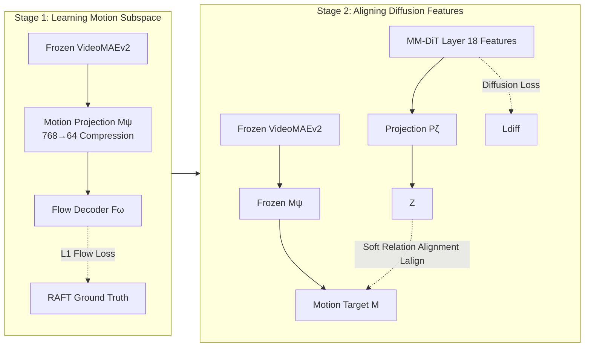

# MoAlign: Motion-Centric Representation Alignment for Video Diffusion Models

**Conference**: ICLR 2026  
**OpenReview**: [https://openreview.net/forum?id=OR0ySm4l9h](https://openreview.net/forum?id=OR0ySm4l9h)  
**Code**: TBD  
**Area**: Video Generation / Video Diffusion Models  
**Keywords**: Text-to-Video, Video Diffusion Models, Representation Alignment, Motion Disentanglement, Optical Flow Supervision, Physical Plausibility  

## TL;DR
MoAlign distills a **low-dimensional motion-only subspace** from a frozen video encoder (enforced via optical flow supervision) and aligns the middle-layer features of a video diffusion model to this subspace using soft relationship alignment. This allows the model to generate physically more plausible videos without requiring any inference-time conditions or simulations.

## Background & Motivation
**Background**: Text-to-video models based on DiT architectures, such as CogVideoX, Wan2.1, and HunyuanVideo, can synthesize high-quality visuals. However, the generated motion often violates physical laws—coins floating in the air, objects clipping during collisions, or erratic trajectories. The root cause lies in the model's insufficient understanding of motion dynamics, where **motion information is severely under-encoded in the latent space**, even if individual frames appear realistic.

**Limitations of Prior Work**: Existing routes to improve physical plausibility have significant drawbacks: (i) Simulation-based methods rely on physics engines or differentiable simulators, which are computationally heavy, domain-specific, and hard to scale to open-world scenarios; (ii) Condition-based methods use optical flow, trajectories, or poses as guidance, requiring extra inputs and preprocessing during inference, making them unusable for pure text-to-video; (iii) Representation alignment methods (e.g., REPA, VideoREPA) align diffusion features to pretrained encoders. However, features from these encoders **entangle appearance and dynamics**, leading to alignment that often degrades into matching static appearance rather than learning motion. Furthermore, hard matching can disrupt the stability of pretrained representations.

**Key Challenge**: Effectively injecting motion understanding into the latent space of the model while avoiding entanglement with appearance and maintaining training stability.

**Goal**: Design a fine-tuning strategy that **explicitly focuses only on motion dynamics** without introducing inference-time overhead or compromising model stability.

**Core Idea**: First learn a **disentangled motion subspace** from a pretrained video encoder using optical flow supervision and a dimensional bottleneck. Then, use **soft relation alignment** (distilling similarity structures between tokens rather than hard-matching features) to align the diffusion model, internalizing motion priors into the generative model itself.

## Method

### Overall Architecture
MoAlign is a two-stage fine-tuning framework based on CogVideoX-2B (MM-DiT, 3D VAE latent). In **Stage 1**, spatio-temporal features are extracted from a frozen VideoMAEv2, passed through a learnable projection head to be compressed into a low-dimensional space, and supervised with ground-truth optical flow to force a motion-only "teacher" subspace. In **Stage 2**, the teacher is frozen, and the latent features of a middle layer (Layer 18) of CogVideoX are projected and aligned to the motion subspace via a soft relation alignment loss, co-trained with the standard diffusion loss. At inference time, all alignment components are discarded, making the generation interface identical to the original CogVideoX with zero extra cost.

### Key Designs

**1. Extracting a "Pure Motion" Subspace via Flow Supervision and Bottleneck: Squeezing out Appearance.** The issue with direct alignment to video encoder features is the entanglement of motion and appearance. Without explicit supervision, there is no guarantee that the learned representation isolates motion. MoAlign's approach applies a learnable projection head $M = M_\psi(S) \in \mathbb{R}^{F''\times H''\times W''\times D_m}$ to the spatio-temporal features $S = V(x_0)$ from a frozen VideoMAEv2, where $D_m \ll D_v$ (compressed from 768 to 64). This **dimensional bottleneck is critical**: the reduced capacity forces the model to retain only the most salient information, cutting the capacity needed for discriminative static content. To ensure this, a lightweight decoder $F_\omega$ reconstructs dense optical flow $\hat{O}$ from $M$, using an L1 loss against ground-truth flow from RAFT: $L_{\text{flow}}=\|\hat{O}-O\|_1$. Optical flow provides dense, low-level, pixel-wise motion supervision, forcing the compressed features to prioritize dynamical structures over static semantics.

**2. Soft Relation Alignment instead of Hard Feature Matching: Stabilizing Pretrained Representations.** Stage 2 aligns diffusion features to the motion subspace. However, REPA-style hard matching (maximizing token-wise cosine similarity) can damage the stability of pretrained DiT representations. MoAlign adopts Token Relation Distillation (TRD) from VideoREPA—matching the **similarity structure** between tokens rather than the features themselves. Diffusion features $Y_t$ from layer 18 are projected to $Z$ (same size as $M$), and pairwise cosine similarity matrices $S^{\text{spatial}}_Z, S^{\text{temporal}}_Z$ are calculated for spatial and temporal dimensions, respectively. These are then aligned to the teacher's corresponding matrices. This soft approach injects motion geometry without overwriting pretrained features, preventing instability.

**3. Temporal Weighting for Cross-frame Dynamics: Emphasizing Motion Consistency.** Since motion is inherently inter-frame change, alignment should prioritize cross-frame relationships. MoAlign excludes intra-frame token pairs in temporal similarity and introduces a weight matrix that decays with frame distance: for tokens in different frames with distance $\Delta_{ij}\neq 0$, $W_{ij}=\exp(-\Delta_{ij}/\tau)$, otherwise 0 (where $\tau$ is temperature). The final loss combines spatial and weighted temporal terms:
$$L_{\text{align}}=\frac{1}{F''}\sum_{f=1}^{F''}\|S^{\text{spatial}}_Z(f)-S^{\text{spatial}}_M(f)\|_1+\|W\odot S^{\text{temporal}}_Z - W\odot S^{\text{temporal}}_M\|_1$$
The total objective is $L_{\text{total}}=L_{\text{diff}}+\lambda L_{\text{align}}$ ($\lambda=0.5, \tau=10$). Compared to the original TRD loss in VideoREPA, this temporal weighting emphasizes local temporal consistency, explicitly encoding short-term motion coherence into the loss.

## Key Experimental Results

### Main Results

**VideoPhy2 (Action-centric, Human-Object Interaction, 591 prompts, SA=Semantic Adherence/PC=Physical Common Sense/Joint=Main Metric)**

| Method | SA | PC | Joint |
|---|---|---|---|
| CogVideoX-2B | 27.1 | 64.5 | 22.3 |
| Static Baseline (Repeat 1st Frame) | 15.6 | 91.0 | 15.1 |
| CogVideoX-2B (FT) | 26.4 | 73.1 | 22.8 |
| VideoREPA-2B (Reproduction) | 26.1 | 73.3 | 23.0 |
| **MoAlign-2B (Ours)** | **28.8** | **75.0** | **24.9** |

> Note: The static baseline achieves a high PC (91.0) but a very low Joint score, proving that PC alone can be misleading (as "no motion" doesn't violate physics). MoAlign leads across SA, PC, and Joint, while VideoREPA improves PC at the cost of SA.

**VideoPhy (Material-centric, Three Material Types, 343 prompts, Overall)**

| Method | Overall SA | Overall PC |
|---|---|---|
| CogVideoX-2B | 49.8 | 23.9 |
| CogVideoX-2B (FT) | 44.9 | 34.1 |
| VideoREPA-2B (Reproduction) | 46.7 | 37.9 |
| **MoAlign-2B (Ours)** | **49.3** | **39.4** |

> On this dataset, SA drops for all fine-tuned models due to missing training samples. However, MoAlign has the smallest drop in SA and the highest PC across all interaction types.

**General Quality (VBench / VBench-2.0 Total)**

| Method | VBench Total | VBench-2.0 Total |
|---|---|---|
| CogVideoX-2B | 80.6 | 54.9 |
| VideoREPA-2B | 80.5 | 55.0 |
| **MoAlign-2B (ours)** | **81.3** | **55.9** |

> Performance on VBench remains stable (no sacrifice in technical quality). Improvements in VBench-2.0 stem from Commonsense, Human Fidelity, and Dynamic Spatial Relationships.

### Ablation Study

**Component Ablation (VideoPhy2)**

| Configuration | SA | PC | Joint |
|---|---|---|---|
| REPA loss | 25.7 | 71.9 | 22.3 |
| CogVideoX (FT) | 26.4 | 73.1 | 22.8 |
| VideoREPA | 26.1 | 73.3 | 23.0 |
| MoAlign w/o Motion Features | 27.8 | 73.8 | 23.5 |
| MoAlign w/o Soft-TRD loss | 28.2 | 74.4 | 24.1 |
| **MoAlign (Full)** | **28.8** | **75.0** | **24.9** |

> Each component individually outperforms VideoREPA. Hard alignment (REPA) performs worst, even falling behind simple fine-tuning.

**Alignment Layer Selection (VideoPhy2 Joint)**: Testing Layers 10 to 22 shows that Layer 18 yields the highest Joint score (24.9). Being too shallow or too deep results in performance drops, indicating that motion-related relational structures are concentrated in deep-middle blocks.

**User Study (672 preference pairs)**: MoAlign vs CogVideoX-2B preference: **68% : 32%**; vs VideoREPA-2B: **78% : 22%**.

### Key Findings
- **Disentangled Motion > Entangled Features**: VideoREPA sacrifices prompt adherence (SA) for physical realism due to entangled alignment; MoAlign improves both.
- **Relational Distillation > Hard Matching**: REPA-style hard alignment is unstable; soft relation alignment provides motion priors while maintaining stability.
- **Single Mid-layer Alignment is Optimal**: Spreading the loss across multiple layers can disturb the denoising trajectory and degrade performance.

## Highlights & Insights
- **Disentangling the motion subspace before alignment is the key differentiator**: Using flow supervision and a dimensional bottleneck to isolate motion directly addresses the entanglement problem in REPA/VideoREPA.
- **Zero Inference Cost**: Unlike VideoJAM, which requires inner-guidance or expanded output spaces, MoAlign discards all alignment components at inference, ensuring zero modification to the generation pipeline.
- **Skeptical Evaluation Design**: Using a static baseline to expose the "PC trap" and emphasizing the "Joint" metric demonstrates methodological rigor.
- **Efficient Training**: Stage 2 requires only 4,000 iterations and focuses on a single layer, achieving consistent improvements across multiple benchmarks with minimal changes.

## Limitations & Future Work
- **Constrained by Training Data**: Fine-tuned models still score lower on dimensions like thermotics and materials (VideoPhy/VBench-2.0 Physics) due to a lack of corresponding samples in the training set.
- **Scale and Architecture Generalization**: Primarily tested on CogVideoX-2B (with minor verification on Wan2.1-1.3B); efficacy on larger-scale or different DiT architectures is not fully explored.
- **Dependency on External Components**: The quality of the motion subspace is limited by RAFT and VideoMAEv2, where optical flow may be unreliable during complex occlusions or extremely fast motion.
- **Hyperparameter Sensitivity**: Layer selection (18), $\lambda=0.5$, and $\tau=10$ are tuned for the specific model and may require search for other architectures.

## Related Work & Insights
- **REPA (Yu et al. 2025)**: The origin of DiT representation alignment (aligning to DINOv2 to accelerate convergence). MoAlign identifies its static/spatial nature as unsuitable for video motion.
- **VideoREPA (Zhang et al. 2025b)**: Extends REPA to video using TRD. MoAlign builds on its TRD loss but solves its feature entanglement issue and adds temporal weighting.
- **VideoJAM (Chefer et al. 2025) / Track4Gen (Jeong et al. 2025)**: Use optical flow but require inference-time modifications. MoAlign positions itself as a fine-tuning-only solution with no inference overhead.
- **Key Insight**: Treating the "disentangled target representation" as a preprocessing step (rather than using raw encoder features) is a powerful paradigm for alignment; to inject a specific prior, first "distill" it from entangled features using weak supervision (e.g., flow).

## Rating
- **Novelty**: ⭐⭐⭐⭐ — Precision response to the entanglement problem by disentangling the subspace via flow supervision. 
- **Experimental Thoroughness**: ⭐⭐⭐⭐ — Comprehensive coverage of physics, quality, and user studies; honest comparison with static baselines.
- **Writing Quality**: ⭐⭐⭐⭐ — Clear motivational chain and logical progression from limitations to solution.
- **Value**: ⭐⭐⭐⭐ — High practical value for "physically realistic T2V" with zero inference cost.

<!-- RELATED:START -->

- **VideoREPA**: [https://arxiv.org/abs/2501.12345](https://arxiv.org/abs/2501.12345)
- **CogVideoX**: [https://arxiv.org/abs/2408.06072](https://arxiv.org/abs/2408.06072)
- **RAFT**: [https://arxiv.org/abs/2003.12039](https://arxiv.org/abs/2003.12039)

<!-- RELATED:END -->

## Related Papers

- [\[CVPR 2026\] SMRABooth: Subject and Motion Representation Alignment for Customized Video Generation](../../CVPR2026/video_generation/smrabooth_subject_and_motion_representation_alignment_for_customized_video_gener.md)
- [\[ICLR 2026\] Target-Aware Video Diffusion Models](target-aware_video_diffusion_models.md)
- [\[ICLR 2026\] VMoBA: Mixture-of-Block Attention for Video Diffusion Models](vmoba_mixture-of-block_attention_for_video_diffusion_models.md)
- [\[ICLR 2026\] NeRV-Diffusion: Diffuse Implicit Neural Representation for Video Synthesis](nerv-diffusion_diffuse_implicit_neural_representation_for_video_synthesis.md)
- [\[CVPR 2026\] Inference-time Physics Alignment of Video Generative Models with Latent World Models](../../CVPR2026/video_generation/inference-time_physics_alignment_of_video_generative_models_with_latent_world_mo.md)

<!-- RELATED:END -->
