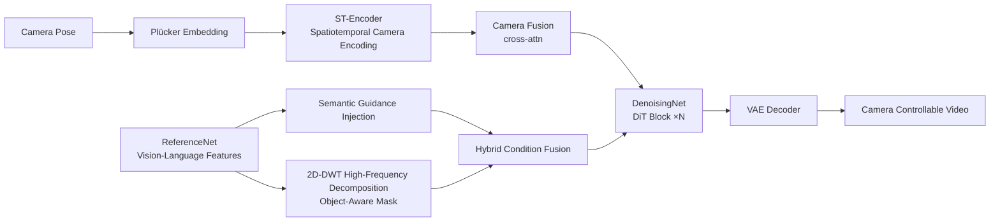

# MoCa: Modeling Object Consistency for 3D Camera Control in Video Generation

**Conference**: ICLR 2026  
**OpenReview**: [https://openreview.net/forum?id=DZcpnudp7f](https://openreview.net/forum?id=DZcpnudp7f)  
**Code**: To be confirmed  
**Area**: Video Generation / Camera Control  
**Keywords**: Camera controllable video generation, object consistency, Plücker embedding, motion disentanglement, dual-branch diffusion  

## TL;DR
MoCa avoids explicit 3D reconstruction by decomposing the observation that "smooth camera motion maintains object consistency in viewpoint, appearance, and motion" into three types of consistency constraints. Using a dual-branch diffusion framework, it simultaneously manages camera trajectories, appearance stability, and motion disentanglement to implicitly learn the 3D relationship between the camera and the scene.

## Background & Motivation
**Background**: Text-to-video (T2V) diffusion models can produce high-fidelity visuals. However, achieving "camera-controllable generation"—moving the viewpoint or synthesizing new views according to a given camera trajectory—requires the model to understand the spatial relationship between 2D pixels and the 3D scene. Formally, standard T2V learns $f(P)\to V^{X\times Y\times T}$, while camera control complicates this mapping into $f(P,C)\to V^{X\times Y\times Z\times T}$, where the additional $Z$ dimension represents the 3D spatial relationships that must remain consistent under camera motion.

**Limitations of Prior Work**: Two mainstream approaches have inherent drawbacks. One category (MotionCtrl, CameraCtrl) treats camera parameters as additional conditions injected into the denoising U-Net via temporal attention or element-wise addition. Lacking 3D spatial awareness, these often suffer from artifacts like disappearing objects, collapsing textures, or unnatural motion. The other category (VidCRAFT3, ViewCrafter, I2VControl-Camera) converts frames into point clouds or RGB-D for explicit 3D supervision. While more geometrically consistent, they heavily rely on precise 3D estimation, limiting generalization and practicality.

**Key Challenge**: Both failures stem from the same root: **the gap between the 2D pixel space and the underlying 3D world**. Directly forcing camera conditions into the 2D domain breaks geometry, while forcing explicit 3D is hindered by estimation errors and data scarcity.

**Goal**: To achieve precise camera control while maintaining image quality and ensuring natural foreground object dynamics, without relying on explicit 3D reconstruction or specialized dynamic video datasets.

**Key Insight**: The authors' key observation is that a camera-controllable video is essentially a 2D projection of a 3D scene; smooth camera motion necessarily makes objects exhibit **viewpoint consistency, appearance consistency, and motion consistency** across frames. **[Implicit 3D Bridge]** Conversely, by strongly constraining these three types of consistency on 2D frames, the model can implicitly learn the 3D relationship between the camera and the scene, bypassing explicit reconstruction.

## Method

### Overall Architecture
MoCa is a dual-branch diffusion framework based on a DiT video model like CogVideoX. It consist of a **ReferenceNet** and a **DenoisingNet** with identical structures and weights initialized from the pre-trained DiT. The three consistencies correspond to specific modules: the Camera Condition Module uses Plücker embeddings for viewpoint consistency; the Semantic Guidance strategy injects vision-language features from ReferenceNet for appearance consistency; and Motion Disentanglement uses frequency domain analysis to separate object motion from camera motion for motion consistency. Together, these allow the model to learn "how the scene changes as the camera moves" at an implicit level.

### Key Designs

**1. Camera Condition Module: Binding trajectories to pixels with Plücker embeddings to maintain viewpoint consistency.** The authors use Plücker embeddings instead of raw camera parameters because they provide strong geometric interpretation down to the pixel level. Given extrinsic $E=[R;t]\in\mathbb{R}^{3\times4}$ and intrinsic $K\in\mathbb{R}^{3\times3}$, for each pixel $(u,v)$, the ray direction is calculated as $d=RK^{-1}[u,v,1]^T+t$, normalized to $d'$, and concatenated as $p=(o\times d', d')$ (where $o$ is the camera center). This yields a geometric embedding $P_i\in\mathbb{R}^{6\times h\times w}$ for each frame. To align this with visual latents, the **Spatial-Temporal Camera Encoder (ST-Encoder)** uses a progressive convolutional structure (downsampling + convolution + residual) for pixel-level spatial features and temporal convolutions for inter-frame dynamics. Finally, the camera representation is integrated into the denoising process via cross-attention in each DiT block (Camera Fusion Module), allowing the model to dynamically modulate visual features based on spatiotemporal camera conditions, ensuring viewpoint and semantic object alignment.

**2. Semantic Guidance Strategy: Using vision-language features from a frozen base as anchors to stabilize appearance consistency.** The authors found that injecting extra camera signals can weaken the base model's inherent generation capabilities, leading to object distortion and texture collapse under complex dynamics. To counter this, vision-language features are extracted from each DiT block of the ReferenceNet and injected into the corresponding DiT blocks of the DenoisingNet. These features, aligned in both visual and semantic space, act as "persistent global information" for the scene, providing a stable reference to suppress distortion. Since ReferenceNet and DenoisingNet are isomorphic and share initialization, this reference-style injection effectively maintains object identity and texture consistency.

**3. Motion Disentanglement: Using high-frequency masks in the frequency domain to isolate object dynamics for motion consistency.** Existing methods often struggle to balance "global camera motion" and "local object motion"—when the camera moves, objects often freeze because the model entangles the two types of motion. MoCa decomposes the total video motion into camera motion (handled by the Camera Condition Module) + object motion. The solution is **High-Frequency Object-Aware Masking**: performing multi-level 2D Discrete Wavelet Transforms (2D-DWT) on the vision-language features from the base model to extract high-frequency components in different directions. These components correspond to foreground structures and edges, serving as implicit "object-aware masks." Through **Hybrid Condition Fusion**, these masks are merged with camera-conditioned visual features using cross-attention for spatial fusion and temporal attention for inter-frame consistency, allowing the model to execute camera moves while preserving natural foreground dynamics.

## Key Experimental Results

Training: Fine-tuned from CogVideoX using RealEstate10K (approx. 65k clips with per-frame camera parameters, mostly static). Evaluation is conducted on both RealEstate10K and VidGen (mostly dynamic). Metrics include FID/FVD/CLIPSIM (quality and alignment), TransErr/RotErr (camera accuracy via Mega-SAM reconstruction), and VBench OC/BC/MS (Object/Background/Motion Smoothness consistency).

### Main Results

| Dataset | Method | FID↓ | FVD↓ | CLIPSIM↑ | TransErr↓ | RotErr↓ | OC↑ | BC↑ | MS↑ |
|---|---|---|---|---|---|---|---|---|---|
| RealEstate10K | MotionCtrl | 246.6 | 870.8 | 0.309 | 0.716 | 0.213 | 94.6% | 95.8% | 97.8% |
| | CameraCtrl | 255.8 | 931.5 | 0.305 | 0.708 | 0.204 | 94.3% | 94.7% | 97.7% |
| | AC3D | 225.2 | 683.4 | 0.309 | 0.695 | **0.196** | **95.1%** | 95.3% | 98.5% |
| | **MoCa** | **207.4** | **667.9** | **0.312** | 0.703 | 0.208 | 94.9% | **96.4%** | **98.5%** |
| VidGen | MotionCtrl | 274.0 | 1858.2 | 0.333 | 0.722 | 0.107 | 92.6% | 93.2% | 97.1% |
| | CameraCtrl | 266.3 | 1905.1 | 0.339 | 0.731 | 0.089 | 92.9% | 93.1% | 96.9% |
| | AC3D | **228.4** | 1712.0 | 0.345 | 0.727 | 0.084 | 93.5% | 94.7% | 97.7% |
| | **MoCa** | 232.2 | **1643.7** | **0.349** | 0.724 | **0.081** | **94.7%** | **95.1%** | **98.3%** |

MoCa leads in quality metrics for static scenes (RealEstate10K) and excels in CLIPSIM, OC, MS, RotErr, and FVD for dynamic scenes (VidGen). A core advantage is that motion smoothness (MS) does not degrade in dynamic scenes (98.3% vs. significant drops in other methods).

### Ablation Study (RealEstate10K)

| Configuration | FID↓ | FVD↓ | TransErr↓ | OC↑ | BC↑ | MS↑ |
|---|---|---|---|---|---|---|
| w/o Plücker Embedding | 225.8 | 694.7 | 0.758 | 93.5% | 95.1% | 98.4% |
| w/o Semantic Guidance | 243.1 | 705.6 | 0.722 | 94.1% | 95.8% | 97.9% |
| w/o High-Freq Modeling | 235.4 | 649.8 | 0.744 | 94.5% | 94.9% | 98.0% |
| Full (Addition Fusion) | 236.2 | 771.8 | 0.738 | 94.6% | 95.1% | 98.2% |
| **Full (Attention Fusion)** | **207.4** | **667.9** | **0.703** | **94.9%** | **96.4%** | **98.5%** |

### Key Findings
- **Plücker embeddings are essential**: Replacing them with raw parameters breaks geometric relationships; TransErr worsened from 0.703 to 0.758.
- **Semantic guidance prevents collapse**: Without it, objects like turtles showed significant geometric distortion under rapid camera motion; FID rose from 207.4 to 243.1.
- **High-frequency masking supports motion smoothness**: Removing the frequency decomposition led to a drop in object/background consistency, particularly in dynamic scenes.
- **Cross-attention fusion outperforms element-wise addition**: Attention fusion led in almost all metrics (FID 207.4 vs. 236.2), showing that dynamic modulation preserves geometry better than static addition.
- **Conflicting motion verification**: When text-specified motion was opposite to the camera direction, MoCa allowed the object to move against the camera without being "overwritten," unlike other methods.

## Highlights & Insights
- **Observation-driven design philosophy**: Translating the abstract "2D-3D gap" into three actionable consistency constraints (viewpoint/appearance/motion) avoids explicit 3D estimation errors while being more structured than pure condition injection.
- **Reusing base model capabilities**: Instead of fighting the loss of generative power caused by camera conditions, the authors pragmatically "bring back" the appearance prior via ReferenceNet features.
- **Implicit segmentation in the frequency domain**: Using 2D-DWT high-frequency components as object-aware masks is an elegant way to localize foregrounds without requiring ground-truth segmentation masks.
- **No specialized dynamic datasets required**: Fine-tuning on the mostly static RealEstate10K generalized well to VidGen's dynamic scenes, proving the consistency constraints learned transferable camera-scene relationships.

## Limitations & Future Work
- **Trade-offs in dynamic scenes**: FID and TransErr were sub-optimal on VidGen, suggesting room for improvement in balancing quality and precision during intense object motion.
- **Dependence on base model feature quality**: Semantic guidance and high-frequency masking rely on the frozen base model; if the base lacks semantic understanding of a category, appearance and localization will suffer.
- **Relative camera accuracy**: TransErr/RotErr lagged behind AC3D in several cases; the method prioritizes "object consistency" over absolute camera precision.
- **Resolution and frame limits**: Experiments downsampled to 16 frames at fixed sizes; the sustainability of the three consistencies in long or high-resolution videos remains to be verified.

## Related Work & Insights
- **Condition Injection** (MotionCtrl, CameraCtrl): MoCa inherits Plücker representations but adopts DiT + cross-attention fusion and consistency constraints.
- **Explicit 3D** (VidCRAFT3, ViewCrafter, I2VControl-Camera): MoCa counters the reliance on point clouds/RGB-D by "learning 3D implicitly via 2D consistency."
- **DiT Camera Control** (AC3D): MoCa follows the paradigm of injecting signals into each DiT block, with AC3D as its primary competitor.
- **Reference-style Consistency** (AnimateAnyone): MoCa borrows the "identity preservation" logic of ReferenceNet and adapts it to stabilize appearance under camera motion.

## Rating
- **Novelty**: ⭐⭐⭐⭐ — The "three consistencies" reframing is clear, and frequency-based motion disentanglement is clever, though components (Plücker, ReferenceNet) are individually established tools.
- **Experimental Thoroughness**: ⭐⭐⭐⭐ — Covers static/dynamic datasets and extensive ablations; lacking larger-scale/high-res testing and user studies.
- **Writing Quality**: ⭐⭐⭐⭐ — Clear logical chain from observation to design; charts and tables are well-integrated.
- **Value**: ⭐⭐⭐⭐ — Achieving motion smoothness in dynamic scenes without dynamic training data makes this an attractive solution for controllable generation.

<!-- RELATED:START -->

## Related Papers

- [\[ICLR 2026\] 3D Scene Prompting for Scene-Consistent Camera-Controllable Video Generation](3d_scene_prompting_for_scene-consistent_camera-controllable_video_generation.md)
- [\[CVPR 2026\] SymphoMotion: Joint Control of Camera Motion and Object Dynamics for Coherent Video Generation](../../CVPR2026/video_generation/symphomotion_joint_control_of_camera_motion_and_object_dynamics_for_coherent_vid.md)
- [\[ICLR 2026\] Light-X: Generative 4D Video Rendering with Camera and Illumination Control](light-x_generative_4d_video_rendering_with_camera_and_illumination_control.md)
- [\[ICLR 2026\] Geometry Forcing: Marrying Video Diffusion and 3D Representation for Consistent World Modeling](geometry_forcing_marrying_video_diffusion_and_3d_representation_for_consistent_w.md)
- [\[ICLR 2026\] MIMIC: Mask-Injected Manipulation Video Generation with Interaction Control](mimic_mask-injected_manipulation_video_generation_with_interaction_control.md)

<!-- RELATED:END -->
