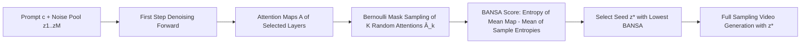

# Model Already Knows the Best Noise: Bayesian Active Noise Selection via Attention in Video Diffusion Model

**Conference**: ICLR 2026  
**OpenReview**: [https://openreview.net/forum?id=11dzFZ2UM1](https://openreview.net/forum?id=11dzFZ2UM1)  
**Code/Project Page**: [https://anse-project.github.io/anse-project/](https://anse-project.github.io/anse-project/)  
**Area**: Video Generation / Text-to-Video Diffusion / Noise Initialization  
**Keywords**: Video Diffusion, Noise Selection, Bayesian Active Learning, Attention Uncertainty, BALD, Inference-time Scaling  

## TL;DR
This paper proposes the ANSE framework and its core scoring function, BANSA, which migrates "Bayesian Active Learning by Disagreement (BALD)" from classification tasks to the **attention space** of diffusion models. By measuring the entropy divergence of attention maps under multiple random perturbations, the method quantifies the model's "certainty" regarding a specific initial noise seed. This allows for the selection of superior initial noise seeds using only a subset of attention layers from the first denoising step, **without retraining or running the full denoising process**.

## Background & Motivation
- **Background**: Text-to-Video (T2V) diffusion models have seen rapid quality improvements. However, changing a random seed for the same prompt can lead to drastically different results in terms of quality, temporal consistency, and text alignment. The choice of initial noise significantly impacts the outcome. Selecting a "good seed" is an inference-time scaling direction orthogonal to architectural design.
- **Limitations of Prior Work**: Existing noise initialization methods (FreeInit, FreqPrior, FreeNoise, PYoCo) rely on **external priors**—such as frequency filtering to preserve low-frequency components, inter-frame smoothing, or Gaussian priors—and often require **repeated full diffusion processes** to refine noise, which is extremely costly (FreeInit adds up to +200% inference time, FreqPrior adds +105%).
- **Key Challenge**: These methods treat noise as an object that needs to be "fixed" by external rules, while **ignoring the model's own internal signals**. In fact, the model implicitly "knows" during the forward pass which seeds lead to more certain and consistent behavior. The key is how to extract this internal signal without external priors or full sampling.
- **Goal**: Construct a **model-aware** noise selection framework that ranks seeds solely based on internal uncertainty metrics, keeping overhead within +15%.
- **Core Idea**: **[Moving BALD to Attention Space]** In classic active learning, BALD uses the mutual information of classification logits to measure epistemic uncertainty. While diffusion models lack explicit predictive distributions, **attention maps** are the most informative signals for text-visual token alignment. Thus, "entropy divergence of multiple random attention samples" replaces classification logits. A lower BANSA score indicates the model is more certain and consistent about the attention for that seed, which empirically corresponds to more coherent videos.

## Method

### Overall Architecture
The ANSE workflow is straightforward: given a prompt, a noise pool $Z=\{z_1,\dots,z_M\}$ is sampled. For each seed, its BANSA score is quickly estimated in an **early denoising step** using Bernoulli masked attention. The seed $z^*$ with the lowest score (most certain/consistent) is then selected for full generation. Three components serve efficiency: BANSA defines the uncertainty criterion (Sec 3.1), Bernoulli masking compresses $K$ forwards into one (Sec 3.2), and correlation probes retain only the most informative layers (Sec 3.3).

### Key Designs

**1. BANSA Score: Using the difference between "Entropy of Mean vs. Mean of Entropy" as attention uncertainty.** This is the heart of the paper. Given seed $z$, prompt $c$, and timestep $t$, the attention map is $A(z,c,t)=\mathrm{Softmax}(QK^\top)\in\mathbb{R}^{N\times N}$. Taking $K$ samples $\{A^{(1)},\dots,A^{(K)}\}$ under random perturbations, BANSA is defined as:

$$\mathrm{BANSA}(z,c,t):=H\!\left(\frac{1}{K}\sum_{k=1}^{K}A^{(k)}\right)-\frac{1}{K}\sum_{k=1}^{K}H\!\left(A^{(k)}\right),$$

where $H(A)=\frac{1}{N}\sum_{i,j}-A_{ij}\log A_{ij}$. This strictly corresponds to the BALD structure: the first term is the "entropy of the average attention map," and the second is the "average entropy of individual attention maps." The difference characterizes both **confidence** (whether a single attention map is sharp) and **consistency** (whether multiple attention samples align). The paper proves a clean property (Proposition 1): $\mathrm{BANSA}=0 \iff A^{(1)}=\cdots=A^{(K)}$, reaching zero when all samples are identical. Seed selection is $z^*=\arg\min_{z\in Z}\mathrm{BANSA}(z,c,t)$. Note that the framework does not seek a universal "golden seed"—quality is prompt-dependent.

**2. Bernoulli Masked Attention: Compressing $K$ independent forwards into a single forward.** Running $K$ forwards for every seed is too expensive. Instead of repeating the forward pass, the authors inject randomness directly into the attention scores: for each $k$, a binary mask $m_k\sim\mathrm{Bernoulli}(p)$ is sampled to obtain $\hat{A}^{(k)}=A\odot m_k$, which is then re-normalized row-wise. This generates $K$ random attention samples in one forward pass. The resulting approximate score $\mathrm{BANSA\text{-}E}$ is guaranteed $\ge 0$ by the concavity of entropy. Ablations show Bernoulli masking ($p=0.2$) fits the model structure better than dropout and captures attention-level uncertainty more accurately.

**3. Layer Selection via Cumulative Correlation: Retaining only the first $d^*$ layers.** BANSA can be calculated at any layer, but behavior varies by depth, and using all layers is costly. The authors compute the cumulative average $\widehat{\mathrm{BANSA\text{-}E}}_{\le d}=\frac{1}{d}\sum_{l=1}^{d}\mathrm{BANSA\text{-}E}^{(l)}$ and use Pearson correlation to select the smallest $d^*$ such that the correlation between the cumulative score of the first $d^*$ layers and the full-layer score is $\ge\tau$. In practice, correlation saturates quickly at medium depths, allowing each model to fix a $d^*$ that approximates the full-layer score with almost no additional cost.

**4. Early Step + Single Step Evaluation: Placing noise selection at the beginning of denoising.** Unlike external prior methods that require full diffusion runs before refinement, ANSE evaluates seeds only at the **first (early) denoising step**. Overhead stems only from the seed scoring phase; the sampling process and memory footprint remain unchanged. This is why it maintains additional overhead below +15% and remains plug-and-play.

## Key Experimental Results

### Main Results (VBench, AnimateDiff / CogVideoX)

| Backbone | Method | Quality | Semantic | Total | Inference Time |
|---|---|---|---|---|---|
| AnimateDiff | Vanilla | 80.22 | 69.03 | 77.98 | 28.23s |
| AnimateDiff | + Ours | 81.66 | 71.09 | 79.33 | 31.33s (+10.98%) |
| AnimateDiff | FreqPrior | 81.22 | 70.45 | 79.07 | 58.01s (+105%) |
| AnimateDiff | FreqPrior + Ours | 82.23 | 73.23 | **80.43** | 61.12s (+5.36%) |
| CogVideoX-2B | Vanilla / +Ours | 82.08 / 82.56 | 76.83 / 78.06 | 81.03 / 81.66 | 247.8s → +8.67% |
| CogVideoX-5B | Vanilla / +Ours | 82.53 / 82.70 | 77.50 / 78.10 | 81.52 / 81.71 | 667.3s → +13.1% |

Ours improves Quality/Semantic/Total scores across advanced MMDiT architectures (CogVideoX-2B/5B) and is fully compatible with FreqPrior, yielding even higher scores. Performance gains are also observed across six quality dimensions on HunyuanVideo / Wan2.1 (e.g., Subject Consistency 0.9562 → 0.9612) with +14% to +16% overhead. FVMD motion fidelity metrics on MSR-VTT also decreased consistently (Wan2.1 16495 → 14306), confirming motion quality gains.

### Ablation Study

| Acquisition Function (CogVideoX-2B) | Quality | Semantic | Total |
|---|---|---|---|
| Random | 82.08 | 76.83 | 81.03 |
| Entropy | 82.23 | 76.73 | 81.13 |
| BANSA (Dropout) | 82.43 | 76.91 | 81.33 |
| **BANSA (Bernoulli)** | **82.56** | **78.06** | **81.66** |

| Ensemble Number K | Subject Cons. | Background Cons. |
|---|---|---|
| 1 / 3 / 5 / 7 / 10 | 0.9618 → 0.9641 | 0.9788 → 0.9811 |

Reverse selection (picking seeds with the **highest** BANSA) dropped Quality from 82.08 to 81.93, while picking low-score seeds raised it to 82.56, verifying the causal direction: low BANSA indeed corresponds to better generation. Since performance saturates at $K=10$, $K=10$ is used by default.

### Key Findings
- **Physical Meaning of the Score**: Analysis shows low BANSA seeds exhibit (1) smaller intra-group Euclidean distances in attention maps (more stable); (2) lower latent trajectory variance but higher intra-frame variance (smoother yet more expressive); (3) prompt-dependent gains—there is no "universal seed," only the "most certain seed for the current prompt."
- **Controllable Overhead**: Compared to FreeInit (+200%) and FreqPrior (+105%) which require multiple full forwards, ANSE only adds one early-step scoring. Overhead for all backbones is < +15% with no change in sampling or VRAM.

## Highlights & Insights
- **Valuable Perspective Shift**: Reframing "noise refinement" as "noise selection" and noting that the best selection signals are hidden in the model's own attention ("model already knows"). This is a clean, transferable concept.
- **Theory-Engineering Synergy**: BANSA inherits the mathematical framework of BALD, and Proposition 1 provides a necessary and sufficient condition for zero uncertainty. Bernoulli masking and layer truncation reduce expensive MC estimation to a single forward of a few layers, ensuring practical feasibility.
- **Strong Generalization and Orthogonality**: Applicable across U-Net (AnimateDiff) and MMDiT (CogVideoX/Wan2.1/Hunyuan) backbones and is additive with frequency prior methods rather than mutually exclusive.

## Limitations & Future Work
- **Requirement of a Noise Pool**: Selecting from $M=10$ candidates implies 10 extra first-step forwards. While cheap, it is not zero-cost; the trade-off between pool size and quality gain is not fully explored.
- **Hyperparameter Dependence**: Bernoulli probability $p$, truncation layer $d^*$, and threshold $\tau$ require pre-calibration per model; automated cross-model selection is not yet implemented.
- **Prompt Dependency**: The framework explicitly avoids seeking a universal seed. While this ensures precision, it means "globally good seeds" cannot be pre-cached for re-use.
- **Evaluation Scope**: Due to compute constraints, HunyuanVideo/Wan2.1 were evaluated on 6 quality dimensions without semantic metrics; statistical significance is provided in the appendix.

## Related Work & Insights
- **Noise Initialization Priors**: Compared to PYoCo (inter-frame correlated noise, requires retraining), FreeNoise (noise rescheduling), FreeInit (frequency filtering), and FreqPrior (Gaussian priors + partial sampling), Ours is a "selector" rather than a "refiner" and is orthogonal to them.
- **Bayesian Active Learning**: While BALD/Houlsby use mutual information for epistemic uncertainty, this work is the first to systematically migrate these acquisition functions to the attention space of generative diffusion without extra models or retraining.
- **Inference-time Scaling**: Allied with test-time scaling in LLMs and sampling path search in diffusion, the insight is that in generative tasks, "picking a good starting point" may be more cost-effective than "refining a starting point," and the quality of that point can be self-evaluated by internal signals.

## Rating
- **Novelty**: ⭐⭐⭐⭐⭐ High. Migrating BALD to diffusion attention for noise selection is a fresh "model already knows" perspective. Proposition 1 provides a theoretical foundation.
- **Experimental Thoroughness**: ⭐⭐⭐⭐ Solid. Covers U-Net to MMDiT, dual evaluations (VBench/FVMD), causal verification via reverse selection, and deeper analysis. Noise pool scaling trade-offs are slightly under-explored.
- **Writing Quality**: ⭐⭐⭐⭐ Logic is smooth; Figures 2/3 are conceptually clear. Minor typos (e.g., "signicanse") exist.
- **Value**: ⭐⭐⭐⭐⭐ Plug-and-play with < +15% overhead, compatible with existing priors, and generalizes across architectures. A high-efficiency "free lunch" for T2V inference.

<!-- RELATED:START -->

## Related Papers

- [\[ICLR 2026\] TPDiff: Temporal Pyramid Video Diffusion Model](tpdiff_temporal_pyramid_video_diffusion_model.md)
- [\[ICLR 2026\] QuantSparse: Comprehensively Compressing Video Diffusion Transformer with Model Quantization and Attention Sparsification](quantsparse_comprehensively_compressing_video_diffusion_transformer_with_model_q.md)
- [\[ICLR 2026\] Lumos-1: On Autoregressive Video Generation with Discrete Diffusion from a Unified Model Perspective](lumos-1_on_autoregressive_video_generation_with_discrete_diffusion_from_a_unifie.md)
- [\[ECCV 2024\] Videoshop: Localized Semantic Video Editing with Noise-Extrapolated Diffusion Inversion](../../ECCV2024/video_generation/videoshop_localized_semantic_video_editing_with_noise-extrapolated_diffusion_inv.md)
- [\[ICLR 2026\] Any-to-Bokeh: Arbitrary-Subject Video Refocusing with Video Diffusion Model](any-to-bokeh_arbitrary-subject_video_refocusing_with_video_diffusion_model.md)

<!-- RELATED:END -->
