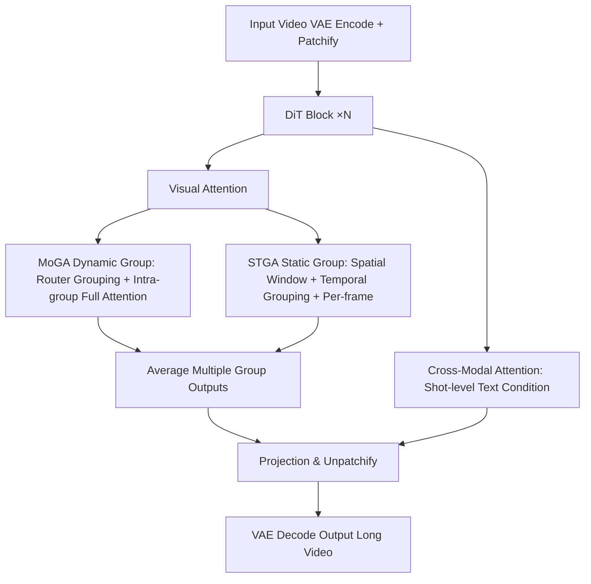

# MoGA: Mixture-of-Groups Attention for End-to-End Long Video Generation

**Conference**: ICLR 2026  
**OpenReview**: [https://openreview.net/forum?id=0hy9kJ1ULB](https://openreview.net/forum?id=0hy9kJ1ULB)  
**Code**: [Project Page](https://jiawn-creator.github.io/mixture-of-groups-attention/)  
**Area**: Video Generation / Long Video Generation / Sparse Attention  
**Keywords**: Long Video Generation, Sparse Attention, Diffusion Transformer, Token Routing, Multi-Shot  

## TL;DR
MoGA employs a lightweight learnable token router to group tokens semantically and perform full attention within these groups. This eliminates the "coarse block score estimation" step found in block-sparse attention, enabling the end-to-end generation of minute-level, multi-shot, 480p/24fps long videos with a context length of approximately 580,000 tokens.

## Background & Motivation

**Background**: When using Diffusion Transformers (DiT) for video generation, the computational complexity of full attention grows quadratically with sequence length. Long videos (minute-level, multi-shot) often involve context lengths of hundreds of thousands of tokens—for instance, a 1-minute 480p, 16fps video contains approximately 384,000 tokens—rendering full attention infeasible. However, video data is naturally sparse: neighboring tokens exhibit strong local correlations, while global semantic consistency across frames is carried by only a few tokens, meaning most query-key pairs contribute negligibly.

**Limitations of Prior Work**: Existing long-video solutions have significant drawbacks. Multi-stage pipelines (generating keyframes followed by interpolation) have disjointed objectives, leading to error accumulation and reliance on manual inductive biases that hinder scaling. End-to-end methods that compress historical content (recurrent layers, FramePack) inevitably lose information. In the context of sparse attention, static selection (local spatio-temporal windows) fails to capture dynamic long-range dependencies. Dynamic "coarse-to-fine" schemes must first estimate block-level importance before selecting the top-$k$ blocks for fine-grained attention; however, as block size increases or $k$ decreases to save costs, selection accuracy drops, creating a rigid bottleneck for the accuracy-efficiency trade-off.

**Key Challenge**: The "block-level estimation" in block-sparse attention serves as both a computation-saving mechanism and an accuracy bottleneck—the block granularity determines both the precision of token allocation and the overhead of the estimation phase itself.

**Goal**: To remove block-level estimation and allow each token to be **precisely** allocated to its destination while maintaining compatibility with modern attention stacks like FlashAttention and sequence parallelism, enabling end-to-end production of minute-level multi-shot long videos.

**Core Idea**: **[Routing as a Substitute for Block Estimation]** Borrowing from the Mixture-of-Experts (MoE) paradigm—where tokens are routed to different expert FFNs to scale parameter counts—MoGA routes tokens to different attention groups to scale sequence lengths. A linear router groups semantically related tokens into the same group for intra-group full attention. The router weights function as implicit clustering centers, allowing tokens to be directly assigned to learnable anchors without needing any global similarity estimation.

## Method

### Overall Architecture
The model utilizes a DiT architecture, alternating between Visual Attention blocks and Cross-Modal Attention blocks. Within Visual Attention, dynamic **MoGA** (capturing long-range consistency) is combined with static **Spatial-Temporal Group Attention (STGA)** (capturing local continuity) to complementarily address both global and local dependencies. Cross-Modal Attention implements shot-level text conditioning via cross-attention or MMDiT. A specialized data pipeline for multi-shot long videos is used to generate training samples.

### Key Designs

**1. Mixture-of-Groups Attention: Precise token grouping via linear router**. Given token $x \in \mathbb{R}^d$ and a predefined number of groups $M$, the router consists of a linear projection followed by softmax gating to calculate routing scores $r = \text{Router}(x)$. The group assignment probability is $p(i|x) = \text{softmax}(r)_i$, and tokens are hard-assigned to the group with the highest probability $g(x) = \arg\max_i p(i|x)$. Self-attention is then performed independently within each group, with the output defined as $\text{MoGA}(x) = p(g(x)|x) \cdot \text{SA}(q, K_{g(x)}, V_{g(x)})$, where attention is computed using the keys and values of that group and scaled by the routing probability to maintain differentiability. This reduces complexity from $O(N^2)$ to a theoretical lower bound of $O(N^2/M)$ (under uniform grouping). Visualizations indicate that after training, the router groups semantically coherent structures—such as heads, hands, or clothing—into the same groups across shot boundaries, suggesting it learns semantic-aware grouping rather than simple spatial proximity. Crucially, this path bypasses block-level estimation, ensuring precise allocation for every token.

**2. FlashAttention Compatibility and Sequence Parallelism: Kernel-free engineering**. MoGA is kernel-free, meaning it does not modify the attention kernel itself. Instead, it permutes tokens by group before the attention operation to align tokens of the same group, which are then fed into standard `flash_attn` (utilizing `cu_seq_len` or `max_seq_len` to define group boundaries). After calculation, tokens are re-permuted to their original positions. This allows MoGA to benefit from FlashAttention without requiring custom CUDA kernels. It is also compatible with sequence parallelism: MoGA calculates routing scores and aggregates results across tokens before the sequence gather and head scatter operations in each attention layer, integrating seamlessly with existing sequence parallelism stacks. Unlike block mechanisms like VMoBA, MoGA introduces no additional memory overhead.

**3. Group Balancing Loss: Preventing router collapse into full attention**. A potential risk of token allocation is router collapse, where most tokens are routed to a few groups, causing MoGA to revert to full attention. Influenced by MoE load balancing, an auxiliary group balancing loss is introduced: $L_{gb} = \alpha \cdot M \cdot \sum_{i=1}^{M} F_i \cdot P_i$, where $F_i = \frac{1}{N} \sum_x \mathbb{1}(g(x)=i)$ represents the fraction of tokens assigned to group $i$, and $P_i$ is the average routing probability for group $i$. This objective is minimized under a uniform distribution, thereby encouraging tokens to be distributed evenly across groups to maintain sparsity. In the paper, $\alpha = 0.1$ and $M = 5$ ($M = 20$ for the MMDiT version).

**4. Spatial-Temporal Group Attention: Supplementing local continuity**. While MoGA captures long-range consistency, it lacks local continuity, which is addressed by the static, predefined groups of STGA. Latent video features are divided into fixed spatial windows and then grouped temporally, ensuring frames from different shots are placed into different temporal groups. The authors found that completely severing cross-shot interaction leads to flickering in the first frame after a shot transition. Consequently, when calculating group attention, the keys and values are padded with two latent frames from adjacent shots at a minimal cost to maintain continuity at shot boundaries. Additionally, per-frame attention is performed to facilitate intra-frame information exchange. Each token thus receives outputs from multiple groups (one dynamic group + two static groups), which are averaged to produce the final output.

## Key Experimental Results

Training Setup: Fine-tuned on open-source Wan2.1 (1.3B/14B) using a rectified flow objective. It stably generates 477 frames at 16fps (30 seconds) at 480p with a 187k context length; the MMDiT version generates 1441 frames at 24fps (60 seconds) at 480p with a 578k context length. $M=5$, with 2×2 spatial grouping, following a multi-stage training schedule (3k steps for 10s + 1k steps for 30s).

### Main Results

5-second single-shot short video (compared with sparse attention baselines using VBench metrics):

| Method | Base Model | Subject Consist.↑ | Aesthetic↑ | Image Quality↑ | Sparsity |
| :--- | :--- | :--- | :--- | :--- | :--- |
| Wan (Original Full Attention) | Wan2.1-14B | 0.9611 | 0.5807 | 0.6680 | 0% |
| DiTFastAttn | Wan2.1-14B | 0.9456 | 0.5269 | 0.6466 | 50% |
| SVG (training-free) | Wan2.1-14B | 0.9002 | 0.5370 | 0.6357 | 50% |
| VMoBA (training-free) | Wan2.1-14B | 0.8605 | 0.5369 | 0.6111 | 31% |
| **MoGA** | Wan2.1-14B | **0.9699** | **0.5810** | **0.6994** | **71.25%** |

10-second multi-shot (cross-shot consistency metrics):

| Method | Base Model | Cross-Shots DINO↑ | Cross-Shots CLIP↑ |
| :--- | :--- | :--- | :--- |
| IC-Lora+Wan | Wan2.1-1.3B | 0.4669 | 0.7169 |
| EchoShot | Wan2.1-1.3B | 0.5961 | 0.8469 |
| **MoGA** | Wan2.1-1.3B | **0.6623** | **0.8654** |
| **MoGA** | Wan2.1-14B | **0.6703** | 0.8629 |

30-second multi-shot long video: MoGA (Wan2.1-14B) significantly outperforms IC-Lora+Wan (14B) in Subject Consistency (0.9572 vs 0.8946). The MMDiT version maintains high fidelity even at extremely high sparsity levels.

### Ablation Study

Impact of group number $M$ on consistency and computation (Wan2.1-1.3B, 10s):

| Group Number M | Cross-shot CLIP↑ | Cross-shot DINO↑ | Sparsity | PFlops |
| :--- | :--- | :--- | :--- | :--- |
| 1 | 0.8206 | 0.5919 | 0% | 0.88 |
| 2 | 0.8589 | 0.6761 | 41.25% | 0.59 |
| 4 | **0.8672** | 0.6853 | 66.25% | 0.42 |
| 8 | 0.8606 | **0.6910** | 78.75% | 0.36 |
| 16 | 0.8569 | 0.6896 | 81.25% | 0.35 |

Consistency shows an "increase then decrease" trend with the number of groups—moderate grouping sparsity achieves the best balance between global consistency and efficiency.

### Key Findings
- **Sparsity can be beneficial**: At 71.25% sparsity, MoGA matches or exceeds the VBench performance of full-attention models (Wan/EchoShot). This suggests that preserving only significant token interactions saves FLOPs while suppressing irrelevant noise, leading to stronger identity consistency and temporal coherence.
- **Computational Gains**: For a 30-second video with $M=5$, MoGA requires 2.26 PFlops compared to 6.94 PFlops for full attention, achieving approximately 1.7× speedup in both training and inference without extra memory overhead.
- **Synergy between MoGA and STGA**: MoGA alone lacks local information exchange, failing to produce meaningful content; STGA alone lacks long-range interaction, leading to poor cross-shot consistency. Their combination is essential for strong cross-shot consistency.
- **Router learns semantic segmentation**: Treating router groups as unsupervised semantic segmentation and using SAM2 masks as Ground Truth, MoGA achieves a 28.6% IoU after training, far exceeding random or untrained routers (15.6%/18.5%). Semantic quality is highest in middle layers (31.0%) and stabilizes as the denoising timestep progresses.

## Highlights & Insights
- **Transferring MoE routing philosophy from "scaling parameters" to "scaling sequence length"** is a novel perspective. Router weights act as implicit cluster centers, allowing tokens to align directly with learnable anchors and bypassing the accuracy-efficiency bottleneck of block-level similarity estimation.
- **The kernel-free permute/repermute design** allows the method to reuse FlashAttention and sequence parallelism directly. This low implementation cost is key to supporting 578k context lengths.
- **The dual-track dynamic (MoGA) + static (STGA) approach** decouples "long-range semantic consistency" and "local detail continuity" into separate group types. The addition of adjacent shot key/values to eliminate flickering demonstrates solid engineering intuition.

## Limitations & Future Work
- Hard assignment (arg max) routing combined with group balancing loss relies on hyperparameters ($\alpha$, $M$). The number of groups must be manually adjusted based on duration and resolution, lacking an adaptive grouping mechanism.
- Evaluations are primarily conducted at 480p for up to 60 seconds; whether routing quality and consistency hold at higher resolutions or for multi-minute "movie-length" sequences remains to be verified.
- Averaging outputs from one dynamic group and two static groups is an empirical design; the weighting method for different group contributions could be further optimized.
- Although semantic segmentation quality (28.6% IoU) exceeds baselines, the absolute value is modest, leaving room to improve the semantic purity of grouping.

## Related Work & Insights
Long video generation previously converged into three paradigms: multi-stage (e.g., Captain Cinema’s hierarchical planning), which introduces manual bias; autoregressive (Diffusion Forcing, CausVid, StreamingT2V), which synthesizes segments sequentially; and compressed history (FramePack, recurrent layers), which inevitably loses information. In sparse attention, static windows cannot capture dynamic long-range dependencies, and block-sparse methods (VMoBA, SVG, MInference) are limited by block granularity. MoGA's insight is that **sparse selection does not necessarily require an "estimate-then-select" process—learnable routing can transform "which tokens to interact with" into an end-to-end trainable grouping problem** compatible with high-performance kernels. This approach offers valuable lessons for efficient attention design in other long-sequence modalities such as long documents, 3D data, and audio.

## Rating
- **Novelty**: ⭐⭐⭐⭐ — Relocating MoE routing to the sequence length dimension and replacing coarse block estimation with a linear router provides a clean and persuasive new perspective for sparse attention.
- **Experimental Thoroughness**: ⭐⭐⭐⭐ — Covers 5s/10s/30s/60s settings, compares multiple baseline types, and includes comprehensive ablations on group counts, MoGA-STGA synergy, and routing semantics; however, stress testing at higher resolutions/lengths is absent.
- **Writing Quality**: ⭐⭐⭐⭐ — Clear motivation diagrams (Full/Block/MoGA comparison), well-documented methodology and engineering details, and a coherent narrative.
- **Value**: ⭐⭐⭐⭐ — End-to-end 580k context, minute-level multi-shot generation with 1.7× speedup, and a kernel-free design make it highly practical for long video generation.

<!-- RELATED:START -->

## Related Papers

- [\[ICLR 2026\] Mixture of Contexts for Long Video Generation](mixture_of_contexts_for_long_video_generation.md)
- [\[ICLR 2026\] VMoBA: Mixture-of-Block Attention for Video Diffusion Models](vmoba_mixture-of-block_attention_for_video_diffusion_models.md)
- [\[CVPR 2026\] STARFlow-V: End-to-End Video Generative Modeling with Autoregressive Normalizing Flows](../../CVPR2026/video_generation/starflow-v_end-to-end_video_generative_modeling_with_autoregressive_normalizing_.md)
- [\[CVPR 2026\] MoCha: End-to-End Video Character Replacement without Structural Guidance](../../CVPR2026/video_generation/mocha_end-to-end_video_character_replacement_without_structural_guidance.md)
- [\[CVPR 2026\] EasyOmnimatte: Taming Pretrained Inpainting Diffusion Models for End-to-End Video Layered Decomposition](../../CVPR2026/video_generation/easyomnimatte_taming_pretrained_inpainting_diffusion_models_for_end-to-end_video.md)

<!-- RELATED:END -->
