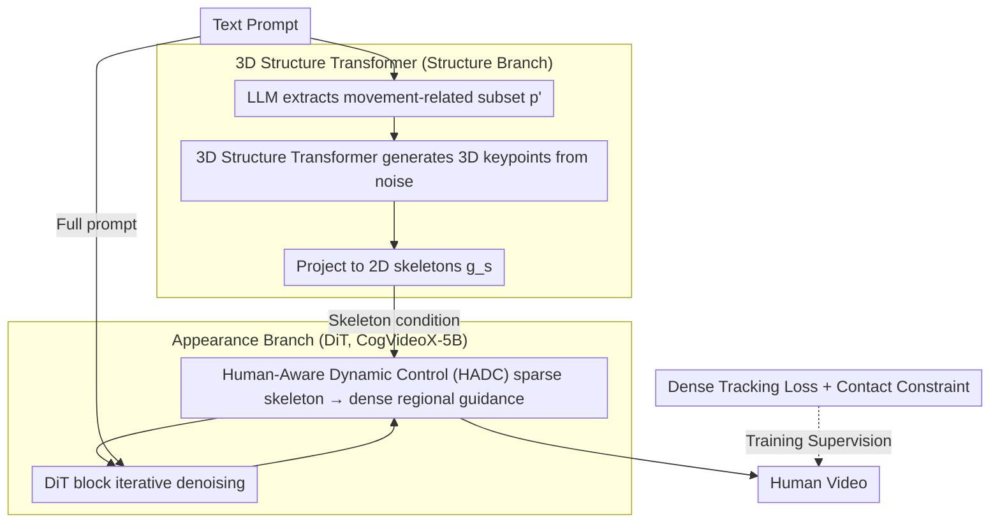

# MoSA: Motion-Coherent Human Video Generation via Structure-Appearance Decoupling

**Conference**: ICLR 2026  
**arXiv**: [2508.17404](https://arxiv.org/abs/2508.17404)  
**Code**: None (to be open-sourced)  
**Area**: Video Generation  
**Keywords**: Human Video Generation, Structure-Appearance Decoupling, 3D Motion Generation, DiT, Dense Tracking Loss

## TL;DR

The authors propose the MoSA framework, which decouples human video generation into "structure generation" (pre-generating physically plausible motion skeletons via a 3D Transformer) and "appearance generation" (synthesizing videos via DiT guided by skeletons). A Human-Aware Dynamic Control (HADC) module is designed to expand sparse skeleton signals into the entire motion region. Together with dense tracking loss and contact constraints, MoSA outperforms SOTA models like HunyuanVideo and Wan 2.1 across metrics including FVD and CLIPSIM.

## Background & Motivation

**Background**: Current mainstream general video generation models (e.g., HunyuanVideo, CogVideoX, Wan 2.1) achieve high visual quality in natural scenes but frequently suffer from structural collapse, such as limb distortion and unnatural movements, when generating human videos. Specialized methods (e.g., the AnimateAnyone series) are mostly limited to face/upper-body or require external pose-driven inputs, making it difficult to handle complex full-body movements.

**Limitations of Prior Work**: First, training objectives based on pure noise reconstruction naturally favor appearance fidelity while ignoring structural consistency—models tend to "draw well" but move irrationally. Second, some methods attempt to generate skeleton sequences directly in 2D space as guidance, but 2D representations lack depth information, leading to structural errors (e.g., leg interpenetration) during limb occlusion. Third, skeletons themselves are sparse keypoint representations; even if generated correctly, their control over subsequent pixel-level appearance generation remains very limited.

**Key Challenge**: Human appearance and motion carry completely different signals—appearance requires pixel-level texture details, while motion requires adherence to physical constraints and anatomical plausibility. Existing methods couple these in the same generation process, leading to a trade-off.

**Goal**: (1) How to generate physically plausible complex human motion? (2) How to make sparse skeleton signals effectively guide dense pixel generation? (3) How to model contact interactions between humans and the environment?

**Key Insight**: The authors observe that human motion has excellent priors in 3D space (large-scale MoCap datasets), while appearance is well-suited for generation by pre-trained DiTs. Therefore, the problem is split into two steps: first leveraging 3D priors to generate structurally sound motion sequences, then generating appearance under skeleton guidance. This ensures motion plausibility via the 3D Transformer and visual quality via the DiT.

**Core Idea**: Generate physically plausible skeleton sequences in 3D space using motion priors, then use a Human-Aware Dynamic Control module to expand sparse skeleton guidance into the entire motion region to guide the DiT in generating high-fidelity appearance.

## Method

### Overall Architecture

MoSA decomposes "how a human video should move" and "what the scene should look like" into two independent branches. The **Structure Generation Branch** focuses solely on motion: it extracts motion-related semantics from the text prompt, uses a pre-trained 3D Structure Transformer to generate a 3D human keypoint sequence, and projects it into 2D skeleton sequences. The **Appearance Generation Branch** uses the full text prompt and this skeleton sequence as conditions to iteratively denoise and generate the final video on a DiT backbone. These branches are not isolated—skeleton signals are processed by the HADC module before being injected into the appearance branch, transforming from sparse keypoints to dense guidance covering the entire human body. During training, skeletons extracted from GT videos are used as conditions, and only the appearance branch is trained while the structure branch is fixed. At inference, the structure branch generates skeletons from text. This ensures physical plausibility via 3D priors and visual quality via DiT.

### Key Designs

**1. 3D Structure Transformer: Generating motion in 3D to bypass 2D occlusion issues**

Generating skeletons directly in the 2D plane has a fatal flaw—when limbs overlap, the lack of depth information often leads to misplacement or interpenetration. MoSA constructs motion in 3D space. Specifically, an LLM extracts a motion-related subset $p'$ from the prompt, filtering out irrelevant background descriptions. The 3D Structure Transformer $\mathcal{G}_s^m$ generates a 3D keypoint sequence from Gaussian noise $z_T^s$ conditioned on $p'$, which is then rendered into 2D skeletons $g_s$ via a Projection operation. Pre-trained on million-scale MoCap datasets, this autoregressive Transformer inherently possesses human anatomical priors. Generating in 3D and then projecting to 2D ensures joint plausibility through 3D priors and maintains correct depth ordering during occlusions.

**2. Human-Aware Dynamic Control (HADC): Expanding sparse "point guidance" to body-wide "regional guidance"**

Skeleton sequences consist of only $K$ keypoints, providing information that is too sparse for effective pixel-level control in DiT. HADC allows skeleton signals to diffuse across the entire human region. Inserted between adjacent DiT blocks, the $k$-th HADC receives skeleton features $s^k$ and video latent $a_i^k$. It uses a learnable weight predictor $\mathcal{P}^k$ to generate a spatially varying dynamic weight map $w^k = \mathcal{P}^k(s^k, a_i^k)$, and integrates the weighted skeleton signal back into the latent:

$$a_o^k = a_i^k \oplus (w^k \odot s^k)$$

To prevent weights from drifting to the background, a learnable network $\mathcal{U}^k$ transforms $w^k$ into a mask latent, constrained by an L2 loss $\mathcal{L}_m$ against the GT mask. This forces weights to concentrate on the human body, upgrading sparse "skeleton guidance" to dense "regional guidance."

**3. Dense Tracking Loss and Contact Constraint: Supervising motion consistency and human-environment interaction**

Standard reconstruction objectives lack constraints on motion correctness. Dense Tracking Loss $\mathcal{L}_{track}$ uses CoTracker3 to extract 2D trajectories from both generated and GT videos, calculating a weighted L1 distance. Weights are set to $e^{|t_v - t_v'|/2}$, assigning higher weights to frame pairs with larger temporal spans, explicitly encouraging the model to learn long-range motion dependencies. The Contact Constraint $\mathcal{L}_{cont}$ models 3D interaction between the human and the ground/objects, preventing physical inconsistencies like "feet sinking into the floor" or "floating."

### Loss & Training

The total loss is $\mathcal{L} = \mathcal{L}_d + \lambda_m \mathcal{L}_m + \lambda_{track} \mathcal{L}_{track} + \lambda_{cont} \mathcal{L}_{cont}$. During training, the pre-trained 3D Structure Transformer $\mathcal{G}_s^m$ is fixed. The appearance branch uses CogVideoX-5B as the backbone. The authors also constructed the MoVid dataset (30K human motion videos) covering diverse complex actions like walking, running, jumping, and skating.

## Key Experimental Results

### Main Results

Quantitative comparison against general video generation models on 300+ text prompts:

| Method | FVD↓ | CLIPSIM↑ | Subject Cons.↑ | Background Cons.↑ | Motion Smooth.↑ | Dynamic Degree↑ | Visual Quality↑ |
|------|------|----------|-----------|-----------|---------|---------|------|
| ModelScope | 1945 | 0.2739 | 90.87% | 93.41% | 96.22% | 48.57% | 60.12% |
| VideoCrafter2 | 1959 | 0.2801 | 93.43% | 97.01% | 97.31% | 35.71% | 60.32% |
| LaVie | 1778 | 0.2895 | 93.80% | 95.51% | 97.21% | 53.73% | 62.57% |
| Mochi 1 | 1207 | 0.2903 | 94.67% | 95.32% | 97.75% | 51.14% | 54.65% |
| CogVideoX | 1360 | 0.2899 | 93.75% | 94.02% | 97.78% | 51.42% | 62.98% |
| HunyuanVideo | 1235 | 0.2948 | 94.41% | 95.17% | 98.95% | 50.42% | 58.13% |
| Wan 2.1 | 1251 | 0.2951 | 94.43% | 95.55% | 98.36% | 51.71% | 65.21% |
| **MoSA** | **1093** | **0.3035** | **96.83%** | **97.43%** | **99.25%** | **52.86%** | **65.43%** |

### Ablation Study

Contribution of each module (FVD↓ / CLIPSIM↑):

| Ablation Config | FVD | CLIPSIM | Description |
|---------|-----|---------|------|
| Full MoSA | 1093 | 0.3035 | All components |
| w/o Structure Branch | 1262 | 0.2971 | Direct finetune of base model, FVD +169 |
| 2D skeleton instead of 3D | 1230 | 0.2998 | Structural collapse in occlusion scenes |
| w/o HADC module | 1188 | 0.2973 | Insufficient sparse skeleton control |
| HADC w/o mask loss | 1112 | 0.3009 | Weight map lacks human region constraint |
| w/o Dense Tracking Loss | 1172 | 0.3009 | Decreased motion consistency |
| Static vs. Temporal Weight | 1114 | 0.3016 | Insufficient long-range dependency learning |
| w/o Contact Constraint | 1108 | 0.3021 | Unnatural human-env interaction |
| HumanVid dataset | 1217 | 0.2949 | Insufficient motion diversity |
| w/o Extra Human Data | 1360 | 0.2899 | Degenerates to base model |

The MoSA framework also shows significant gains when migrated to Wan 2.1: Wan 2.1 original FVD=1251 / CLIPSIM=0.2951 → With MoSA FVD=1108 / CLIPSIM=0.3044, validating the framework's versatility.

### Key Findings

- **Structure-Appearance Decoupling is the primary driver**: Without the structure branch, FVD rises from 1093 to 1262 (+15.5%), proving that explicit structural guidance is critical for motion quality.
- **3D is Superior to 2D**: The 3D→2D projection outperforms direct 2D generation by 137 FVD, mainly because depth information maintains structural integrity during limb occlusions.
- **HADC Module is Effective**: Removing HADC increases FVD by 95, and the mask loss contributes an additional 19 FVD improvement, indicating that spatial weight constraints effectively cover the human region.
- **Temporal Weighting in Tracking Loss is Vital**: A 21 FVD difference exists between static weights and exponential temporal weighting, showing that long-range motion dependencies must be explicitly encouraged.
- **MoVid Dataset is Irreplaceable**: MoVid contributed a 124 FVD improvement over HumanVid by covering more complex and diverse full-body motions.

## Highlights & Insights

- **Systematic Decoupling Paradigm**: Motion = structural signals (requiring physical constraints), Appearance = texture signals (requiring visual quality) → These two signals should naturally be generated by different models. This two-stage design is both rational and efficient.
- **Sparse-to-Dense HADC Design**: Points are sparse, but HADC diffuses guidance signals via a learnable weight predictor, constrained by mask loss. This "sparse → dense" signal propagation is a transferable idea for any sparse control task.
- **Clever Temporal Weighting**: The $e^{|t_v - t_v'|/2}$ weight allows frame pairs with larger temporal gaps to contribute more gradients, forcing the model to learn long-range consistency rather than just focusing on adjacent frames.

## Limitations & Future Work

- **Hand Motion remains a Bottleneck**: The 3D Structure Transformer is trained on SMPL body joints, which do not include fingers, leading to distortions in fine hand movements.
- **Single-Person Limitation**: While the paper shows some multi-person interactions, the framework is primarily designed for single-person scenarios and lacks systematic interaction modeling.
- **MoVid Scale**: 30K videos is still small compared to million-scale general datasets, potentially limiting generalization.
- **Computational Overhead**: The additional branches and tracking loss increase training and inference costs.

## Related Work & Insights

- **vs. AnimateAnyone2**: AnimateAnyone2 also uses skeleton guidance but requires user-provided driving pose sequences and supports simpler scenes. MoSA's advantage is automatic skeleton generation from text for complex motions.
- **vs. VideoJAM**: VideoJAM focuses on joint motion-appearance representation within one model; MoSA more aggressively decouples them to optimize each separately.
- **vs. Direct 2D Skeleton Methods**: These methods fail in occlusion; MoSA solves this fundamentally via 3D→2D projection.

## Rating

- Novelty: ⭐⭐⭐⭐ The decoupling is intuitive and systematically implemented for human video, though the two-stage paradigm has precedents in other fields.
- Experimental Thoroughness: ⭐⭐⭐⭐⭐ Quantitative comparison with 7 models + VBench evaluation + detailed ablation + backbone migration + qualitative visualization.
- Writing Quality: ⭐⭐⭐⭐ Clear logic and rich visualization, though some notation is slightly redundant.
- Value: ⭐⭐⭐⭐ Provides a systematic decoupling paradigm and the valuable MoVid dataset; however, the data scale and single-person focus mean further expansion is needed for deployment.

<!-- RELATED:START -->

<!-- RELATED:END -->

## Related Papers

- [\[ICLR 2026\] EchoMotion: Unified Human Video and Motion Generation via Dual-Modality Diffusion Transformer](echomotion_unified_human_video_and_motion_generation_via_dual-modality_diffusion.md)
- [\[CVPR 2026\] SymphoMotion: Joint Control of Camera Motion and Object Dynamics for Coherent Video Generation](../../CVPR2026/video_generation/symphomotion_joint_control_of_camera_motion_and_object_dynamics_for_coherent_vid.md)
- [\[AAAI 2026\] MotionCharacter: Fine-Grained Motion Controllable Human Video Generation](../../AAAI2026/video_generation/motioncharacter_fine-grained_motion_controllable_human_video_generation.md)
- [\[CVPR 2026\] 3D-Aware Implicit Motion Control for View-Adaptive Human Video Generation](../../CVPR2026/video_generation/3d-aware_implicit_motion_control_for_view-adaptive_human_video_generation.md)
- [\[ICLR 2026\] Anchor Frame Bridging for Coherent First-Last Frame Video Generation](anchor_frame_bridging_for_coherent_first-last_frame_video_generation.md)

<!-- RELATED:END -->
