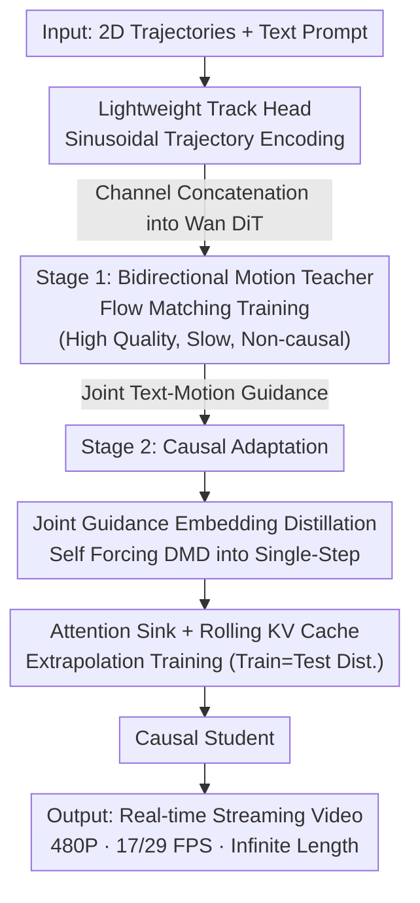

# MotionStream: Real-Time Video Generation with Interactive Motion Controls

**Conference**: ICLR 2026  
**arXiv**: [2511.01266](https://arxiv.org/abs/2511.01266)  
**Code**: None  
**Area**: Video Generation  
**Keywords**: streaming video generation, motion control, causal distillation, attention sink, distribution matching distillation, real-time interaction

## TL;DR
The authors propose MotionStream, the first real-time streaming video generation system with motion control. The method trains a bidirectional motion-controlled teacher with a lightweight track head, then distills it into a causal student via Self Forcing and DMD. By introducing attention sinks and a rolling KV cache, the system achieves a total match between training and inference distributions. It reaches 17 FPS (29 FPS with Tiny VAE) at 480P on a single H100 GPU, supporting infinite-length generation at constant speed.

## Background & Motivation

**Background**: Motion-controlled video generation (e.g., Motion Prompting) has succeeded in generating high-quality trajectory-following videos. However, inference is extremely slow (e.g., 12 minutes for a 5-second video), non-causal (requiring complete control signals beforehand), and limited to finite lengths.

**Limitations of Prior Work**:
- Bidirectional attention in diffusion models requires knowledge of future trajectories, preventing real-time interaction.
- Causal distillation methods like CausVid suffer from severe drift (color shifts and quality degradation) outside the training horizon (>81 frames).
- ControlNet-style architectures double FLOPs, further slowing down inference.
- RoPE positions in sliding window attention grow unbounded, leading to fluctuations in latency and throughput.

**Key Challenge**: Interactive creation requires a "real-time + causal + infinite length" experience, which fundamentally conflicts with the "slow + bidirectional + finite length" paradigm of diffusion models.

**Goal**: Transform motion-controlled video generation from a "render-and-wait" mode to a "real-time creation" mode, where users see immediate results as they draw trajectories.

**Key Insight**: Break through three levels simultaneously: (1) a lightweight teacher architecture to reduce baseline overhead; (2) joint guidance embedding distillation to eliminate multiple NFEs; (3) attention sinks and training-time simulation of inference distributions to eliminate long-video drift.

**Core Idea**: A pipeline consisting of "Efficient Teacher → Causal Distillation → Attention Sink Extrapolation Training" enables real-time, infinite streaming generation of motion-controlled videos.

## Method

### Overall Architecture

MotionStream aims to transform motion-controlled video generation into an immediate experience. Since diffusion models are inherently slow and non-causal, the authors use a two-stage pipeline. **Stage 1** attaches a lightweight track head to Wan DiT to train a high-quality but bidirectional and slow teacher. **Stage 2** performs causal adaptation and distills the teacher into a single-step forward causal student using Self Forcing-style DMD. During distillation, attention sinks and a rolling KV cache are introduced so the context distribution during training exactly matches real-world streaming inference. The final student achieves 17/29 FPS at 480P on a single H100, with generation speed independent of video length.

### Key Designs

**1. Lightweight Track Head and Sinusoidal Encoding: Injecting 2D Trajectories Efficiently**

ControlNet-style branches double FLOPs, which is unacceptable for real-time systems. MotionStream assigns a unique $d$-dimensional sinusoidal position encoding $\phi_n$ to each trajectory as an ID. This encoding is written into spatial locations for each frame: $c_m[t, \lfloor y_t^n/s \rfloor, \lfloor x_t^n/s \rfloor] = v[t,n] \cdot \phi_n$. After 4× temporal compression and a $1\times1\times1$ convolution, this sparse motion map is concatenated with the video latent in the channel dimension. This is 40× faster than RGB-VAE encoding (24.8ms vs 1053ms) and improves tracking accuracy (EPE 6.54 vs 8.57) because sinusoidal encodings provide clearer identity signals than raw pixels.

**2. Joint Text-Motion Guidance Embedding Distillation: Baking Guidance Costs into the Student**

The teacher uses joint guidance to follow both trajectories and text:

$$\hat{v} = v_{\text{base}} + w_t\big(v(c_t,c_m) - v(\emptyset,c_m)\big) + w_m\big(v(c_t,c_m) - v(c_t,\emptyset)\big),$$

where $w_t=3.0$ and $w_m=1.5$. This requires three passes per step. During distillation, the student does not mimic these three passes. Instead, the teacher's joint guidance is defined as the $s_{\text{real}}$ target for DMD, while the student $s_{\text{fake}}$ uses only a single $f_\psi(c_t,c_m)$ pass without CFG. This "bakes" the quality of integrated guidance into a single inference step. Retaining text guidance is vital: pure motion guidance creates rigid 2D translations, whereas text guidance adds natural secondary motions (e.g., a background rainbow appearing as an elephant walks).

**3. Attention Sinks and Rolling KV Cache: Constant Speed and Drift Prevention**

Causal distillation methods typically drift after the training horizon (>81 frames). MotionStream maintains a fixed-size KV cache: $S$ sink chunks (initial frames) and $W$ local window chunks. As new tokens are generated, the window rolls forward while the cache size remains constant. RoPE is assigned based on intra-cache positions rather than absolute time, ensuring constant latency. Critically, the student is trained using **self-rollout with the exact same rolling KV cache and attention sinks**. This aligns the training context distribution with inference and prevents color/content drift. Retaining initial frames as anchors is based on observation (Figure 3) that many heads consistently attend to initial tokens, functioning as global anchors.

### Loss & Training

Teacher Training: Flow matching loss $\mathcal{L}_{\text{FM}} = \mathbb{E}_{z_0,z_1,t}[w_t \| v_\theta(z_{t'},t',c_t,c_m) - (z_1-z_0) \|^2]$ over two stages (OpenVid-1M 4.8K steps → synthetic finetune 800 steps). Causal adaptation: Regression using 4,000 teacher-generated ODE trajectories (2000 steps). Self Forcing DMD: 1:5 generator-to-critic update ratio, 400 steps convergence. Total hardware: 32×A100 for ~3 days (teacher) + 20 hours (distillation).

## Key Experimental Results

### Motion Transfer — Reconstruction Quality

| Method | Backbone | FPS | PSNR↑ | LPIPS↓ | EPE↓ |
|------|----------|-----|-------|--------|------|
| Go-With-The-Flow | CogVideoX-5B | 0.60 | 15.62 | 0.490 | 41.99 |
| Diffusion-As-Shader | CogVideoX-5B | 0.29 | 15.80 | 0.483 | 40.23 |
| ATI | Wan 2.1-14B | 0.23 | 15.33 | 0.473 | 17.41 |
| **MotionStream Teacher** | Wan 2.1-1.3B | 0.79 | **16.61** | **0.427** | **5.35** |
| **MotionStream Causal** | Wan 2.1-1.3B | **16.7** | 16.20 | 0.443 | 7.80 |

### New View Synthesis (LLFF Dataset)

| Method | Resolution | FPS | PSNR↑ | LPIPS↓ |
|------|--------|-----|-------|--------|
| DepthSplat | 576P | 1.40 | 13.9 | 0.30 |
| ViewCrafter | 576P | 0.26 | 14.0 | 0.30 |
| SEVA | 576P | 0.20 | 14.1 | 0.29 |
| **MotionStream Teacher** | 480P | 0.79 | **16.0** | **0.21** |
| **MotionStream Causal** | 480P | **16.7** | 15.7 | 0.23 |

### Ablation Study — Attention Configurations

| Config | LPIPS↓ | EPE↓ | Latency Jitter | Throughput |
|------|--------|------|---------|--------|
| c3s1w1 (Standard) | **0.464** | **25.34** | 0.70±0.01 | 16.92±0.80 |
| c3s0w1 (No sink) | 0.501 | 26.64 | 0.68±0.005 | 17.43±0.88 |
| c1s1w1 (chunk=1) | 0.597 | 76.21 | 0.30±0.01 | 13.26±1.36 |
| Sliding window | 0.480 | 28.09 | 0.80±**0.08** | 14.96±**1.42** |

### Key Findings
- MotionStream Causal is 20-70× faster than baselines while achieving SOTA on DAVIS/Sora motion tracking metrics.
- Outperforms specialized 3D methods (DepthSplat/ViewCrafter/SEVA) in zero-shot camera control (PSNR +1.6, LPIPS -0.07).
- Attention sinks are critical: removing them degrades LPIPS from 0.464 to 0.501 and causes visible color drift in long videos.
- Counter-intuitive finding: larger attention windows can degrade quality because attending to long-past history accumulates errors.
- Sliding window approaches show latency jitter (±0.08s vs ±0.01s) due to unstable computation from unbounded RoPE positions.
- Tiny VAE increases Wan 2.1 FPS from 16.7 to 29.5 with negligible quality loss.

## Highlights & Insights
- **Paradigm shift**: The 2-order-of-magnitude speedup moves motion-controlled video from "rendering" to "interactive creation."
- **Cross-domain Attention Sinks**: The "initial token concentration" observed in LLMs is successfully applied to video diffusion, using initial frames as anchors to prevent drift.
- **Matched Distribution Training**: Unlike methods like TalkingMachines, MotionStream uses the exact inference rolling KV cache during self-rollout, eliminating the train-test mismatch.
- **Guidance Complementarity**: Pure trajectory guidance leads to rigid motion, while joint guidance ($w_t=3.0, w_m=1.5$) ensures both natural movement and precise tracking.

## Limitations & Future Work
- Fixed attention sinks are unsuitable for complete scene cuts; dynamic anchor refreshing is needed.
- Physically impossible trajectories still cause temporal inconsistency or appearance distortion.
- Wan 2.1 (1.3B) is more robust at maintaining structure than larger models like Wan 2.2 (5B).
- Trajectory disappearance: Models struggle to distinguish between occlusion and "no specified control" (both being zero values).

## Related Work & Insights
- **vs Motion Prompting**: Both use 2D trajectories, but Motion Prompting is slow/offline (12min/5s), whereas MotionStream is real-time/causal (29FPS).
- **vs Self Forcing**: MotionStream solves the latency jitter and long-video drift issues found in the original unbounded sliding window framework by using attention sinks.
- **vs TalkingMachines**: MotionStream avoids the temporal discontinuity issues of synchronized denoising by using full causal simulation during training.

## Rating
- Novelty: ⭐⭐⭐⭐⭐ First real-time streaming motion-controlled video system.
- Experimental Thoroughness: ⭐⭐⭐⭐ Broad coverage across motion transfer, camera control, and ablations.
- Writing Quality: ⭐⭐⭐⭐ Clear system design and insightful ablation analysis.
- Value: ⭐⭐⭐⭐⭐ Significant advancement for interactive video creation.

<!-- RELATED:START -->

## Related Papers

- [\[ICLR 2026\] LongLive: Real-time Interactive Long Video Generation](longlive_real-time_interactive_long_video_generation.md)
- [\[ICLR 2026\] Real-Time Motion-Controllable Autoregressive Video Diffusion](real-time_motion-controllable_autoregressive_video_diffusion.md)
- [\[NeurIPS 2025\] Autoregressive Adversarial Post-Training for Real-Time Interactive Video Generation](../../NeurIPS2025/video_generation/autoregressive_adversarial_posttraining_for_realtime_interac.md)
- [\[ICLR 2026\] Rolling Forcing: Autoregressive Long Video Diffusion in Real Time](rolling_forcing_autoregressive_long_video_diffusion_in_real_time.md)
- [\[ICLR 2026\] Streaming Drag-Oriented Interactive Video Manipulation: Drag Anything, Anytime!](streaming_drag-oriented_interactive_video_manipulation_drag_anything_anytime.md)

<!-- RELATED:END -->
