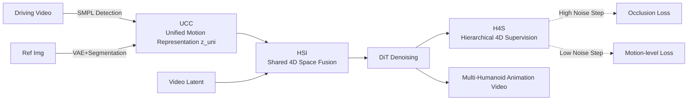

# MotionWeaver: Holistic 4D-Anchored Framework for Multi-Humanoid Image Animation

**Conference**: ICLR 2026  
**OpenReview**: [https://openreview.net/forum?id=KjlLwRsiUE](https://openreview.net/forum?id=KjlLwRsiUE)  
**Code**: TBD  
**Area**: Video Generation / Character Image Animation  
**Keywords**: Multi-Humanoid Animation, 4D Representation, SMPL, Occlusion Modeling, Diffusion Transformer, Motion-Appearance Decoupling  

## TL;DR
MotionWeaver extends character image animation from single-person to multi-humanoid (robots, anthropomorphic animals, game characters) scenes. By "extracting identity-agnostic unified motion representations + fusing motion and video latents in a shared 4D space + hierarchical 4D supervision," it effectively addresses identity confusion and occlusion in multi-character interactions.

## Background & Motivation

**Background**: Character image animation (synthesizing a video of a reference character following a driving pose video) is mature in single-person scenarios, with applications across film, e-commerce, and immersive content. Mainstream approaches have shifted from GANs to diffusion models, utilizing skeleton maps, SMPL renderings, or dense pose as control signals injected into DiTs.

**Limitations of Prior Work**: These methods largely fail in multi-humanoid scenarios due to three root causes summarized by the authors:
- **Impure motion representation**: Skeleton maps and SMPL renderings naturally carry identity-specific information like body proportions and shape, making them difficult to generalize to diverse "humanoids" (robots, animals, avatars). Additionally, control signals for multiple characters are often concatenated into a single image, leading to identity confusion.
- **Lack of explicit 4D modeling**: Existing methods perform naive cross-attention between video latents and control signals without explicitly modeling the spatio-temporal relationships between characters or between characters and the scene. **Crucially, the absence of depth information** leads to failures in handling occlusion and distinguishing between "a small character" and "a character far from the camera."
- **Suboptimal training strategy**: Most methods rely solely on 2D pixel-level MSE loss, lacking explicit supervision for 4D motion. Furthermore, coupling motion and appearance causes the model to become a "naive renderer of control signals" rather than a "generator guided by motion information."

**Key Challenge**: Given only human training data, the model must learn to generalize to various humanoid forms and maintain identity and motion consistency under dense multi-character interaction and frequent occlusion. Fundamentally, **motion must be purified into form-independent universal signals, and the entire pipeline must be rooted in the 4D world**.

**Goal**: To build an end-to-end framework that supports multi-humanoid animation and robustly handles interaction and occlusion.

**Core Idea**: **Unified motion representation + Holistic 4D-anchored paradigm**—motion extraction, motion-latent fusion, and training supervision are all unified and anchored in 4D space, enabling the model to truly "understand" motion dynamics rather than memorizing appearances.

## Method

### Overall Architecture
MotionWeaver is built upon a pre-trained I2V model (Wan2.1-I2V-14B) and consists of three concatenated modules: first, the **Unified-Choreography Core (UCC)** extracts identity-agnostic motion tokens from the driving video and binds them to the corresponding characters to obtain the unified motion representation $z_{uni}$; next, the **Hyper-Scene Integrator (HSI)** fuses $z_{uni}$ and video latents within a shared 4D space (inserted every 4 DiT blocks); finally, **Hierarchical-4D Supervision (H4S)** provides layered supervision for 4D motion across different noise steps. The base model remains frozen throughout, with only group attention and HSI being trained.

### Key Designs

**1. Unified-Choreography Core: Decoupling motion from form and rebinding it to characters.** UCC addresses identity leakage and confusion. First, it **extracts identity-agnostic motion tokens**: a pose detector extracts SMPL parameters from the driving video and converts them to joint coordinates $\chi \in \mathbb{R}^{P\times F\times J\times 3}$, which are then mapped to a **standardized skeleton** $\rho$ (enforcing fixed Euclidean distances between adjacent joints). This eliminates human-specific biases like bone length and body shape, resulting in $\bar\chi$. Finally, a temporally downsampled tokenizer $\Phi_{tok}$ suppresses frame-level noise to produce motion tokens $z_{mo}=\Phi_{tok}(\text{Map}(\chi,\rho))$. Second, it **binds motion to identity**: individual characters are segmented from the reference frame using masks, processed via the base model's VAE and patchified to obtain identity tokens $z_{id}$. A group attention mechanism then associates the two—for each character $p$, motion tokens serve as queries, while identity tokens serve as keys/values: $z_{uni}[p]=\text{GroupAttn}(Q(z_{mo}[p]),K(z_{id}[p]),V(z_{id}[p]))$. This prevents identity mismatch even when characters swap positions.

**2. Hyper-Scene Integrator: Fusion in shared 4D space with dedicated depth handling.** HSI addresses the lack of spatio-temporal modeling and depth in naive cross-attention. It first assigns a 4D global position $\Psi[p,t]\in\mathbb{R}^4$ to each motion-unit $z_{uni}[p,t]$ (using the temporal mean of SMPL translation $(x,y,z)$ combined with latent time $t$). Recognizing that depth $z$ is critical yet difficult to learn from latents, the authors use two complementary mechanisms: (a) **Depth-Aware Attention (DAA)**—the $z$ coordinate is sinusoidally encoded into depth tokens $z_{depth}$, then concatenated with motion tokens and passed through $\text{MLP}_K$ to get z-aware keys, while video latents pass through $\text{MLP}_Q$ to get z-aware queries. This is supervised by an occlusion loss to ensure correct depth ordering and visibility. (b) **Dynamic C-RoPE** (Cross-Attention Shared RoPE)—the rotation matrix is divided across $(t,x,y)$ axes as $\tilde{R}^d_{\Theta,t,x,y}=\text{diag}(R^{d/3}_{\Theta,t},R^{d/3}_{\Theta,x},R^{d/3}_{\Theta,y})$. Keys dynamically select rotation matrices based on the motion-unit's global position $\Psi$, while queries rotate based on their pixel positions (with $(x,y)$ projected from camera space to the pixel perspective plane for alignment), allowing the model to capture relative spatio-temporal relationships between characters and the scene.

**3. Occlusion Loss: Training depth attention as an "order arbiter."** This is the key supervision for DAA to learn depth. Character-specific attention maps $h_p$ are derived by summing the attention score matrix $H$ along the $T$ and $J$ dimensions for the $p$-th character. A ground-truth mask $m_p$ is then constructed where, in overlapping regions, **the mask of the character with greater depth is forced to zero**, explicitly encoding occlusion relationships. Optimization follows $L_{OCC}=\frac{1}{TP}\sum_i \text{MSE}(h_i,m_i)$, forcing the model to learn foreground-background occlusion.

**4. Hierarchical-4D Supervision: Switching supervision targets by noise step.** H4S designs dynamic losses following the diffusion property of "global layout first, fine details later": $L_{H4S}=L_{MSE}+\lambda_1 L_{OCC}$ (when $t\ge\alpha T$, high noise steps) and $L_{H4S}=L_{MSE}+\lambda_2 L_{MO}$ (when $t<\alpha T$, low noise steps). The high-noise stage uses occlusion loss to establish correct relationships early in denoising, while the low-noise stage switches to **motion-level loss** $L_{MO}$. At this point, the denoised latents are nearly accurate; after VAE decoding, motion features are extracted via a pre-trained 4D pose detector and aligned with ground truth via MSE, injecting strong 4D motion priors into the HSI. Trainable timestep-conditioned AdaLN + gating are used to modulate the HSI and enhance temporal sensitivity. Parameters are set at $\alpha=0.6,\lambda_1=\lambda_2=1$.

The authors developed two datasets for this setup: **MultiHuman46** (46 hours of multi-human interaction video including boxing, fencing, and dancing, filtered for SMPL accuracy) for training, and **DualDynamics** (300 professional double-humanoid interaction videos) for multi-humanoid benchmarking.

## Key Experimental Results

### Main Results (DualDynamics Benchmark, Dual-Humanoid)

| Method | FVD↓ | FID-VID↓ | FID↓ | L1↓ | PSNR↑ | SSIM↑ | LPIPS↓ | CLIP↑ |
|---|---|---|---|---|---|---|---|---|
| MimicMotion | 312.4 | 74.23 | 71.72 | 0.6098 | 26.04 | 0.5165 | 0.4319 | 0.7842 |
| MusePose | 298.3 | 59.14 | 60.46 | 0.5741 | 28.12 | 0.5301 | 0.3416 | 0.8109 |
| StableAnimator | 262.5 | 35.19 | 34.97 | 0.5261 | 27.11 | 0.5341 | 0.3721 | 0.7741 |
| Animate-X | 230.1 | 32.47 | 30.22 | 0.5361 | 28.15 | 0.5276 | 0.3780 | 0.8539 |
| HumanVid | 174.6 | 29.12 | 31.58 | 0.5122 | 27.03 | 0.4576 | 0.4197 | 0.8214 |
| UniAnimate-DiT | 172.3 | 24.98 | 22.87 | 0.5743 | 29.11 | 0.5399 | 0.3482 | 0.8601 |
| RealisDance-DiT | 164.6 | 22.12 | 23.26 | 0.5341 | 29.06 | 0.5216 | 0.3271 | 0.8813 |
| **Ours** | **145.7** | **20.34** | **19.41** | **0.4836** | **29.19** | **0.5428** | **0.3213** | **0.9041** |

Ours leads across nine metrics, with FVD dropping from a second-best 164.6 to 145.7, and CLIP rising from 0.8813 to 0.9041.

### Ablation Study (DualDynamics)

| Method | FVD↓ | FID-VID↓ | FID↓ | L1↓ | PSNR↑ | SSIM↑ | CLIP↑ |
|---|---|---|---|---|---|---|---|
| w/o MNP (Motion Normalization) | 198.5 | 27.28 | 25.29 | 0.5524 | 26.34 | 0.519 | 0.7801 |
| w/o GAM (Group Attention) | 183.2 | 25.76 | 24.45 | 0.5343 | 27.98 | 0.537 | 0.8941 |
| w/o DAA (Depth-Aware Attention) | 167.1 | 21.80 | 22.03 | 0.5252 | 28.64 | 0.522 | 0.8921 |
| w/o DCR (Dynamic C-RoPE) | 225.6 | 27.31 | 25.29 | 0.5541 | 26.28 | 0.511 | 0.8270 |
| w/o H4S (Hierarchical Supervision) | 174.3 | 24.22 | 21.46 | 0.5011 | 29.04 | 0.524 | 0.8714 |
| **Ours** | **145.7** | **20.34** | **19.41** | **0.4836** | **29.19** | **0.5428** | **0.9041** |

### Key Findings
- **Dynamic C-RoPE (DCR) is most critical**: Removing it leads to the worst FVD (225.6) with unstable training, highlighting that explicit $(t,x,y)$ positional encoding is the foundation of 4D fusion.
- **Motion Normalization (MNP) is secondary in importance**: Removal results in an FVD of 198.5 and unrealistic limbs when character morphology deviates from the motion source, confirming the role of standardized skeletons in cross-form generalization.
- **GAM handles identity**: Its removal leads to motion-character mismatch when multiple characters swap positions.
- **DAA + Occlusion loss handles occlusion**: Removal leads to failure in processing inter-character occlusion.
- **Scalability**: Although trained only on dual-human data, the model generalizes to >2 characters during inference, validating the universality of the 4D-anchored paradigm.

## Highlights & Insights
- **"Holistic 4D Anchoring" is a consistent methodology**: Rather than merely adding a temporary depth loss, the framework anchors motion extraction (standardized skeleton tokens), fusion (shared 4D space + C-RoPE + DAA), and supervision (occlusion + motion-level loss) in 4D, creating a cohesive logic.
- **Clever occlusion loss construction**: Aligning attention score maps directly with "distant indices set to zero" masks turns "who blocks whom" into a supervisable signal, which is more direct than simply stacking depth maps.
- **Noise-scheduled supervision**: Switching supervision goals based on diffusion noise steps (global occlusion first, fine motion later) aligns with the diffusion prior, serving as a valuable training trick.
- **Standardized skeletons decouple motion from form**: Eliminating body shape via fixed joint spacing is key to allowing robots, animals, and avatars to share the same motion representation.

## Limitations & Future Work
- **Strong dependence on SMPL and multi-person pose detectors**: The entire pipeline relies on SMPL parameters and masks estimated by CoMotion; pose detection errors in extreme occlusion or rare forms directly propagate to the generation.
- **Humanoid topology constraints**: The standardized skeleton is based on a 24-joint SMPL model; generalization to non-humanoid topologies (e.g., multipedal, non-human skeletons) remains unverified.
- **Benchmark novelty**: DualDynamics is a self-collected benchmark with 300 videos limited to dual-humanoid scenarios; quantitative comparisons across other benchmarks or with >2 characters are not yet exhaustive.
- **High training cost**: Requires 8×H100 GPUs and a multi-stage training process (4D tokenizer first, then HSI), creating a high barrier to reproduction.

## Related Work & Insights
- **3D/4D Control Route**: MTVCrafter uses 3D motion data for lossless control, but static RoPE and naive fusion fail to resolve position swaps and occlusion; this work responds directly with dynamic C-RoPE and depth-aware attention.
- **Multi-Character Animation Route**: DanceTogether and Structural Video Diffusion also target multi-person scenes but rely heavily on precise human masks and strict alignment between reference and driving poses; the unified motion representation in this work is more generalizable.
- **Insight**: Explicitly encoding "position/depth" as first-class citizens into attention (rather than stuffing them into control images) and applying structured supervision based on noise steps is a concept transferable to other tasks requiring multi-entity spatio-temporal consistency.

## Rating
- **Novelty**: ⭐⭐⭐⭐ Systematically pulls multi-humanoid image animation into a 4D perspective. The combination of unified motion representation, shared 4D space, and hierarchical 4D supervision is tightly integrated, with original contributions in occlusion loss and dynamic C-RoPE.
- **Experimental Thoroughness**: ⭐⭐⭐⭐ Comprehensive lead across nine metrics and five ablation components; generalizes to >2 characters. Points deducted for reliance on a single self-collected benchmark and limited quantitative multi-character comparisons.
- **Writing Quality**: ⭐⭐⭐⭐ Clear logic from pain points to motivation and method; well-categorized results with complete formulas and diagrams.
- **Value**: ⭐⭐⭐⭐ Fills a gap in multi-humanoid animation. The MultiHuman46 dataset and DualDynamics benchmark provide actual value to the community, and the methodology is highly transferable.

<!-- RELATED:START -->

- **UniAnimate**: [https://arxiv.org/abs/2406.01188](https://arxiv.org/abs/2406.01188) (UniAnimate-DiT baseline)
- **MimicMotion**: [https://arxiv.org/abs/2406.19680](https://arxiv.org/abs/2406.19680) (Single-person SOTA)
- **Wan2.1**: [https://github.com/Wan-Video/Wan2.1](https://github.com/Wan-Video/Wan2.1) (Base model)

<!-- RELATED:END -->

## Related Papers

- [\[ICLR 2026\] MTVCraft: Tokenizing 4D Motion for Arbitrary Character Animation](mtvcraft_tokenizing_4d_motion_for_arbitrary_character_animation.md)
- [\[CVPR 2026\] STAGE: Storyboard-Anchored Generation for Cinematic Multi-shot Narrative](../../CVPR2026/video_generation/stage_storyboard-anchored_generation_for_cinematic_multi-shot_narrative.md)
- [\[ICCV 2025\] Multi-identity Human Image Animation with Structural Video Diffusion](../../ICCV2025/video_generation/multi-identity_human_image_animation_with_structural_video_diffusion.md)
- [\[CVPR 2026\] MultiAnimate: Pose-Guided Image Animation Made Extensible](../../CVPR2026/video_generation/multianimate_pose-guided_image_animation_made_extensible.md)
- [\[CVPR 2026\] HoloCine: Holistic Generation of Cinematic Multi-Shot Long Video Narratives](../../CVPR2026/video_generation/holocine_holistic_generation_of_cinematic_multi-shot_long_video_narratives.md)

<!-- RELATED:END -->
