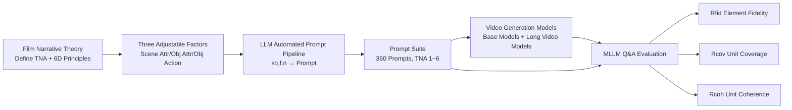

# NarrLV: Towards a Comprehensive Narrative-Centric Evaluation for Long Video Generation

**Conference**: ICLR 2026  
**OpenReview**: [https://openreview.net/forum?id=Qh3CQBTB1g](https://openreview.net/forum?id=Qh3CQBTB1g)  
**Project Page**: [https://amap-ml.github.io/NarrLV-Website/](https://amap-ml.github.io/NarrLV-Website/)  
**Area**: Video Generation / Evaluation Benchmark  
**Keywords**: Long Video Generation, Narrative Evaluation, Benchmark, Temporal Narrative Atom (TNA), MLLM Q&A Evaluation  

## TL;DR
NarrLV introduces "Temporal Narrative Atoms (TNA)" as the fundamental unit for quantifying narrative richness. It features a prompt suite with an arbitrarily extendable number of TNAs and a three-stage progressive evaluation metric based on MLLM Q&A. This work systematically measures the "storytelling" capability of long video generation models for the first time, revealing that current models can only reliably express approximately 2 narrative units.

## Background & Motivation

**Background**: Base video generation models (e.g., Wan, HunyuanVideo, CogVideoX) are limited by computational constraints to producing short videos. Consequently, several long video generation models (e.g., FreeNoise, Presto, RIFLEx, FreeLong) have emerged, extending duration and expressing narratives that evolve over time through denoising module modifications and segmented text injection. The community has increasingly realized that the goal of long video generation is not just "longer" duration, but **accurate expression of richer narrative content** within longer spans.

**Limitations of Prior Work**: Evaluation lags significantly behind model development. Early approaches relied on general metrics like FID/FVD/CLIP-SIM, which are disconnected from human judgment. Subsequent benchmarks such as VBench, TC-Bench, and StoryEval, while offering more dimensions, feature prompts with simple narratives—the number of TNAs is concentrated in a very narrow low-value range (mostly 1 for VBench, 2 for TC-Bench, and 2–4 for StoryEval). Consequently, long video models are forced to be evaluated on VBench (designed for short videos), failing to expose their true narrative expression boundaries.

**Key Challenge**: Long video generation pursues "narrative richness," which is an abstract capability. Existing benchmarks lack both a unified unit for quantifying narrative richness and a flexible prompt/evaluation protocol that can scale with narrative complexity.

**Goal**: To construct NarrLV, the first benchmark specifically for evaluating **narrative expression capability** in long video generation. It aims to provide prompts that can be arbitrarily extended according to narrative richness, ensure evaluation metrics align highly with human preferences, and characterize the performance boundaries of current models.

**Core Idea**: **[Quantifying the smallest unit of narrative]** Drawing from the concept of a "Beat" in film narratology, the "smallest narrative unit maintaining continuous visual presentation" is defined as a Temporal Narrative Atom (TNA). The number of TNAs directly measures narrative richness. **[Anchoring adjustable factors from theory]** Based on the 6D principles of film narrative, three adjustable factors (Scene attributes, Object attributes, and Object actions) that influence the number of TNAs are identified. **[Progressive MLLM Q&A Evaluation]** Narrative expression is decomposed into three progressive levels: "Element Fidelity → Unit Coverage → Unit Coherence," calculated via an MLLM Q&A framework.

## Method

### Overall Architecture

NarrLV consists of three linked components: first, defining TNA and identifying three adjustable factors based on film narrative theory; second, building an LLM-driven automated prompt generation pipeline to produce a suite of prompts with flexibly extendable TNA counts; and finally, utilizing an MLLM Q&A framework to score generated videos across three progressive dimensions—Element Fidelity, Unit Coverage, and Unit Coherence—while validating alignment with human preferences.

### Key Designs

**1. Temporal Narrative Atoms (TNA) and Three Adjustable Factors: Quantifying "Narrative Richness" into Countable Units.** Narrative richness is inherently abstract. This paper borrows the "Beat" concept from film narratology to define the "smallest narrative unit under continuous visual presentation" as a TNA. More TNAs imply richer narratives (e.g., "teacher walks on stage → writes on board → explains → erases → leaves stage" contains 5 TNAs). To determine what dictates the number of TNAs, the authors apply the 6D principles of film narrative (Total frames, Temporal continuity, Spatial continuity, Scene, Action, Object). In a video generation context, total frames are determined by the model's inherent duration, and spatio-temporal continuity is strictly maintained by training data (excluding discontinuous samples like cuts). Thus, only three factors remain adjustable: Scene, Object, and Action, formalized as a factor set $F = [s_{att}, t_{att}, t_{act}]$ (Scene attributes, Object attributes, Object actions). This step transforms the vague question of "can it tell a story" into "how many TNAs can it express," providing a unified scale for prompt expansion and metric design.

**2. Scalable TNA-driven Prompt Suite: Automatically Generating Controllable Narrative Test Sets.** To avoid the high cost of manual design, the authors built an automated pipeline using LLMs. They randomly sampled 100,000 text entries each from the user-oriented dataset VideoUFO-1M and the narrative-rich dataset DropletVideo-1M. Qwen2.5-32B was used to extract scene $s$ and primary object lists $o$ for each entry, merging object lists within the same scene to form Scene-Object pairs $SO$. During generation, an instance $so$ is selected, 1–2 objects are sampled, and given a TNA count $n$ and variation factor $f$, GPT-4o completes the evolution of attributes/actions to produce the prompt:
$$(so, f, n) \xrightarrow{\text{LLM}} p_{f,n}, \quad so \in SO,\ f \in F,\ n \in [1, N_{tna}]$$
In the post-processing phase, $SO$ is categorized into 14 major classes. For each factor-quantity combination, 1–3 $so$ instances are selected from each class, resulting in 20 prompts per group. With $N_{tna}=6$ and 3 factors, a total of $20\times 6\times 3 = 360$ evaluation prompts are obtained. This pipeline is naturally scalable—evaluating longer videos in the future simply requires increasing $N_{tna}$ and rerunning it.

**3. Progressive Three-Stage Evaluation Metric + Five-Vote Denoising: Reliably Quantifying Narratives via MLLM Q&A.** The evaluation progresses from "basic elements → narrative units they form." For each prompt $p_{f,n}$, the model generates video $v$, an LLM generates dimension-specific question sets $Q$ based on semantics, and an MLLM provides answers $A$, which are mapped to results $R$: $(p_{f,n})\xrightarrow{m}v,\ (p_{f,n})\xrightarrow{\text{LLM}}Q,\ (Q,v)\xrightarrow{\text{MLLM}}A\to R$. The three dimensions are: **Narrative Element Fidelity** $R_{fid}$, which uses binary judgment questions for elements like scene categories/attributes, object categories/attributes/actions, and initial layouts; **Narrative Unit Coverage** $R_{cov}$, which asks whether each TNA "appears," with the number of questions growing with $n$; **Narrative Unit Coherence** $R_{coh}$, which asks if a "transition exists" between adjacent TNA pairs. To address the instability of MLLM answers for uncertain questions, the MLLM answers the same $(Q,v)$ five times, and the proportion is used as the score for a single question:
$$r^k_{fid} = \frac{1}{5}\sum_{t=1}^{5}\delta(a^{k,t}_{fid}, a^k_{pos}), \quad R_{fid} = \frac{1}{N_{fid}}\sum_{k=1}^{N_{fid}} r^k_{fid}$$
For coherence, a TNA existence ratio $\rho_{tna}$ is introduced as a prerequisite constraint (a transition can only exist if the TNAs exist):
$$\rho_{tna} = \frac{1}{N_{cov}}\sum_{k=1}^{N_{cov}}\Theta(r^k_{cov}-\tau_{cov}), \quad R_{coh} = \frac{1}{2}(R'_{coh}+\rho_{tna})$$
where $\tau_{cov}=0.3$. This progressive Q&A design is better at pinpointing specific model weaknesses across narrative levels compared to "one-shot holistic scoring."

## Key Experimental Results

### Main Results

Dimension scores for various models under three variation factors (Excerpts from Table 1, higher is better):

| Model | Rfid(satt/tatt/tact) | Rcov(satt/tatt/tact) | Rcoh(satt/tatt/tact) |
|------|------|------|------|
| Wan (Base) | 74.9/77.8/82.5 | 68.8/72.7/70.3 | 50.1/52.4/54.5 |
| HunyuanVideo | 74.4/77.2/76.9 | 64.3/64.6/57.9 | 44.7/44.2/40.8 |
| CogVideoX | 67.3/69.9/69.1 | 62.9/60.2/58.6 | 44.5/38.9/43.1 |
| RIFLEx (Long) | 59.6/62.4/67.8 | 56.1/59.4/52.7 | 39.2/39.9/39.2 |
| FreeNoise | 77.6/71.5/74.5 | 58.5/63.0/51.2 | 40.7/43.1/34.4 |
| TALC | 38.0/37.1/40.4 | 31.0/33.0/31.6 | 21.9/23.4/21.7 |
| Mean | 67.9/67.6/71.4 | 57.4/60.3/53.7 | 39.6/40.7/37.9 |

Alignment accuracy with human judgment (Table 2, Consist-n/3 refers to subsets where n out of 3 annotators agree):

| Metric | Consist-2/3 (Rfid/Rcov/Rcoh) | Consist-3/3 (Rfid/Rcov/Rcoh) |
|------|------|------|
| VBench-2.0 | 0.33/0.32/0.28 | 0.31/0.27/0.29 |
| StoryEval | 0.41/0.51/0.51 | 0.55/0.55/0.56 |
| **Ours** | **0.63/0.67/0.67** | **0.81/0.80/0.79** |

### Ablation Study

Impact of MLLM repetition count and capacity on alignment accuracy (Table 3):

| # | Variant | Consist-2/3 (Rfid/Rcov/Rcoh) | Consist-3/3 (Rfid/Rcov/Rcoh) |
|---|------|------|------|
| 1 | Baseline (5 votes) | 0.63/0.67/0.67 | 0.81/0.80/0.79 |
| 2 | 1 vote | 0.61/0.63/0.64 | 0.81/0.77/0.78 |
| 3 | 3 votes | 0.62/0.66/0.67 | 0.81/0.78/0.80 |
| 4 | 32B MLLM | 0.65/0.63/0.64 | 0.78/0.72/0.75 |

Accuracy increases as the vote count moves from 1→3→5 and tends toward convergence, justifying the choice of 5. Replacing the 72B MLLM with a 32B model significantly degrades coverage/coherence accuracy.

### Key Findings
- **Narrative richness inversely correlates with unit expression, while basic elements remain unaffected**: As TNA count increases, $R_{cov}$ and $R_{coh}$ drop significantly, whereas $R_{fid}$ only fluctuates slightly—models capture key elements but struggle to organize them into time-evolving narratives.
- **Current models can only reliably express a minimal number of narrative units**: Defining $N_{exp}=R_{cov}\times n$ as the number of effectively expressed TNAs, $N_{exp}$ grows very slowly as prompt TNAs increase, widening the gap from the upper bound. Practically, it is suggested that prompt TNA counts should not exceed 2.
- **Base models dictate the narrative ceiling for long video models**: FIFO-Diffusion, FreeLong, FreePCA, and FreeNoise all derive from VideoCraft; they outperform VideoCraft in $R_{cov}$ and $R_{coh}$ (proving long video modules work), but differences between them are marginal, indicating narrative capability is primarily determined by the base model. Furthermore, these long video models are generally weaker than the latest base models.
- **The "Action" factor is the most difficult to vary**: Models show the highest element fidelity for initial object actions $t_{act}$, yet perform worst on $t_{act}$ regarding narrative units (coverage/coherence)—they excel at generating a single action but struggle with diverse action evolution.

## Highlights & Insights
- **Film narratology provides a computable definition for "storytelling" capability**: The TNA + 6D principles condense abstract narrative richness into three adjustable factors and a countable unit. This offers a solid theoretical anchor and a unified language for prompt expansion and metric design.
- **Precision of progressive three-stage metrics**: Layered assessment of fidelity, coverage, and coherence clearly distinguishes "element generation" from "narrative organization." This decomposition allowed the discovery of the "stable elements, broken units" pattern.
- **Pragmatic handling of MLLM uncertainty**: The five-vote proportional scoring and TNA existence constraints for coherence effectively improve human alignment (reaching 0.79–0.81 for Consist-3/3, far exceeding VBench-2.0 and StoryEval).
- **High scalability**: The prompt pipeline only requires increasing $N_{tna}$ to evaluate longer videos, ensuring the benchmark does not become obsolete as models advance.

## Limitations & Future Work
- **TNA upper bound currently set at 6**: While claims of scalability are made, the paper does not validate model performance or metric stability at higher TNA counts (e.g., 10+); evaluation of ultra-long narratives remains to be explored.
- **Heavy dependency on closed-source/large models**: Prompt generation uses GPT-4o, and evaluation uses Qwen2.5-VL-72B. Ablation shows that smaller models lead to performance drops, affecting reproduction costs and evaluation consistency due to MLLM capability fluctuations.
- **Focus on T2V in continuous spatio-temporal settings**: The work explicitly excludes spatio-temporal discontinuities like camera cuts, meaning it does not yet cover "cinema-grade" narratives involving transitions and editing.
- **Subjectivity in TNA partitioning and factor assumptions**: Simplifying adjustable factors into scene/object/action is an engineering trade-off that may omit higher-order narrative dimensions like emotion or cinematography.

## Related Work & Insights
- **Long Video Generation Models** (FreeNoise, Presto, Mask2DiT, RIFLEx, FreeLong) mostly add segmented text interaction or adjust positional embeddings on short video bases. This work fills the missing gap in narrative evaluation for these models.
- **Video Generation Benchmarks** (VBench, DEVIL, TC-Bench, VMBench, StoryEval, VBench-2.0) focus on quality, dynamics, temporal composition, motion, or event-level stories, but their prompt TNA distributions are narrow. NarrLV addresses the "rich narrative + scalability" gap.
- **MLLM Q&A-style Evaluation** (inspired by TIFA, Davidsonian approaches) informed the scalable evaluation paradigm of "question generation → video answering" used here, which is instructive for interpretable evaluation in image/video generation.

## Rating
- Novelty: ⭐⭐⭐⭐ The first benchmark targeting "narrative expression" for long videos; TNA unit and progressive metrics are theoretically grounded and highly original.
- Experimental Thoroughness: ⭐⭐⭐⭐ Covers 6 long video + 5 base models, 360 prompts, and 600 pairs of human annotations. Main experiments, ablations, and alignment analyses are comprehensive, though ultra-long TNAs and more modal factors lack verification.
- Writing Quality: ⭐⭐⭐⭐ Clear logic from theory to pipeline and metrics. Well-supported by figures (TNA distribution, 3D results, word clouds, feature distances).
- Value: ⭐⭐⭐⭐ Provides a quantifiable, scalable, and human-aligned narrative evaluation tool for long video generation, offering actionable conclusions like "TNA≤2," which is valuable for both model R&D and evaluation.

<!-- RELATED:START -->

## Related Papers

- [\[ICLR 2026\] VideoPhy-2: A Challenging Action-Centric Physical Commonsense Evaluation in Video Generation](videophy-2_a_challenging_action-centric_physical_commonsense_evaluation_in_video.md)
- [\[ICML 2026\] V2V-Bench: A Comprehensive Benchmark for Video-to-Video Generation Evaluation](../../ICML2026/video_generation/v2v-bench_a_comprehensive_benchmark_for_video-to-video_generation_evaluation.md)
- [\[ICLR 2026\] Mixture of Contexts for Long Video Generation](mixture_of_contexts_for_long_video_generation.md)
- [\[ICLR 2026\] DrivingGen: A Comprehensive Benchmark for Generative Video World Models in Autonomous Driving](drivinggen_a_comprehensive_benchmark_for_generative_video_world_models_in_autono.md)
- [\[ICLR 2026\] LongLive: Real-time Interactive Long Video Generation](longlive_real-time_interactive_long_video_generation.md)

<!-- RELATED:END -->
