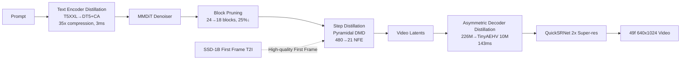

# Neodragon: Mobile Video Generation Using Diffusion Transformer

**Conference**: ICLR 2026  
**OpenReview**: [https://openreview.net/forum?id=XBzIhhwv8d](https://openreview.net/forum?id=XBzIhhwv8d)  
**Project Page**: [https://qualcomm-ai-research.github.io/neodragon](https://qualcomm-ai-research.github.io/neodragon)  
**Code**: To be confirmed  
**Area**: Video Generation / Efficient On-device Inference  
**Keywords**: Video Diffusion Model, Diffusion Transformer, On-device Deployment, Distillation, Block Pruning, Step Distillation, DMD  

## TL;DR
Neodragon compresses a video DiT (based on Pyramidal-Flow) into the Qualcomm Hexagon NPU of smartphones/laptops through four major operations: text encoder distillation, asymmetric decoder distillation, MMDiT block pruning, and step distillation extended to pyramidal flow matching (DMD). It generates 49 frames of $640 \times 1024$ video in ~6.7 seconds, achieving a VBench total score of 81.61 and setting a new SOTA for on-device video generation.

## Background & Motivation
- **Background**: Diffusion-based Video Diffusion Models (VDMs) have replaced GANs as the mainstream, shifting from space-time UNet to DiT due to better scalability, temporal consistency, and image quality. However, leading open-source VDMs require massive computation and depend on cloud inference.
- **Limitations of Prior Work**: Cloud inference introduces latency, privacy, and cost issues, which are unfriendly to creators in low-bandwidth or resource-constrained regions. Moving video generation to the device can truly "democratize" this capability, but mobile compute, memory, bandwidth, and power budgets are extremely tight.
- **Key Challenge**: There is a massive gap between the memory/compute overhead of video DiT and mobile NPU budgets—for example, the T5 XXL text encoder (4.726B parameters) exceeds mobile memory; the native VAE decoder, while not huge in parameters (226M), requires caching massive 4D feature maps that exceed NPU capacity; initial end-to-end latency was as high as ~184 seconds.
- **Goal**: Systematically compress model and runtime complexity to a level manageable by mobile NPUs without significantly sacrificing image quality, achieving truly usable on-device text-to-video generation.
- **Core Idea**: **[Decompose on-device deployment into four independent "bottleneck operations," each formulated as a distillation/pruning problem]**—instead of redesigning the model, four major latency sources (text encoder, decoder, denoising backbone size, and denoising steps) are addressed individually using Pyramidal-Flow as the baseline.

## Method

### Overall Architecture
Neodragon uses Pyramidal-Flow (a pyramidal, causal video DiT with a 24-block MMDiT denoiser initialized from SD3.5) as the baseline. Four compression operations are applied sequentially based on the order of latency bottlenecks, ensuring the generation latent space remains intact, eventually integrating into an end-to-end pipeline.

### Key Designs

**1. Text Encoder Distillation: Compressing T5 XXL into DT5+ContextAdapter using prompts.** The authors questioned whether high-quality video generation truly requires the full capacity of T5 XXL, as short descriptive prompts have shallow semantic needs. Instead of aligning raw T5 XXL embeddings (found unstable in experiments), they used the ContextEmbedder (CE, a linear layer) in the MMDiT denoiser as a frozen ground-truth reference. They introduced a learnable 4-layer MLP with residual connections—ContextAdapter (CA)—to align multimodal tokens produced by a smaller DT5 via CA with tokens produced by $\mathrm{CE}(\mathrm{T5XXL}(\text{prompt}))$. The loss combines MSE and cosine distance: $L_{distil}(t,\hat t)=w_{mse}\lVert t-\hat t\rVert_2^2+w_{cd}(1-\frac{t\cdot\hat t}{|t||\hat t|})$ where $t=\mathrm{CE}(\mathrm{T5XXL}(\text{prompt}))$ and $\hat t=\mathrm{CA}(\mathrm{DT5}(\text{prompt}))$, with $w_{mse}=1.0,w_{cd}=0.1$. The framework supports [RM] replacement, [EM] expansion, [TDT5] trainable DT5, and [LORA] modes. It is trained entirely on ~1.4M text prompts **without any image or video data**. Ultimately, [RM] was adopted: compressing 4.762B T5 XXL to 0.130B DT5 (35× compression), with VBench total score only dropping from 80.31 to 79.64, while on-device latency is only 3ms.

**2. Asymmetric Decoder Distillation: Freezing the encoder and replacing the decoder with alignment.** Although the decoder is lightweight, its 4D feature map cache exceeds NPU capacity. The authors treated this as a distillation problem, assuming "compressed video latent spaces learned by different VDMs are universal and transferable at low cost." The framework has three steps: introduce asymmetry by keeping the original encoder latents $z=E_{enc}(x)$ but replacing the original decoder with another model's decoder $F_{dec}$ to reconstruct $\hat x=F_{dec}(z)$; minimally add/remove blocks to align the new decoder's compression ratio to the fixed [8×8×8]; finally, fine-tune end-to-end using MSE+LPIPS reconstruction loss $L(x,\hat x)$, keeping the encoder frozen to maintain the latent space required by MMDiT (also saving KL regularization). PSNR on DAVIS generally exceeded 29dB across decoder variants, verifying latent space universality. TinyAEHV (10M, 226M→10M, 20× compression) was selected for deployment, bringing decoder latency down to 143ms.

**3. MMDiT Block Pruning: Multimodal importance scoring and two-stage curriculum fine-tuning.** After achieving initial execution, MMDiT denoising accounted for nearly all of the 184s latency. Two reductions were made: first, model size. Borrowing from SANA-1.5 but adapted for MMDiT's multimodal nature, importance for the $k$-th block is calculated separately for visual and text tokens as the cosine distance between input/output tokens $BI_k^v=1-\mathbb E[\frac{z_k\cdot z_{k+1}}{\lVert z_k\rVert\lVert z_{k+1}\rVert}]$ and $BI_k^t$, probed using 100 calibration prompts × 5 samples. Since visual and text importance are uncorrelated, visual judgment ("block removal vs. image quality") was also used. Two-stage fine-tuning followed: **Stage-1** uses ~350K data with the original flow matching objective (converging in ~300 steps); **Stage-2** introduces Full Teacher feature matching (visual token MSE + text token cosine distance + dual flow matching supervision from teacher/GT, 60k steps). A key finding is that Stage-2 must follow Stage-1 as curriculum training; direct training or annealed weighting failed. Ultimately, 18 blocks (25% pruned) achieved VBench 80.21, only 0.1 lower than the 24-block baseline, while reducing per-step denoising from 1.15s to 0.74s.

**4. Pyramidal DMD Step Distillation: Extending DMD to pyramidal flow matching, 480→21 NFE.** After sizing down, steps were reduced. Pyramidal-Flow decomposes probability flow into $S$ stages, where the $i$-th stage operates at $2^i$ downsampled resolution with noise levels $(\sigma^i_{start},\sigma^i_{end})$, aiming for $L_{pyr\text{-}FM}=\sum_{i=0}^{S-1}L^i_{FM}$. Authors extended DMD to this objective: a student $D_\theta$ predicts clean latents via single-step Euler $\tilde z_\theta=\tilde z_\sigma-\frac{\sigma}{\sigma^i_{start}-\sigma^i_{end}}D_\theta(\tilde z_\sigma,\sigma)$; a "fake score model" $D_\phi$ is trained on the student distribution; the student updates via DMD gradient $\nabla_\theta L^i_{DMD}\propto(D(\tilde z_\tau,\tau)-D_\phi(\tilde z_\tau,\tau))\cdot\nabla_\theta\tilde z_\theta$ with higher weights for samples estimated more accurately by the teacher, plus a Cauchy loss $L_{teacher}=\log(1+\lVert\tilde z_\theta-\mathrm{Down}(z,2^i)\rVert_2^2)$. Students and fake models alternate updates at 1:2. In a 4-4-4 configuration, Pyramidal DMD achieved VBench 80.37, cutting 480 NFE to 84 (finally 21 NFE in 1-1-1 config), reducing denoising latency to 20.72s.

## Key Experimental Results

### Main Results (VBench, [49×320×512], selected comparisons)

| Platform | Model | Total↑ | Quality↑ | Semantic↑ |
|---|---|---|---|---|
| Server | Wan2.1 1.3B | 83.31 | 85.23 | 75.65 |
| Server | CogVideoX 5B | 81.91 | 83.05 | 77.33 |
| Server | Pyramidal-Flow | 81.72 | 84.74 | 69.62 |
| On-device | Pyramidal-Flow† (Reported) | 80.31 | 83.68 | 66.81 |
| On-device | Snap Mobile Video DiT | 81.45 | 83.12 | 74.76 |
| On-device | Hummingbird 16f | 81.35 | 83.73 | 71.84 |
| On-device | SnapGenV | 81.14 | 83.47 | 71.84 |
| **On-device** | **(Ours) Neodragon E2E** | **81.61** | **83.68** | **73.36** |

> Neodragon achieved the highest VBench total score among on-device solutions, even surpassing its own cloud baseline Pyramidal-Flow† (80.31).

### Ablation Study (Impact of operations)

| Operation | Configuration | Param/NFE | Latency | VBench Total |
|---|---|---|---|---|
| Text Encoder | T5 XXL Baseline | 4.732B | — | 80.31 |
| Text Encoder | DT5+CA [RM] | 0.260B (35×↓) | 3ms | 79.64 |
| Decoder | PF Native | 226M | 2.496s(GPU) | 80.31 |
| Decoder | TinyAEHV (Ours) | 10M (20×↓) | 143ms(NPU) | 80.25 |
| Block Pruning | 24 Blocks Original | 2.028B | 1.15s | 80.31 |
| Block Pruning | 18 Blocks Stage-2 | 1.518B (25%↓) | 0.74s | 80.21 |
| Step Distill | PF Native 4-4-4 | 480 NFE | 118.4s | 80.31 |
| Step Distill | Pyramidal DMD 4-4-4| 84 NFE | 20.72s | 80.37 |

### Key Findings
- **Latency Trajectory**: End-to-end latency dropped from ~184.2s initially → (Block Pruning) 118.6s → (Step Distillation) 25.96s → (First Frame T2I + SR) final **6.7s**.
- **First Frame Strategy for Semantics**: Pyramidal DMD at extreme low steps (1-1-1) introduces saturation and semantic inconsistency in the first frame, though motion is smooth. Replacing the first frame with SSD-1B (0.82s) and using the 1-1-1 pipeline for subsequent motion increased VBench from 80.37 to **81.61**.
- **Peak Memory is only ~3.5GB**, allowing operation on Snapdragon X Elite (laptop) and Snapdragon 8 Elite Gen 4 (phone) without affecting system processes.

## Highlights & Insights
- **"Bottleneck-Driven" Engineering**: The method tackles bottlenecks in the order they appear during real-world deployment, providing actual latency figures for each step, ensuring high reproducibility and persuasion.
- **Unified Distillation Perspective**: Text encoders, decoders, and denoising steps are all framed as distillation problems. The text encoder distillation requires no image/video data, using only ~1.4M prompts at minimal cost.
- **Evidence for Latent Space Universality**: Asymmetric decoder distillation indirectly proves that compressed video latent spaces across different VDMs can be transferred at low cost, which is insightful for combining community models.
- **Curriculum Pruning Fine-tuning**: The strictly sequential nature of Stage-1 → Stage-2 reveals that pruned optimization landscapes need to "land" with GT data before distilling teacher features.

## Limitations & Future Work
- **Dependency on External T2I**: The final high score depends on SSD-1B for the first frame, indicating that Pyramidal DMD at extreme low steps still struggles with initial frame quality.
- **VBench Limitations**: The authors acknowledge that semantic artifacts like over-saturation are not fully captured by VBench; on-device quality metrics closer to human perception are needed.
- **Mechanism of Stage-2 Failure**: The reason why direct distillation fails after pruning remains an open question for future work.
- **Long Engineering Chain**: While orthogonal, each operation requires separate data and training pipelines, making replication complex. Synergy with other on-device VDM works (On-device Sora, etc.) is yet to be explored.

## Related Work & Insights
- **On-device UNet series**: AMD-Hummingbird, MobileVD, SnapGen-V, MoViE—mostly based on UNet compression.
- **On-device DiT series (Early Stage)**: On-device Sora (training-free step reduction + token merging), Wu et al. (extreme VAE compression + KD pruning). Neodragon claims its techniques are orthogonal and combinable with these concurrent works.
- **Foundational Work**: Pyramidal-Flow (baseline), DMD (distillation), SANA-1.5 (pruning inspiration), DistilT5, TinyAEHV, SSD-1B, QuickSRNet.

## Rating
- **Novelty**: ⭐⭐⭐⭐ — While individual techniques are migrations/extensions (DMD to pyramidal flow, SANA to MMDiT), the system-level integration of video DiT into mobile NPU via this "bottleneck-driven" combination is solid and a pioneering on-device SOTA.
- **Experimental Thoroughness**: ⭐⭐⭐⭐ — Each of the four operations has independent ablations, real NPU latency measurements, and VBench comparisons with server/on-device SOTAs across two SoCs; only lacking more granular human evaluation.
- **Writing Quality**: ⭐⭐⭐⭐ — Organized by latency bottlenecks, the narrative is clear, motivations are natural, and formulas/tables are robust.
- **Value**: ⭐⭐⭐⭐ — On-device video generation has clear privacy/accessibility significance. Generating 49 frames of $640 \times 1024$ in 6.7s with only 3.5GB peak memory has high practical value for deployment.

<!-- RELATED:START -->

- **AMD-Hummingbird**: Video Diffusion Models on Consumer Devices.
- **Pyramidal-Flow**: Simple and Efficient Video Generation via Pyramidal Diffusion.
- **DMD**: Distribution Matching Distillation for Fast Diffusion Models.

<!-- RELATED:END -->

## Related Papers

- [\[ICLR 2026\] Syncphony: 用扩散 Transformer 实现音画同步的音频到视频生成](syncphony_synchronized_audio-to-video_generation_with_diffusion_transformers.md)
- [\[ICLR 2026\] EchoMotion: Unified Human Video and Motion Generation via Dual-Modality Diffusion Transformer](echomotion_unified_human_video_and_motion_generation_via_dual-modality_diffusion.md)
- [\[ICLR 2026\] SANA-Video: Efficient Video Generation with Block Linear Diffusion Transformer](sana-video_efficient_video_generation_with_block_linear_diffusion_transformer.md)
- [\[ICLR 2026\] QuantSparse: Comprehensively Compressing Video Diffusion Transformer with Model Quantization and Attention Sparsification](quantsparse_comprehensively_compressing_video_diffusion_transformer_with_model_q.md)
- [\[CVPR 2025\] Tora: Trajectory-Oriented Diffusion Transformer for Video Generation](../../CVPR2025/video_generation/tora_trajectory-oriented_diffusion_transformer_for_video_generation.md)

<!-- RELATED:END -->
