# NeRV-Diffusion: Diffuse Implicit Neural Representation for Video Synthesis

**Conference**: ICLR 2026  
**OpenReview**: [https://openreview.net/forum?id=tX0cSOvBnS](https://openreview.net/forum?id=tX0cSOvBnS)  
**Project Page**: [https://nerv-diffusion.github.io/](https://nerv-diffusion.github.io/)  
**Code**: TBC  
**Area**: Video Generation / Implicit Neural Representation / Diffusion Models  
**Keywords**: NeRV, INR, Video Diffusion, Weight Generation, Implicit Tokenizer, DiT  

## TL;DR
This work compresses a video into the "weights of a small convolutional network" (i.e., NeRV, an Implicit Neural Representation). A diffusion Transformer then performs denoising directly on these Gaussian-distributed weight tokens to generate new videos. This approach bypasses the frame-wise feature maps and cross-frame attention of traditional video tokenizers, resulting in a more compact framework with faster decoding and sub-linear growth in resolution/duration overhead.

## Background & Motivation
**Background**: Video Latent Diffusion Models (LDMs) achieve impressive results, but their tokenizers mostly inherit from image models, encoding videos into independent frame-by-frame feature maps. This ignores inherent temporal coherence and leads to representation redundancy. To maintain temporal consistency, models must stack **cross-frame attention**, causing parameter explosion and massive computational costs.

**Limitations of Prior Work**: Traditional tokenizers have fixed downsampling factors; latent sizes grow **quadratically** as resolution doubles. While 1D tokenization provides holistic latents, discrete tokens sacrifice spatial-temporal granularity. Conversely, INRs (like NeRV) excel at compression, fast decoding, and smooth interpolation, but existing hypernetwork-INR encoders are optimized solely for "reconstruction." The resulting weights **do not follow any distributional constraints**, making them impossible for diffusion models to generate.

**Key Challenge**: To make "INR weight generation" viable, two conflicting goals must be satisfied simultaneously: weights must be **near-Gaussian** (for smooth denoising) while maintaining **high expressivity** (to faithfully reconstruct diverse real-world videos). Previously, no video diffusion model succeeded in the weight space because videos carry more dynamic information than images, imposing stricter requirements on the denoising space.

**Goal**: Construct an implicit latent space diffusion framework that represents a video as a set of INR weight tokens, enjoying the generative power of LDMs alongside the compactness, fast decoding, and interpolatability of INRs.

**Core Idea**: **"The video is an exclusive neural network."** In the first stage, a hypernetwork tokenizer encodes the video into weight tokens following $N(0,1)$. These tokens serve as the convolutional kernels for a NeRV decoder, which renders the entire video given frame indices. In the second stage, a vanilla DiT performs diffusion on these weight tokens (which lack spatial-temporal structure) to generate new weights from noise.

## Method

### Overall Architecture
NeRV-Diffusion is a two-stage framework: The **Tokenization stage** trains an implicit autoencoder (NeRV-VAE) to compress pixels into weight tokens, which are instantiated as a NeRV decoder for self-decoding reconstruction. The **Generation stage** trains an implicit diffusion Transformer to denoise and generate weight tokens from noise. The core design ensures weight tokens are both "reconstructible" and "diffusible."

```mermaid
flowchart LR
    A[RGB Video] --> B[NeRV Encoder<br/>ViT hypernetwork]
    B --> C[Weight token latent<br/>KL Constraint ~ N&#40;0,1&#41;]
    C -->|Multi-head Affine| D[NeRV Decoder<br/>Instance-specific kernels]
    E[Frame Index + Spatio-temporal PE] --> D
    D --> F[Reconstructed Video]
    C -.Noise/Denoise.-> G[Implicit DiT]
    G -.Sampling.-> C
    G --> H[Generated Weight Tokens] --> D2[NeRV Decoder] --> I[Generated Video]
```

### Key Designs

**1. NeRV-VAE: An Asymmetric Implicit Autoencoder for Gaussian Weight Tokens** — The encoder $E$ is a ViT/FastNeRV-based hypernetwork that maps pixel input $x$ to INR parameters $\theta=E(x)$. The decoder is an instance-specific INR $D_\theta(\cdot)$ that outputs pixels from coordinates. Since weight tokens lack a direct spatial-temporal mapping to input patches, the authors use **query tokens** concatenated with video patches, keeping only the query counterparts. Crucially, a two-layer FC bottleneck with **KL divergence loss** aligns the latent distribution to a standard Gaussian. Reconstruction, perceptual, and adversarial losses are combined: $L_{\mathrm{VAE}}=\|x-\tilde{x}\|^2+L_{\mathrm{LPIPS}}+L_{\mathrm{GAN}}+D_{\mathrm{KL}}(N(0,1),\tilde\theta)$. A **convolutional** discriminator is preferred over Transformer-based ones to avoid inter-frame flickering artifacts.

**2. Multi-head Affine + Channel-wise Weight Parameterization: High Expressivity with Compact Latents** — FastNeRV originally used latents to "modulate" only a few INR layers, but KL constraints severely limit this expressivity. This work extends the bottleneck FC into **multi-head affine mappings**: the same set of weight tokens is reused, with each NeRV layer having a dedicated affine head to map tokens into its specific parameters. This fills all layers independently, expanding expressivity while keeping latents compact. Furthermore, instead of modulating shared base weights, the authors **directly set the instance-specific tokens as the convolutional kernels** for specific INR channels, with remaining parameters $\theta_s$ shared across the dataset. Kernel values are normalized (inspired by StyleGAN demodulation). This allows generated weights maximum freedom during decoding and supports parameter interpolation. This parameterization reduces gFVD from 741 to **283**.

**3. Generative NeRV Decoder: Reshaping Upsampling for Generative Quality** — Original temporal-query NeRV upsamples from $R^{T\times D\times1\times1}$ to $R^{T\times3\times H\times W}$, which often yields blurry spatial content. The authors extend temporal embeddings with **3D spatial-temporal positional embeddings** (time remains the query axis) to provide geometric priors and remove the initial FC layer. Using weight reuse, the decoder scales up **without increasing weight tokens** by expanding layers into blocks (each performing 2× upsampling and additional convolutions). **Transposed convolutions** are chosen as upsampling operators (better quality than pixelshuffle with 1/4 parameters), and **residual side connections** fuse multi-scale features (reducing gFVD from 248 to 219), modulated by the same token set with zero extra trainable parameters.

**4. Implicit DiT + Two Training Stabilization Tricks: Denoising in Unstructured Weight Space** — Weight tokens have no spatial-temporal structure, making Transformers more suitable than U-Nets, and **no temporal attention** is required. The diffusion process is $\theta_t=\alpha_t\theta_0+\sigma_t\epsilon$, where the denoising network $\phi$ optimizes $L_{\mathrm{IDM}}=\mathbb{E}[\|\epsilon_0-\epsilon(\epsilon_t,t)\|^2]$. The authors found that implicit diffusion converges slower at **early (high-noise) timesteps**, so they introduce **Min-SNR-γ loss weighting** $w_t=\min\{\mathrm{SNR}(t),\gamma\}$ to prevent over-biasing toward low-noise regimes. Additionally, **scheduled sampling** is introduced to mitigate exposure bias by using the model's own prediction $\tilde\theta_{t-1}=\theta_\phi(\theta_t,t)$ as an input during training with a certain probability, aligning training and inference modes.

## Key Experimental Results

### Main Results: UCF / K600 Generation Quality (gFVD↓)

| Dataset/Setting | Method | gFVD↓ |
|---|---|---|
| UCF 16f@128² | LARP-L (SOTA Non-implicit) | 102 |
| UCF 16f@128² | MAGVITv2-AR | 109 |
| UCF 16f@128² | DIGAN (Implicit) | 465 |
| UCF 16f@128² | **NeRV-Diffusion-L (Ours)** | **97** |
| UCF 16f@256² | HPDM-M | 143 |
| UCF 16f@256² | **NeRV-Diffusion-L** | **140** |
| UCF 128f@128² | CoordTok | 369 |
| UCF 128f@128² | **NeRV-Diffusion-L** | **366** |
| K600 16f@128² | LARP-L | 17 |
| K600 16f@128² | **NeRV-Diffusion-L** | 22 |

NeRV-Diffusion **outperforms all previous implicit models and most recent non-implicit models** (GAN/Diffusion/AR) on UCF, maintaining parity or leadership in long-video (128 frames) and high-resolution (256²) settings.

### Efficiency Comparison (A6000, bf16, batch=1)

| Module | Method | #Tokens | Latency↓ (128²/256²) | VRAM↓ (256²) |
|---|---|---|---|---|
| Decoder | SD-VAE | 4096/16384 | 0.048s/0.260s | 4.3G |
| Decoder | **NeRV-VAE-L** | **128/160** | **0.032s/0.133s** | **2.6G** |
| Generator | OmniTokenizer | 1280/5120 | -/139s | 4.5G |
| Generator | LARP-L | 1024 | 20s/- | 1.6G |
| Generator | **NeRV-Diffusion-L** | **128/160** | **6.8s/8.2s** | 2.1G |

Token counts are only 128~160 (two orders of magnitude fewer than SD-VAE), with significantly lower latency and **sub-linear** overhead growth when resolution increases.

### Ablation Study (NeRV-Diffusion-S on UCF, gFVD↓)

| Dimension | Configuration | gFVD↓ |
|---|---|---|
| Parameterization | Repeat / FMM / **Channel** | 741 / 636 / **570** |
| Token Reuse | No reuse / Direct / **Multi-head affines** | 570 / 562 / **283** |
| Spatial PE | h=w=1 / **8** / 16 | 283 / **254** / 277 |
| Upsampling | PixelShuffle / **Transposed** / Bilinear | 254 / **248** / 287 |
| Side Connection | Vanilla / **Residual** / Skips | 248 / **219** / 235 |

### Key Findings
- **Multi-head affine reuse is the largest contributor**: It nearly halved the gFVD from 570 to 283.
- The reconstruction-generation gap is small, indicating efficient latent design and utilization.
- Temporal interpolation and long-video extrapolation are achieved by simply interpolating frame indices.

## Highlights & Insights
- **Paradigm Shift**: Replaces "generating pixels/features" with "generating network weights," making the video a specialized network and eliminating per-frame representations.
- **Sub-linear Scaling**: Latent shape scales with INR decoder size rather than resolution; doubling resolution only adds an upsampling block instead of quadratic growth.
- **The "Gaussian vs. Expressivity" Tension**: Resolved via KL bottleneck + multi-head affine + channel-wise parameterization, allowing weights to be both diffusible and highly reconstructive.
- **Inherent Interpolatability**: Since all frames share one parameter set, the model naturally maintains temporal consistency and smooth interpolation.

## Limitations & Future Work
- Validated only on UCF-101 and Kinetics-600; **large-scale open-domain text-to-video** generalization remains untested.
- Stage 1 NeRV-VAE relies on adversarial training, which may involve high tuning costs and potential instability.
- Implicit diffusion converges slowly at high noise levels; while Min-SNR-γ helps, the fundamental challenge of denoising in unstructured weight space persists.
- Long-video consistency was evaluated through frame index interpolation rather than native dense modeling.

## Related Work & Insights
- **INR & Video Compression**: Builds upon NeRV/FastNeRV but transforms "reconstruction-only" encoders into generative ones.
- **INR Generation**: While prior works focus on 3D NeRF or image INRs, **video INR diffusion was previously uncharted**; this work fills that gap.
- **StyleGAN Influence**: Techniques like multi-head affines, demodulation, and residual connections demonstrate that generator architectures can be successfully ported to weight generation.
- **Training Trick Reuse**: Adaption of Min-SNR-γ and scheduled sampling suggests these techniques are robust across different latent spaces.

## Rating
- **Novelty**: ⭐⭐⭐⭐⭐ First framework to perform video diffusion in NeRV weight space; a breakthrough in making "video as network weights" practical.
- **Experimental Thoroughness**: ⭐⭐⭐⭐ Solid ablations across resolution/duration and reconstruction vs. generation; however, benchmarks are somewhat limited.
- **Writing Quality**: ⭐⭐⭐⭐ Clear motivation and architecture; detailed enough but requires background in NeRV/StyleGAN for full technical grasp.
- **Value**: ⭐⭐⭐⭐ Significant advantages in token count and efficiency (sub-linear scaling, 100+ tokens) for high-resolution video generation.

<!-- RELATED:START -->

## Related Papers

- [\[CVPR 2026\] CineScene: Implicit 3D as Effective Scene Representation for Cinematic Video Generation](../../CVPR2026/video_generation/cinescene_implicit_3d_as_effective_scene_representation_for_cinematic_video_gene.md)
- [\[ICLR 2026\] Geometry Forcing: Marrying Video Diffusion and 3D Representation for Consistent World Modeling](geometry_forcing_marrying_video_diffusion_and_3d_representation_for_consistent_w.md)
- [\[ICLR 2026\] MoAlign: Motion-Centric Representation Alignment for Video Diffusion Models](moalign_motion-centric_representation_alignment_for_video_diffusion_models.md)
- [\[CVPR 2026\] Generative Neural Video Compression via Video Diffusion Prior](../../CVPR2026/video_generation/generative_neural_video_compression_via_video_diffusion_prior.md)
- [\[ICLR 2026\] NewtonGen: Physics-consistent and Controllable Text-to-Video Generation via Neural Newtonian Dynamics](newtongen_physics-consistent_and_controllable_text-to-video_generation_via_neura.md)

<!-- RELATED:END -->
