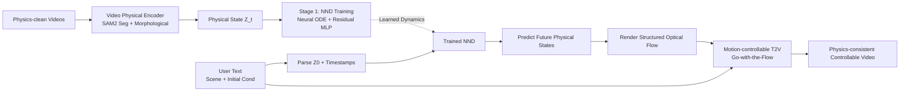

# NewtonGen: Physics-consistent and Controllable Text-to-Video Generation via Neural Newtonian Dynamics

**Conference**: ICLR 2026  
**Code**: [https://github.com/pandayuanyu/NewtonGen](https://github.com/pandayuanyu/NewtonGen)  
**Area**: Video Generation / Physics Consistency  
**Keywords**: Text-to-Video Generation, Physics Consistency, Neural ODE, Newtonian Dynamics, Motion Controllable Generation  

## TL;DR
NewtonGen integrates a learnable "Neural Newtonian Dynamics (NND)" module into the text-to-video pipeline. It first utilizes a Neural ODE to learn the latent dynamics of various Newtonian motions from a minimal amount of physics-clean data, then converts predicted future physical states into structured optical flow to guide video generators, achieving physics-consistent and parameter-controllable video generation.

## Background & Motivation
**Background**: Text-to-video models based on diffusion and DiT (e.g., Sora, Veo3, CogVideoX, Wan) have achieved visually realistic synthesis. The industry generally views them as precursors to "world simulators," expecting physical understanding to emerge naturally through scaling laws.

**Limitations of Prior Work**: These models primarily learn the **appearance-level motion distribution** from large-scale videos rather than the underlying dynamical laws. Consequently, while visually appealing, physical accuracy often fails—objects falling upward, abrupt velocity changes, or inconsistent acceleration—especially in out-of-distribution (OOD) scenarios. Furthermore, they lack **precise parameter control**: users cannot specify initial position, velocity, or angular velocity to generate consistent dynamics across different conditions.

**Key Challenge**: Pure data-driven models have low bias and strong generation capabilities but are physically unreliable and uncontrollable. Conversely, pure physical simulation (sim-then-gen or gen-then-sim) offers explicit control but requires manual pre-definition of physical parameters and rules for every scene, suffering from poor generalization and high manual costs. This paper categorizes existing physics-aware generation into three types: post-generation simulation $\hat V = P(G_\psi(I))$, pre-generation simulation $\hat V = G_\psi(P(I))$, and generation with learned physical priors $\hat V = G_\psi(P_\phi(I))$. It points out that the risk of the third category lies in the "assumption that Large Models can perform physical reasoning," whereas their physical understanding is often just data fitting.

**Goal**: To inject a **lightweight, learnable, and white-box controllable** physics prior into the high expressivity of data-driven generation, ensuring results are both physics-consistent and precisely responsive to user-defined initial conditions.

**Core Idea**: The authors decouple "physical dynamics reasoning" from "video content generation." A Neural ODE explicitly models Newtonian motion to predict future physical states, while a motion-controllable video generator renders the appearance. Since the physics prior is driven by both an **explicit physical model** (linear ODE) and **physics-clean data**, it is more controllable and generalizes better to OOD scenarios than purely implicit priors.

## Method

### Overall Architecture
NewtonGen consists of two stages. **Stage 1 (NND Training)**: Neural Newtonian Dynamics are trained on a small batch of physics-clean videos to learn latent dynamics and parameters for various motions. **Stage 2 (Controllable Inference)**: Users provide a scene description and initial physical conditions via text. The system parses the initial state $Z_0$ and future timestamps, feeds them into the trained NND to predict the full sequence of physical states, converts these states into structured optical flow, and sends them along with the scene prompt to a motion-controllable T2V generator to produce the final video.

### Key Designs

**1. 9-Dimensional Latent Physical State: A unified vector for translation, rotation, and deformation.** NND operates in a latent space rather than pixel space, compressing each frame into a 9D state $Z = [x, y, v_x, v_y, \theta, \omega, s, l, a]$, where $x, y$ are centroid positions, $v_x, v_y$ are velocities, $\theta, \omega$ encode rotation angle and angular velocity, $s, l$ represent the object's shortest and longest dimensions, and $a$ is the projected area. This design allows a single vector to characterize complex behaviors; even 3D motion effects can be achieved through combinations of position and size changes (e.g., moving closer/further is reflected in area/scale). Reducing high-dimensional video to low-dimensional physical states makes dynamics modeling both lightweight and interpretable.

**2. Linear Physics ODE + Residual MLP: One framework for multiple dynamics.** Different motions follow different laws—free fall can be described by a simple linear ODE, while non-linear motions like damped pendulums cannot. NND combines a second-order linear ODE with a residual MLP: the linear term captures dominant linear dynamics, while the residual MLP accounts for non-linear and unknown components. For each component $z$ in $Z$, the dynamics are expressed as:
$$a_z \ddot z + b_z \dot z + c_z z + d_z + \mathrm{MLP}(Z) = 0$$
where $a_z, b_z, c_z, d_z$ are learnable linear ODE parameters. After synthesizing the ODEs into an autonomous form, given $Z_0$ and time $t$, an ODE solver `odeint` integrates to predict future states:
$$Z_t = Z_0 + \int_{t_0}^{t} \mathrm{Func}\big(Z(\tau)\big)\, d\tau$$
The second-order constraint is used because most daily motions (e.g., a flying ball) can be sufficiently characterized by second-order dynamics with dense anchors. Ablations show the residual MLP reduces prediction errors for non-linear motions (circular, parabolic+rotation, damped oscillation) from 0.5–0.7 to 0.006–0.04.

**3. Encoder-only Training + Physics-clean Data: Learning a motion in two hours.** During training, an encoder-only architecture is used, optimizing only in the latent physical space without decoding back to images, which saves significant computation. Specifically, the Video Physical Encoder uses SAM2 to obtain masks for dynamic regions, extracts centroid, area, axes, and orientation via morphological analysis, and calculates velocity through frame differencing. The training loss is the MSE between predicted and encoded states:
$$\mathcal{L} = \frac{1}{T}\sum_{t=1}^{T} \big\| E_{\text{phys}}(I_t) - \mathrm{NND}_\kappa(E_{\text{phys}}(I_0), t) \big\|_2^2$$
Due to the lack of high-quality physical dynamics datasets, the authors built a Python-based physics simulator to render "physics-clean" videos (significant motion, monotonic, no motion blur, no background interference) with precise timestamps. Each motion type requires only 100 videos and ~2 hours of training on a single A100.

**4. Physical States to Structured Optical Flow: Injecting dynamics into the generator.** The core of Stage 2 is "translating" NND's physical predictions for the video generator. The authors chose Go-with-the-Flow as the backbone, which achieves motion control by warping independently initialized Gaussian noise per frame according to input optical flow (better for deformation and rotation than ControlNet's point/box trajectories). The process: parse physical prompts for $Z_0$ → NND predicts states → calculate pixel-level flow based on scene settings (scene/object size, geometry) → spatiotemporal downsampling to match latent resolution → sample the final video.

## Key Experimental Results

### Main Results
The model was compared against 5 SOTA baselines across 12 motion types (24 prompts each). Metrics include Physics Invariant Score (PIS, where $\mathrm{PIS} = (1 + C_\sigma/(|C_\mu|+\epsilon))^{-1}$, closer to 1 is better), Background Consistency (BC), and Motion Smoothness (MS). Representative PIS (↑) scores:

| Motion / Metric | Reference | Sora | Veo3 | CogVideoX-5B | Wan2.2 | PhyT2V | **Ours** |
|---|---|---|---|---|---|---|---|
| Constant Vel. PIS-v | 0.9972 | 0.6548 | 0.9784 | 0.5392 | 0.6395 | 0.5349 | **0.9830** |
| Parabolic PIS-vx | 0.9988 | 0.9095 | 0.9042 | 0.7392 | 0.7747 | 0.6370 | **0.9803** |
| Parabolic PIS-ay | 0.9487 | 0.5723 | 0.7662 | 0.4230 | 0.5571 | 0.3567 | **0.8189** |
| 3D Motion PIS-Δl | 0.7388 | 0.5013 | 0.5932 | 0.3026 | 0.4583 | 0.2911 | **0.6472** |
| Circular PIS-ω | 0.9933 | 0.8393 | 0.8932 | 0.7726 | 0.4677 | 0.6391 | **0.9788** |
| Deformation PIS-Δl | 0.9247 | 0.3626 | 0.3466 | 0.3550 | 0.3515 | 0.3601 | **0.5492** |

NewtonGen achieves optimal or sub-optimal PIS across nearly all 12 motion types, with superior BC and MS, demonstrating smooth trajectories without sudden direction/velocity changes.

### Ablation Study
Ablations focused on the residual MLP and data scale, measuring Normalized Absolute Error (↓) between predicted states and ground truth:

| Config / Motion | Circular | Para+Rota | Damped Osci | Def |
|---|---|---|---|---|
| W/o MLP | 0.5388 | 0.7451 | 0.2275 | 0.0854 |
| Our-data10 | 0.1246 | 0.1045 | 0.2327 | 0.0555 |
| **Our-data100** | **0.0255** | **0.0064** | **0.0425** | **0.0357** |
| Our-data500 | 0.0196 | 0.0063 | 0.0694 | 0.0290 |

### Key Findings
- **Residual MLP is crucial for non-linear motion**: Removing it causes errors to jump by an order of magnitude for circular and complex motions, proving linear ODEs alone are insufficient.
- **100 clean clips are sufficient**: Significant gains from data10 to data100, but data500 yields diminishing returns, indicating NND accurately infers system dynamics from few samples.
- **Transferability to real videos**: Training NND on real falling videos from PISABench allows it to learn falling dynamics despite motion blur. While PIS scores (vx: 0.8485, ay: 0.6008) are lower than simulated data, it validates real-world feasibility.

## Highlights & Insights
- **Decoupling "Physical Reasoning" from "Appearance Generation"** is the core philosophy: letting Neural ODEs handle dynamics while Large Models handle visuals leverages their respective strengths.
- **White-box Controllability**: Users directly specify initial position, velocity, angular velocity, and size. Generation outcomes faithfully reflect these explicit settings—a feat unattainable for black-box T2V.
- **Remarkably Lightweight**: Each motion type requires only 100 videos and 2 hours of single-GPU training. The physics prior is a "plug-in" rather than a retraining of the generator.
- **9D State + Hybrid ODE/MLP Architecture** achieves a beautiful balance between expressivity and interpretability; using size/area for 3D effects is a clever simplification.

## Limitations & Future Work
- **Continuous Dynamics Only**: Being ODE-based, it struggles with multi-object interactions like collisions or mergers (discrete events). Discrete neural architectures might be needed.
- **Dependence on Foreground Segmentation**: Extraction relies on clean SAM2 segmentation; complex backgrounds, severe occlusion, or multi-object scenes pose challenges.
- **Limited Motion Range**: Experiments focused on 0–15 m/s and 1–2 second durations. Long-term or time-varying external forces were not thoroughly validated.
- **Realism Gap in Clean Data**: While simulated data is "clean," it differs from real-world textures and lighting, leading to lower PIS on real videos.

## Related Work & Insights
- **Physics-aware Generation**: NewtonGen belongs to the category of "learned physical priors" but differs by using explicit physical models and clean data rather than relying on the implicit reasoning of LLM/VLMs (e.g., PhyT2V's self-correction).
- **Physics from Video**: Inspired by Hamiltonian/Lagrangian NN and PINNs, NND uses an encoder-only structure and universal Neural ODE to unify multiple dynamics into one framework, breaking the "one model per system" limitation.
- **Motion Controllable Backbones**: Choosing the structured noise mechanism of Go-with-the-Flow is key to transforming physical states into controllable signals for deformation and rotation.
- **Inspiration**: Injecting a "learnable physical simulator" as a plug-and-play prior into generative models can be extended to 3D generation, robotic world models, and controllable animation.

## Rating
- **Novelty**: ⭐⭐⭐⭐ Decoupling Newtonian dynamics via trainable Neural ODEs into a T2V pipeline using a unified 9D state + hybrid model is an elegant and fresh approach.
- **Experimental Thoroughness**: ⭐⭐⭐⭐ Covers 12 motion types, 5 strong baselines, and multiple metrics. Solid ablations on MLP, data scale, and real videos. Lacks large-scale evaluation on physics benchmarks like VBench or user studies.
- **Writing Quality**: ⭐⭐⭐⭐ Clear motivation, well-structured categorization of physics-aware generation, with readable formulas and diagrams.
- **Value**: ⭐⭐⭐⭐ Offers a lightweight, reproducible, and practical solution for "physics-credible + parameter-controllable" video generation, proving insightful for world model research.

<!-- RELATED:START -->

## Related Papers

- [\[ICLR 2026\] 3D Scene Prompting for Scene-Consistent Camera-Controllable Video Generation](3d_scene_prompting_for_scene-consistent_camera-controllable_video_generation.md)
- [\[NeurIPS 2025\] PhysCtrl: Generative Physics for Controllable and Physics-Grounded Video Generation](../../NeurIPS2025/video_generation/physctrl_generative_physics_for_controllable_and_physicsgrou.md)
- [\[CVPR 2026\] Phantom: Physics-Infused Video Generation via Joint Modeling of Visual and Latent Physical Dynamics](../../CVPR2026/video_generation/phantom_physics-infused_video_generation_via_joint_modeling_of_visual_and_latent.md)
- [\[ICLR 2026\] Syncphony: Audio-to-Video Generation with Synchronized Visual Dynamics using Diffusion Transformers](syncphony_synchronized_audio-to-video_generation_with_diffusion_transformers.md)
- [\[ICLR 2026\] NeRV-Diffusion: Diffuse Implicit Neural Representation for Video Synthesis](nerv-diffusion_diffuse_implicit_neural_representation_for_video_synthesis.md)

<!-- RELATED:END -->
