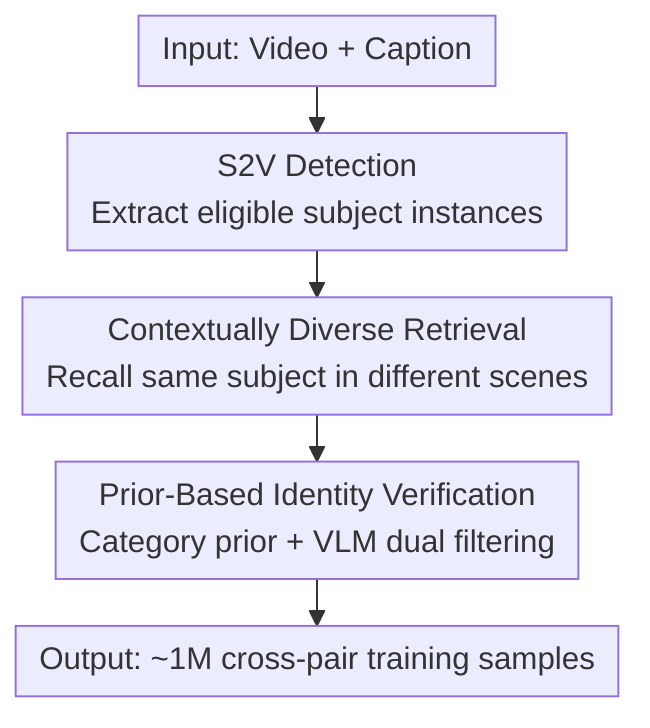

# Phantom-Data: Towards a General Subject-Consistent Video Generation Dataset

**Conference**: ICLR 2026  
**OpenReview**: [https://openreview.net/forum?id=IjqKXnzUXx](https://openreview.net/forum?id=IjqKXnzUXx)  
**Project Page**: [https://phantom-video.github.io/Phantom-Data/](https://phantom-video.github.io/Phantom-Data/)  
**Code**: See project page  
**Area**: Video Generation / Subject Consistency / Datasets  
**Keywords**: Subject-consistent video generation, cross-pair data, copy-paste, identity consistency, data pipeline

## TL;DR
Addressing the prevalent "copy-paste" issue in subject-to-video (S2V) generation, this paper constructs Phantom-Data, the first general cross-pair subject-consistent dataset. It contains approximately 1 million identity-consistent pairs. Through a three-stage pipeline (S2V Detection → Contextually Diverse Retrieval → Prior-Based Identity Verification), the method finds reference images in different scenarios for each subject from 53 million videos and 3 billion images, significantly improving text-following capabilities and image quality while maintaining identity consistency.

## Background & Motivation
**Background**: Subject-consistent video generation (S2V) requires models to generate videos that both follow text prompts and faithfully preserve the identity of reference subjects (humans, animals, products, scenes, etc.). Significant progress has been made recently, with mainstream approaches using pre-trained encoders/VLMs to inject reference features via cross-attention or concatenating identity features with diffusion inputs in noise space (e.g., Phantom, VACE).

**Limitations of Prior Work**: These methods commonly suffer from the "copy-paste problem"—the generated video directly transfers the subject from the reference frame along with its background and pose. This leads to the neglect of new scenes described in the prompt (e.g., "boxing ring"), resulting in artifacts and poor text-following ability. Paper Fig.2 demonstrates this "copy-paste" phenomenon using a SOTA model (Kling).

**Key Challenge**: The root cause lies in the training paradigm. Most methods use an **in-pair** paradigm, where the reference subject is sampled from the same clip as the target video. This naturally entangles "subject identity" with "background/contextual attributes." The model fails to distinguish between what should be preserved (identity) and what should be discarded (scene), thus memorizing the background and pose. In reality, these entangled features often conflict with new actions or semantics described in the prompt.

**Existing Remedies and Their Deficiencies**: One line of work employs data normalization/augmentation (background removal, color jitter, geometric transformations), but the variations are too limited to decouple complex contextual factors like perspective and motion. Another line introduces cross-pair data (reference and target frames from different sources). While the idea is correct, existing cross-pair datasets are almost exclusively limited to the human face domain and cannot generalize to general subjects (animals, products, stylized characters). In summary, existing training data lacks reference variation or domain diversity.

**Goal & Key Insight**: The authors aim to create a "general domain + cross-pair" high-quality dataset based on three principles for reference subjects: ① General subjects that fit user input distributions; ② Reference subjects appearing in different contexts (background/perspective/pose) from the target video; ③ Identity consistency in shape/structure/texture despite contextual changes. **Core Idea**: Instead of sampling references within the same video (in-pair), the method retrieves "same identity, different context" reference images across a massive library of 53 million videos and 3 billion images, using the data itself to decouple identity and context.

## Method

### Overall Architecture
Phantom-Data is essentially a **data construction pipeline** rather than a new model. The input is "video + caption," and the output is a set of "reference image (different scene) ↔ target video" cross-pair training samples. It consists of three sequential stages: detecting eligible candidate subjects from each video clip (S2V Detection), retrieving candidate reference images for these subjects in different scenes from a large-scale library (Contextually Diverse Retrieval), and finally filtering out "same identity, different context" pairs using prior knowledge and VLM verification (Prior-Based Identity Verification). This results in approximately 1 million identity-consistent samples, including over 30,000 multi-subject scenes.

### Key Designs

**1. S2V Detection: Extracting "Complete, Unique, and Text-Aligned" Subject Instances**

This step addresses the issue where directly using frames from existing detectors results in incomplete, blurry, or semantically mismatched subjects. The authors designed a five-step cascade: ① **Frame Sampling**—Sampling frames at $t=0.05, 0.5, 0.95$ to ensure temporal diversity; ② **Keyword Extraction**—Using Qwen2.5 to extract noun phrases (human/animal/product) as candidate subjects; ③ **Visual Grounding**—Using Qwen2.5-VL to align each phrase to regions within the frame, discarding ambiguous matches; ④ **Box Filtering**—Retaining boxes covering $4\% \sim 90\%$ of the image with at least $128 \times 128$ resolution, and suppressing overlapping boxes with $\text{IoU} > 0.8$; ⑤ **Visual-Semantic Re-checking**—Using InternVL2.5-7B with three criteria: **Completeness** (detectors often crop objects, but S2V users provide complete subjects), **Uniqueness** (excluding vague generic objects like trees or stones), and **Subject-Text Alignment** (ensuring the region matches the phrase semantics). This cascade improves the quality of subjects used as references.

**2. Contextually Diverse Retrieval: Recalling Identities Across 3 Billion Images**

The core difficulty of cross-pair data is finding the same subject in different contexts. The authors built a massive retrieval library by indexing every subject instance detected in the training videos and adding 3 billion images from LAION to supplement diversity in scenes, poses, and appearances for high-intra-class-variance categories like products. The key to retrieval is using **category-specific expert encoders** to extract "identity-preserving, context-robust" embeddings: ArcFace for faces, $V_{face}=E_{arcface}(I_{face})$; consistency-tuned CLIP for general objects, $V_{subj}=E_{IR}(I)$; and a concatenation for persons, $V_{person}=[E_{IR}(I), E_{arcface}(I_{face})]$. Retrieval applies both **upper and lower similarity bounds**—the upper bound filters near-duplicates (to avoid reverting to copy-paste), and the lower bound excludes different identities, hitting the "same identity but visually distinct" target range.

**3. Prior-Based Identity Verification: Cleaning False Positives with Category Priors and VLMs**

Due to the scale of the retrieval library, false positives are frequent even within reasonable similarity ranges, necessitating two levels of filtering. The first level is **category-specific priors**: Non-living subjects (products) have high intra-class variance and are the hardest to verify, so only instances with complete, recognizable brand logos (e.g., Nike, Audi) are kept, using the logo as a stable anchor. Living subjects (humans, animals) are restricted to samples from **different clips of the same long video**, ensuring natural scene/pose changes while guaranteeing identity. The second level is **Pairwise VLM Verification**: For non-living objects, it enforces consistency in color, packaging, and text details while allowing background changes; for humans, it verifies facial identity and clothing consistency for full-body samples. It also checks for **contextual diversity**, retaining only pairs with sufficient background/scene differences.

### Loss & Training
The dataset does not introduce a new loss function. Validation was performed using the open-source Phantom-wan (based on Wan2.1) framework. A 1.3B parameter model was trained using Rectified Flow on 64 A100 GPUs with 480p data for 30k iterations. Inference used 50-step Euler sampling with classifier-free guidance to decouple image and text conditions.

## Key Experimental Results

### Main Results
Evaluation used 100 test cases covering humans, animals, products, environments, and clothing, measured across three dimensions: subject consistency (DINO, GPT-4o), text following (Reward-TA), and video quality (VBench metrics).

| Training Paradigm | DINO ↑ | GPT-4o ↑ | Reward-TA ↑ | IQ ↑ | BG ↑ | Subj ↑ |
|----------|--------|----------|-------------|------|------|--------|
| In-pair | 0.478 | 2.481 | 2.074 | 0.725 | 0.937 | 0.933 |
| In-pair + Data Aug | 0.473 | 2.792 | 2.427 | 0.730 | 0.932 | 0.922 |
| Face Cross-pair | 0.354 | 2.378 | 3.022 | 0.723 | 0.937 | 0.935 |
| **Ours (Phantom-Data)** | 0.416 | **3.041** | **3.827** | **0.739** | **0.948** | **0.944** |

Ours achieves SOTA in text-following (Reward-TA 3.827 vs. 2.074 for in-pair) and multiple image quality metrics. While subject consistency (DINO 0.416) is lower than in-pair (0.478), it is comparable given the much higher scene diversity and significantly outperforms the face-only Cross-pair baseline (0.354).

### Ablation Study

| Configuration | DINO ↑ | GPT-4o ↑ | Reward-TA ↑ | Description |
|------|--------|----------|-------------|------|
| Baseline (Face only) | 0.354 | 2.378 | 3.022 | Only faces |
| + Human | 0.401 | 2.747 | 3.726 | Add human subjects |
| + IP/animal | 0.416 | 2.795 | 3.407 | Add IP/animals |
| + Product | 0.386 | 2.662 | 3.572 | Add products |
| + Multi-subject | 0.418 | 2.901 | 3.512 | Add multi-subject |
| 100k scale | 0.408 | 3.090 | 3.796 | Small data scale |
| 1M scale | 0.416 | 3.175 | 3.827 | Full data scale |

### Key Findings
- **Subject Diversity** is the key to performance gains: Progressively adding humans, animals, products, and multi-subject scenes consistently improves both consistency and text-following.
- **Data Scale** is equally important: Expanding from 100k to 1M samples improves all metrics, showing that both quantity and diversity are essential.
- **Retrieval and Verification** ablations show that: Minute-level (vs. second-level) frame sampling provides richer context; large-scale image retrieval improves diversity; and VLM verification eliminates difficult misidentifications like "same face, same clothes."

## Highlights & Insights
- **Shifting "Identity-Context Decoupling" from Model to Data**: Without modifying architectures or adding loss functions, simply using "cross-scene retrieval of the same identity" mitigates the copy-paste problem.
- **Category-Specific Encoders + Dual Thresholds**: The upper bound prevents near-duplicate degradation, while the lower bound prevents identity drift, effectively targeting the "same identity, different scene" sweet spot.
- **Practical Engineering Priors**: Using brand logos as anchors for products and different clips of long videos for living subjects effectively bypasses the false positive issues of pure similarity retrieval.
- The "Detection → Retrieval → Prior+VLM Verification" pipeline is transferable to other consistency tasks like image customization or virtual try-on data construction.

## Limitations & Future Work
- The pipeline heavily relies on multiple large models (Qwen2.5-VL, InternVL2.5, ArcFace, CLIP, GPT-4o), leading to high construction costs and high barriers to reproducibility.
- The product category relies on "complete brand logos," meaning products without logos are difficult to include.
- Living subject data is limited to "different clips of the same long video," excluding cross-video pairs of the same person.
- Validations were only performed on a 1.3B model at 480p; the scalability to larger models or higher resolutions remains unverified.

## Related Work & Insights
- **vs. In-pair Paradigm**: In-pair sampling guarantees identity alignment but entangles context; this work trades off some identity fidelity for a massive gain in text-following via contextual diversity.
- **vs. Data Augmentation**: Augmentations like background removal provide limited variation; this work uses real data from different scenes for authentic diversity.
- **vs. Face Cross-pair (e.g., MovieGen)**: Previous cross-pair datasets were restricted to the human face domain; Phantom-Data is the first open-access cross-pair dataset covering general subjects.

## Rating
- Novelty: ⭐⭐⭐⭐ First general cross-pair S2V dataset; the "data-side decoupling" idea is clean though it uses existing components.
- Experimental Thoroughness: ⭐⭐⭐⭐ Comprehensive ablations on diversity, scale, and retrieval, though the test set is small.
- Writing Quality: ⭐⭐⭐⭐ Motivation and pipeline descriptions are clear with intuitive illustrations.
- Value: ⭐⭐⭐⭐⭐ Directly addresses the "copy-paste" pain point in S2V; high value for the open-source community.

<!-- RELATED:START -->

## Related Papers

- [\[ICLR 2026\] BindWeave: Subject-Consistent Video Generation via Cross-Modal Integration](bindweave_subject-consistent_video_generation_via_cross-modal_integration.md)
- [\[ICLR 2026\] MAGREF: Masked Guidance for Any-Reference Video Generation with Subject Disentanglement](magref_masked_guidance_for_any-reference_video_generation_with_subject_disentang.md)
- [\[ICLR 2026\] 3D Scene Prompting for Scene-Consistent Camera-Controllable Video Generation](3d_scene_prompting_for_scene-consistent_camera-controllable_video_generation.md)
- [\[ICLR 2026\] NewtonGen: Physics-consistent and Controllable Text-to-Video Generation via Neural Newtonian Dynamics](newtongen_physics-consistent_and_controllable_text-to-video_generation_via_neura.md)
- [\[CVPR 2026\] PoseAnything: General Pose-guided Video Generation with Part-aware Temporal Coherence](../../CVPR2026/video_generation/poseanything_general_pose-guided_video_generation_with_part-aware_temporal_coher.md)

<!-- RELATED:END -->
