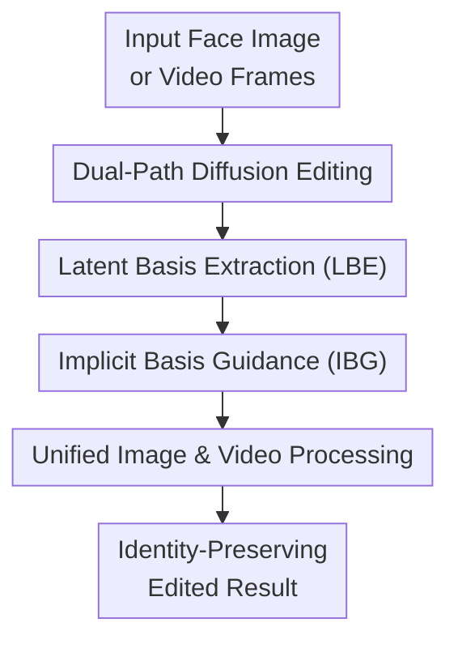

# Pixel-Perfect Puppetry: Precision-Guided Enhancement for Face Image and Video Editing

**Conference**: ICLR2026  
**OpenReview**: [https://openreview.net/forum?id=8mHZWTeF3z](https://openreview.net/forum?id=8mHZWTeF3z)  
**Code**: https://github.com/yl4467/flow_edit  
**Area**: Video Generation  
**Keywords**: Face Editing, Video Editing, Diffusion Models, Latent Geometry, Identity Preservation

## TL;DR
FlowGuide explicitly extracts semantic directions induced by editing conditions in the diffusion UNet bottleneck as orthogonal bases, then uses the geometric alignment between the reconstruction and editing paths to dynamically correct the denoising noise. This enables more precise attribute modification in facial images and videos while preserving identity, background, and temporal consistency.

## Background & Motivation
**Background**: Both face image and video editing have shifted from early GAN inversion to diffusion models. Diffusion models exhibit superior reconstruction quality, generation stability, and text-conditional editing capabilities. Consequently, many methods involve inverting input images or frames into noise latents and introducing target attribute prompts during the denoising process to generate results with new expressions, beards, glasses, makeup, or hair colors.

**Limitations of Prior Work**: The primary difficulty is not "whether it can be edited," but "modifying only the necessary areas." GAN methods suffer from inversion errors, leading to identity loss or artifacts. While diffusion models provide better reconstruction, target attributes introduced into the denoising trajectory often inadvertently change face shapes, facial features, skin tones, backgrounds, and inter-frame details. Video scenarios are even more sensitive, as small per-frame deviations result in flickering, instability, or identity drift during playback.

**Key Challenge**: Most existing guidance mechanisms treat the reconstruction path as a structural anchor and pull the editing path toward the original image using fixed, coarse-grained constraints. When constraints are too strong, target attributes remain unchanged; when too weak, identity and non-target regions are modified together. In other words, these methods lack a local scale to judge which differences belong to target attributes and which should be preserved during each denoising step.

**Goal**: The authors aim to handle both face image and video editing within a unified framework. Given an original face image or video frames and a target editing condition, the output should reflect the target attributes while satisfying three constraints: actual attribute modification, preservation of identity and non-target content, and the absence of temporal jitters in videos.

**Key Insight**: This paper leverages a geometric observation: the latent space of the diffusion UNet bottleneck can be locally approximated as linear. Thus, the influence of editing conditions on bottleneck representations can be viewed as semantic subspace directions. By extracting the local basis vectors corresponding to the "original condition" and the "target editing condition," their angular relationship can estimate the magnitude of semantic changes, determining which regions should follow the editing path or return to the reconstruction path.

**Core Idea**: Use the condition Jacobian matrix of the UNet bottleneck to extract attribute-related latent bases. Use the cosine alignment between reconstruction and editing bases to generate a dynamic mask, correcting the editing noise at each step. This ensures diffusion editing follows target attribute directions without unconstrained modifications to the entire face.

## Method
### Overall Architecture
FlowGuide adopts a dual-path diffusion process: a reconstruction path using original conditions to recover the input from noise latents as an identity/structural baseline, and an editing path using target conditions to generate results with new attributes. Both paths share the high-noise starting point from inversion. During denoising, latent bases are extracted from the UNet bottleneck for both paths, and the predicted noise of the editing path is corrected based on basis alignment.

The critical aspect of this framework is not training a large model but inserting geometric guidance into the existing diffusion process: LBE identifies the "directions where conditions actually drive bottleneck changes," and IBG converts these directions into time-varying spatial constraints. For single images, it controls local attribute editing; for videos, it runs per-frame to ensure each frame is guided by the same attribute directions, reducing temporal drift.

### Key Designs
**1. Dual-Path Diffusion Editing: Placing Identity Baseline and Target Editing in the Same Coordinate System**

Instead of driving generation solely with the target prompt, the paper maintains both reconstruction and editing paths. Input frames $X_0$ are inverted to high-noise latents. The reconstruction path $X^r_t$ uses original conditions to provide a reference for "what the face should look like without editing" at each step. The editing path $X^c_t$ utilizes target conditions to introduce smiles, beards, sunglasses, or makeup.

This dual-path setup addresses the common "out-of-control" problem in diffusion editing. If only the editing path exists, the model cannot distinguish between necessary attribute changes and side effects. If the editing path is forced to match the reconstruction path too strictly, target attributes are suppressed. FlowGuide compares the two paths at the same time step rather than patching the final image, allowing corrections to occur progressively.

**2. Local Basis Extraction (LBE): Finding Attribute-Influenced Directions via Jacobian SVD**

Based on the local linearity assumption of the UNet bottleneck, the impact of condition $C$ on bottleneck representation $H$ is modeled as a local linear map $T_C \rightarrow T_H$. If $J_C$ is the Jacobian matrix, a direction $v$ in condition space maps to $u = J_C v$ in the bottleneck tangent space. The pullback norm measures the influence intensity of a condition direction on the bottleneck:

$$
\|v\|_{pb}^{2}=\langle u,u\rangle_H=v^\top J_C^\top J_C v.
$$

By performing Singular Value Decomposition (SVD) on $J_C=U\Lambda V^\top$, the right singular vectors $V=\{v_1,\ldots,v_n\}$ correspond to local directions that cause the strongest bottleneck response. Rather than comparing entire latents, LBE asks: which semantic directions is the current condition primarily pushing? This yields $V^r$ for reconstruction and $V^c$ for editing.

This design value lies in "filtering irrelevant changes." Input latents contain identity, pose, background, and noise. Simple differences between $X^r_t$ and $X^c_t$ might not correspond to target attributes. LBE defines directions through local bottleneck responses, closer to what the "editing prompt actually wants to change," creating a semantically-aware threshold rather than a hard pixel difference.

**3. Implicit Basis Guidance (IBG): Determining Edit Regions via Basis Alignment**

Given $V^r$ and $V^c$, FlowGuide uses cosine similarity to measure the geometric alignment of original and editing conditions. The normalized angular form is:

$$
\Phi_C(V^r,V^c)=\cos^{-1}(\phi)/\pi,
\quad
\cos(\phi)=\frac{1}{n}\sum_{i=1}^{n}\frac{v_i^r v_i^c}{\|v_i^r\|\|v_i^c\|}.
$$

This value serves as a dynamic guidance signal. High similarity implies the conditions do not differ significantly, so the editing path shouldn't deviate much. Low similarity suggests target attributes are dominant, allowing larger local changes. The paper compares Pearson, Spearman, and cosine similarities, concluding that angular or rank correlations better describe latent geometry than linear correlation, with cosine offering the best balance between edit intensity and identity preservation.

For denoising, the method compares the difference between editing noise $\epsilon^c$ and reconstruction noise $\epsilon^r$. A mask is constructed using a dynamic quantile threshold $\lambda$ based on the similarity:

$$
M=|\epsilon^c-\epsilon^r|<\lambda,
\quad
\hat{\epsilon}=\epsilon^c+M\odot(\epsilon^r-\epsilon^c).
$$

Masked regions pull edit noise back toward the reconstruction path, while unmasked regions retain edit freedom. Non-target areas remain close to the original face, while attribute-related areas are modified. Unlike fixed guidance, the IBG threshold varies by time step and semantic similarity, being conservative early on and releasing fine-grained modifications in necessary regions later.

**4. Unified Image and Video Processing: Reducing Temporal Drift via Shared Geometric Constraints**

Videos are treated as multi-frame editing tasks where each frame undergoes inversion, dual-path denoising, LBE, and IBG. Stability is achieved not through complex temporal Transformers but via "identical attribute subspace constraints": if every frame's edit is restricted to target directions (e.g., mustache, smile) and identity/background directions are anchored to the reconstruction path, inter-frame deviations are naturally suppressed.

This explains the focus on pixel-level face editing. In videos, viewers are highly sensitive to drifts in eyes or mouth corners. FlowGuide's progressive mask fusion acts as a local "brake" for each frame: target attribute regions proceed with editing while other regions return to the reconstruction path, satisfying both identity preservation and temporal consistency.

### Loss & Training
The framework does not involve training a new supervised loss but adds guidance during the inversion and denoising of pre-trained diffusion models. Image experiments use Stable Diffusion, while video experiments process sampled sequential frames. Key hyperparameters relate to denoising steps, editing conditions, similarity metrics, and dynamic quantile thresholds. Since it acts as a post-training geometric controller, it can be embedded into existing diffusion editing pipelines.

## Key Experimental Results

### Main Results
The paper evaluates both face image and video editing. Images are sampled from CelebA (500 images) for tasks like adding sunglasses, makeup, age changes, and smiles. Video experiments use HDTF and VoxCeleb (20 videos each, 32 frames), evaluating identity preservation, attribute change, CLIP scores, and temporal consistency.

| Task / Dataset | Metric | FlowGuide | Representative Baselines | Conclusion |
|--------|------|-----------|--------------|------|
| CelebA Image | PSNR ↑ | 23.160 (Consine) / 24.129 (Spearman) | h-Edit 22.078 | FlowGuide exceeds h-Edit in non-edit quality; Spearman is highest, Cosine is balanced |
| CelebA Image | LPIPS ↓ | 0.0965 (Cosine) / 0.0882 (Spearman) | h-Edit 0.1034 | Lower perceptual difference indicates better identity/background retention |
| CelebA Image | CLIP Sim ↑ | 19.391 (Cosine) | h-Edit 19.707 / NMG 21.666 | Cosine alignment is slightly lower than some aggressive methods but favors fidelity |
| HDTF Video | IPR ↑ | 0.9667 | DVA 0.9244 / TCSVE 0.9413 | Highest identity preservation rate |
| HDTF Video | CLIP-Score ↑ | 0.7777 | DVA 0.7685 / StyleCLIP 0.7676 | Leads in attribute editing alignment |
| VoxCeleb Video | IPR ↑ | 0.9033 | DVA 0.8910 / TCSVE 0.8723 | Maintains identity advantage across datasets |

In image experiments, the Pearson version of FlowGuide achieves a high CLIP Sim (22.157) but significantly degrades PSNR and DINO Dist, proving that pursuing raw edit intensity sacrifices identity. The Cosine version is the recommended trade-off. In video experiments, FlowGuide outperforms DVA and TCSVE in Identity Preservation Rate (IPR) and maintains high temporal identity consistency (TL-ID/TG-ID).

### Ablation Study
| Configuration | Key Metrics | Observation |
|------|---------|------|
| FlowGuide | IPR 0.9510 / CLIP 0.7563 / TG-ID 0.9929 | Most balanced across identity, editing capability, and consistency. |
| w/o LBE | IPR 0.9831 / CLIP 0.7437 / TG-ID 0.9775 | Similarity computed on raw latents; identity is conservative but editing power drops. |
| w/o IBG | IPR 0.9370 / CLIP 0.7773 / TG-ID 0.8854 | Editing is stronger, but lack of spatial control degrades identity and temporal stability. |

### Key Findings
- LBE contributes "what to change." Without LBE, the model cannot isolate attribute directions from the mixed latent, leading to conservative reconstruction rather than precise editing.
- IBG contributes "where to change." Without IBG, changes cannot be localized, causing significant drops in identity and TG-ID due to non-target region drift.
- Adaptive thresholds are necessary. Basis similarity is high (~0.8-0.9) in early denoising steps and drops (~0.4-0.5) later, suggesting edit freedom should evolve over time.
- FlowGuide favors high-fidelity editing over maximizing text CLIP scores. For face videos, this trade-off is critical as identity drift is more jarring than slightly lower attribute intensity.

## Highlights & Insights
- The primary highlight is translating the "identity vs. attribute" trade-off into a latent geometric problem. Instead of pixel-level patches, it compares local basis directions in the UNet bottleneck, enhancing interpretability.
- The division between LBE (semantic disentanglement) and IBG (spatial localization) is logical and well-validated by ablations.
- It achieves video stability through per-frame geometric consistency rather than heavy temporal modules, making it attractive for practical engineering.
- The use of dynamic quantile thresholds is a transferable trick applicable to local editing in other domains like medical imaging or virtual try-on.

## Limitations & Future Work
- Over-smoothing may occur in high-motion videos where conservative guidance might sacrifice sharp textures during fast head movements.
- Editing of "hard-boundary" accessories (e.g., sunglasses) can lead to unnatural blending, as diffusion latents struggle with sharp geometric occlusion edges.
- Perfect attribute decoupling is not achieved; related attributes (e.g., age and skin texture) may still bleed into each other due to data correlations.
- Dependence on the pre-trained diffusion model's distribution means it cannot edit attributes the base model was never trained on without additional fine-tuning.

## Related Work & Insights
- **vs GAN Inversion (StyleCLIP/STIT)**: GANs have interpretable directions but are limited by inversion quality and frame-to-frame error accumulation. FlowGuide applies "semantic direction" concepts to the diffusion space for better reconstruction.
- **vs h-Edit / PnP Inversion**: While these improve inversion or use noise constraints, FlowGuide uses condition-specific bases to avoid blindly trusting either the reconstruction or editing path.
- **vs RAVE**: General video editing methods allow large semantic changes. FlowGuide adopts local geometric constraints to meet the stricter identity requirements of face editing.
- **Insight**: Diffusion intermediate layers are not just black-box features; they can be treated as local geometric objects for control without retraining specialized controllers.

## Rating
- **Novelty**: ⭐⭐⭐⭐☆ Combines bottleneck linearity, Jacobian SVD, and dynamic masking into a coherent guidance framework.
- **Experimental Thoroughness**: ⭐⭐⭐⭐☆ Covers major face datasets and ablates similarity variants; higher resolution or user studies would strengthen it further.
- **Writing Quality**: ⭐⭐⭐⭐☆ Clear methodology; LBE and IBG roles are well-articulated.
- **Value**: ⭐⭐⭐⭐☆ Highly relevant for high-fidelity face editing tasks requiring identity preservation.

<!-- RELATED:START -->

## Related Papers

- [\[ICLR 2026\] EditVerse: Unifying Image and Video Editing and Generation with In-Context Learning](editverse_unifying_image_and_video_editing_and_generation_with_in-context_learni.md)
- [\[ICLR 2026\] Controllable First-Frame-Guided Video Editing via Mask-Aware LoRA Fine-Tuning](controllable_first-frame-guided_video_editing_via_mask-aware_lora_fine-tuning.md)
- [\[ICLR 2026\] DreamSwapV: Mask-guided Subject Swapping for Any Customized Video Editing](dreamswapv_mask-guided_subject_swapping_for_any_customized_video_editing.md)
- [\[CVPR 2026\] RecEdit-Drive: 3D Reconstruction-Guided Spatiotemporal Video Editing for Autonomous Driving Scenes](../../CVPR2026/video_generation/recedit-drive_3d_reconstruction-guided_spatiotemporal_video_editing_for_autonomo.md)
- [\[ICLR 2026\] Unified In-Context Video Editing](unified_in-context_video_editing.md)

<!-- RELATED:END -->
