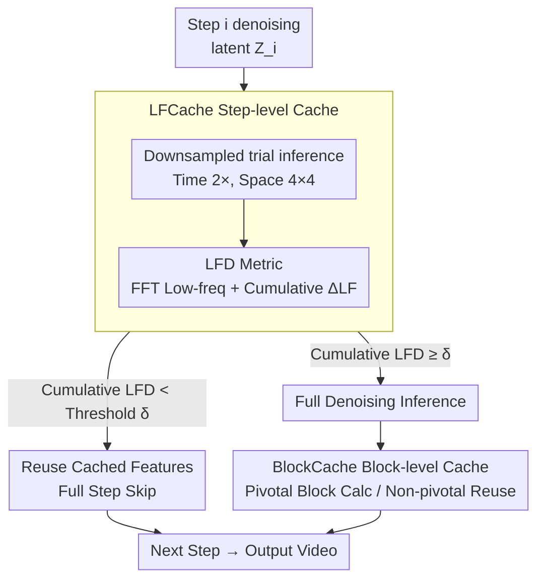

# PreciseCache: Precise Feature Caching for Efficient and High-fidelity Video Generation

**Conference**: ICLR 2026  
**arXiv**: [2603.00976](https://arxiv.org/abs/2603.00976)  
**Code**: None  
**Area**: Video Generation/Inference Acceleration  
**Keywords**: Feature caching, video diffusion, low-frequency difference, step-level caching, block-level caching

## TL;DR

PreciseCache is proposed as a plug-and-play acceleration framework that precisely detects and skips truly redundant calculations in video generation. It consists of LFCache (step-level, based on the Low-Frequency Difference (LFD) metric) and BlockCache (block-level, based on input-output difference metrics), achieving an average 2.6× speedup on mainstream models like Wan2.1-14B without significant quality loss.

## Background & Motivation

**Background**: The generation quality of video diffusion models (e.g., Sora, HunyuanVideo, CogVideoX, Wan2.1) continues to improve, but inference remains extremely slow—Wan2.1-14B requires approximately 907 seconds to generate a single 720P video on 4 A800 GPUs. Feature caching is a mainstream training-free acceleration method that skips network inference for certain steps by reusing cached features from preceding denoising steps.

**Limitations of Prior Work**:

- **Uniform Caching Strategies (e.g., PAB)**: Caching every $n$ steps ignores the varying contributions of different denoising steps to the final quality—high-noise steps establish video structure and content (non-skippable), while low-noise steps refine high-frequency details (safely skippable).
- **Existing Adaptive Caching Methods**: Require complex extra fitting or extensive hyperparameter tuning, and caching decision criteria remain imprecise.
- **Direct Use of Adjacent Step Prediction Differences as Caching Indicators (e.g., TeaCache)**: This metric lacks a strong correlation with final generation quality, leading to suboptimal caching strategies.

**Key Challenge**: How to design a runtime adaptive caching criterion that precisely distinguishes "truly redundant computation" from "computation critical to generation quality" to maximize acceleration while maintaining video quality?

**Goal**: This paper proposes Low-Frequency Difference (LFD) as a precise metric for step-level redundancy based on a **Key Insight**: the diffusion process models low-frequency structural information during high-noise stages (important) and refines high-frequency details during low-noise stages (cacheable). LFD is highly consistent with the impact of caching on final quality.

## Method

### Overall Architecture

The root cause of slow video diffusion model inference is that the network runs fully for dozens of denoising steps, even though many calculations are redundant. PreciseCache splits "redundancy" into two levels for precise detection and skipping: **Step-level**—LFCache detects steps making negligible new contributions using the LFD metric to skip entire steps; **Block-level**—BlockCache handles steps that must run by using cached differences to approximate outputs of Transformer blocks within the DiT that exhibit minimal feature changes.

For a specific denoising step: the latent is first downsampled for an inexpensive trial inference to estimate the step's LFD. If the accumulated LFD is below a threshold, the entire step is skipped by reusing the cache (LFCache). Otherwise, full inference is executed, during which BlockCache saves computation on non-critical blocks. This cascaded double-layer acceleration uses only standard operators like FFT, downsampling, and hooks, without altering base model parameters or architecture. It is plug-and-play for different DiT architectures like Wan2.1 and HunyuanVideo and is orthogonal to parallel strategies like DSP.

### Key Designs

**1. Low-Frequency Difference (LFD) Metric: Aligning Caching Criteria with Resulting Quality**

Uniform caching (e.g., PAB every $n$ steps) and using raw prediction differences between adjacent steps (e.g., TeaCache) are imprecise because they fail to distinguish what the denoising process is doing. High-noise stages build the low-frequency structure (cannot be skipped), whereas low-noise stages refine high-frequency details (can be safely cached). This method uses FFT to split network prediction $\bm{F}_i$ into low-frequency $\bm{F}_i^{LF}$ and high-frequency $\bm{F}_i^{HF}$ components. The low-frequency region is masked as a circle with a radius of $\frac{1}{5}$ of the minimum spatial dimension. The L2 distance $\Delta_i^{LF} = \| \bm{F}_i^{LF} - \bm{F}_{i+1}^{LF} \|_2$ serves as the step-level redundancy metric. Experiments confirm $\Delta_i^{LF}$ is highly consistent with the quality impact of caching: high-noise steps have large LFD, while low-noise steps have small LFD.

**2. Downsampled Trial Inference: Bypassing the "Indicator Calculation Requires Inference" Paradox**

Calculating LFD normally requires full inference of the current step, which contradicts the goal of acceleration. A key observation is that LFD is insensitive to latent resolution. Thus, the latent is downsampled for a cheap trial inference: $\widetilde{\bm{Z}}_i = \text{Downsample}(\bm{Z}_i)$, $\widetilde{\bm{F}}_i = \epsilon_\theta(\widetilde{\bm{Z}}_i, t_i)$. With a downsampling ratio of 2× in time and 4×4 in space, trial inference overhead is negligible. Decisions use cumulative LFD $\sum_{i=a}^{b} \widetilde{\Delta}_i^{LF}$ to prevent error accumulation. Full inference is triggered only when the cumulative value exceeds threshold $\delta$, which is set by a relative factor $\delta = \widetilde{\Delta}_{max}^{LF} \times \alpha$ ($\alpha=0.5$ for Base, $0.7$ for Turbo).

**3. BlockCache: Exploiting Block-level Redundancy in Executed Steps**

For steps not skipped by LFCache, BlockCache examines the feature changes in each Transformer block. It calculates the input-output difference $\bm{D}_{k_i}^j = \bm{F}_{k_i}^j - \bm{F}_{k_i}^{j-1}$ and identifies the top $c\%$ blocks with the largest differences as pivotal blocks. For subsequent $L$ steps, pivotal blocks are calculated normally, while non-pivotal blocks approximate the output using the cached difference:

$$\bm{F}_{k_{i-l}}^j = \begin{cases} \mathcal{B}^j(\bm{F}_{k_{i-l}}^{j-1}, t_{k_{i-l}}), & j \in \mathcal{I}_i \text{ (Pivotal Blocks)} \\ \bm{F}_{k_{i-l}}^{j-1} + \bm{D}_{k_i}^j, & j \notin \mathcal{I}_i \text{ (Non-pivotal Blocks)} \end{cases}$$

This adds another layer of computational saving. The Flash configuration uses a 40% cache rate (60% blocks skipped) and $L=3$ to maximize speedup.

## Key Experimental Results

### Main Results: Efficiency and Quality Comparison on 4 Mainstream Models (4 A800 GPUs)

| Method | Model | MACs (P) ↓ | Gain ↑ | VBench ↑ | LPIPS ↓ | PSNR ↑ |
|:-----|:-----|:----------|:---------|:---------|:--------|:-------|
| Baseline | Wan2.1-14B | 329.2 | 1× | 83.62% | - | - |
| PAB | Wan2.1-14B | 233.5 | 1.38× | 82.91% | 0.1853 | 26.18 |
| TeaCache | Wan2.1-14B | 166.3 | 1.94× | 83.24% | 0.1012 | 27.22 |
| FasterCache | Wan2.1-14B | 183.9 | 1.73× | 83.47% | 0.0741 | 28.45 |
| **Ours-base** | Wan2.1-14B | 204.5 | **1.59×** | **83.56%** | **0.0451** | **29.12** |
| **Ours-turbo** | Wan2.1-14B | 151.0 | **2.15×** | **83.52%** | **0.0633** | **28.98** |
| **Ours-flash** | Wan2.1-14B | 122.4 | **2.63×** | **83.43%** | 0.0812 | 28.76 |
| Baseline | HunyuanVideo | 14.92 | 1× | 80.66% | - | - |
| TeaCache | HunyuanVideo | 8.93 | 1.64× | 80.51% | 0.0911 | 28.15 |
| **Ours-turbo** | HunyuanVideo | 7.49 | **1.95×** | **80.49%** | 0.0884 | 29.06 |
| **Ours-flash** | HunyuanVideo | 6.04 | **2.44×** | 80.02% | 0.0902 | 28.64 |

Core Conclusion: PreciseCache-flash achieves a 2.63× speedup on Wan2.1-14B with only a 0.19% decrease in VBench (83.62% → 83.43%), whereas PAB already drops by 0.71% at a 1.38× speedup. PreciseCache-base remains optimal across LPIPS/PSNR metrics (LPIPS 0.0451 vs. competitor best 0.0741).

### Ablation Study: Impact of Downsampling Ratios and GPU Counts

| Downsampling Factor (T×H×W) | Latency (s) | VBench ↑ | LPIPS ↓ |
|:-------------------|:---------|:---------|:--------|
| Baseline (No cache) | 907 (1×) | 83.62% | - |
| 1×2×2 | 918 (0.98×) | 83.57% | 0.0797 |
| 1×4×4 | 525 (1.73×) | 83.49% | 0.0801 |
| **2×4×4 (Default)** | **416 (2.18×)** | **83.52%** | **0.0793** |
| 1×8×8 | 401 (2.26×) | 83.18% | 0.1946 |
| 4×4×4 | 403 (2.25×) | 83.02% | 0.1875 |

2×4×4 is the optimal balance: too small a downsampling ratio fails to accelerate (1×2×2 is 0.98×), while too large leads to inaccurate LFD estimates and quality degradation (4×4×4 VBench drops to 83.02%).

| GPU Count | Wan2.1 Baseline | + PreciseCache | Gain |
|:---------|:-----------|:--------------|:-------|
| 1 | 3326s | 1330s | 2.50× |
| 2 | 1732s | 753s | 2.30× |
| 4 | 907s | 416s | 2.18× |
| 8 | 459s | 229s | 2.00× |

PreciseCache is effective across different GPU counts, with the highest speedup on a single GPU (2.50×), complementing the DSP parallel strategy.

## Highlights & Insights

**Rating**: ⭐⭐⭐⭐

**Value**:
- The LFD metric design is elegant and supported by physical intuition—the low-to-high frequency generation order in diffusion determines the step-level redundancy distribution.
- The downsampled trial inference solves the paradoxical problem of needing inference to calculate the cache indicator, with negligible overhead.
- The dual-layer caching architecture (step-level + block-level) is complementary, allowing for stacked acceleration effects.
- Experiments cover 4 mainstream models, various resolutions, and GPU configurations, validating strong generalization.
- Plug-and-play, requires no training, has few hyperparameters, and remains stable across models.

**Limitations**:
- The low/high-frequency division ratio (radius of $\frac{1}{5}$) lacks theoretical derivation and relies on empirical results.
- The Flash configuration shows some quality loss in specific metrics (e.g., LPIPS), indicating a boundary for aggressive acceleration.
- Comparison with distillation-based acceleration (e.g., consistency distillation) is missing—these could be complementary but are not discussed.
- Block selection in BlockCache is static (based on the last full inference), while block importance might change dynamically during the denoising process.

<!-- RELATED:START -->

## Related Papers

- [\[ICLR 2026\] Flow Caching for Autoregressive Video Generation](flow_caching_for_autoregressive_video_generation.md)
- [\[CVPR 2026\] Lynx: Towards High-Fidelity Personalized Video Generation](../../CVPR2026/video_generation/lynx_towards_high-fidelity_personalized_video_generation.md)
- [\[CVPR 2026\] DisCa: Accelerating Video Diffusion Transformers with Distillation-Compatible Learnable Feature Caching](../../CVPR2026/video_generation/disca_accelerating_video_diffusion_transformers_wi.md)
- [\[ICLR 2026\] BWCache: Accelerating Video Diffusion Transformers through Block-Wise Caching](bwcache_accelerating_video_diffusion_transformers_through_block-wise_caching.md)
- [\[ICLR 2026\] SANA-Video: Efficient Video Generation with Block Linear Diffusion Transformer](sana-video_efficient_video_generation_with_block_linear_diffusion_transformer.md)

<!-- RELATED:END -->
