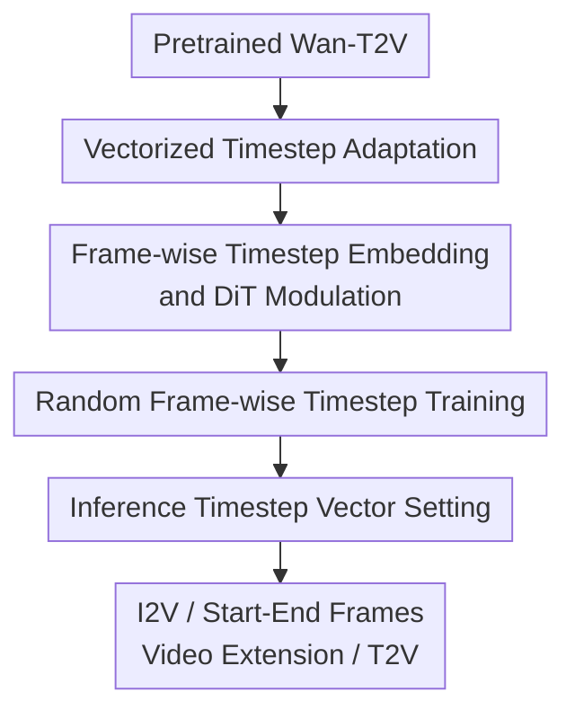

# Pusa V1.0: Unlocking Temporal Control in Pretrained Video Diffusion Models via Vectorized Timestep Adaptation

**Conference**: ICLR2026  
**OpenReview**: [https://openreview.net/forum?id=4adY8FepXg](https://openreview.net/forum?id=4adY8FepXg)  
**Code**: To be confirmed  
**Area**: Video Generation / Diffusion Models  
**Keywords**: Vectorized Timestep, Video Diffusion, Image-to-Video, Temporal Control, LoRA Fine-tuning

## TL;DR
Pusa V1.0 replaces the single scalar timestep in pretrained video diffusion models with a frame-wise timestep vector. Through non-destructive Vectorized Timestep Adaptation and minimal LoRA fine-tuning, Wan-T2V gains zero-shot capabilities for image-to-video (I2V), start-end frame control, and video extension while preserving its text-to-video (T2V) quality, achieving performance on VBench-I2V comparable to Wan-I2V.

## Background & Motivation
**Background**: Mainstream video diffusion models typically inherit the temporal variable setting of image diffusion models: all frames in a video clip share a single scalar timestep خلال a sampling step. This design is natural for T2V because the model only needs to synchronize all frames from the same noise level towards a clean video; large models like Wan-T2V, HunyuanVideo, and Mochi essentially follow this paradigm.

**Limitations of Prior Work**: This "synchronized evolution" becomes rigid for tasks like I2V, start-end frame control, video completion, or video extension. I2V requires the first frame to remain close to the input image while subsequent frames gradually generate motion; start-end tasks require strong constraints on both ends with interpolation in the middle; video extension requires low noise for historical frames and high noise for new frames. Scalar timesteps cannot directly express these varying noise levels at different moments, leading to common practices like modifying architectures, adding masks, incorporating CLIP embeddings, or performing large-scale fine-tuning for single tasks.

**Key Challenge**: Task-specific fine-tuning can improve a particular task, but at the cost of destroying the generation priors learned by the pretrained T2V model. For example, when Wan-I2V is adapted from Wan-T2V, it introduces extra conditioning mechanisms and requires massive data and compute to realign image conditions with video motion; this modification often degrades the original T2V capability and is difficult to transfer to other temporal control tasks like start-end frames or video completion.

**Goal**: The authors aim to enable frame-wise temporal control for large-scale pretrained T2V models with minimal modifications. Specifically, it must satisfy three criteria: first, the training cost must be low enough to avoid retraining an industrial-grade I2V model; second, the original T2V capability must be preserved after adaptation; third, the same model should handle I2V, start-end frames, and video extension via different timestep vectors without task-specific training.

**Key Insight**: The paper builds on the observation from FVDM: each frame in a video can have its own diffusion progress. By extending the timestep from $t$ to $\tau=[\tau_1,\tau_2,\ldots,\tau_N]$, the model can express temporal conditions such as "first frame clean, others noisy," "both ends clean, middle noisy," or "old segment low noise, new segment high noise." The challenge lies not in the concept, but in how to interface it with a trained large model while avoiding the combinatorial explosion of vectorized timesteps.

**Core Idea**: The core innovation of Pusa is the use of Vectorized Timestep Adaptation to replace scalar timestep embeddings with frame-wise embeddings, fine-tuning only a few parameters to let the pretrained model "learn temporal control" on top of existing generation priors, rather than rebuilding conditioning branches for every task.

## Method

### Overall Architecture
Starting from a pretrained T2V model like Wan-T2V, Pusa keeps the basic generation paradigm of text conditions, VAE, and DiT backbone unchanged. It replaces the clip-wide scalar timestep with a unique timestep for each latent frame. During training, it uses random frame-wise timesteps to expose the model to various asynchronous noise states; during inference, the same model can switch between I2V, start-end frames, or video extension by manually setting the timestep vector.

Mathematically, traditional flow matching uses a single $t$ for the entire sample, with a linear path $z_t=(1-t)z_0+tz_1$ and a target velocity of $z_1-z_0$. Pusa treats a video as a matrix $X\in\mathbb{R}^{N\times d}$ of $N$ frames and assigns each frame its own temporal variable $\tau_i$:

$$
X_\tau=(1-\tau)\odot X_0+\tau\odot X_1,
$$

where $\tau=[\tau_1,\ldots,\tau_N]^\top$ is broadcast to the latent features by frame. This allows the $i$-th frame to be at a low noise state while the $j$-th frame is at high noise, while the model learns a common velocity field $v_\theta(X,\tau)$. This step does not introduce a new task label but transforms "where each frame is on its diffusion trajectory" into an interpretable condition for the model.

### Key Designs
**1. Vectorized Timestep Adaptation: Replacing Global Synchronization with Frame-wise Progress**

The bottleneck of traditional video diffusion models is the scalar timestep $t$, forcing all frames to denoise synchronously. Pusa extends this to a vectorized temporal variable $\tau\in[0,1]^N$, where each component $\tau_i$ represents the position of the $i$-th frame along the flow matching path. Under a linear interpolation path, the state of the $i$-th frame is $x^i_{\tau_i}=(1-\tau_i)x^i_0+\tau_i x^i_1$. The training objective for the entire video remains $X_1-X_0$, keeping the optimization simple while changing the conditional variable from "global time" to "frame-wise time."

This design solves the expressiveness problem: I2V can set the first frame near $\tau_1=0$ while others follow a sampling schedule; start-end tasks can fix both the first and last frames; video extension can keep existing clips at low noise while generating future clips at high noise. Instead of designing an adapter for each task, vectorized timesteps unify these tasks into a problem of "how to set the noise progress for each frame."

**2. Non-destructive DiT Modulation: Modifying Condition Entry without Rewriting Priors**

The implementation focuses on the temporal conditioning mechanism. It modifies the timestep embedding module to process the $\tau$ vector, outputting frame-level temporal embeddings $E_\tau\in\mathbb{R}^{N\times D}$. Subsequently, it generates modulation parameters (scale, shift, gate) for each latent frame within the DiT blocks. Thus, tokens of the $i$-th frame still pass through the original DiT backbone, text cross-attention, and video generation path, but perceive their own $\tau_i$ at the block modulation stage.

This is "non-destructive" because when all frames have the same timestep ($\tau_1=\tau_2=\cdots=\tau_N=t$), the adapted model can revert to the behavior of the original scalar timestep. Unlike Wan-I2V, it does not add mask branches or image CLIP embeddings, nor does it convert the T2V model into a single-purpose I2V model. Parameter drift analysis supports this: changes in Wan-I2V significantly affect text encoders and cross-attention, while Pusa's changes are smaller and concentrated in self-attention blocks related to temporal dynamics.

**3. Fully Random Frame-wise Sampling: Training Temporal Control via Mixed Asynchrony**

FVDM originally used PTSS to mix synchronous and asynchronous timesteps to prevent the training space of vectorized timesteps from becoming too large. Pusa takes a more aggressive stance: since the pretrained Wan-T2V already possesses strong video generation priors, the fine-tuning stage does not need heavily sampled synchronous timesteps to maintain T2V capability. Instead, it sets $p_{async}=1$, sampling each $\tau_i$ independently from $U[0,1]$.

This strategy forces the model to encounter various combinations of "some frames clean, some frames noisy" during training, learning to propagate conditions across frames rather than just memorizing an I2V template. Ablation results confirm this: at 900 iterations, fully random sampling achieved a Total of 87.69 and I2V of 94.83, outperforming fixed I2V sampling (73.27 / 76.57) and PTSS ($p=0.2$ and $p=0.8$). This indicates Pusa learns general temporal control rather than overfitting to first-frame conditions.

**4. Zero-shot Task Switching via Timestep Vectors: Train Once, Re-schedule at Inference**

Pusa's multi-task capability primarily manifests during inference. For I2V, given an input image $I_0$, the model encodes the first frame into the latent space and initializes other frames with Gaussian noise. During sampling, the noise level of the first frame is fixed at 0 ($\tau^1_s=0$), while other frames follow the scheduler. In the Euler update $Z_{s+1}=Z_s+\hat{U}_s\odot(\sigma_{s+1}-\sigma_s)$, the $\sigma$ difference for the first frame is 0, so it remains constant as a clean condition frame.

The same logic applies to other tasks: start-end frame tasks fix the timesteps of both boundary frames, video completion fixes known frames while denoising unknown ones, and video extension fixes existing segments while generating future ones. No separate models are trained for these tasks; only the boundary conditions of the timestep vector change. This is an advantage over autoregressive video diffusion, which struggles with simultaneous start-end constraints.

### Loss & Training
Pusa utilizes a Frame-Aware Flow Matching objective. Given ground truth video $X_0$, prior noise $X_1$, and sampled frame-wise timesteps $\tau$, it constructs $X_\tau=(1-\tau)\odot X_0+\tau\odot X_1$ and trains the model to regress the target velocity from data to noise:

$$
\mathcal{L}_{FAFM}(\theta)=\mathbb{E}_{X_0,X_1,\tau}\left[\lVert v_\theta(X_\tau,\tau)-(X_1-X_0)\rVert_F^2\right].
$$

For training, the model performs LoRA fine-tuning on Wan-T2V using 8×80GB GPUs, DeepSpeed Zero2, and a total batch size of 8. The data consists of 3,860 high-quality 720p video samples generated by Wan-T2V, covering diverse scenes and motions. This emphasizes that Pusa does not rely on massive task-specific data but instead uses a small set of T2V samples aligned with the base model distribution to teach the model the new "frame-wise temporal variable" interface.

## Key Experimental Results

### Main Results
The main experiment uses VBench-I2V to evaluate I2V performance. The full test set includes 5590 videos, while hyperparameter tuning and ablations use a subset of 750 videos. The table below compares Pusa with open models and the direct baseline Wan-I2V (metrics in percentages, higher is better).

| Model | Total | I2V | Quality | Motion Smoothness | Dynamic Degree | I2V Subject | I2V Background | Camera Motion |
|------|-------|-----|---------|-------------------|----------------|-------------|----------------|---------------|
| Magi-1 | 89.28 | 96.12 | 82.44 | 98.68 | 68.21 | 98.39 | 99.00 | 50.85 |
| Step-Video-TI2V | 88.36 | 95.50 | 81.22 | 99.24 | 48.78 | 97.86 | 98.63 | 49.23 |
| Wan-I2V | 86.86 | 92.90 | 80.82 | 97.90 | 51.38 | 96.95 | 96.44 | 34.76 |
| Pusa | 87.32 | 94.84 | 79.80 | 98.49 | 52.60 | 97.64 | 99.24 | 29.46 |

The key takeaway is that Pusa achieves a higher Total score than the baseline Wan-I2V at a fraction of the training cost, with stronger I2V condition consistency. Pusa's I2V Background Consistency reaches 99.24 (vs. 96.44 for Wan-I2V), and Subject Consistency improves to 97.64. It manages to balance motion generation (Dynamic Degree 52.60) with smoothness (98.49).

### Ablation Study
| Configuration | Total | Quality | I2V | Description |
|------|-------|---------|-----|------|
| Fully Random Frame-wise (Ours) | 87.69 | 80.55 | 94.83 | Independent timestep per frame; best results |
| Fixed I2V Sampling | 73.27 | 69.96 | 76.57 | First frame fixed clean; others synchronized; poor generalization |
| PTSS, $p=0.2$ | 84.74 | 77.60 | 91.88 | Mixed asynchronous sampling is effective |
| PTSS, $p=0.8$ | 86.49 | 79.30 | 93.69 | Higher asynchronous ratio is better |

These results validate the training strategy: training only on I2V templates leads to a narrow mode with low scores. Fully random sampling indicates that as long as the base model’s priors are stable, exposing it to asynchronous temporal combinations during fine-tuning effectively teaches generalized temporal control.

| Base Model | Setting | Total | Quality | I2V | Dynamic Degree | Camera Motion | Description |
|----------|------|-------|---------|-----|----------------|---------------|------|
| Wan2.1 | $\alpha=1.4$ | 87.69 | 80.55 | 94.83 | 66.40 | 26.40 | Stronger aesthetic quality and dynamics |
| Wan2.2 | high $\alpha=1.5$, low $\alpha=1.4$ | 87.69 | 79.89 | 95.49 | 63.60 | 51.60 | More pronounced camera motion |

The base model ablation shows that VTA is not locked to a specific version. Differences between Wan2.1 and Wan2.2 stem from the base models themselves, proving Pusa is a versatile adaptation paradigm.

### Key Findings
- Pusa's training efficiency is remarkable, achieving performance comparable to Wan-I2V using ~4K samples and ~$500 cost.
- Fully random frame-wise timestep is the most critical ablation. It out-performs fixed templates and PTSS, suggesting the model learns a composable temporal control interface.
- 10 inference steps are sufficient, as 20 steps provide marginal gains (Total 87.84 vs 87.69).
- Mechanism analysis shows Pusa enhances self-attention from subsequent frames to the first frame across all sampling steps, explaining its stable condition preservation.
- Parameter drift in Pusa is over an order of magnitude smaller than in Wan-I2V and is concentrated in temporal dynamics self-attention, providing evidence for its non-destructive nature.

## Highlights & Insights
- The biggest highlight is the unification of multiple video control tasks into a timestep vector configuration problem. I2V, start-end, completion, and extension are just different boundary conditions for the noise scheduler.
- The non-destructive adaptation has high engineering value. Pusa adds a "temporal control knob" to existing models without breaking the expensive pretrained T2V priors.
- While the combinatorial space of vectorized timesteps is theoretically massive, the pretrained models already have robust frame generation structures. Pusa leverages this by using small-scale random asynchrony to "plug into" existing priors.
- This approach could extend to video editing (local freezing, partial redrawing) or long video generation. Moving to spatial-temporal patch-level timesteps could enable even finer-grained editing.
- Minimalistic entry point modifications with parameter-efficient fine-tuning (PEFT) can be more stable and cost-effective than building new architecture branches.

## Limitations & Future Work
- While zero-shot capabilities for start-end and extension are shown qualitatively, systematic quantitative evaluation for these tasks is needed.
- Control is currently at the frame level. Complex video editing often requires spatial-temporal patch-level control (e.g., "object moves, background stays") which frame-wise vectors cannot yet express.
- Training depends on a strong T2V base model. It is unclear if random asynchronous sampling would suffice if the base model's temporal modeling were weak.
- Fixing the first frame in I2V can sometimes lead to inconsistencies in lighting or pose relative to subsequent frames; finding the optimal trade-off between fidelity and coherence (e.g., adding slight noise to the first frame) requires more exploration.

## Related Work & Insights
- **vs Wan-I2V**: Wan-I2V is a task-specific reconstruction requiring massive data. Pusa achieves comparable performance via a timestep vector extension and minimal LoRA fine-tuning on the same base model.
- **vs FVDM**: Pusa expands the vectorized timestep paradigm to industrial-scale models and demonstrates that non-destructive VTA is feasible at very low cost.
- **vs Autoregressive Diffusion**: Autoregressive models excel at forward prediction but struggle with bi-directional constraints (e.g., start-end). Pusa's frame-wise schedule naturally handles bi-directional conditions.
- **vs Zero-shot I2V/Adapters**: Unlike pure inference hacks or external adapters, Pusa integrates temporal control as a fundamental conditional variable during training, leading to better robustness and quality.

## Rating
- Novelty: ⭐⭐⭐⭐⭐ Vectorized timesteps as a non-destructive adaptation interface is a clear and powerful paradigm.
- Experimental Thoroughness: ⭐⭐⭐⭐☆ Strong I2V results and mechanism analysis, though more quantitative benchmarks for other zero-shot tasks would be beneficial.
- Writing Quality: ⭐⭐⭐⭐☆ Clear main storyline; some supplementary details are dense but clarify the scheduling strategies.
- Value: ⭐⭐⭐⭐⭐ Highly relevant for low-cost adaptation of large video models, especially when preserving base capabilities is a priority.

<!-- RELATED:START -->

## Related Papers

- [\[ICCV 2025\] EfficientMT: Efficient Temporal Adaptation for Motion Transfer in Text-to-Video Diffusion Models](../../ICCV2025/video_generation/efficientmt_efficient_temporal_adaptation_for_motion_transfer_in_text-to-video_d.md)
- [\[ICLR 2026\] TPDiff: Temporal Pyramid Video Diffusion Model](tpdiff_temporal_pyramid_video_diffusion_model.md)
- [\[CVPR 2026\] EasyOmnimatte: Taming Pretrained Inpainting Diffusion Models for End-to-End Video Layered Decomposition](../../CVPR2026/video_generation/easyomnimatte_taming_pretrained_inpainting_diffusion_models_for_end-to-end_video.md)
- [\[CVPR 2026\] TempoControl: Temporal Attention Guidance for Text-to-Video Models](../../CVPR2026/video_generation/tempocontrol_temporal_attention_guidance_for_text-to-video_models.md)
- [\[ICLR 2026\] Vid2World: Crafting Video Diffusion Models to Interactive World Models](vid2world_crafting_video_diffusion_models_to_interactive_world_models.md)

<!-- RELATED:END -->
