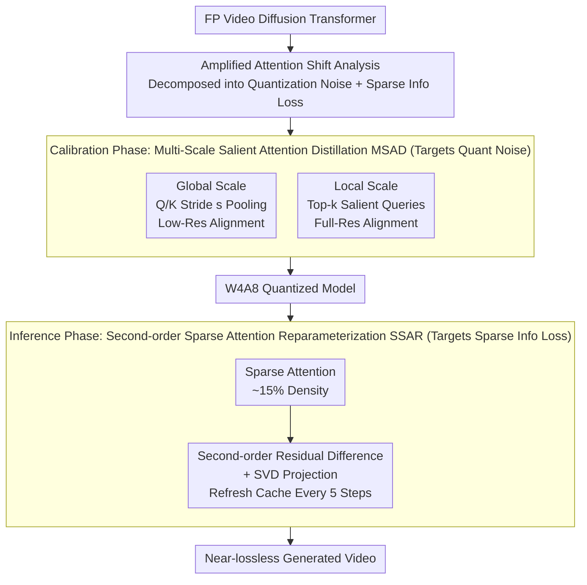

# QuantSparse: Comprehensively Compressing Video Diffusion Transformer with Model Quantization and Attention Sparsification

**Conference**: ICLR 2026  
**arXiv**: [2509.23681](https://arxiv.org/abs/2509.23681)  
**Code**: [GitHub](https://github.com/wlfeng0509/QuantSparse)  
**Area**: Video Generation  
**Keywords**: video-generation, model-compression, quantization, sparse-attention, diffusion-transformer

## TL;DR

This paper proposes the QuantSparse framework, which for the first time synergistically integrates model quantization and attention sparsification for the compression of video diffusion Transformers. By addressing the "amplified attention shift" caused by the naive combination of these two techniques through Multi-Scale Salient Attention Distillation (MSAD) and Second-order Sparse Attention Reparameterization (SSAR), it achieves 3.68× storage compression and 1.88× inference speedup on HunyuanVideo-13B with W4A8 quantization and 15% attention density, while maintaining near-lossless generation quality.

## Background & Motivation

1. **High Computational Cost of Video Diffusion Models**: SOTA models like Wan2.1-14B require 20GB+ GPU memory and nearly one hour of inference time to generate a high-definition video, which severely restricts practical deployment, especially in resource-constrained scenarios.

2. **Quantization and Sparsification are Complementary Compression Directions**: Quantization reduces storage and computation through low-bit integer representations, while sparse attention reduces complexity by pruning redundant attention calculations. Theoretically, they are orthogonal and their benefits can be superimposed.

3. **Severe Degradation at Limits of Single Methods**: Quantizing to extremely low bits (e.g., binarization) leads to a collapse in representation capability, and extreme sparsification discards critical contextual information. Pushing either method to its limit independently leads to significant quality degradation.

4. **Naive Combination Performs Worse**: Experiments reveal that simply combining quantization and sparsification triggers an "amplified attention shift." After sparsification removes low-magnitude attention weights, the systematic perturbation from quantization on the remaining attention product is amplified. These two errors reinforce each other, severely damaging fine-grained dependency modeling in video generation.

5. **Existing Methods Operates Independently**: Quantization methods (Q-VDiT, ViDiT-Q) and sparsification methods (SparseVideoGen, Jenga) have developed independently, and no work has yet systematically explored their synergistic integration strategy.

6. **Attention Distillation Faces Memory Bottlenecks**: For models like HunyuanVideo, where sequence length $L > 10^4$, storing the full attention matrix requires $O(L^2)$ memory, making direct attention distillation infeasible.

## Method

### Overall Architecture

QuantSparse aims to solve the problem where individual quantization or sparsification of video diffusion Transformers provides moderate compression, but pushing them to limits leads to quality collapse, and a naive combination performs worse than either alone. The paper first characterizes this "worse when stacked" failure mechanism as "amplified attention shift," where quantization noise and sparse masks interactively amplify errors. Based on this, the compression pipeline is divided into two parts: a **Calibration Phase** using Multi-Scale Salient Attention Distillation (MSAD) to align the quantized attention distribution with the Full Precision (FP) model to suppress the quantization noise term; and an **Inference Phase** using Second-order Sparse Attention Reparameterization (SSAR) to compensate for the context discarded by sparse masks to fill in the information loss term. Starting from an FP model, MSAD calibration produces a W4A8 quantized model. During inference, sparse attention and SSAR correction are applied, resulting in near-lossless video at approximately 15% attention density.

### Key Designs

**1. Formalization of Amplified Attention Shift: Identifying the Root Cause of Naive Combination Failure**

Directly stacking quantization and sparsification performs worse than using them individually. QuantSparse attributes this to a cross-term. Quantization injects noise $\epsilon$ into the QK dot product, and the sparse mask $\mathbf{M}$ removes low-amplitude weights. The composite shift can be written as $\Delta_{\text{total}} = \Delta_{\text{sparse}} + \Delta_{\text{quant}} + O(\|\epsilon\|_F \cdot \|\mathbf{M}\|_0)$. The first two terms are errors inherent to each method. The real difficulty lies in the third cross-term: sparsification concentrates attention mass on a few remaining weights, causing the perturbation from quantization noise on these weights to be proportionally amplified. These errors reinforce each other, destroying fine-grained spatio-temporal dependencies. By isolating this term, the subsequent modules have clear targets: one to suppress quantization noise $\epsilon$ (MSAD) and another to compensate for the information loss from the sparse mask $\mathbf{M}$ (SSAR).

**2. Multi-Scale Salient Attention Distillation (MSAD): Aligning Quantized Attention under $O(L^2)$ Memory Constraints**

To align quantized attention with the FP distribution via distillation, the most direct way is to align the entire attention matrix. However, for HunyuanVideo where $L > 10^4$, storing the full $O(L^2)$ matrix is impossible. MSAD bypasses this bottleneck using global and local scales. The global scale exploits the spatial locality of videos by applying average pooling with stride $s$ to Q and K. Distillation loss $\mathcal{L}_{\text{global}} = \text{MSE}(\mathbf{A}_{\text{global}}^{\text{FP}} \| \mathbf{A}_{\text{global}}^{\text{quant}})$ is calculated at a low resolution $\tilde{L} = L/s^2$, reducing complexity to $1/s^2$ of full attention while preserving coarse global structure. The local scale targets the highly skewed attention distribution—less than 10% of tokens occupy most of the attention mass. Thus, it selects only the top-$k$ salient queries at full resolution for $\mathcal{L}_{\text{local}} = \text{MSE}(\mathbf{A}_{\text{local}}^{\text{FP}} \| \mathbf{A}_{\text{local}}^{\text{quant}})$, concentrating calibration effort on the most impactful regions at low cost. Both are optimized jointly with the quantization loss $\mathcal{L}_{\text{distill}} = \mathcal{L}_{\text{quant}} + \lambda_{\text{global}} \mathcal{L}_{\text{global}} + \lambda_{\text{local}} \mathcal{L}_{\text{local}}$, suppressing the quantization noise term in the shift formula.

**3. Second-order Sparse Attention Reparameterization (SSAR): Compensating for Sparse Loss with Stable Second-order Residuals**

During inference, the sparse mask discards part of the context. Conventional cache-based methods store the first-order residual $\Delta^{(t)} = \mathbf{A}_{\text{full}}^{(t)} - \mathbf{A}_{\text{sparse}}^{(t)}$ and assume it remains nearly constant across timesteps. Under quantization, this assumption fails: quantization noise $\epsilon^{(t)}$ fluctuates across timesteps, making the first-order residual unstable and introducing outdated errors when reused. The key observation of SSAR is to use the second-order residual $\hat{\Delta}^{(t)} = \Delta^{(t)} - \Delta^{(t-1)}$. Since quantization noise distributions are similar at adjacent timesteps, the noise largely cancels out after differencing, making the temporal variation much smaller than the first-order residual and thus re-cacheable. Furthermore, SVD is applied to the second-order residual, projecting it onto the top $r$ principal components $\tilde{\Delta}_{\text{quant}} = \mathbf{S}_{:,:r} \mathbf{U}_{:r,:r} \mathbf{V}_{:,:r}^\top$ to filter out remaining temporal variance. During inference, the cache is refreshed every 5 steps, using this second-order correction to efficiently approximate full attention output with negligible extra storage, compensating for the information loss from the sparse mask.

## Key Experimental Results

### Setup

- **Models**: HunyuanVideo-13B, Wan2.1-1.3B, Wan2.1-14B
- **Quantization Settings**: W6A6, W4A8, per-channel weight quantization + dynamic per-token activation quantization
- **Baselines**: Quantization methods (PTQ4DiT, Q-DiT, SmoothQuant, QuaRot, ViDiT-Q, Q-VDiT); Sparsification methods (DiTFastAttn, Jenga, SparseVideoGen); and their combinations

### Table 1: HunyuanVideo-13B Main Results (W4A8)

| Method | Density | VQA↑ | PSNR↑ | SSIM↑ | LPIPS↓ | Speedup |
|------|------|------|-------|-------|--------|--------|
| Full Prec. | 100% | 81.23 | - | - | - | 1.00× |
| Q-VDiT | 100% | 67.95 | 16.85 | 0.605 | 0.461 | 1.09× |
| Q-VDiT+SVG | 15% | 76.30 | 16.66 | 0.591 | 0.460 | 1.84× |
| **QuantSparse** | **15%** | **81.19** | **20.88** | **0.678** | **0.273** | **1.88×** |

QuantSparse achieves a VQA of 81.19 at 15% attention density (approaching full precision 81.23). PSNR significantly leads Q-VDiT+SVG (20.88 vs 16.66), while achieving a 1.88× speedup and 3.68× storage compression.

### Table 2: Ablation Study — Module Contribution (Wan2.1-14B, W4A8, 25% Density)

| Module | VQA↑ | PSNR↑ | SSIM↑ | LPIPS↓ |
|------|------|-------|-------|--------|
| No Distillation | 81.92 | 14.35 | 0.486 | 0.425 |
| + Global Guidance | 85.26 | 16.01 | 0.547 | 0.349 |
| + Local Guidance | 86.95 | 16.82 | 0.561 | 0.325 |
| + MSAD (Global+Local) | **91.98** | **18.72** | **0.630** | **0.240** |
| No Cache | 68.00 | 14.16 | 0.470 | 0.445 |
| + 1st Order Residual | 70.82 | 17.08 | 0.572 | 0.285 |
| + 2nd Order Residual | 89.73 | 18.68 | 0.616 | 0.258 |
| + SSAR (2nd+SVD) | **91.98** | **18.72** | **0.630** | **0.240** |

MSAD improves PSNR from 14.35 to 18.72 (+4.37), and SSAR improves it from 14.16 to 18.72 (+4.56). Both modules contribute equally and complementarily.

### Efficiency Analysis

| Configuration | Model Storage | VRAM Consumption | DiT Time | Speedup |
|------|---------|---------|---------|--------|
| Full Prec. | 23.88GB | 35.79GB | 1264s | 1.00× |
| QuantSparse W4A8 15% | **6.49GB** (↓3.68×) | 27.02GB (↓1.32×) | **671s** | **1.88×** |

## Highlights & Insights

- **First Systematic Integration of Quantization + Sparsification**: Proposes a mathematical analysis of "amplified attention shift" and a unified solution, filling the gap in the synergistic application of these two orthogonal compression techniques.
- **Memory-Efficient Attention Distillation**: MSAD bypasses the $O(L^2)$ memory bottleneck through global downsampling and local salient token selection.
- **Key Insight on Second-order Residuals**: Identifies that first-order residuals are unstable under quantization but second-order residuals are stable. This elegant mathematical observation is further enhanced by SVD projection for noise reduction.
- **Aggressive Near-Lossless Compression**: Achieves quality close to full precision at 15% attention density + W4A8, far exceeding all baselines.

## Limitations

- **Calibration Phase Cost**: MSAD requires running both the FP model and the quantized model during PTQ calibration, placing demands on memory and computation during calibration.
- **Manual Cache-Refresh Interval**: The interval=5 is empirical; different models and resolutions may require retuning.
- **SVD Decomposition Overhead**: Although described as "negligible overhead," the actual cost of SVD decomposition on extremely long sequences or very large models needs further verification.
- **Metric Limitations**: Primarily relies on reference-based metrics like PSNR/SSIM and no-reference metrics like VQA/CLIPSIM, lacking large-scale subjective human evaluation.

## Related Work & Insights

### vs. Q-VDiT (Feng et al., 2025) — Current SOTA Quantization

Q-VDiT introduces temporal distillation for quantization calibration and was the prior SOTA for video DiT quantization. However, it only focuses on quantization. On HunyuanVideo W4A8, its PSNR is only 16.85. Even when combined with SVG sparsification, the PSNR is 16.66 (a slight decrease), proving that naive combination is ineffective. QuantSparse leads with 20.88 PSNR, demonstrating the necessity of joint design.

### vs. SparseVideoGen (Xi et al., 2025) — Static Sparse Attention

SVG uses predefined spatio-temporal sparse masks to reduce attention computation, performing well at full precision. However, when combined with quantization (QuaRot+SVG PSNR on HunyuanVideo W4A8 15% density is only 41.40 VQA), performance degrades severely. QuantSparse targets the quantization-sparse interaction via MSAD+SSAR, maintaining high quality at the same compression rates.

### vs. DiTFastAttn (Yuan et al., 2024) — Cache-based 1st Order Residuals

DFT utilizes the temporal stability of first-order residuals for attention approximation. QuantSparse's SSAR points out that first-order residuals are no longer stable under quantization (Proposition 3.2), whereas second-order residuals are (Proposition 3.3). This more rigorous theoretical generalization significantly outperforms DFT in W4A8 settings.

## Rating

- ⭐⭐⭐⭐⭐ Novelty: First synergistic design of quantization and sparsification with solid theoretical analysis and clever module design.
- ⭐⭐⭐⭐⭐ Experimental Thoroughness: Covers three models (1.3B-14B), two quantization settings, multiple baselines/combinations, and detailed ablations.
- ⭐⭐⭐⭐ Writing Quality: Clear mathematical derivations and rich charts, though notation is dense and some details are in the appendix.
- ⭐⭐⭐⭐⭐ Value: 3.68× storage compression + 1.88× speedup with near-lossless quality; direct value for video generation deployment.

<!-- RELATED:START -->

## Related Papers

- [\[ICLR 2026\] Model Already Knows the Best Noise: Bayesian Active Noise Selection via Attention in Video Diffusion Model](model_already_knows_the_best_noise_bayesian_active_noise_selection_via_attention.md)
- [\[ICLR 2026\] Neodragon: Mobile Video Generation Using Diffusion Transformer](neodragon_mobile_video_generation_using_diffusion_transformer.md)
- [\[CVPR 2026\] Attention Surgery: An Efficient Recipe to Linearize Your Video Diffusion Transformer](../../CVPR2026/video_generation/attention_surgery_an_efficient_recipe_to_linearize_your_video_diffusion_transfor.md)
- [\[ICLR 2026\] SANA-Video: Efficient Video Generation with Block Linear Diffusion Transformer](sana-video_efficient_video_generation_with_block_linear_diffusion_transformer.md)
- [\[ICLR 2026\] TPDiff: Temporal Pyramid Video Diffusion Model](tpdiff_temporal_pyramid_video_diffusion_model.md)

<!-- RELATED:END -->
