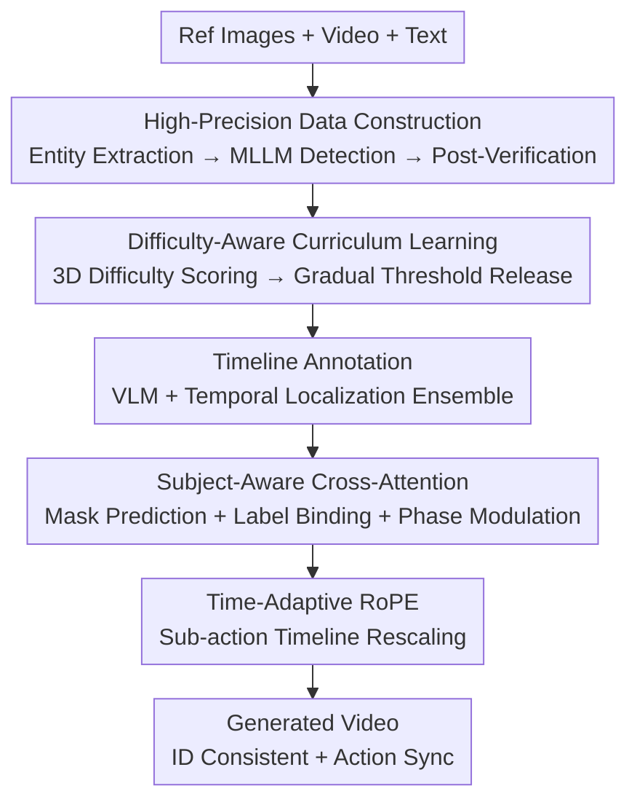

# ReactID: Synchronizing Realistic Actions and Identity in Personalized Video Generation

**Conference**: ICLR 2026  
**OpenReview**: [https://openreview.net/forum?id=yn0Wu7NsTa](https://openreview.net/forum?id=yn0Wu7NsTa)  
**Code**: None  
**Area**: Video Generation / Diffusion Models  
**Keywords**: Personalized Video Generation, Identity Preservation, Timeline Conditioning, Curriculum Learning, RoPE

## TL;DR
ReactID employs a three-pronged approach—high-precision data construction, difficulty-aware curriculum learning, and timeline-structured conditioning (incorporating subject-aware cross-attention and time-adaptive RoPE)—to simultaneously enhance subject identity consistency and action realism in personalized video generation, mitigating the long-standing trade-off between the two.

## Background & Motivation
**Background**: Personalized or subject-to-video generation aims to make a specified subject (person or object) perform desired actions while maintaining identity across frames. Current mainstream solutions are mostly based on Diffusion Transformers (DiT), injecting identity information from reference images via cross-attention or adapters.

**Limitations of Prior Work**: These methods struggle with the "identity consistency vs. action realism" trade-off. To anchor the identity, models often degrade into a "copy-paste" mode where subjects remain static like stickers, resulting in stiff actions or repetitive stacking. Conversely, emphasizing motion dynamics often causes identity drift and artifacts.

**Key Challenge**: The authors decompose this imbalance into three intertwined root causes. First, **inaccurate subject-video alignment**: traditional annotation pipelines produce incomplete or misaligned bounding boxes and incorrect identity associations, leading to unreliable identity representations. Second, **unstable training**: variance in sample difficulty causes issues. Large, clear "easy samples" induce copy-paste shortcuts, while small, varied "hard samples" force the model to use motion priors but slow down convergence; indiscriminate mixed training disrupts convergence patterns. Third, **coarse action modeling**: using only monolithic text prompts lacks fine-grained temporal annotations, causing the model to prioritize clearly supervised identity features over motion patterns, leading to rigid actions.

**Goal**: To reconstruct data, training, and action modeling to synchronize identity and action rather than sacrificing one for the other.

**Key Insight**: Rather than implementing isolated architectural tricks, the three bottlenecks of the entire pipeline should be addressed systematically.

**Core Idea**: Replace "noisy annotations + indiscriminate training + single-segment text" with "high-precision subject annotations + easy-to-hard curriculum + timestamped structured timeline conditions" to anchor both identity and fine-grained actions to the correct subjects.

## Method

### Overall Architecture
ReactID is a collaborative framework covering "Data-Training-Modeling" based on Wan2.1-T2V-1.3B. Given reference images and descriptions, it generates videos with high identity fidelity and natural actions following multi-action timelines. The workflow involves: building ReactID-Data via a high-precision pipeline; sorting samples by difficulty for curriculum learning; and upgrading text prompts to "timestamped sub-action timelines." Inside the DiT blocks, a **Subject Synchronization Module** is inserted, featuring subject-aware cross-attention (binding actions to subjects) and time-adaptive RoPE (ensuring attention invariance across action durations). During inference, an LLM acts as a "time planner" to expand single natural language prompts into timelines.

### Key Designs

**1. ReactID-Data: High-Precision Subject Annotation Pipeline**

To resolve inaccurate subject-video alignment, the authors built an automated high-precision pipeline. It processes 20 million videos from public sets like HD-VG-130M and OpenHumanVid through scene splitting, transcoding, and quality filtering. The core is **refined entity extraction**: instead of coarse entities from standard NER, ReactID uses a 1,200-word vocabulary to classify entities as "animate/inanimate." Animate entities receive fine-grained labels (e.g., "person in red") generated by a VLM for instance differentiation. Florence-2 (MLLM) localizes entities into bounding boxes, followed by cross-modal distance verification in SigLIP feature space and segmentation via SAM. For human entities, InsightFace extracts face boxes/masks. This chain ensures reliable subject-video correspondence.

**2. Difficulty-Aware Curriculum Learning**

To stabilize training, "difficulty" is quantified as a weighted sum: $D_{overall} = \lambda_{sub}D_{sub} + \lambda_{app}D_{app} + \lambda_{sam}D_{sam}$. **Subject size difficulty** $D_{sub}$ is inversely defined by the mask-to-pixel ratio: $D_{sub} = 1 - (NHW)^{-1}\sum_n\sum_i\sum_j \mathbb{1}\{M_n(i,j)=1\}$. **Appearance similarity difficulty** $D_{app}$ uses the inverse average cosine similarity between reference images and video subject regions (using DINOv2 or ArcFace). **Sampling strategy difficulty** $D_{sam}$ distinguishes between intra-clip (easier, $D_{sam}=0$) and inter-clip (harder, $D_{sam}=1$) references. Training progresses through four stages by gradually increasing the difficulty threshold $\tau$ based on quantiles, effectively preventing copy-paste overfitting on easy samples while ensuring convergence on hard ones.

**3. Timeline-Structured Conditioning & Subject-Aware Cross-Attention**

To handle fine-grained dynamics, ReactID constructs **timeline annotations** for 1.2 million pairs. It integrates timestamps from Qwen2.5-VL-72B, UniMD, and TFVTG, with InternVideo2 acting as a reward model to select the best one. Sub-actions are injected via the **Subject Synchronization Module**. **Subject-aware cross-attention** uses an attention-based mask predictor (supervising the cross-attention map between reference and video tokens via focal loss). **Label binding** assigns numerical labels (e.g., $\alpha$ for "woman in red") to video tokens and timeline prompts within respective masks. Phase modulation $\tilde{q}_i = q_i e^{l_i\theta_0}$ and $\tilde{k}_j = k_j e^{l_j\theta_0}$ ensures that the attention bias $\tilde{q}_i^\top\tilde{k}_j$ is maximized when labels $l_i = l_j$, correctly routing sub-action semantics to the corresponding subject.

**4. Time-Adaptive RoPE**

Standard temporal RoPE uses absolute frame indices, assuming uniform sub-action lengths. This causes temporal misalignment and action jumps near transitions because a frame might be numerically closer to the midpoint of an adjacent sub-action. The authors propose **Time-Adaptive RoPE**, which rescales the time axis per sub-action: for a frame $f$ in interval $[f^{start}_n, f^{end}_n]$, the rescaled index is $f' = (f - f^{start}_n)/(f^{end}_n - f^{start}_n)\cdot T + (n-1)\cdot T$. This normalization makes attention bias duration-invariant, leading to smoother transitions.

### Loss & Training
The framework is built on Wan2.1-T2V-1.3B, trained for 10k steps with a global batch size of 32 using AdamW (LR $1\times10^{-5}$). Focal loss supervises subject mask prediction. Difficulty weights $\lambda_{sub},\lambda_{app},\lambda_{sam}$ are set to 0.5, 1, and 1. Inference uses 50 steps of denoising at CFG=5.0.

## Key Experimental Results

### Main Results
Evaluated on OpenS2V-Eval and the custom ReactID-Eval-SEQ.

| Dataset / Scenario | Metric | ReactID | Prev. SOTA | Gain |
|--------|------|------|----------|------|
| OpenS2V-Eval (Single Subject) | TotalScore | 56.04% | Phantom-1.3B 54.50% | +1.54% |
| OpenS2V-Eval (Peoples) | TotalScore | 62.17% | Phantom-1.3B 60.00% | +2.17% |
| ReactID-Eval-SEQ (Multi-action) | TotalScore | 54.42% | Phantom-1.3B 51.40% | +3.02% |

ReactID's Motion Amplitude is significantly higher (40.79% vs. Phantom's 14.09% in the human domain). FaceSim is slightly lower than Phantom, which the authors attribute to motion blur—a reasonable trade-off for larger, more natural motion. In user studies, ReactID leads across all dimensions, including subject consistency (3.90) and action naturalness (4.00).

### Ablation Study

| Configuration | TotalScore | Note |
|------|---------|------|
| Full Curriculum | 54.42% | Full curriculum learning |
| w/o $D_{sub}$ | 53.35% | Without subject size cues |
| w/o $D_{app}$ | 53.76% | Without similarity cues |
| w/o $D_{sam}$ | 52.68% | Without sampling strategy cues (highest drop) |
| Random Expansion | 51.39% | Sample expansion without difficulty guidance |
| Full Data Training | 51.54% | Direct training on full data |

Regarding subject-aware cross-attention, a "Uniform" label strategy outperformed "Adaptive," suggesting that fixed hard-coding is more robust for identity preservation. For Time-Adaptive RoPE, TARoPE ($T=2$) outperformed vanilla RoPE on CLIP-T and temporal consistency metrics.

### Key Findings
- **Sampling strategy $D_{sam}$** is the most critical difficulty cue; scheduling intra/inter-clip references is vital to force the model to learn beyond copy-pasting.
- **Curriculum value**: Randomly expanding data (51.39%) is worse than full data training (51.54%), proving that the value of curriculum learning lies in the *order* of difficulty rather than the data volume alone.
- Phase modulation with dispersed label values (e.g., 2 and 20) provides more robust subject routing than smaller values.

## Highlights & Insights
- **Systematic Diagnosis**: Decomposing the identity-action trade-off into addressable data, training, and modeling bottlenecks is a reusable engineering methodology.
- **Quantifiable Difficulty**: Defining curriculum stages via calculable metrics (size, similarity, sampling) provides a more grounded approach than empirical scheduling.
- **Phase Modulation for Routing**: Using $e^{l\theta_0}$ to maximize inner products within labels is an elegant, lightweight way to embed routing into attention without hard masking.
- **Duration-Invariant Time Embeddings**: The rescaling trick in Time-Adaptive RoPE addresses temporal misalignment at transition boundaries, acting as a "plug-and-play" temporal alignment fix.

## Limitations & Future Work
- **FaceSim trade-off**: ReactID still faces a slight dip in face similarity compared to copy-paste heavy models, as motion blur from large movements affects fidelity.
- **Resource Intensity**: The pipeline relies on multiple external LLMs and VLMs, making data construction computationally expensive.
- **Base Model Scale**: Validated only on a 1.3B DiT; scalability to larger bases and longer durations requires further verification.
- **Inference Planning**: Zero-shot timeline planning relies on the LLM's capability; planning failures directly impact action synchronization.

## Related Work & Insights
- **vs. Phantom / VACE / Concat-ID**: These baselines inject identity via cross-attention or concatenation but struggle with multi-action sequences and motion amplitude. ReactID's timeline conditions improve seq-action scores by 3.02%.
- **vs. Tuning-based Methods**: Unlike UNet-era methods requiring test-time optimization, ReactID is a tuning-free framework for multi-subject and multi-action scenarios.

## Rating
- Novelty: ⭐⭐⭐⭐ Targeted combination of timeline conditioning and Subject Sync Module.
- Experimental Thoroughness: ⭐⭐⭐⭐ Solid evaluation across three datasets with comprehensive ablation and user studies.
- Writing Quality: ⭐⭐⭐⭐ Clear logic, effectively connecting the three causes to three solutions.
- Value: ⭐⭐⭐⭐ Strong practical contribution to the community via both data and framework insights.

<!-- RELATED:START -->

## Related Papers

- [\[CVPR 2026\] Lynx: Towards High-Fidelity Personalized Video Generation](../../CVPR2026/video_generation/lynx_towards_high-fidelity_personalized_video_generation.md)
- [\[ICLR 2026\] LumosX: Relate Any Identities with Their Attributes for Personalized Video Generation](lumosx_relate_any_identities_with_their_attributes_for_personalized_video_genera.md)
- [\[ICLR 2026\] AUHead: Realistic Emotional Talking Head Generation via Action Units Control](auhead_realistic_emotional_talking_head_generation_via_action_units_control.md)
- [\[CVPR 2026\] Stand-In: A Lightweight and Plug-and-Play Identity Control for Video Generation](../../CVPR2026/video_generation/stand-in_a_lightweight_and_plug-and-play_identity_control_for_video_generation.md)
- [\[ICLR 2026\] DanceTogether: Generating Interactive Multi-Person Video without Identity Drifting](dancetogether_generating_interactive_multi-person_video_without_identity_driftin.md)

<!-- RELATED:END -->
## Related Papers

- [\[CVPR 2026\] Lynx: Towards High-Fidelity Personalized Video Generation](../../CVPR2026/video_generation/lynx_towards_high-fidelity_personalized_video_generation.md)
- [\[ICLR 2026\] LumosX: Relate Any Identities with Their Attributes for Personalized Video Generation](lumosx_relate_any_identities_with_their_attributes_for_personalized_video_genera.md)
- [\[CVPR 2026\] Stand-In: A Lightweight and Plug-and-Play Identity Control for Video Generation](../../CVPR2026/video_generation/stand-in_a_lightweight_and_plug-and-play_identity_control_for_video_generation.md)
- [\[ICML 2026\] OLAF-World: Orienting Latent Actions for Video World Modeling](../../ICML2026/video_generation/olaf-world_orienting_latent_actions_for_video_world_modeling.md)
- [\[CVPR 2026\] ConsID-Gen: View-Consistent and Identity-Preserving Image-to-Video Generation](../../CVPR2026/video_generation/consid-gen_view-consistent_and_identity-preserving_image-to-video_generation.md)

<!-- RELATED:END -->
