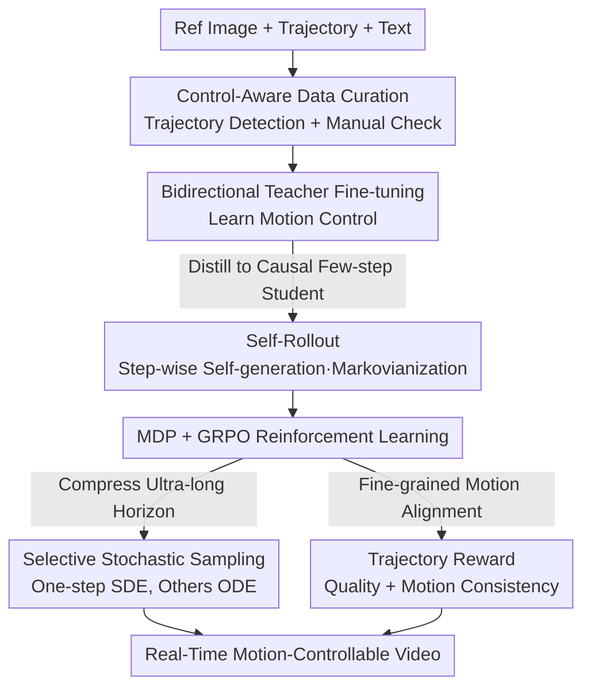

# Real-Time Motion-Controllable Autoregressive Video Diffusion

**Conference**: ICLR 2026  
**OpenReview**: [https://openreview.net/forum?id=4Q55RwYte9](https://openreview.net/forum?id=4Q55RwYte9)  
**Code**: Project Page https://kesenzhao.github.io/AR-Drag.github.io/  
**Area**: Video Generation / Diffusion Models  
**Keywords**: Autoregressive Video Diffusion, Motion-Controllable Generation, Real-Time Generation, Reinforcement Learning, GRPO

## TL;DR
This paper proposes AR-Drag—the first few-step autoregressive image-to-video (I2V) diffusion model enhanced by Reinforcement Learning. By using Self-Rollout to maintain Markovian properties, compressing ultra-long decision horizons with selective stochastic sampling, and introducing trajectory-based rewards for GRPO, it achieves a first-frame latency of 0.44s with 1.3B parameters, outperforming existing bidirectional motion-controllable models in both visual quality and motion control.

## Background & Motivation

**Background**: Current mainstream controllable video diffusion models (VDMs) are predominantly based on **bidirectional** DiT—denoising all frames simultaneously, where information from future frames can influence past frames. Motion-controllable methods such as Tora, DragAnything, DragNUWA, and MagicMotion utilize this design.

**Limitations of Prior Work**: Bidirectional designs are inherently unsuitable for real-time interaction. Since the entire video must be generated jointly, denoising can only begin after **all** control signals are provided, causing high latency (176s for Tora, and 1426s for the 5B MagicMotion). Furthermore, they cannot adjust time-evolving motion commands during the generation process. Autoregressive (AR) VDMs generate frames sequentially and are naturally suited for real-time control, but most existing AR VDMs are for text-to-video (T2V), support only simple signals like poses or camera motion, or suffer from quality degradation and motion artifacts in difficult I2V scenarios due to error accumulation—especially in few-step models.

**Key Challenge**: Introducing Reinforcement Learning (RL)—with its capability for trial-and-error exploration and generalization—into AR video generation (to combat error accumulation and expand the control action space) faces three hurdles: (1) Standard AR VDMs use teacher forcing during training (conditioning on **ground-truth** history) but utilize **self-generated** frames during inference, creating a train–test mismatch that breaks the Markov Decision Process (MDP) required for RL; (2) The decision horizon of video generation equals denoising steps $\times$ frames, leading to an **ultra-long horizon** where step-by-step randomness causes reward variance to explode; (3) Lack of reward models for controllable video generation that can finely evaluate motion alignment.

**Goal / Core Idea**: Construct a few-step, real-time, motion-controllable AR I2V model and successfully apply GRPO for the first time. The **Key Insight** is to satisfy RL prerequisites via **Self-Rollout** (strictly self-generating history during training to "Markovianize" the process) and **selective stochasticity** (using SDE for only one randomly selected denoising step while others follow deterministic ODE), finalized with a **trajectory-based reward**.

## Method

### Overall Architecture

AR-Drag follows a two-step approach. **Step 1** involves building a real-time AR base model with fundamental motion control: curated data with control signals is used to fine-tune a **bidirectional teacher** (Wan2.1-1.3B-I2V) for motion control, which is then distilled into a **few-step causal student** (replacing bidirectional attention with causal attention and using DMD + adversarial loss, requiring only $N=3$ denoising steps per frame for real-time inference). **Self-Rollout** is introduced during distillation to align training with AR inference, "Markovianizing" the training for Step 2. **Step 2** formalizes AR video generation as an MDP and optimizes it via GRPO: Self-Rollout provides the Markovian property, and the ODE→SDE transition provides stochasticity. Finally, **selective stochastic sampling** compresses the ultra-long horizon variance, optimized by a composite reward evaluating quality and motion alignment.

For control signals, the $m$-th frame uses a three-way signal $c_m$: trajectory embedding $c^{traj}_m$ (raw coordinate heatmaps via VAE encoder), text embedding $c^{text}$ (shared across all frames), and a reference image embedding $c^{ref}$ (VAE + CLIP encoding) injected only in the first frame ($m=0$), with Gaussian noise placeholders for other frames.

### Key Designs

**1. Self-Rollout: Markovianizing AR Training via Self-Generated History**

This addresses Limitation (1). Standard AR VDM training uses teacher forcing, whereas inference depends on the model's own output, causing exposure bias and breaking the MDP property. Self-Rollout maintains a KV memory cache of previously denoised frames as causal context. During training, all frames are **denoised sequentially from pure noise**. For the $m$-th frame at the $n$-th denoising step $x_{m,n}$: a random step $n$ is sampled, the model denoises from $x_{m,0}$ to $x_{m,n}$ to calculate DMD loss (Eq. 5) and adversarial loss, then **continues step-wise** denoising until $x_{m,N}$. The generated clean frame $x_{m,N}$ updates the KV cache. This ensures subsequent frames depend on self-generated history. Unlike Self-Forcing, which collapses the $x_{m,n} \to x_{m,N}$ trajectory into a single step, Self-Rollout adheres to full step-wise ancestral sampling, matching inference dynamics and providing a clean sequential decision process for GRPO. Removing Self-Rollout causes FID to jump from 28.98 to 38.13 and FVD from 187 to 354, proving its necessity.

**2. MDP Formulation for Video Generation + GRPO**

To apply GRPO, AR video denoising is formulated as an MDP. State $s_{m,n} \triangleq (c_m, t_n, X_{m,n})$, where the video snapshot $X_{m,n}$ consists of "generated clean frames $x_{<m,N}$ + current denoising frame $x_{m,n}$ + noise $x_{>m,0}$". Action $a_{m,n} \triangleq x_{m,n+1}$ is the next denoising state sampled from policy $p_\theta$ (stochasticity via ODE→SDE). Rewards are **given only upon frame completion**: $R(x_{m,N},c_m) = \mathbb{1}[n=N] \cdot (R_{quality} + R_{motion})$. GRPO is then extended to AR video by sampling a group of $G$ trajectories and calculating advantages $\hat A^{(i)}_{m,n} = \frac{R-\text{mean}}{\text{std}}$ with importance clipping and KL regularization.

**3. Selective Stochastic Sampling: Variance Suppression for Ultra-long Horizons**

This addresses Limitation (2). GRPO requires stochasticity for advantage estimation and exploration, introduced via ODE→SDE conversion (Eq. 4). However, AR video chains are extremely long, and performing SDE sampling at **every** step causes trajectory reward variance to explode. The solution restricts stochasticity: for each frame, only **one randomly selected step** $\tilde n$ follows SDE, while all other steps use a deterministic ODE solver. This provides sufficient exploration while reducing the effective horizon by 5–20 times, making GRPO stable for AR diffusion.

**4. Trajectory-based Composite Reward: Optimizing Realism and Precision**

This addresses Limitation (3). The composite reward is defined as $R = R_{quality} + R_{motion}$. Quality is measured by a LAION aesthetic predictor $f_{AQ}$ (scoring 1–5): $R_{quality}(x_{m,N}) = f_{AQ}(x_{m,N})$. Motion reward utilizes Co-Tracker to estimate trajectories $\hat c^{traj}_m$ from generated frames and compares them to ground truth: $R_{motion} = \lambda \max(0, \alpha - \|\hat c^{traj}_m - c^{traj}_m\|_2^2)$, where $\alpha$ is a bias and $\lambda$ is a scaling factor. This hinge-style reward allows for fine-grained control constraints.

### Loss & Training

Step 1 uses an extended flow-matching objective $L_{FM}(\theta) = \mathbb{E}_{t,x_t}[\|v_\theta(c,t,x_t) - v\|_2^2]$ to fine-tune the teacher, and a combination of DMD loss and adversarial loss to distill the student. Step 2 applies $L_{GRPO}$. Implementation uses Wan2.1-1.3B-I2V, 3-step per-frame denoising, a KV cache of 7 frames, AdamW, $lr=1e-5$, 8 $\times$ H20. LoRA is avoided to prevent performance degradation. Evaluation is conducted on a self-built benchmark of 206 diverse segments.

## Key Experimental Results

### Main Results

| Method | Latency (s) $\downarrow$ | FID $\downarrow$ | FVD $\downarrow$ | Aesthetic $\uparrow$ | Motion Smooth $\uparrow$ | Motion Consist $\uparrow$ |
| :--- | :--- | :--- | :--- | :--- | :--- | :--- |
| DragNUWA | 94.26 | 36.31 | 376.39 | 3.30 | 0.9759 | 3.71 |
| DragAnything | 68.76 | 38.13 | 367.74 | 3.22 | 0.9811 | 3.63 |
| Tora | 176.51 | 32.84 | 283.43 | 3.86 | 0.9855 | 3.97 |
| MagicMotion (5B) | 1426.37 | 30.04 | 230.53 | 4.01 | 0.9871 | 3.95 |
| Self-Forcing | 0.95 | 34.47 | 315.87 | 3.70 | 0.9920 | 4.06 |
| **AR-Drag (Ours, 1.3B)** | **0.44** | **28.98** | **187.49** | **4.07** | **0.9948** | **4.37** |

**AR-Drag outperforms all baselines across all six metrics**. Latency (0.44s) is less than 1% of Tora's and less than half of Self-Forcing (0.95s). It achieves the lowest FID/FVD and highest aesthetic and motion scores. Significantly, it outperforms the 5B MagicMotion with only 1.3B parameters.

### Ablation Study

| Configuration | Latency (s) $\downarrow$ | FID $\downarrow$ | FVD $\downarrow$ | Aesthetic $\uparrow$ | Motion Smooth $\uparrow$ | Motion Consist $\uparrow$ |
| :--- | :--- | :--- | :--- | :--- | :--- | :--- |
| **AR-Drag (Full)** | 0.44 | 28.98 | 187.49 | 4.07 | 0.9948 | 4.37 |
| w/o RL (Base) | 0.44 | 31.65 | 210.35 | 3.92 | 0.9926 | 4.12 |
| Initial model (Wan2.1) | 45.72 | 35.94 | 303.16 | 3.84 | 0.9915 | 3.22 |
| Teacher model | 45.64 | 29.38 | 151.46 | 4.15 | 0.9941 | 4.36 |
| w/o Self-Rollout | 0.44 | 38.13 | 353.75 | 3.38 | 0.9904 | 4.02 |

### Key Findings
- **Self-Rollout is critical**: Removing it degrades FID from 28.98 to 38.13, causing severe artifacts as it breaks the Markovian property.
- **RL Post-training yields significant gains**: RL encourages exploration, recovers missing details (e.g., feet), and alleviates over-saturation found in the non-RL base.
- **Efficiency**: AR-Drag (student) matches or exceeds the bidirectional multi-step **teacher** in quality metrics (FID 28.98 vs 29.38) while reducing latency from 45.64s to 0.44s.

## Highlights & Insights
- **First application of GRPO to AR video generation**: The core insight is that GRPO failure stems from non-MDP dynamics and long horizons, solved via Self-Rollout and selective stochasticity.
- **The "one-step difference" between Self-Rollout and Self-Forcing**: Ensuring full ancestral sampling during cache updates is a small but vital correction that enables RL.
- **Generic Selective Stochasticity**: This trick can be applied to any diffusion-based RL with long decision chains to maintain stability and lower costs.

## Limitations & Future Work
- Rewards are limited by the capacity of off-the-shelf models (LAION predictor and Co-Tracker).
- The 206-segment benchmark is relatively small, and motion consistency evaluation involves self-reference to the reward model.
- Long-term consistency beyond the 7-frame KV cache and performance under dense/multi-object trajectories require further testing.
- Scaling behavior to larger foundation models remains to be verified.

## Related Work & Insights
- **vs. Self-Forcing**: Both combat exposure bias, but Self-Forcing's single-step update violates MDP. AR-Drag's Self-Rollout follows the chain rule strictly, enabling GRPO and better quality.
- **vs. Tora / MagicMotion**: These rely on bidirectional DiTs; AR-Drag achieves real-time interactivity while surpassing their motion control precision.
- **vs. DanceGRPO / FlowGRPO**: While these applied GRPO to bidirectional T2I flow-matching, AR-Drag extends it to the more challenging AR I2V video setting.

## Rating
- Novelty: ⭐⭐⭐⭐⭐ 
- Experimental Thoroughness: ⭐⭐⭐⭐ 
- Writing Quality: ⭐⭐⭐⭐ 
- Value: ⭐⭐⭐⭐⭐ 

<!-- RELATED:START -->

## Related Papers

- [\[ICLR 2026\] Rolling Forcing: Autoregressive Long Video Diffusion in Real Time](rolling_forcing_autoregressive_long_video_diffusion_in_real_time.md)
- [\[ICLR 2026\] MotionStream: Real-Time Video Generation with Interactive Motion Controls](motionstream_real-time_video_generation_with_interactive_motion_controls.md)
- [\[ICLR 2026\] LongLive: Real-time Interactive Long Video Generation](longlive_real-time_interactive_long_video_generation.md)
- [\[CVPR 2025\] Teller: Real-Time Streaming Audio-Driven Portrait Animation with Autoregressive Motion Generation](../../CVPR2025/video_generation/teller_real-time_streaming_audio-driven_portrait_animation_with_autoregressive_m.md)
- [\[ICLR 2026\] Lumos-1: On Autoregressive Video Generation with Discrete Diffusion from a Unified Model Perspective](lumos-1_on_autoregressive_video_generation_with_discrete_diffusion_from_a_unifie.md)

<!-- RELATED:END -->
