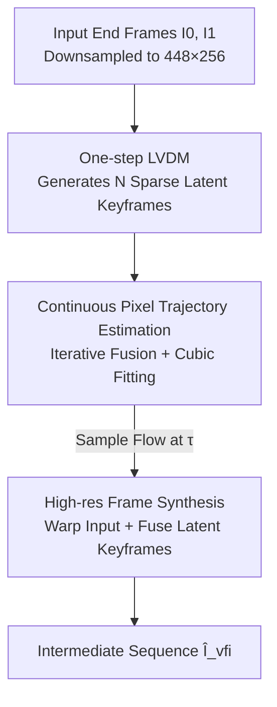

# Realtime Video Frame Interpolation Using One-Step Diffusion Sampling

**Conference**: ICLR 2026  
**OpenReview**: [https://openreview.net/forum?id=OiWyf1BNtC](https://openreview.net/forum?id=OiWyf1BNtC)  
**Code**: See project page (mentioned in the paper, no explicit repository link provided)  
**Area**: Video Generation / Diffusion Models / Video Frame Interpolation  
**Keywords**: Video Frame Interpolation, Latent Video Diffusion, One-step Sampling, Continuous Pixel Trajectory, Real-time

## TL;DR
RDVFI transforms video frame interpolation from "directly drawing intermediate frames with diffusion" into "using one-step diffusion to generate sparse latent keyframes and fitting high-order continuous pixel trajectories to warp input pixels." It achieves real-time speeds of 17 FPS at 1024×576 (approx. 44× faster than SOTA) while minimizing ghosting and deformation in large-motion scenes.

## Background & Motivation
**Background**: Video Frame Interpolation (VFI) aims to synthesize intermediate frames at arbitrary timestamps between two given end frames. Mainstream approaches estimate optical flow between intermediate and input frames to warp pixels. Motion modeling evolved from early low-order rigid priors (linear/quadratic) to data-driven non-parametric flow estimation. Recent SOTA methods (GI, FCVG, Wan) reformulate VFI as a conditional generation problem based on Latent Video Diffusion Models (LVDM) to directly generate intermediate frame pixels.

**Limitations of Prior Work**: LVDM-based direct generation faces two major issues. First, "Pixel Fidelity Bias": their training objective is pixel-wise reconstruction, optimizing for local texture proximity rather than global motion consistency, leading to structural artifacts like ghosting and object deformation under intense, non-rigid motion. Second, high computational cost: generating high-frequency details requires multi-step iterative sampling; existing distillation methods for speed-up often amplify these structural artifacts when sampling steps are reduced for complex motions.

**Key Challenge**: There is a contradiction in making the diffusion model responsible for both "motion" and "texture." Texture requires dense multi-step sampling for clarity, yet the appearance of intermediate frames is mostly present in the two input frames. The actual missing information is the motion—how to move input pixels to the intermediate timestamp. Coupling these into a single generative target slows down speed and harms motion accuracy.

**Goal**: Decouple "motion generation" from "high-resolution rendering." Let diffusion handle motion and warping handle pixels to achieve both accuracy and real-time speed.

**Key Insight**: The authors observe that if LVDM is used only to generate a few sparse keyframes to determine the coefficients of a high-order continuous pixel trajectory, the modeling target degrades from "high-frequency texture" to "low-frequency motion structure." Motion structure is far less sensitive to sampling steps, making one-step sampling sufficient.

**Core Idea**: Use one-step LVDM to generate sparse latent keyframes → Use keyframes to determine high-order continuous pixel trajectories → Sample optical flow from trajectories to warp input pixels, shifting the diffusion burden from "drawing frames" to "defining motion."

## Method

### Overall Architecture
Given two end frames $I_0, I_1$, RDVFI synthesizes the intermediate sequence $\{\hat I_{\tau_j}\}_{j=1}^{L}$ for any $\tau_j \in (0,1)$. The pipeline consists of two phases: **Phase 1 estimates continuous pixel trajectories at a fixed low resolution (e.g., 448×256)**, and **Phase 2 performs frame synthesis at high resolution (e.g., 1024×576)**. The efficiency gain is derived from running diffusion and trajectory estimation on low-resolution, low-frequency motion, while only the lightweight warp + fusion step operates at full resolution.

Specifically, Phase 1 downsamples the input and uses a one-step LVDM to generate $N$ sparse latent keyframes $\{\hat z_{k_i}\}_{i=1}^{N}$. These keyframes act as temporal anchors for the continuous pixel trajectory estimator, which iteratively fuses motion between adjacent frames and fits them into a continuous trajectory using cubic convolution, allowing sampling at any timestamp. Phase 2 samples dense optical flow from this trajectory at each $\tau_j$, warps the input frames, and fuses the latent keyframes to compensate for appearance changes (dynamic texture, lighting, occlusion) that flow cannot represent, outputting high-resolution intermediate frames.

### Key Designs

**1. One-step Latent Video Diffusion: Generating Sparse Keyframes and Modeling Motion**

This design addresses the issue where diffusion-based frame generation is slow and fails during large motions. Instead of multi-step sampling for all intermediate frames, RDVFI uses **one-step sampling** to generate a few ($N=7$ in experiments) latent keyframes $\hat z_{k_i}$. The underlying LVDM follows standard v-prediction training: noisy latent frames $z_t = \alpha_t z + \sigma_t \epsilon_t$ are processed by a denoising network $F_\theta(z_t; t, z_0, z_1)$ conditioned on input latents to predict velocity $v_t = \alpha_t \epsilon_t - \sigma_t z$, with the objective $L_\theta(t) = \lVert F_\theta(z_t; t, z_0, z_1) - v_t \rVert$. One step is sufficient because these frames define "motion" rather than "details." Since the appearance is already in the inputs, diffusion only needs to provide structural information, which lacks high-frequency components and is sampling-insensitive. Furthermore, because $N \ll L$ and motion is resolution-scalable, the LVDM operates at a smaller spatiotemporal resolution, enhancing speed and training stability.

**2. High-order Continuous Pixel Trajectories: Iterative Fusion of Small Motions**

This design targets the failure of low-order or non-parametric motion modeling to capture large, non-linear movements. RDVFI defines pixel trajectories as mappings $\{f_{0\to\tau}, f_{1\to\tau}\}$ indexing input pixel offsets to any $\tau$. To maintain accuracy under large displacement, it avoids direct long-range flow regression. Instead, it **decomposes complex motion into smaller, easily estimated components between adjacent frames and fuses them iteratively**: first estimating motion between adjacent keyframes $f_{k_i\to k_{i+1}} = \varphi_1(\hat z_{k_i}, \hat z_{k_{i+1}})$, then recursively fusing the flow from input frames to each keyframe $f_{0\to k_{i+1}} = \varphi_2(f_{0\to k_i}, f_{k_i\to k_{i+1}}, z_0, \hat z_{k_{i+1}})$. Finally, cubic convolution fits these keyframe flows into a **high-order** continuous function. This iterative approach is more robust than direct regression baselines (proven by the significant drop in the "Direct Warping" ablation).

**3. Frame Synthesis Module: Warping and Fusion**

This design solves the problem where optical flow can only move existing pixels but cannot generate new appearance. For each $\tau_j$, optical flows $\{f_{0\to\tau_j}, f_{1\to\tau_j}\}$ are sampled to produce warped frames $\{I_{0\to\tau_j}, I_{1\to\tau_j}\}$. Unlike traditional methods, RDVFI also identifies adjacent keyframes $z_{k_i}, z_{k_{i+1}}$, warps them to $\tau_j$, and uses a network $\varphi_s(\cdot)$ to fuse the warped frames with warped latent keyframes. The latent keyframes provide the necessary information for dynamic textures, lighting changes, and occlusions, ensuring detailed output without sacrificing speed.

### Loss & Training
RDVFI is trained in two stages. **Stage 1: Motion-guided Decoding**—Frees rest and trains the continuous trajectory estimator to decode latent keyframes into accurate flow. Lacking ground truth flow, it uses unsupervised learning with a reconstruction loss on interpolated frames: $L_{rec}(\hat I_{rec}, I) = w_1 L_{lpips}(I, \hat I_{rec}) + w_2 \lVert I - \hat I_{rec} \rVert_2$, with weights $w_1=0.2, w_2=1$. **Stage 2: One-step Diffusion Training**—Freezes the trajectory estimator and synthesis network to update the LVDM. To stabilize, the sampling lower bound is linearly increased during training. The total objective adds interpolated reconstruction loss to the latent space loss: $L_{vfi}(I, \hat I_{vfi}) = \lambda_1 L_\theta(t) + \lambda_2 L_{rec}(\hat I_{vfi}, I)$, with $\lambda_1=1.0, \lambda_2=0.5$. Since decoding includes trajectory estimation, the pixel-space reconstruction term acts as an **implicit motion regularization**, forcing the diffusion to generate latents that accurately restore cross-frame motion. Backbones are based on 1.5B SVD (RDVFI-U) and Wan2.1-Fun-1.3B-InP (RDVFI-D).

## Key Experimental Results

### Main Results
Evaluation across three benchmarks (DAVIS-7 / FCVG / Pixels), lower is better:

| Dataset | Metric | RDVFI-D | Runner-up | Note |
|:---:|:---:|:---:|:---:|:---:|
| DAVIS-7 | FVD↓ | 189.37 | 201.49 (RDVFI-U) | Outperforms all baselines |
| FCVG | FVD↓ | 197.86 | 214.45 (Wan) | ~8% lower than Wan |
| FCVG | FID↓ | 19.98 | 28.52 (Wan) | Significant lead |
| Pixels | FVD↓ | 119.21 | 129.33 (RDVFI-U) | State-of-the-art |

RDVFI-D generally outperforms the SVD-based RDVFI-U due to a stronger backbone (DiT/Wan). Image-diffusion methods (LDMVFI, MoMo) suffer from ghosting, while direct generation (GI, Wan) shows structural degradation.

### Efficiency Comparison (FCVG Dataset, ×24 Interpolation, 1024×576)

| Method | VRAM (GB) | Time per Frame (s) | FVD↓ |
|:---:|:---:|:---:|:---:|
| Wan (Previous SOTA Diffusion) | 18.0 | 2.579 | 214.45 |
| FCVG | 27.6 | 14.381 | 225.48 |
| GI | 23.5 | 29.613 | 282.22 |
| RDVFI-U | 14.2 | 0.137 | 217.72 |
| RDVFI-D | 13.1 | **0.057** | **197.86** |

RDVFI-D at 0.057s/frame ≈ 17 FPS is the fastest and most memory-efficient diffusion VFI method. Only the non-generative RIFE (0.025s) is faster, but RIFE cannot handle complex large motions.

### Ablation Study

| Configuration | LPIPS↓ | FID↓ | FVD↓ | Note |
|:---:|:---:|:---:|:---:|:---:|
| Direct Warping | 0.287 | 42.33 | 327.11 | No iterative fusion |
| L loss | 0.269 | 33.29 | 281.37 | Latent loss only |
| L+P-L2 loss | 0.251 | 29.37 | 267.42 | No pixel perceptual loss |
| RDVFI-D (Full) | 0.224 | 23.71 | 209.38 | Complete model |

Resolution ablation shows that since diffusion is fixed at low resolution, the runtime of RDVFI-D remains almost constant (55.3→58.0→63.5 ms) as resolution increases from 576 to 1280, whereas one-step Wan explodes (103→268→314 ms).

### Key Findings
- Removing iterative motion fusion (Direct Warping) caused the largest performance drop (FVD 327 vs 209), identifying "splitting and merging small motions" as the core of large-motion accuracy.
- The pixel-space loss chain (L → L+P-L2 → Full) progressively restores performance, validating implicit motion regularization.
- Human study: In 10 groups of comparisons with 25 participants, 76.9% (motion) and 75.7% (overall) chose RDVFI-D as the best, roughly 5× more votes than the runner-up, Wan.

## Highlights & Insights
- **Downgrading diffusion from "Drawing" to "Defining Motion"**: This is the most profound insight—once diffusion only handles low-frequency motion structure, one-step sampling becomes naturally viable, removing the need for distillation or heavy auxiliary networks.
- **Decoupling "Motion Generation ↔ High-res Rendering"**: Fixing diffusion at low resolution while using warping for high resolution ensures that input resolution barely affects diffusion overhead, which is critical for practical deployment.
- **Reconstruction loss as implicit motion reg**: Because the trajectory estimation is embedded in the decoding chain, pixel reconstruction loss constrains motion rather than texture. This "proxy" strategy could be transferred to other tasks involving "generation of intermediate representations followed by rendering."

## Limitations & Future Work
- **Dependency on sufficient overlap**: The method relies on warping input pixels, requiring consistent objects and sufficient overlap between end frames. In cases of 7-frame jumps with minimal overlap or scene changes, the flow cannot be coherently estimated.
- **Fixed number of keyframes**: $N=7$ is an empirical setting; its sufficiency for longer time spans or more violent motions has not been fully explored.
- **Appearance completion constraints**: Content that appears exclusively in the intermediate frames (large occlusion release, new objects) remains a structural weakness within the warping paradigm.

## Related Work & Insights
- **vs. Wan / GI (Direct Generation)**: These use multi-step LVDM to draw all frames, suffering from "Pixel Fidelity Bias," slow speed, and motion inconsistency. RDVFI with the same backbone (RDVFI-D vs. Wan) achieves better FVD/FID and is ~44× faster.
- **vs. FCVG (Linear Motion Control)**: FCVG uses sparse matching with linear interpolation to guide motion, treating diffusion as a "shader." It sacrifices motion generation capability, failing on non-linear motions. RDVFI preserves motion expression via high-order trajectories.
- **vs. Motion-I2V (Decoupled Flow and Generation)**: While both decouple motion, Motion-I2V uses an independent LVDM for flow estimation, which degrades over temporal distances and lacks ground truth training data. RDVFI bypasses the need for long-range flow ground truth using iterative fusion and unsupervised reconstruction.

## Rating
- Novelty: ⭐⭐⭐⭐⭐ First to solve VFI motion using high-order trajectories with one-step LVDM, redefining the role of diffusion.
- Experimental Thoroughness: ⭐⭐⭐⭐⭐ Comprehensive coverage across three benchmarks, efficiency, resolution/network/loss ablations, and human studies.
- Writing Quality: ⭐⭐⭐⭐ Clear motivation and method; Figures 2/3/4 explain the trajectory concept well, though some notation is dense.
- Value: ⭐⭐⭐⭐⭐ First real-time (17 FPS) LVDM interpolation, pushing generative VFI to deployable levels.

<!-- RELATED:START -->

## Related Papers

- [\[ICLR 2026\] Towards One-Step Causal Video Generation via Adversarial Self-Distillation](towards_one-step_causal_video_generation_via_adversarial_self-distillation.md)
- [\[CVPR 2026\] Towards Holistic Modeling for Video Frame Interpolation with Auto-regressive Diffusion Transformers](../../CVPR2026/video_generation/towards_holistic_modeling_for_video_frame_interpolation_with_auto-regressive_dif.md)
- [\[ICLR 2026\] Arbitrary Generative Video Interpolation](arbitrary_generative_video_interpolation.md)
- [\[ICLR 2026\] Frame Guidance: Training-Free Guidance for Frame-Level Control in Video Diffusion Models](frame_guidance_training-free_guidance_for_frame-level_control_in_video_diffusion.md)
- [\[AAAI 2026\] Phased One-Step Adversarial Equilibrium for Video Diffusion Models](../../AAAI2026/video_generation/phased_one-step_adversarial_equilibrium_for_video_diffusion_models.md)

<!-- RELATED:END -->
