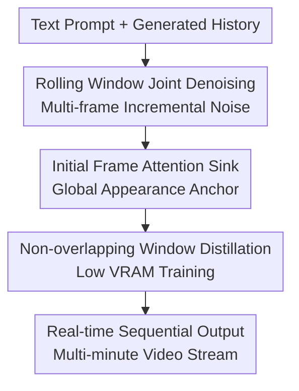

# Rolling Forcing: Autoregressive Long Video Diffusion in Real Time

**Conference**: ICLR2026  
**OpenReview**: [https://openreview.net/forum?id=IAyzXjbfwo](https://openreview.net/forum?id=IAyzXjbfwo)  
**Code**: To be confirmed  
**Area**: Video Generation / Long Video Diffusion / Real-time Streaming Generation  
**Keywords**: Long video generation, streaming video diffusion, autoregressive generation, error accumulation, attention sink  

## TL;DR
Rolling Forcing transforms frame-by-frame autoregressive video diffusion into a rolling multi-frame joint denoising process, utilizing initial frame attention sinks to anchor global appearance. This achieves near 16 FPS real-time generation of multi-minute long videos on a single GPU while significantly suppressing long-term error accumulation.

## Background & Motivation
**Background**: Modern video diffusion models are capable of generating high-quality short clips. However, mainstream bidirectional video diffusion typically processes an entire temporal window at once, making it suitable for offline generation but unsuitable for real-time streaming output in interactive world models, neural game engines, or XR scenarios. Real-time applications require video frames to be produced sequentially such that a user or downstream system can consume a frame immediately without waiting for the entire sequence to be sampled.

**Limitations of Prior Work**: To satisfy streaming constraints, methods like CausVid and Self Forcing distill bidirectional video diffusion into fast causal autoregressive generators. The issue is that strictly causal frame-by-frame prediction makes each frame dependent on previously generated frames. Small artifacts are inherited and amplified by subsequent frames, leading to obvious color drift, background deformation, subject disintegration, or unnatural motion after several dozen seconds. Another category of long-video methods plans distant keyframes before interpolating intermediate frames, but this out-of-order generation violates the sequential output requirement of streaming systems.

**Key Challenge**: Real-time streaming video generation requires both "sequential output" and "long-term stability." If generation is strictly frame-by-frame along a causal chain, sequentiality is strong but errors propagate over time. If future frames are allowed to participate in planning, long-term consistency improves, but sequential per-frame delivery cannot be guaranteed. Adding noise to historical frames may mitigate distribution shifts between training and inference but sacrifices clean historical references, leading to degraded local coherence.

**Goal**: The authors aim to distill short-window video diffusion into a real-time autoregressive long video generator without altering the architecture of base models like Wan2.1. Specific goals include: single-GPU real-time throughput, sub-second stable latency, multi-minute generation, short-term motion continuity, prevention of long-term tone/background drift, and a training phase that does not require expensive long-video datasets.

**Key Insight*: The paper observes that strictly frame-by-frame denoising "finalizes" all local errors prematurely. If the current frame and several subsequent frames can be jointly denoised within a small window, local errors have the opportunity to be corrected by neighboring frames before output. Furthermore, the initial frames of a video naturally contain global information such as subjects, scenes, tone, and white balance. By retaining these as "attention sinks" (similar to streaming LLMs), subsequent frames gain a stable anchor.

**Core Idea**: Use "rolling window joint denoising + initial frame attention sink + non-overlapping window distillation" to replace strict frame-by-frame autoregressive denoising. This suppresses error accumulation in long videos while maintaining sequential output and real-time latency.

## Method

### Overall Architecture
Rolling Forcing remains an autoregressive video diffusion framework: the system rolls forward one time step at a time, outputting the current clean frame and appending a new high-noise frame to the end of the window. The difference is that instead of denoising only the current frame, it processes multiple consecutive frames simultaneously within a rolling window of length $T$. These frames possess increasing noise levels from low to high and use bidirectional attention within the window to correct each other.

The system can be understood as three memory layers plus a rolling window: a KV cache of recent clean frames provides short-term temporal context, a KV cache of initial frames serves as a long-term global anchor, and the current window is responsible for advancing a sequence of frames with varying noise levels toward a cleaner state. During training, the authors use DMD distillation to transform Wan2.1-T2V-1.3B into a 5-step fast generator and backpropagate gradients only for a subset of non-overlapping rolling windows to enable training on an 80G GPU.

During inference, the $i$-th rolling window contains $x_i, \ldots, x_{i+T-1}$. The frames in the window carry increasing noise levels $t_1, \ldots, t_T$. The model predicts the clean versions of all frames in one forward pass and pushes them to the next set of lower noise levels via the forward diffusion process $\Psi$. Once the leading frame in the window reaches $t_0=0$, it is output, while the remaining frames stay in the window, and a new Gaussian noise frame is appended at the end.

### Key Designs
**1. Rolling Window Joint Denoising: Correcting the current frame via neighboring future frames before finalization**

In strictly frame-by-frame denoising (like Self Forcing), written as $x^i_{t_{j-1}}=\Psi(G_\theta(x^i_{t_j},t_j,x^{<i}_0),t_{j-1})$, the current frame can only see clean history and cannot mutually adjust with the neighboring frames being generated. Consequently, noise, artifacts, or color deviations in a preceding frame become conditions for the next, allowing errors to propagate along the chain without a natural way to disappear.

Rolling Forcing extends single-frame denoising to window denoising, with the core distribution written as $p_\theta(x^{i:i+T-1}_{t_{0:T-1}}\mid x^{i:i+T-1}_{t_{1:T}},x^{<i}_0)$. Consecutive frames within the window use bidirectional attention, and noise levels increase along the time dimension: frames toward the front are closer to output, while those toward the back are noisier. Each roll only outputs the cleanest leading frame; others are preserved as intermediate states for the next round. This arrangement maintains sequential output while allowing the current frame to be constrained by future short-term motion trends before being output, preventing local errors from being solidified into history.

The window length $T$ theoretically equals the number of denoising steps. Standard video diffusion often requires dozens of steps, which would make the window too large. The paper uses DMD few-step distillation to reduce $T$ to 5 and sets each chunk to 3 latent frames, resulting in an actual rolling window of 15 latent frames. This is key to real-time performance: the window is long enough for mutual correction but short enough for a single GPU to achieve 15.79 FPS and 0.76s latency during steady-state generation.

**2. Initial Frame Attention Sink: Locking long-term tone and scene identity**

Retaining only recent history maintains short-term coherence, but long-term drift is often a gradual shift in global attributes: exposure, tone, background layout, and subject identity can change significantly after dozens of seconds. Rolling Forcing therefore keeps the KV states of the initial $L_{glo}$ frames as permanent global context and uses the most recent $L_{tem}$ frames as temporal context, ensuring $L_{tem}+L_{glo}+L_{win}=L_{bidirectional}$ so that the total attention window matches the length the teacher model was originally trained to handle.

This attention sink is not as simple as permanently padding the first frame into the cache. Models like Wan2.1 use RoPE; if the relative positional offset increases indefinitely with video length, it will exceed the range seen during training, causing artifacts like jumping back to the initial frame, flickering, or abnormal motion. The authors' solution is to store global context key states without RoPE applied. During each generation step, they are dynamically assigned positions $i-L_{tem}-L_{glo}:i-L_{tem}-1$ preceding the temporal context. This ensures that while the initial frames remain global anchors in content, their positional encoding always appears as context "just before the recent history," avoiding RoPE offset overflow.

**3. Non-overlapping Window Distillation: Enabling training of expanded windows while maintaining exposure to self-generated history**

Rolling Forcing training still utilizes the DMD loss to align the student's generation distribution with the teacher's data distribution. The challenge is that predicting $T$ frames in a rolling window significantly increases query size and gradient memory (roughly $T$ times compared to Self Forcing). The authors estimate that without a subset gradient strategy, VRAM usage could explode from 80G to approximately 400G, making it untrainable.

The authors sample a random offset $j\sim Uniform\{0,\ldots,T-1\}$ and only backpropagate gradients for windows starting at $i\equiv j\pmod T$. These windows do not overlap but collectively cover the entire video, requiring only approximately $\lceil N/T\rceil$ gradient-enabled forward passes per training round. Importantly, the input windows and history during training come from the model's own rolling generation rather than ground truth history, continuing the advantage of Self Forcing in mitigating exposure bias.

### Mechanism
Consider a scenario where the system generates a 2-minute video of "a longboarder descending a mountain road through a forest." Initially, the model initializes $T-1$ intermediate noise states and generates the starting frames. The KV states of these initial frames are saved as global context, capturing the person, road, lighting, and visual style.

By the 40th second, the current window might contain five chunks in different denoising stages: the leading chunk is nearly clean and about to be output, while subsequent chunks are noisier but already contain rough motion directions. Rolling Forcing allows these chunks to "see" each other in one forward pass. If the skateboard's posture in the leading frame is inconsistent with the future motion trend, bidirectional attention can correct it before output. If the color temperature begins to drift, the global context anchors the appearance. If the recent frames show a series of turns, the temporal context maintains short-term inertia.

### Loss & Training
The paper uses Wan2.1-T2V-1.3B as the base model, initialized with causal attention masking and 16k ODE solution pairs, followed by 3,000 steps of Rolling Forcing training. Training prompts are sourced from VidProM (filtered and expanded by LLM). The resolution is 832 × 480 at 16 FPS.

The training objective follows DMD, which approximates the gradient of the reverse KL divergence using the difference between the teacher's score $s_{data}$ and the student's score $s_{gen}$. The gradient form is $\nabla_\theta L_{DMD}\approx-E_t\int(s_{data}-s_{gen})\frac{dG_\theta(\epsilon)}{d\theta}d\epsilon$. This does not require ground truth video labels, allowing the student to be trained on self-generated history.

The authors set $T=5$ with 3 latent frames per chunk. The training temporal window is 27 latent frames with a batch size of 8. The generator $G_\theta$ uses AdamW with a learning rate of $1.5\times10^{-6}$, while the fake score $s_{gen}$ uses $4.0\times10^{-7}$. The generator is updated once for every 5 updates of the fake score.

## Key Experimental Results

### Main Results
Evaluation was conducted on 200 randomly sampled MovieGen prompts for 30-second videos. Metrics from VBench were used, along with $\Delta Quality_{Drift}$ (absolute difference in imaging quality between the first and last 5 seconds).

| Method | Params | Throughput FPS ↑ | Latency s ↓ | Subject ↑ | Background ↑ | Imaging ↑ | $\Delta Quality_{Drift}$ ↓ |
|------|--------|------------|----------|-----------|--------------|-----------|-----------------------------|
| FramePack | 13B | 0.92 | 65 | 91.65 | 93.55 | 65.20 | 3.45 |
| CausVid | 1.3B | 15.38 | 0.78 | 87.99 | 89.99 | 66.38 | 2.18 |
| Self Forcing | 1.3B | 15.38 | 0.78 | 86.48 | 90.29 | 68.68 | 1.66 |
| **Rolling Forcing** | 1.3B | **15.79** | **0.76** | **92.80** | **93.71** | **70.75** | **0.01** |

In 2-minute long video evaluations:

| Method | Temp. ↑ | Subj. ↑ | Back. ↑ | Aes. ↑ | Img. ↑ | Dyn. ↑ | $\Delta Quality_{Drift}$ ↓ |
|------|---------|---------|---------|--------|--------|--------|-----------------------------|
| CausVid | 96.67 | 84.69 | 89.53 | 62.16 | 63.62 | 52.08 | 3.35 |
| Self Forcing | 97.44 | 71.95 | 88.73 | 50.66 | 60.03 | 51.02 | 14.4 |
| Rolling Forcing | **96.90** | **91.47** | **95.29** | **65.21** | **68.96** | **57.14** | **0.49** |

Self Forcing's drift explodes to 14.4 over 2 minutes, while Rolling Forcing maintains a drift of 0.49.

### Ablation Study
| Configuration | Temporal ↑ | Subject ↑ | Background ↑ | Motion ↑ | Aesthetic ↑ | Imaging ↑ | $\Delta Quality_{Drift}$ ↓ |
|------|------------|-----------|--------------|----------|-------------|-----------|-----------------------------|
| w/o RF inference | 95.45 | 86.01 | 89.94 | 97.36 | 57.59 | 65.19 | 5.53 |
| w/o RF training | 95.91 | 87.50 | 90.86 | 98.05 | 60.41 | 69.24 | 0.89 |
| w/o SF training | 90.83 | 83.27 | 88.14 | 95.63 | 55.30 | 62.00 | 1.62 |
| w/o attention sink | 97.53 | 83.22 | 87.99 | 98.56 | 58.99 | 67.30 | 4.63 |
| **Ours full** | **97.61** | **92.80** | **93.71** | **98.70** | **62.39** | **70.75** | **0.01** |

### Key Findings
- The rolling window is not just a training trick but the core mechanism during inference for suppressing drift; removing RF inference increases drift from 0.01 to 5.53.
- The attention sink is vital for long-term identity stability; without it, subject consistency drops significantly, even if short-term smoothness remains high.
- Self Forcing targets in mixed training primarily stabilize natural motion; removing them degrades temporal and motion metrics.
- Rolling Forcing achieves higher total VBench quality scores (84.08) compared to CausVid (80.89) and Self Forcing (81.39).

## Highlights & Insights
- **Compressing future information into a streamable local window**: Instead of non-sequential planning, the model allows current frames to interact with noisy future states. This "weak" future information is sufficient to correct local errors without breaking the sequential flow.
- **Natural migration of Attention Sinks to video**: Initial frames act like prompt prefixes. Storing their KV states is cheaper than recomputing history, though dynamic RoPE is the engineering detail that prevents position-related artifacts.
- **Engineering-driven training strategy**: Non-overlapping window gradients introduce training-inference discrepancies but make the process VRAM-viable. Coverage of the full trajectory matters more than localized gradient precision.
- **Quantifying long-video drift**: By using the difference in imaging quality between the start and end of a stream, the paper explicitly measures long-term degradation, providing a benchmark for future real-time world models.

## Limitations & Future Work
- **Global Memory Gaps**: Global context only saves the start, and temporal context only saves the recent past. Intermediate frames are discarded, meaning the model lacks "true" memory for objects that disappear and reappear.
- **Training Costs**: Rolling windows expand the attention window, and DMD loss is VRAM-intensive. Scaling to larger models or contexts remains a challenge.
- **Interactive Latency**: The rolling window partially pre-generates future states. Sudden prompt changes would require handling these invalid future states (e.g., clearing the cache).

## Related Work & Insights
- **vs. Self Forcing**: Self Forcing addresses exposure bias via self-generated history during training, but inference remains strictly causal. Rolling Forcing adds joint window denoising during inference to further suppress drift.
- **vs. CausVid**: Rolling Forcing enhances the distilled causal approach of CausVid by specifically targeting long-term stability.
- **vs. planning generation**: Unlike planning methods that are non-sequential, Rolling Forcing ensures the system remains fundamentally online/streaming by outputting the leading frame of every step.

## Rating
- Novelty: ⭐⭐⭐⭐⭐ 
- Experimental Thoroughness: ⭐⭐⭐⭐⭐ 
- Writing Quality: ⭐⭐⭐⭐☆ 
- Value: ⭐⭐⭐⭐⭐ 

<!-- RELATED:START -->

## Related Papers

- [\[ICLR 2026\] LongLive: Real-time Interactive Long Video Generation](longlive_real-time_interactive_long_video_generation.md)
- [\[ICLR 2026\] Real-Time Motion-Controllable Autoregressive Video Diffusion](real-time_motion-controllable_autoregressive_video_diffusion.md)
- [\[CVPR 2026\] Endless World: Real-Time 3D-Aware Long Video Generation](../../CVPR2026/video_generation/endless_world_real-time_3d-aware_long_video_generation.md)
- [\[ICLR 2026\] MotionStream: Real-Time Video Generation with Interactive Motion Controls](motionstream_real-time_video_generation_with_interactive_motion_controls.md)
- [\[ICML 2026\] Light Forcing: Accelerating Autoregressive Video Diffusion via Sparse Attention](../../ICML2026/video_generation/light_forcing_accelerating_autoregressive_video_diffusion_via_sparse_attention.md)

<!-- RELATED:END -->
