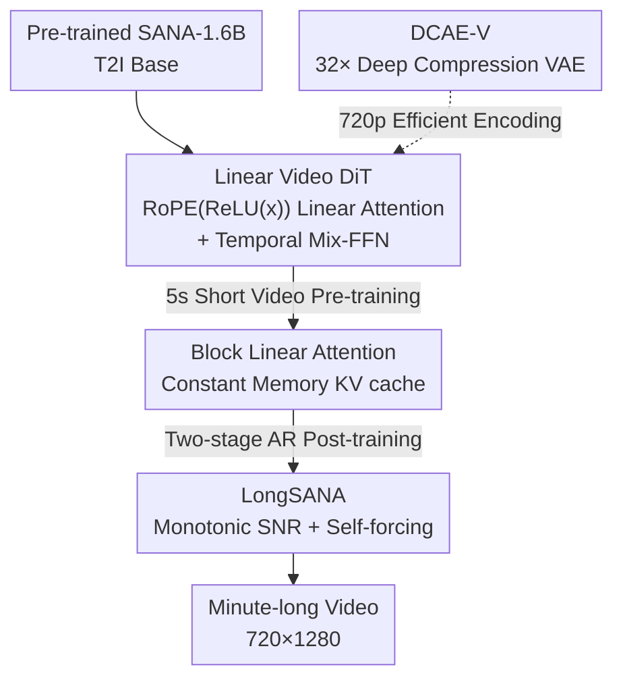

# SANA-Video: Efficient Video Generation with Block Linear Diffusion Transformer

**Conference**: ICLR 2026  
**OpenReview**: [https://openreview.net/forum?id=mzAchylAtf](https://openreview.net/forum?id=mzAchylAtf)  
**Paper**: [Project Page](https://nvlabs.github.io/Sana/Video/)  
**Code**: https://github.com/NVlabs/Sana (Available)  
**Area**: Video Generation / Diffusion Models / Linear Attention / Efficient Inference  
**Keywords**: Video Diffusion, Linear Attention, Autoregressive Long Video, KV cache, Deep Compression VAE

## TL;DR
SANA-Video replaces the full attention in video DiTs with linear attention to reduce complexity from $O(N^2)$ to $O(N)$. By leveraging the additive property of linear attention, a "constant memory" block autoregressive KV cache is designed. This allows a 2B model to be trained on 64 H100s in 12 days (only 1% of MovieGen's cost), producing 720×1280 minute-long videos that match Wan2.1-14B on VBench while being 16× faster during inference.

## Background & Motivation
**Background**: Current mainstream video generation models (Wan, Veo3, Kling, Seedance, etc.) almost exclusively use standard full-attention DiTs, trading massive parameters and compute for quality.

**Limitations of Prior Work**: Video is an "extremely token-dense" task—generating a 5-second 720p video with Wan 14B requires processing 75,000 tokens, taking 32 minutes on an H100. The $O(N^2)$ complexity of full attention makes training costs and inference latency prohibitively high for researchers and edge devices.

**Key Challenge**: Worse yet, the path to "long video" is blocked. Generating videos longer than 10 seconds requires block autoregression with KV cache, but full-attention KV cache memory grows linearly with historical tokens ($O(N \times D)$ memory and compute per new token). Consequently, methods like MAGI-1, SkyReels-V2, and Self-Forcing must truncate attention windows to local ranges to stabilize memory, sacrificing global context and degrading long-term temporal consistency.

**Goal**: Develop a small diffusion model that produces high-quality, high-resolution videos, computes rapidly on cloud and edge (even RTX 5090), and stably generates minute-long content.

**Key Insight**: Linear attention naturally offers efficiency advantages when token counts are massive. Furthermore, the "accumulated state" of causal linear attention can be rewritten as a fixed-size global memory—simultaneously solving the "slow short video" and "memory-exploding long video" problems.

**Core Idea**: Replace all attention layers in the video DiT with ReLU linear attention ($O(N)$). Utilize the additive decomposability of linear attention to compress the causal KV cache into a constant $O(D^2)$ memory state, preserving global context for infinite-length autoregressive generation within fixed memory.

## Method

### Overall Architecture
The core of SANA-Video is a pipeline that "inherits from image models and gradually transforms into an efficient long video model." It starts with the pre-trained SANA-1.6B text-to-image model as a base, replaces full attention with linear attention featuring 3D RoPE, and adds temporal convolutions to the Mix-FFN to create the **Linear Video DiT**. This DiT undergoes continuous pre-training on short videos (5s), is transformed into an autoregressive version supporting "Block Causal Linear Attention + Constant Memory KV cache" (termed LongSANA), and is finally polished via two-stage autoregressive post-training (monotonic SNR sampling + improved self-forcing) to generate minute-long videos. To ensure speed at 720p, the authors fine-tuned DCAE into a video VAE (DCAE-V) with 32× spatial compression. The pipeline takes text (T2V) or "first frame + text" (I2V) and outputs high-resolution long videos.

### Key Designs

**1. Linear Video DiT: Bringing Linear Attention to Video with RoPE(ReLU(x))**

Since video tokens are numerous, full attention's $O(N^2)$ is the bottleneck. Replacing all attention with SANA's ReLU linear attention reduces complexity to $O(N)$, speeding up 720p generation by 4×. However, two issues arise. First, Position Encoding: 3D RoPE is needed for spatio-temporal modeling. The key is **ReLU then RoPE**, i.e., $\text{RoPE}(\phi(Q_i))$ rather than $\phi(\text{RoPE}(Q_i))$. If RoPE is applied first, the ReLU kernel filters out position information; applying it after yields sparse, locally focused attention maps. Applying RoPE directly to $Q/K$ usually breaks the non-negativity of ReLU outputs, risking zero denominators and instability. The solution is to apply RoPE only to $Q$ and $K$ in the numerator while **removing RoPE from the denominator** to ensure it remains positive:

$$O_i = \frac{\text{RoPE}(\phi(Q_i)) \left( \sum_{j=1}^{N} \text{RoPE}(\phi(K_j))^T V_j \right)}{\phi(Q_i) \left( \sum_{j=1}^{N} \phi(K_j)^T \right)}$$

Second, linear attention is more "diffuse" and less capable of capturing local details than softmax attention. Following SANA's approach, a **1D temporal convolution** with a shortcut is added to the Mix-FFN to aggregate local features along the time axis, improving motion consistency. Shortcut and zero-initialization allow these layers to be added without disturbing pre-trained weights early in training.

**2. Block Linear Attention + Constant Memory KV cache: Compressing Global History**

This is the core for avoiding memory explosions. Standard causal KV cache requires $O(N \times D)$ memory, which becomes unsustainable for long videos. Causal linear attention can be rewritten as an accumulative form: for the $i$-th token, the output depends only on the **state accumulation** $\sum_{j=1}^{i-1} S_j$ (where $S_j = \phi(K_j)^T V_j \in \mathbb{R}^{D \times D}$) and the **key accumulation** $\sum_{j=1}^{i-1} \phi(K_j)^T \in \mathbb{R}^{D \times 1}$.

$$O_i = \frac{\phi(Q_i)\left(\sum_{j=1}^{i-1} S_j + S_i\right)}{\phi(Q_i)\left(\sum_{j=1}^{i-1}\phi(K_j)^T + \phi(K_i)^T\right)}$$

By caching these two sums, a new token only needs to compute its own $S_i$. **Memory and computation per token are fixed at $O(D^2)$**, regardless of history length. To make Mix-FFN work causally, a **Block Causal Mix-FFN** is used: a zero token is padded to the end of each block during training to prevent leakage, and the last frame (Token$_{-1}$) is cached to prepend to the next block for the size-3 kernel temporal convolution.

**3. LongSANA Two-stage Autoregressive Post-training: Monotonic SNR Sampling + Improved Self-forcing**

To stabilize minute-long generation, two training issues are addressed. The first stage is **Autoregressive Block Training** using a Monotonic SNR Sampler: one block is randomly assigned a timestep using the SNR sampler, while others use propagation sampling to ensure timesteps increase monotonically across blocks. This narrows the sampling space and ensures thorough training via the SNR block. The second stage targets **exposure bias**, where inference errors accumulate because the model was trained on ground truth conditions. While methods like Self-Forcing are limited by full attention's memory, SANA-Video extends **self-forcing to longer intervals (e.g., 1 min) under global attention** thanks to its constant memory KV cache, better aligning conditional signals between training and inference.

**4. DCAE-V Deep Compression Video VAE**

Even with linear attention, 720p is 2.3× slower than 480p due to token count. DCAE is fine-tuned into DCAE-V, achieving deep compression with spatial downsampling $F=32$, temporal $T=4$, and channels $C=32$. Two key points: 32 latent channels align with the pre-trained T2I model for fast adaptation; and unlike Wan2.2-5B (which predicts 192 latent dimensions), DCAE-V's 32-dimensional latent is easier for small diffusion models. It matches SOTA VAEs like Wan/LTX in reconstruction while allowing a 5s 720p video to generate in 36s.

### Loss & Training
The objective uses Rectified Flow with an SNR sampler to predict the velocity field: $\mathbb{E}_{c,t,x^0}\|u(x^t \mid t,c;\theta) - v(x)\|^2$. The workflow follows: VAE adaptation → Continuous T2I pre-training (coarse-to-fine from low-res short to high-res long) → Autoregressive block training → Self-forcing post-training → Human preference SFT. T2I/T2V/I2V are trained in a unified framework; I2V is achieved by zeroing first-frame noise without modifying the architecture. Detailed captions (80–100 words) are generated using strong VLMs.

## Key Experimental Results

### Main Results
VBench Evaluation (480×832×81 video latency on H100 BF16):

| Task | Model | Params | Latency(s) | Total↑ | Semantic/I2V↑ |
|------|------|------|---------|--------|----------------|
| T2V | Wan2.1-14B | 14B | 484 | 83.69 | 76.11 |
| T2V | Wan2.1-1.3B | 1.3B | 103 | 83.31 | 75.65 |
| T2V | Open-Sora-2.0 | 14B | 465 | 84.34 | 80.12 |
| T2V | **Ours** | 2B | **60** | 83.71 | **81.35** |
| I2V | Wan2.1-14B | 14B | 493 | 86.86 | 92.90 |
| I2V | **Ours** | 2B | **60** | **88.02** | **96.40** |

At 720×1280×81, SANA-Video's latency is only 36s with a Total score of 84.05, whereas Wan2.1-14B takes 1897s and Wan2.2-5B takes 116s.

### Ablation Study
VBench Ablations (Table 5):

| Config | Total↑ | Quality↑ | Semantic↑ | Note |
|------|--------|----------|-----------|------|
| w/o Temporal Conv | 80.94 | 82.63 | 74.18 | - |
| w/ Temporal Conv | 81.71 | 83.10 | 76.15 | Semantic +1.97 |
| w/o 3D RoPE | 81.19 | 82.68 | 75.22 | - |
| w/ 3D RoPE | 82.79 | 83.89 | 78.38 | Semantic +3.16 |
| Random Steps | 82.00 | 83.13 | 77.51 | - |
| Increasing Steps | 83.70 | 84.43 | 80.78 | Semantic +3.27 |

### Key Findings
- **3D RoPE and Monotonic SNR Sampler contribute most**: Each improves the semantic score by approximately 3 points, far exceeding temporal convolutions.
- **Efficiency gains of linear attention scale with resolution**: 2× speedup at 480p and 4× at 720p, proving highly efficient for high-token video tasks.
- **Constant memory enables long video for small models**: At 480×832, memory remains constant at 7.2GB as length increases, while causal full attention OOMs at 60s.
- **NVFP4 Quantization**: Using SVDQuant for NVFP4 reduces latency from 71s to 29s (2.4× speedup) on an RTX 5090 for 5s 720p videos.

## Highlights & Insights
- **Leveraging "Additive Decomposability" for Long Video**: By compressing history into a $O(D^2)$ fixed state, the model maintains global context without the memory issues of local window truncation.
- **Strict RoPE and ReLU Sequencing**: Applying RoPE after ReLU and removing it from the denominator preserves locality and numerical stability, a crucial engineering detail for making linear attention viable in video.
- **"Free" Start from Image Models**: Zero-initialization and shortcuts allow the inclusion of temporal modules without destroying pre-trained T2I weights, reducing training costs to 1% of MovieGen.

## Limitations & Future Work
- **Quality still trails behind larger models**: SANA-Video's quality scores are lower than Wan2.1-14B in some comparisons; it wins on efficiency and semantic alignment.
- **Representational Capacity of Linear Attention**: Whether ReLU linear attention remains sufficient for extremely complex motions or ultra-long videos (>1 min) without drift requires further investigation.
- **High Compression Trade-offs**: 128x total compression (spatial × temporal) might lose fidelity in high-detail scenes compared to lower compression VAEs.

## Related Work & Insights
- **vs Self-Forcing / LongLive**: Prior methods use local windows due to memory limits. SANA-Video extends self-forcing to global attention for up to 1 minute, improving consistency.
- **vs Wan / MAGI-1 / SkyReels-V2**: These rely on full attention and parameter scaling. SANA-Video matches or exceeds their VBench performance with a 2B model while being 8–16× faster.
- **vs Wan2.2-5B**: Wan2.2's VAE predicts a 192-dimensional latent, which is difficult for small models. DCAE-V predicts only 32 dimensions, leading to faster convergence and 3.2× faster inference.

## Rating
- Novelty: ⭐⭐⭐⭐⭐ 
- Experimental Thoroughness: ⭐⭐⭐⭐ 
- Writing Quality: ⭐⭐⭐⭐ 
- Value: ⭐⭐⭐⭐⭐ 

<!-- RELATED:START -->

- **SANA**: [SANA: Efficient High-Resolution Image Synthesis with Linear Diffusion Transformers (CVPR 2024)]
- **Wan2.1**: [Wan: Open and User-Friendly Video Generation with High-Resolution (2025)]
- **MovieGen**: [MovieGen: A Holistic System for Media Generation (2024)]

<!-- RELATED:END -->

## Related Papers

- [\[ICLR 2026\] BLADE: Block-Sparse Attention Meets Step Distillation for Efficient Video Generation](blade_block-sparse_attention_meets_step_distillation_for_efficient_video_generat.md)
- [\[ICLR 2026\] VMoBA: Mixture-of-Block Attention for Video Diffusion Models](vmoba_mixture-of-block_attention_for_video_diffusion_models.md)
- [\[ICLR 2026\] Neodragon: Mobile Video Generation Using Diffusion Transformer](neodragon_mobile_video_generation_using_diffusion_transformer.md)
- [\[CVPR 2026\] Attention Surgery: An Efficient Recipe to Linearize Your Video Diffusion Transformer](../../CVPR2026/video_generation/attention_surgery_an_efficient_recipe_to_linearize_your_video_diffusion_transfor.md)
- [\[ICLR 2026\] BWCache: Accelerating Video Diffusion Transformers through Block-Wise Caching](bwcache_accelerating_video_diffusion_transformers_through_block-wise_caching.md)

<!-- RELATED:END -->
