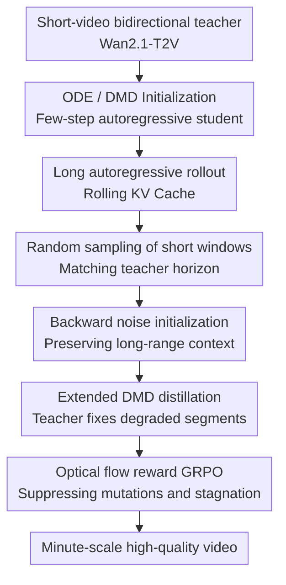

# Self-Forcing++: Towards Minute-Scale High-Quality Video Generation

**Conference**: ICLR 2026  
**OpenReview**: [https://openreview.net/forum?id=DzvPiqh23f](https://openreview.net/forum?id=DzvPiqh23f)  
**Paper**: [https://openreview.net/forum?id=DzvPiqh23f](https://openreview.net/forum?id=DzvPiqh23f)  
**Code**: Project page exists, long-horizon demos provided in the paper; code not explicitly listed in cache  
**Area**: Video Generation / Long Video Generation  
**Keywords**: Long Video Generation, Autoregressive Video Diffusion, Distribution Matching Distillation, Rolling KV Cache, Visual Stability

## TL;DR
Self-Forcing++ utilizes a short-video bidirectional diffusion teacher as a "short-window error corrector." It performs Extended DMD training by randomly sampling degraded segments from long-video trajectories generated by the student, combined with a rolling KV cache and optical flow rewards. This extends a 1.3B autoregressive video model from 5-second to 100-second and even 4-minute generation while significantly mitigating overexposure, darkening, stagnation, and error accumulation.

## Background & Motivation
**Background**: High-quality text-to-video models are mostly based on DiT or similar bidirectional diffusion architectures. Models like Sora, Wan, HunyuanVideo, and Veo have pushed short-video visual quality to high levels. However, these models typically process a fixed length of video tokens at once, making them neither naturally supportive of streaming generation nor easy to extend the timeline without cost during inference. Consequently, typical outputs remain concentrated between 5 and 10 seconds.

**Limitations of Prior Work**: To generate long videos, a recent trend is to adapt bidirectional diffusion models into autoregressive streaming generators: the model generates one frame/chunk at a time and reuses historical context via KV cache. Methods like CausVid and Self-Forcing have shown this approach achieves high throughput and low latency. However, two specific problems occur during long-horizon rollouts: CausVid relies on recomputing overlapping frames for continuity, which leads to gradual overexposure; while Self-Forcing mitigates overexposure, it is only trained within short windows covered by the teacher, leading to motion stagnation, darkening, or semantic collapse beyond 5 seconds.

**Key Challenge**: The bottleneck is not just that the "teacher can only generate 5 seconds." The deeper contradiction is the distribution mismatch between training and inference in the temporal domain. During training, the student only sees short videos and receives dense teacher supervision at every frame. During inference, the student must roll out for dozens of seconds or minutes using its own historical KV cache, where early minor errors accumulate in the continuous latent space, resulting in exposure drift, motion collapse, and structural degradation.

**Goal**: The authors aim to solve the horizon scaling problem in long video generation: extending generation without recollecting long video data, without requiring the teacher itself to generate long videos, and without relying on repeated overlapping frame recomputation. The goal is to enable an autoregressive student to recover quality and sustain motion from its own degraded long rollout states while maintaining streamable inference.

**Key Insight**: The paper makes a practical observation: although a short-video teacher can only directly generate 5-second clips, it has been trained on vast amounts of real video and still "knows whether a local short window looks like a reasonable video." In other words, any continuous short segment in a long video can be viewed as a marginal sample of the long video distribution. If the student first rolls out a long video and then provides short windows to the teacher for correction, the teacher's short-window knowledge can backwardly repair the student's long-horizon errors.

**Core Idea**: Self-Forcing++ replaces "teacher forcing only in the first 5 seconds" with "long rollout + random short-window teacher correction." This exposes the student to the degraded states it actually encounters during inference and distills the teacher's local restoration capabilities back into the student.

## Method
### Overall Architecture
Self-Forcing++ is built upon the autoregressive adaptation path of Wan2.1-T2V-1.3B, CausVid, and Self-Forcing. It first distills/initializes a bidirectional video diffusion teacher into a few-step autoregressive student, which then generates long videos far exceeding the teacher's horizon using a rolling KV cache. The core of training is not asking the teacher to generate long videos, but randomly sampling a short window (that the teacher can handle) from the student's own long-video generation. This window is backwardly noised and fed to both student and teacher to align their distributions via Extended DMD. If long-range motion mutations persist, an optical-flow-based GRPO reward is used for smoothness fine-tuning.

It is clearer when viewed as a closed training loop: the student rolls out $N$ frames just like in inference, where $N \gg M$ ($M$ is the teacher's reliable short-video horizon). A starting point is uniformly sampled between $1$ and $N-K+1$ to extract a window of length $K$ (usually aligned with the teacher's 5s training horizon). Finally, noise re-injection and distribution matching are performed on this window. Consequently, the training distribution consists not of clean, short segments supervised by the teacher from the start, but of the actual erroneous states the student reaches during long-duration autoregression.

### Key Designs
**1. Self-generated long trajectories exceeding teacher horizon: Encountering inference errors during training**

The issue with Self-Forcing was not a total lack of autoregressive capability, but that training almost exclusively processed the first $M$ frames covered by the teacher, while inference required generating videos far longer than $M$. Self-Forcing++ pulls the training horizon directly to $N$ frames, allowing the student to generate long-video candidates using its rolling KV cache. These candidates naturally contain accumulated errors, such as slowing motion, brightness drift, local degradation, or freezing subjects. The authors treat these errors as the most valuable training states rather than discarding them as failures.

The advantage of this design is bringing "long-video failure modes" forward from the inference stage into training. The teacher does not need to know how to generate a 100-second video; it only needs to judge and repair the student's current local degradation within a short window. The student learns to recover from these degraded states through repeated correction. Compared to simply shortening the attention window or adding random noise to the KV cache, this approach exposes the actual error distribution produced by the model's rollout, making it more relevant to end-use scenarios.

**2. Backward noise initialization: Teacher intervention while preserving video context**

If a long-video window started from pure random noise for the teacher to generate, the noise would have no relationship with the previously generated content, effectively cutting the local segment off from the long-video context. Self-Forcing++ does the reverse: it takes the clean latents already generated by the student and adds noise back according to the diffusion schedule, constructing a noisy state that both the teacher and student can process. As formulated in the cache: given a clean trajectory $\{x_i\}_{i=1}^N$ generated by the student, the noisy state at timestep $t$ is:

$$
x_{i,t} = (1 - \sigma_t)x_{i,0} + \sigma_t\epsilon,
$$

where $\epsilon \sim \mathcal{N}(0, I)$, and $x_{i,0}$ comes from the combination of the previous denoising state and the student's noise prediction. Intuitively, this step does not resample a video-irrelevant noise but "reverts" latents that already contain long-range context back to a certain noise level.

This achieves two effects. First, the window the teacher sees still originates from the student's long-video context, so the correction target is aligned with preceding and succeeding content. Second, the teacher's strength lies in recovering local video distributions from noisy latents, and backward noising provides a suitable entry point. The paper emphasizes that while similar noising tricks have been used for short-video distillation or training without real data, they are used here specifically to maintain long-video temporal consistency.

**3. Extended DMD: Turning a short-video teacher into a sliding-window local corrector**

The core training objective of Self-Forcing++ is Extended Distribution Matching Distillation. After the student generates a long rollout of length $N$, the training process randomly selects a continuous window of length $K$, where $K$ is typically the teacher's reliable short-video horizon. The KL divergence between the student distribution $p^S_{\theta,t}$ and teacher distribution $p^T_t$ is then compared on this window. The approximate gradient is summarized as:

$$
\nabla_\theta L^{\mathrm{extended}}_{\mathrm{DMD}}
= \mathbb{E}_{t, i}\left[\nabla_\theta \mathrm{KL}\left(p^S_{\theta,t}(z) \| p^T_t(z)\right)\right],
$$

where $i \sim \mathrm{Unif}\{1, \ldots, N-K+1\}$ denotes the random window start. This random window mechanism is critical: if only the beginning is corrected, the model will still collapse in the latter half; if it always biases toward early windows, it easily learns "short videos are better, long videos slow down." The main experiment chooses uniform sampling, allowing the teacher's short-window knowledge to uniformly cover various temporal positions of the long video.

**4. Rolling KV Cache and Optical Flow GRPO: Aligning training and inference cache states while ensuring long-range smoothness**

CausVid uses KV cache during inference but recomputes overlapping frames to ensure consistency, which damages streaming efficiency and causes overexposure. Self-Forcing still has a discrepancy between fixed cache in training and rolling cache in inference, mitigated only by tricks like masking the first frame. Self-Forcing++ is more direct: both training rollout and inference generation use a rolling KV cache. The cache update observed during training is the same as during deployment, eliminating the need for frame recomputation or extra latent masking.

The rolling cache resolves the train-inference cache mismatch, but long videos may still suffer from other issues: objects appearing/disappearing suddenly due to windowed attention or sparse historical memory, or spikes in motion magnitude. The paper introduces GRPO, using optical flow magnitude between adjacent frames as a proxy reward for motion continuity. After calculating rewards $r_i$ for an output group, the model is updated using relative advantages $A_i=(r_i-\mathrm{mean}(r))/\mathrm{std}(r)$; the optimization target uses importance weights $\rho_{t,i}=\pi_\theta(a_{t,i}|s_{t,i})/\pi_{\theta_{old}}(a_{t,i}|s_{t,i})$ with clipping. This step suppresses optical flow spikes, making transitions and motion more natural.

### Loss & Training
The training process is divided into initialization and long-horizon alignment. The initialization follows the CausVid/Self-Forcing approach: distilling the bidirectional teacher into a few-step generator and then training a student with causal attention using teacher-sampled ODE trajectories. The ODE training objective is:

$$
L_{ode}=\mathbb{E}_{x,t}\left[\left\|G_\phi(\{x^{(i)}_{t_i}\}_{i=1}^{N}, \{t_i\}_{i=1}^{N}) - \{x^{(i)}_{teacher}\}_{i=1}^{N}\right\|^2\right].
$$

The main training stage uses 8 H100 80GB GPUs with a batch size of 8, training on lengths up to 100 seconds for approximately 48 H100 GPU days. The model uses Wan2.1-T2V-1.3B as the teacher/base. Hyperparameters include denoising steps $1000, 750, 500, 250$, a generator learning rate of $2\times10^{-6}$, and a critic learning rate of $4\times10^{-7}$. A rolling KV cache window of 21 latent frames is used, with EMA enabled after 200 epochs.

## Key Experimental Results

### Main Results
The experiments cover two settings: standard 5s VBench short videos and MovieGen 128 prompts for 50/75/100s long videos. 

| Scenario | Method | Text Alignment | Temporal Quality | Dynamic Degree | Visual Stability | Framewise Quality |
|------|------|----------------|------------------|----------------|------------------|------------------|
| 50s | CausVid | 25.25 | 89.34 | 37.35 | 40.47 | 61.56 |
| 50s | Self-Forcing | 24.77 | 88.17 | 34.35 | 40.12 | 61.06 |
| 50s | SkyReels-V2 | 23.73 | 88.78 | 39.15 | 60.41 | 54.13 |
| 50s | Ours | 26.37 | 91.03 | 55.36 | 90.94 | 60.82 |
| 100s | CausVid | 24.41 | 89.06 | 34.60 | 39.21 | 61.01 |
| 100s | Self-Forcing | 22.00 | 87.39 | 26.41 | 32.03 | 58.25 |
| 100s | SkyReels-V2 | 22.05 | 88.80 | 38.75 | 56.72 | 50.48 |
| 100s | Ours | 26.04 | 90.87 | 54.12 | 84.22 | 60.66 |

At 100s, Self-Forcing's Dynamic Degree drops to 26.41, while the proposed method maintains 54.12. Visual Stability is significantly higher (84.22 vs 32.03). 

### Ablation Study
| Configuration | Eval Length | Text Alignment | Temporal Quality | Dynamic Degree | Visual Stability | Description |
|------|----------|----------------|------------------|----------------|------------------|------|
| Self-Forcing | 50s | 24.77 | 88.17 | 34.35 | 40.12 | Trained only on short horizon; obvious accumulation errors |
| 10s Horizon | 50s | 25.36 | 88.78 | 35.91 | 50.78 | Simply doubling training horizon is insufficient |
| Beta Sampling | 50s | 26.65 | 90.14 | 45.66 | 86.25 | Biased toward early windows; high alignment but slower motion |
| Uniform Sampling / Ours | 50s | 26.37 | 91.03 | 55.36 | 90.94 | Uniformly covering long video positions; best dynamics |

### Key Findings
- The core gain comes from "random window distillation on the student's own long rollouts," applying teacher knowledge across the entire timeline.
- Visual Stability is a more suitable metric for long videos than VBench framewise quality, as the latter might favor overexposed or degraded frames.
- A clear scaling phenomenon exists in training budgets; as training expands (up to 25x), the model supports stable generation up to 255 seconds with minimal quality loss.
- The method maintains an autoregressive inference throughput of 17 FPS on a single H100.

## Highlights & Insights
- Reinterpreting the short-video teacher as a "local error corrector" elegantly bypasses the teacher's horizon limitations without discarding its strong priors.
- Backward noise initialization is crucial as it creates a valid diffusion entry point for the teacher while maintaining contextual continuity.
- The discussion on benchmark bias is valuable, highlighting that "temporal consistency" in metrics may sometimes just reflect static scenes.
- Autoregressive video generation might not strictly require massive long-video datasets if the training distribution can cover self-rollout failure states.

## Limitations & Future Work
- Training costs remain high (48 H100 GPU days) due to the self-rollout nature.
- Long-term memory is not fully solved; objects that are occluded for long periods may still drift.
- GRPO rewards currently focus on optical flow; higher-level semantic consistency and identity preservation remain challenges.
- Visual Stability relies on MLLM evaluators (Gemini-2.5-Pro), which involves costs and potential model versioning issues.
- The method is still bounded by the base model's positional encoding length.

## Related Work & Insights
- **vs CausVid**: CausVid relies on overlapping frame recomputation which causes overexposure; Ours uses rolling KV cache and manages consistency during training.
- **vs Self-Forcing**: Self-Forcing is limited to a 5s training window; Ours extends the student rollout to 100s+ and uses random window sampling to handle error accumulation.
- **vs SkyReels-V2 / MAGI-1**: These utilize complex noise levels but still suffer from structural degradation in long videos; Ours proves that clean-context autoregression can be stable if failure modes are exposed during training.

## Rating
- Novelty: ⭐⭐⭐⭐⭐ 
- Experimental Thoroughness: ⭐⭐⭐⭐⭐ 
- Writing Quality: ⭐⭐⭐⭐ 
- Value: ⭐⭐⭐⭐⭐ 

<!-- RELATED:START -->

## Related Papers

- [\[ICCV 2025\] DH-FaceVid-1K: A Large-Scale High-Quality Dataset for Face Video Generation](../../ICCV2025/video_generation/dh-facevid-1k_a_large-scale_high-quality_dataset_for_face_video_generation.md)
- [\[CVPR 2026\] EasyV2V: A High-quality Instruction-based Video Editing Framework](../../CVPR2026/video_generation/easyv2v_a_high-quality_instruction-based_video_editing_framework.md)
- [\[ICLR 2026\] Towards One-Step Causal Video Generation via Adversarial Self-Distillation](towards_one-step_causal_video_generation_via_adversarial_self-distillation.md)
- [\[CVPR 2026\] Scaling Instruction-Based Video Editing with a High-Quality Synthetic Dataset](../../CVPR2026/video_generation/scaling_instruction-based_video_editing_with_a_high-quality_synthetic_dataset.md)
- [\[ICLR 2026\] Rolling Forcing: Autoregressive Long Video Diffusion in Real Time](rolling_forcing_autoregressive_long_video_diffusion_in_real_time.md)

<!-- RELATED:END -->
