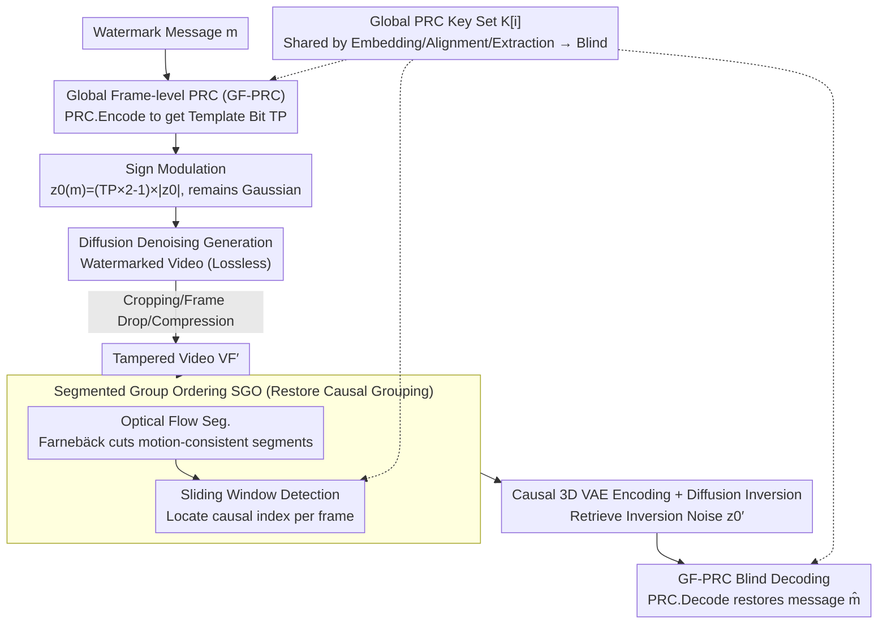

# SIGMark: Scalable In-Generation Watermark with Blind Extraction for Video Diffusion

**Conference**: ICLR 2026  
**arXiv**: [2603.02882](https://arxiv.org/abs/2603.02882)  
**Code**: [https://github.com/JeremyZhao1998/SIGMark-release](https://github.com/JeremyZhao1998/SIGMark-release)  
**Area**: Video Generation/Watermarking  
**Keywords**: Video Diffusion Models, Watermarking, Blind Extraction, Pseudo-Random Coding, Causal 3D VAE, Scalability

## TL;DR
SIGMark proposes the first blind-extraction in-generation watermarking framework for modern video diffusion models. It achieves constant-time blind extraction via Global Frame-level Pseudo-Random Coding (GF-PRC) and enhances temporal robustness under Causal 3D VAE via a Segmented Group Ordering (SGO) module. It reaches 90%+ bit accuracy with a capacity of 512×16 bits on HunyuanVideo and Wan-2.2.

## Background & Motivation

1. **Background**: Video diffusion models (e.g., HunyuanVideo, Wan-2.2) are developing rapidly, making copyright protection and provenance of AI-generated content urgent. Invisible watermarking is a key technology, categorized into post-processing and in-generation watermarking.

2. **Limitations of Prior Work**:
    - Post-processing watermarks (e.g., DCT, DT-CWT) inevitably degrade video quality.
    - Existing in-generation methods (e.g., VideoShield, VideoMark) are non-blind: extraction requires maintaining all message-key pairs for template matching, with costs growing linearly with the number of generated videos.
    - modern video diffusion models employ Causal 3D VAE, where temporal perturbations (e.g., frame loss) disrupt causal grouping, leading to highly inaccurate watermark inversion.

3. **Key Challenge**: Scalability (blind extraction vs. non-blind template matching) and temporal robustness (sensitivity of frame grouping in Causal 3D VAE) are two critical challenges not yet simultaneously addressed.

4. **Goal**: (1) How to realize blind watermark extraction with constant complexity? (2) How to recover correct causal frame grouping under temporal perturbations?

5. **Core Idea**: Use globally shared frame-level PRC keys to encode watermark messages into initial noise for blind extraction, and employ optical flow segmentation combined with sliding window detection to restore causal frame grouping for temporal robustness.

## Method

### Overall Architecture
SIGMark follows the "in-generation watermark" paradigm—instead of post-processing generated videos, it embeds the watermark into the initial noise of the diffusion model before the standard denoising process. The pipeline consists of two ends: the **embedding end** encodes watermark message $m$ via Global Frame-level Pseudo-Random Coding (GF-PRC) into the initial noise, producing a watermarked video with near-lossless quality after denoising. The **extraction end** takes a potentially cropped, frame-dropped, or compressed video, restores disrupted causal frame groups using the Segmented Group Ordering (SGO) module, performs Causal 3D VAE encoding and diffusion inversion to retrieve noise, and finally blind-decodes the message using the same global keys. The core of the framework lies in **sharing the same set of global PRC keys** $K$—used for encoding at the embedding end, alignment at the SGO module, and decoding at the extraction end—eliminating the need to store message-key pairs per request, which is the root of its "blind extraction" (constant extraction overhead).

### Key Designs

**1. Global Frame-level Pseudo-Random Coding (GF-PRC): A global key for shared embedding and blind decoding**

Non-blind methods fail to scale because they store an independent message-key pair for every generation request, requiring template matching against the entire database during extraction, making overhead grow linearly at $O(N)$. GF-PRC abandons per-request keys, instead assigning a **globally shared** pseudo-random error-correcting code (PRC) key $K[i]$ to each temporal dimension (a group of $d_t$ frames) of the latent. The total number of keys is set to the maximum frame capacity the system supports. During embedding, the watermark message $m[i] \in \{0,1\}^M$ is encoded into template bits $\mathrm{TP}[i] = \mathrm{PRC.Encode}(m[i]; K[i])$, then embedded into initial noise via element-wise sign modulation:

$$z_0(m) = (\mathrm{TP} \times 2 - 1) \times |z_0|$$

Since the amplitude $|z_0|$ comes from Gaussian sampling and the sign is determined by the template bits, the modulated noise still follows $z_0(m) \sim \mathcal{N}(0, \mathbf{I})$, ensuring theoretically lossless quality. The key to this is the pseudo-random mapping of PRC (Christ & Gunn 2024)—even with the same message and key, different random template bits are generated each time, maintaining noise randomness and diversity under a global key. This is something traditional stream ciphers (e.g., ChaCha20) cannot achieve, as fixed key material maps identical messages to fixed outputs. Since the keys are globally known, the extraction end decodes sign bits of inversion noise $z_0'$ directly:

$$\hat{m[i]} = \mathrm{PRC.Decode}\Big(\frac{\mathrm{Sgn}(z_0'[i])+1}{2}; K[i]\Big)$$

The system avoids the original message database and template matching, reducing extraction complexity from $O(N)$ to $O(1)$. This "blind extraction" is the source of scalability.

**2. Segmented Group Ordering (SGO): Restoring disrupted causal frame grouping before decoding**

Modern video diffusion uses Causal 3D VAE to encode $d_t$ consecutive frames into a single temporal latent feature ($f = f_l \times d_t$). Any temporal manipulation (frame loss, interpolation, cropping) causes frame grouping boundaries to shift, resulting in latent mismatches and inversion failure. SGO restores grouping in two steps. First, **Optical Flow Segmentation**: Farnebäck bidirectional optical flow is calculated for adjacent frames. An inconsistency score is derived from median flow amplitude, forward-backward consistency, and motion compensation residuals. Hysteresis thresholding identifies temporal cut points, dividing the video into motion-consistent segments. Second, **Sliding Window Detection**: Each segment only needs to locate the "first frame of a causal group." By padding $d_t-1$ frames at the segment start and using a sliding window to invert latents, PRC detection identifies the frame index via the global keys:

$$\hat{\mathrm{Idx}[j]} = \mathrm{argmax}\big(\mathrm{PRC.Detect}(z_0'[j]; K[0,...,f_l])\big)$$

When adjacent window detection results are consecutive ($\hat{\mathrm{Idx}[j]}+1 = \hat{\mathrm{Idx}[j+1]}$), the correct group start is locked, and missing slots are filled with the nearest available frames. This works because GF-PRC makes frame indices detectable via independent keys, allowing SGO to reuse this capability for alignment without extra training or storage.

### Loss & Training
SIGMark is a training-free method that does not fine-tune any model parameters. Embedding relies purely on sign modulation, providing provable quality preservation. For extraction, inversion uses Euler discrete inversion for flow matching models (HunyuanVideo and Wan-2.2) and DDIM inversion for standard diffusion models, conditioned on an empty prompt.

## Key Experimental Results

### Main Results (HunyuanVideo T2V/I2V, VBench-2.0 Evaluation)

| Method | Category | 512-bit Bit Acc | V-score | 512×16-bit Bit Acc | V-score |
|------|------|-------------|---------|----------------|---------|
| No-mark | - | - | 0.490 | - | 0.490 |
| DCT | Post-proc | 0.889 | 0.424 | 0.862 | 0.423 |
| VideoMark | Non-blind | 0.873 | 0.507 | 0.758 | 0.502 |
| VideoShield | Non-blind | 1.000 | 0.497 | 0.991 | 0.506 |
| **SIGMark** | **Blind** | **0.958** | **0.506** | **0.885** | **0.499** |

### Robustness Experiments (HunyuanVideo I2V, 512-bit/512×16-bit)

| Method | Spatial (None/Gaussian/Comp/Blur) | Temporal (None/Loss/Interp/Crop) |
|------|------|------|
| VideoMark | 0.85/0.64/0.63/0.64 | 0.71/0.52/0.51/0.51 |
| VideoShield | 1.00/1.00/0.99/1.00 | 0.99/0.89/0.84/0.83 |
| **SIGMark** | **0.98/0.89/0.84/0.95** | **0.91/0.81/0.87/0.85** |

### Ablation Study

| Configuration | Bit Acc | Description |
|------|---------|------|
| Single PRC (Non-blind) | 0.707 | Degrades to VideoMark strategy without GF-PRC |
| **GF-PRC (Ours)** | **0.905** | Complete embedding scheme |
| w/o SGO | 0.534 | Significant drop under temporal perturbation without SGO |
| w/o OF-seg | 0.762 | Without optical flow segmentation |
| w/o SW-det | 0.823 | Without sliding window detection |
| **SGO (Ours)** | **0.869** | Complete extraction scheme |

### Key Findings
- SIGMark's extraction time is constant, while VideoShield grows linearly with the number of videos (unfeasible for millions of videos).
- GF-PRC not only enables blind extraction but also improves bit accuracy through inter-frame redundancy error correction.
- Both sub-modules of SGO (OF-seg and SW-det) are indispensable.
- Post-processing watermarks (DCT) show significantly lower V-scores, validating the quality preservation of in-generation methods.

## Highlights & Insights
- **Paradigm Shift in Blind Extraction**: The first to achieve true blind extraction in video diffusion watermarking, reducing extraction complexity from $O(N)$ to $O(1)$, which is vital for large-scale video platforms.
- **Exquisite Application of PRC**: Uses the pseudo-random properties of PRC to maintain noise diversity under global keys, a feat traditional stream ciphers cannot achieve.
- **Dedicated Design for Causal 3D VAE**: The SGO module is a specialized design for modern video diffusion models, showing a deep understanding of the architecture's temporal characteristics.

## Limitations & Future Work
- Bit accuracy has not reached 100%, which relates to the error-correction capability of PRC and diffusion inversion precision.
- Evaluation was limited to HunyuanVideo and Wan-2.2; generalizability to other models requires further verification.
- Robustness under high compression rates (e.g., extremely low bitrate video compression) remains to be explored.
- Future work could integrate multi-frame voting strategies to further enhance temporal robustness.

## Related Work & Insights
- **vs. VideoShield/VideoMark**: These non-blind methods require exhaustive matching; SIGMark achieves constant overhead via global PRC.
- **vs. Gaussian Shading**: An image watermarking method; SIGMark extends this to video and solves challenges unique to Causal 3D VAE.
- **vs. DCT/DT-CWT**: Post-processing methods inevitably degrade quality, while SIGMark maintains generation quality.

## Rating
- Novelty: ⭐⭐⭐⭐ First blind extraction for video diffusion; ingenious GF-PRC and SGO.
- Experimental Thoroughness: ⭐⭐⭐⭐ Two mainstream models, multiple perturbations, ablation studies, and scalability analysis.
- Writing Quality: ⭐⭐⭐⭐ Clear problem definition and logically rigorous method description.
- Value: ⭐⭐⭐⭐⭐ High practical value for AI video security.

<!-- RELATED:START -->

## Related Papers

- [\[ICML 2026\] VEDA: Scalable Video Diffusion via Distilled Sparse Attention](../../ICML2026/video_generation/veda_scalable_video_diffusion_via_distilled_sparse_attention.md)
- [\[CVPR 2025\] DynamicScaler: Seamless and Scalable Video Generation for Panoramic Scenes](../../CVPR2025/video_generation/dynamicscaler_seamless_and_scalable_video_generation_for_panoramic_scenes.md)
- [\[ECCV 2024\] VFusion3D: Learning Scalable 3D Generative Models from Video Diffusion Models](../../ECCV2024/video_generation/vfusion3d_learning_scalable_3d_generative_models_from_video_diffusion_models.md)
- [\[ICLR 2026\] Neodragon: Mobile Video Generation Using Diffusion Transformer](neodragon_mobile_video_generation_using_diffusion_transformer.md)
- [\[ICCV 2025\] STiV: Scalable Text and Image Conditioned Video Generation](../../ICCV2025/video_generation/stiv_scalable_text_and_image_conditioned_video_generation.md)

<!-- RELATED:END -->
