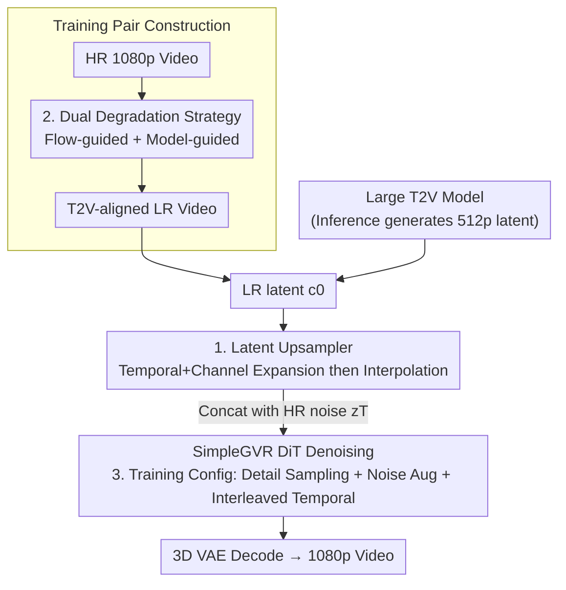

# SimpleGVR: A Simple Baseline for Latent-Cascaded Generative Video Super-Resolution

**Conference**: ICLR 2026  
**OpenReview**: [https://openreview.net/forum?id=ZnwBhBZhFb](https://openreview.net/forum?id=ZnwBhBZhFb)  
**Code**: None (Project page provides visual comparisons)  
**Area**: Video Generation / Video Super-Resolution / Diffusion Models  
**Keywords**: Cascaded Video Generation, Latent Super-Resolution, Degradation Modeling, Rectified Flow, Long Video

## TL;DR
SimpleGVR moves the super-resolution (VSR) stage of cascaded text-to-video generation entirely into the latent space. By using a "latent upsampler" to eliminate redundant decoding/re-encoding and employing two AIGC-aligned degradation strategies along with three training optimizations, this lightweight diffusion VSR outperforms existing methods on AIGC100. Furthermore, the "512p + SR" cascaded scheme surpasses end-to-end 1080p generation in both quality and speed.

## Background & Motivation

**Background**: Current high-resolution text-to-video (T2V) mainstream models follow a "cascaded" approach—first using a powerful large T2V model to generate low-resolution videos (capturing semantics and motion), followed by a lightweight VSR model to add details and upscale to 1080p. Since the computational cost of global self-attention in large DiTs grows quadratically with resolution, cascaded generation is widely recognized as an efficient compromise.

**Limitations of Prior Work**: The authors observe that existing cascaded works treat the "base model" and "VSR model" as loosely coupled components, leading to two specific issues. First is the **inefficiency of the pixel-space interface**: the latent output from the base model is decoded into a pixel-space video, interpolated, and then re-encoded back into latents for the VSR. This cycle of decoding and re-encoding is redundant and slows down inference. Second is the **mismatch in degradation strategies**: VSR models are typically trained with simple downsampling kernels or two-stage degradation schemes. While effective for real low-quality videos, these produce severe artifacts or destroy depth perception when applied to AIGC content, as large T2V outputs do not resemble natural degradations.

**Key Challenge**: A "pixel-space" gap exists between the base model and the VSR, wasting computation and creating a distribution shift—the degradations seen during VSR training (real blur/noise/compression) differ from those encountered during inference (color bleeding and motion blur in T2V outputs).

**Goal**: (1) Enable the VSR to operate directly in the latent space to eliminate decoding/re-encoding; (2) Align VSR training data with the degradation characteristics of upstream T2V outputs; (3) Refine this lightweight model for practical use in long video generation and detail reconstruction.

**Key Insight**: Since the base model already generates in the latent space, the VSR should remain there. However, simple interpolation of LR latents loses local details, requiring a structure-preserving latent upsampler. Furthermore, to "mimic T2V outputs," the T2V model itself should be used to create training pairs.

**Core Idea**: Implement the entire VSR pipeline in the latent space (injecting conditions via a latent upsampler), generate aligned training pairs using two AIGC-oriented degradations (flow-guided and model-guided), and utilize three training configurations to establish a "simple but strong" cascaded SR baseline.

## Method

### Overall Architecture
SimpleGVR is a lightweight diffusion-based VSR model built within the latent space defined by a pretrained 3D VAE, utilizing Rectified Flow ($z_t=(1-t)z_0+t\epsilon$) for training. During inference, a large T2V model first generates a 512p low-resolution latent $c_0$. SimpleGVR uses a **latent upsampler** to upscale $c_0$ while preserving its layout, resulting in a conditional latent $c$. This is concatenated along the channel dimension with a randomly initialized high-resolution Gaussian noise $z_T$ and fed into DiT blocks for iterative denoising. Finally, $z_0$ is decoded into a 1080p video—avoiding the pixel space entirely and bypassing "decoding → interpolation → re-encoding."

The key to the training side is constructing LR–HR pairs that match T2V outputs. HR videos are encoded via VAE to get $z_0$, while the LR branch is synthesized using **two degradation strategies** (flow-guided degradation to simulate color bleeding and motion blur; model-guided degradation using the large T2V model for partial denoising), then encoded into the conditional latent $c_0$. Different noise intensities are injected into the two branches (LR branch noise falls in $[0.3, 0.6]$) to train the DiT to predict the velocity field. Additionally, **three training configurations** (detail-aware timestep sampling, noise augmentation intervals, and interleaved temporal units) ensure high-quality detail reconstruction and long-video processing.

### Key Designs

**1. Latent Upsampler + Channel Concatenation: Preserving Layout before latent injection**

The first pain point is the redundant pixel-space interface. SimpleGVR aligns the condition latent $c_t$ and noise latent $z_t$ within the latent space, using channel concatenation as it is more efficient than ControlNet or token concatenation. The challenge lies in $c_t$ being a low-resolution feature; direct bilinear interpolation loses local details and creates temporal aliasing. The proposed **latent upsampler** first uses two 3D residual blocks to **simultaneously expand channel and temporal dimensions**, performs bilinear interpolation, and uses two more 3D residual blocks to compress the dimensions back to match $z_t$:

$$x_t=\text{patchify}\big([z_t,\ \text{Res3D}(\text{Res3D}(\text{bilinear}(\text{Res3D}(\text{Res3D}(c_t)))))]_{\text{channel-dim}}\big).$$

The critical step is **temporal expansion before interpolation**—ensuring each latent frame corresponds to an RGB frame, thus avoiding temporal signal aliasing during spatial upscaling. Ablation studies comparing this to a variant that only expands channels prove that temporal expansion is necessary to maintain semantics and layout.

**2. Dual Degradation Strategy: Creating training pairs with T2V characteristics**

The second pain point is degradation mismatch. The authors observed that base T2V outputs (Fig. 4) exhibit motion-coupled features: inter-frame color bleeding and local motion blur. **Flow-guided degradation** uses DIS flow estimation to identify motion fields, introducing random elliptical patterns to guide sampling and blend color from the previous frame to simulate bleeding. It also generates adaptive block-blur kernels based on local motion vectors to apply directional blur solely to moving areas. **Model-guided degradation**, inspired by SDEdit, downsamples 1080p to 512p, encodes it to $c_0$, adds Gaussian noise with ratio $\alpha$, and uses the large T2V for partial denoising to produce $\hat c_0$. These strategies ensure the training pairs reflect the T2V output distribution.

**3. Three Training Configurations: Consolidating details, noise, and long videos**

To ensure robustness, three configurations are added. First, a **detail-aware timestep sampler** uses DCT to extract high-frequency coefficients $H(\hat z_t^0)$ of the predicted clean signal. Analysis shows detail gain occurs primarily in high/medium noise regions. Timesteps are sampled based on a probability distribution normalized from this curve. Second, a **noise augmentation interval** of $[0.3, 0.6]$ for the LR branch is used to balance correcting structural errors and preserving global layout. Third, **interleaved temporal units** use Swin-style shifting windows to handle 77-frame sequences efficiently by alternating between non-overlapping temporal windows and shifted windows in DiT blocks.

### Loss & Training
Training follows the Conditional Flow Matching objective for Rectified Flow: $L_{\text{CFM}}=\mathbb{E}_{t,\epsilon,z_0}\big[\|(z_1-z_0)-v_\Theta(z_t,t,c_{\text{text}})\|_2^2\big]$. Training includes three stages: ① Initialization from a 1B T2V model using RealBasicVSR degradations on 17-frame sequences (20K steps); ② Finetuning on the proposed dual degradation data (10K steps); ③ Extending the temporal range to 77 frames using interleaved temporal units (5K steps). Training uses 16 GPUs, total batch 32, AdamW, and a learning rate of $5\times10^{-5}$.

## Key Experimental Results

### Main Results
Evaluation is performed on the self-built AIGC100 (100 T2V generated videos, no GT) and VBench110 using no-reference metrics (MUSIQ, CLIPIQA, etc.) and VBench scores.

| Dataset | Metric | Ours | Prev. SOTA | Description |
|--------|------|------|----------|------|
| AIGC100 | MUSIQ | **62.35** | 60.34 (DOVE) | Highest per-frame quality |
| AIGC100 | CLIPIQA | **0.6768** | 0.6179 (SeedVR2) | Significant lead |
| AIGC100 | MANIQA | **0.4956** | 0.4591 (RealBasicVSR) | Best performance |
| AIGC100 | DOVER-Overall | **71.34** | 67.76 (STAR) | Best overall video quality |
| AIGC100 | VBench Avg | **84.63** | 84.40 (MGLD) | Highest overall score |

### Ablation Study

| Configuration | DOVER-Overall | Description |
|------|---------------|------|
| Upsampler + Channel Concat (Ours) | **61.25** | Full injection scheme |
| Latent Interp + Channel Concat | 59.43 | Layout drift (e.g., extra ears) |
| Token Concat | 58.03 | Unnatural artifacts at the end |
| 3D ResBlocks + Interp (Channel only) | 59.43 | Fails to preserve layout |

| Degradation Setup | DOVER-Overall | MUSIQ |
|------|---------------|-------|
| RealBasicVSR only | 61.25 | 62.06 |
| + Flow-guided | 63.41 | 61.89 |
| + Model-guided | **69.64** | 62.19 |

### Key Findings
- **Model-guided degradation provides the largest gain**: Adding it on top of flow degradation boosts DOVER-Overall from 63.41 to 69.64, proving that using the T2V model for degradation modeling aligns distributions better than manual simulation.
- **Temporal expansion is essential**: Skipping temporal expansion in the upsampler significantly degrades performance, confirming its role in preventing temporal aliasing.
- **Cascaded vs. End-to-end**: The "512p + SimpleGVR" scheme achieves a DOVER-Overall of 71.34 compared to 62.32 for end-to-end 1080p generation, while reducing DiT processing time from 950s to 283s (approx. 3.4× speedup).
- **Noise Sweet Spot**: LR noise augmentation must fall within $[0.3, 0.6]$ to correct structural errors without deviating from the global layout.

## Highlights & Insights
- **Efficiency through Latent Operations**: Moving the entire VSR process into the latent space eliminates redundant decoding/re-encoding and enables efficient channel concatenation.
- **"Fighting Fire with Fire" in Degradation**: Rather than manually simulating artifacts, using the T2V model itself to generate degradations ensures training distributions naturally align with inference distributions.
- **Evidence-based Sampling**: The detail-aware sampler uses DCT coefficients to quantify when high-frequency details are reconstructed, providing a principled approach to timestep sampling.
- **Practical Long Video Handling**: Swin-style interleaved temporal units allow the model to scale from 17 to 77 frames efficiently for both training and inference.

## Limitations & Future Work
- Inference with 50 steps is still slow; future work involves compressing steps for real-time performance.
- Sensitivity to hyperparameters (e.g., $\alpha$) across different base T2V models has not been fully explored.
- Evaluation relies on no-reference metrics and a self-built dataset; absolute values may have limited cross-study comparability.
- The method is tightly coupled with a cascaded setup where the base model provides a latent output.

## Related Work & Insights
- **vs FlashVideo**: Both use cascaded architectures, but SimpleGVR avoids pixel-space round-trips by processing Everything in the latent space, yielding better visual details.
- **vs RealBasicVSR**: Traditional VSR models are optimized for real-world degradations, which cause artifacts when applied to AIGC content; Ours specifically targets T2V-specific artifacts.
- **vs SDEdit**: Model-guided degradation adapts the "noise then denoise" concept from SDEdit, but for generating training samples rather than image editing.

## Rating
- Novelty: ⭐⭐⭐⭐
- Experimental Thoroughness: ⭐⭐⭐⭐
- Writing Quality: ⭐⭐⭐⭐
- Value: ⭐⭐⭐⭐

<!-- RELATED:START -->

## Related Papers

- [\[CVPR 2026\] VSRELL: A Simple Baseline for Video Super-Resolution and Enhancement in Low-Light Environment](../../CVPR2026/video_generation/vsrell_a_simple_baseline_for_video_super-resolution_and_enhancement_in_low-light.md)
- [\[ICML 2026\] LuVe: Latent-Cascaded Ultra-High-Resolution Video Generation with Dual Frequency Experts](../../ICML2026/video_generation/luve_latent-cascaded_ultra-high-resolution_video_generation_with_dual_frequency_.md)
- [\[ICLR 2026\] Arbitrary Generative Video Interpolation](arbitrary_generative_video_interpolation.md)
- [\[ICLR 2026\] Generative View Stitching](generative_view_stitching.md)
- [\[ICLR 2026\] Uniform Discrete Diffusion with Metric Path for Video Generation](uniform_discrete_diffusion_with_metric_path_for_video_generation.md)

<!-- RELATED:END -->
