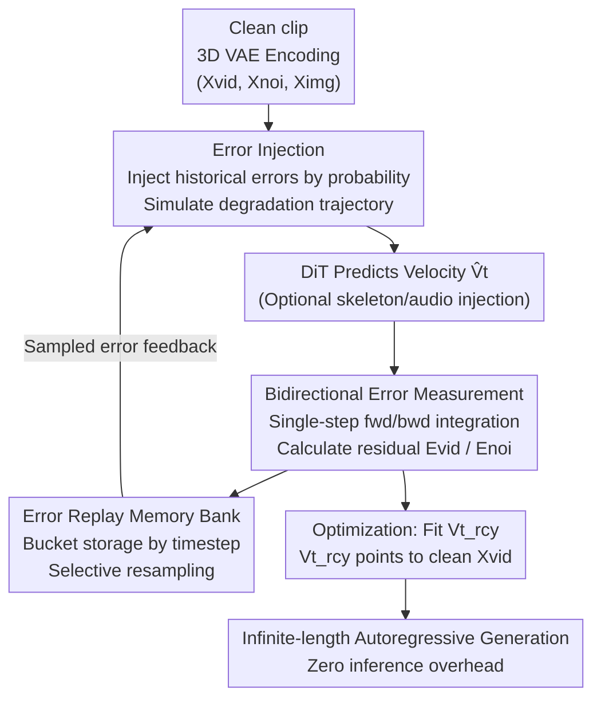

# Stable Video Infinity: Achieving Infinite-Length Video Generation via "Error Recycling"

**Conference**: ICLR 2026  
**OpenReview**: [https://openreview.net/forum?id=X96Ei9n34a](https://openreview.net/forum?id=X96Ei9n34a)  
**Project Page**: [https://stable-video-infinity.github.io/homepage/](https://stable-video-infinity.github.io/homepage/)  
**Area**: Video Generation / Diffusion Models  
**Keywords**: Long Video Generation, Error Accumulation, Flow Matching, Autoregressive Generation, LoRA Fine-Tuning

## TL;DR
Addressing the fundamental gap in autoregressive long video generation—where training assumes clean inputs but testing is conditioned on error-prone self-generated frames—this paper proposes Error-Recycling Fine-Tuning. By collecting errors made by the DiT itself into a memory bank and re-injecting them into clean inputs to simulate degradation trajectories, the model is forced to actively correct errors. This enables extending video length from seconds to "infinite" with zero additional inference overhead, achieving SOTA results across consistency, creativity, and conditional benchmarks.

## Background & Motivation

**Background**: Video Diffusion Transformers (DiTs, such as Wan and Hunyuan) can generate realistic, temporally coherent short videos but are generally limited to around 5 seconds. To generate longer videos, the mainstream approach is to autoregressively use the last few frames of the previous segment as a reference to generate the next segment.

**Limitations of Prior Work**: This autoregressive approach triggers **error accumulation (drifting)**—once conditioned on historical frames containing errors, prediction errors compound across segments, leading to the progressive breakdown of image quality, motion stability, and semantic controllability. Existing mitigation solutions fall into three categories: ① modifying noise schedulers to reduce dependence on historical frames; ② using clean reference frames for frame anchoring; ③ modifying sampling strategies (e.g., masked-noise guidance, anti-drifting sampling). However, these only **alleviate rather than correct** errors, resulting in two major flaws: length is still limited (typically 10 seconds to about 1 minute), and they can only extrapolate under a single prompt, leading to homogeneous visuals and repetitive actions that cannot support feature films or hour-long demonstrations requiring frequent scene changes.

**Key Challenge**: The authors identify that the root cause is not just that "errors accumulate," but the **hypothesis gap between training and testing**. During training, flow matching assumes historical trajectories are clean and error-free (seeing clean data), while during testing, the model is autoregressively conditioned on its own error-prone outputs. A counterintuitive phenomenon supports this: artifacts caused by errors (blur, color shifts) are essentially types of degradation common in image restoration. Theoretically, a 14B DiT should handle them easily, yet they are extremely fragile and collapse quickly—because the model has never seen error-prone inputs during training.

**Goal**: To address the root cause (letting the model actively correct errors) rather than just the symptoms (alleviating error impacts), pushing video length from seconds to infinity while supporting segment-wise prompt control and multi-modal conditions like audio/skeletons.

**Key Insight**: Comparing generative DiTs with restoration DiTs—the latter assumes error-prone inputs during both training and testing, making it inherently robust. If a generative DiT can "see" the errors it will commit in the future during training, its inherent restoration capabilities can be unlocked.

**Core Idea**: Recycling self-generated errors as supervisory prompts. Through autoregressive error feedback, the model is forced to learn to identify and correct its own mistakes.

## Method

### Overall Architecture

The core of SVI is **Error-Recycling Fine-Tuning (ERFT)**: a closed-loop LoRA fine-tuning pipeline that transforms an existing video DiT into a version capable of infinite extension using only 300–6k short video segments, with zero additional inference overhead.

The entire pipeline revolves around "Manufacturing errors → Measuring errors → Accessing errors → Supervising with errors." Given a clean video clip, the 3D VAE encodes it into clean video latent $X_{vid}$, noise $X_{noi}$, and reference image latent $X_{img}$. Then: (a) Historical errors sampled from a memory bank are injected into these three components according to probabilities to obtain error-prone inputs $\tilde X_{vid}, \tilde X_{noi}, \tilde X_{img}$, artificially breaking the "clean training" hypothesis; (b) The DiT predicts velocity $\hat V_t$ on the error-prone input, and **single-step bidirectional integration** is used to cheaply approximate the predicted latent and calculate the current error; (c) The calculated errors are dynamically stored in a **Replay Memory Bank** by timestep for the next round of resampling. Finally, an "error-recycling velocity" $V_t^{rcy}$ pointing towards the clean latent is used as the supervisory target to optimize LoRA. These three steps connect end-to-end to form a closed loop.

### Key Designs

**1. Error Injection: Bringing test-time degradation into training**

This step directly addresses the core contradiction of "training seeing clean inputs while testing sees error-prone frames." The authors design three types of injectable errors $E_{vid}, E_{noi}, E_{img}$ corresponding to the two types of errors appearing at test time—single-segment prediction error $E$ and cross-segment condition error—and inject them into clean inputs based on probabilities:

$$\tilde X_{vid} = X_{vid} + I_{vid}\cdot E_{vid},\quad \tilde X_{noi} = X_{noi} + I_{noi}\cdot E_{noi},\quad \tilde X_{img} = X_{img} + I_{img}\cdot E_{img}$$

Where the probability of $I_*=1$ is $p_*$, otherwise 0. Random switches simulate the complexity of "errors appearing at any inference timestep in any combination." A key clever detail is maintaining a probability of $p=0.5$ for clean inputs, ensuring the model learns error correction without losing its original generative capability. The resulting error-prone noise latent $\tilde X_t = t\tilde X_{vid} + (1-t)\tilde X_{noi}$ is concatenated with the error-prone reference image and fed into the DiT. This injection breaks the clean assumption from the root. Furthermore, control signals can be attached: spatial conditions $C_{vis}$ (e.g., skeletons) are added element-wise at the token input, while embedding conditions $C_{emb}$ (e.g., text, audio) are injected via specialized cross-attention layers, allowing the framework to extend into a family of models like SVI-Talk and SVI-Dance.

**2. Bidirectional Error Measurement: Cheaply calculating "how much was wrong" via single-step integration**

After injecting errors, it is necessary to determine how much the model deviated, but solving the full ODE is too costly. The authors approximate the prediction using **single-step bidirectional integration**: starting from the error-prone latent $\tilde X_t$ and predicted velocity $\hat V_t$, forward integration yields the video latent $\hat X_{vid}=\tilde X_t+\int_t^1 V_s\,ds$, and backward integration yields the conditional noise $\hat X_{noi}^{img}=\tilde X_t-\int_0^t V_s\,ds$. Similarly, integration of the **error-recycling velocity** $V_t^{rcy}$ (defined as the "ideal velocity" always pointing to clean $X_{vid}$, regardless of history or current state) yields $X_{vid}^{rcy}, X_{noi}^{rcy}$. The error is the residual: $E_{vid}=\hat X_{vid}-X_{vid}^{rcy}$, $E_{noi}=\hat X_{noi}^{img}-X_{noi}^{rcy}$, and $E_{img}=\mathrm{Unif}_T(E_{vid})$. The paper expands this across three scenarios: "no injection / start-point injection / end-point injection," corresponding to initial single-segment prediction error, cross-segment condition error, and their accumulated degradation, proving the unified formula holds. This avoids full ODE costs while obtaining recyclable ground-truth errors at any timestep.

**3. Error Replay Memory Bank: Bucket storage by timestep to align error distribution with testing**

Calculated errors must be reused to form a loop. The authors store $E_{vid}$ and $E_{noi}$ into two memory banks $B_{vid}$ and $B_{noi}$, aligned by timestep buckets. Training timesteps typically $N_{tra}=1000$ are discretely aligned to the $N_{test}=50$ grid used in testing, and each error is stored in the bucket corresponding to the nearest grid. To counter slow updates due to few samples per GPU, **cross-machine collection warmup** is borrowed from federated learning. Memory is capped at $Z=500$; when a bucket is full, the most similar old error (by L2 distance) is replaced to preserve diversity. During retrieval, **selective resampling** is used: $E_{vid}$ is sampled uniformly from the timestep-aligned bucket $B_{vid,n}$ (degradation types are strongly correlated with sampling steps); $E_{noi}$ is sampled synchronously from $B_{noi,n}$ (noise-latent duality); while $E_{img}$ is sampled across all timesteps from the video bank—because the reference image in autoregressive generation is the "previous segment's frame," and the error is the integral accumulation of the entire trajectory, requiring cross-step sampling to simulate this complexity. Each error type is sampled according to its physical role, ensuring the training distribution accurately approximates the test distribution.

### Loss & Training

The final optimization goal is for the DiT to predict the error-recycling velocity $V_t^{rcy}=X_{vid}-\tilde X_{noi}$ from error-prone inputs:

$$L_{SVI} = \mathbb{E}_{\tilde X_{vid}, \tilde X_{noi}, \tilde X_{img}, C, t}\,\big\|u(\tilde X_t, \tilde X_{img}, C, t;\theta) - V_t^{rcy}\big\|^2$$

Only LoRA is trained (lightweight data, flexible switching), leaving the backbone untouched. The types of error injection probabilities for $E_{img}, E_{vid}, E_{noi}$ are approximately 0.9, 0.9, and 0.01 respectively. Since error correction capability is learned directly into the weights, inference requires no additional steps or overhead.

## Key Experimental Results

Evaluations were conducted on three types of benchmarks (consistent, creative, conditional), using 6 core metrics from Vbench++, and Sync-C/Sync-D/FVD/PSNR/SSIM for conditional generation.

### Main Results

For consistent video generation (single prompt, 50s and 250s ultra-long), SVI-Shot is optimal across most core metrics:

| Setting | Metric | SVI-Shot | FramePack | Wan 2.1 |
|------|------|----------|-----------|---------|
| 50s | Scenes Consistency | **98.13%** | 93.08% | 87.03% |
| 50s | Subject Consistency | **98.19%** | 94.72% | 92.45% |
| 250s Ultra-long | Scenes Consistency | **97.50%** | 79.37% | 80.00% |
| 250s Ultra-long | Subject Consistency | **97.89%** | 86.64% | 87.27% |

Most critical is the **ultra-long degradation magnitude**: extending from 50s to 250s, the Subject Consistency of Wan 2.1 and FramePack drops by 7.03% and 13.71% respectively, while SVI drops by only 0.63%, showing almost no degradation. SVI also leads in conditional generation:

| Task | Metric | SVI | runner-up |
|------|------|------|------|
| Long audio dialogue (300s) | Sync-C ↑ / FVD ↓ | **6.12 / 390** | MultiTalk 1.26 / 520 |
| Long skeleton dance (50s) | PSNR ↑ / FVD ↓ | **20.01 / 299** | UniAnimate-DiT 18.97 / 337 |

In creative generation (prompt stream with scene changes), existing long video methods largely fail (unable to generate film-level scene transitions), while SVI-Film can generate end-to-end according to the storyline while maintaining consistency and reasonable dynamics.

### Ablation Study

Removing the three types of error injection (Table 4):

| Configuration | Scene Cons. | Subject Cons. | Background Qual. | Description |
|------|-------------|---------------|------------------|------|
| Wan 2.1 (Baseline) | 66.73% | 82.83% | 43.95% | No ERFT |
| SVI w/o $E_{img}$ | 73.82% | 84.21% | 49.58% | No image error, largest drop |
| SVI w/o $E_{noi}$ | 94.22% | 94.87% | 59.80% | No noise error, small impact |
| SVI w/o $E_{vid}$ | 93.56% | 95.01% | 58.99% | No latent error |
| SVI full | **94.69%** | **95.39%** | **61.88%** | Full |

### Key Findings
- **Image error $E_{img}$ contributes the most**: Removing it causes Scene Consistency to plunge from 94.69% to 73.82%, verifying that cross-segment condition errors (previous segment frames as next segment reference) are the primary cause of long video collapse and must be modeled centrally.
- Although the $E_{noi}$ injection probability is only 0.01, it is retained for theoretical completeness regarding noise-latent duality, though it has the smallest impact on final quality.
- SVI shows almost no degradation as videos get longer (Fig. 5), whereas baseline methods decline significantly, indicating that "active error correction" is more stable over long durations than "alleviating dependence."

## Highlights & Insights
- **Errors as assets, not burdens**: While traditional approaches try to avoid errors, this paper takes the opposite route by actively collecting, replaying, and injecting errors as supervisory signals. This echoes Henry Ford's "Failure is simply the opportunity to begin again, this time more intelligently"—a valuable perspective for transfer.
- **Precise diagnosis of the training-testing hypothesis gap**: This reframes long video collapse from "error accumulation" as a symptom to a fundamental difference in training assumptions between generative and restoration DiTs. This reframing allows the solution to emerge naturally.
- **Engineering cleverness in single-step bidirectional integration**: Using forward/backward integration residuals to calculate error avoids full ODE costs, making error measurement a practical, trainable process.
- **Zero additional inference overhead + Model family extension**: Error correction is learned directly into LoRA weights; inference requires no extra steps. The framework derives SVI-Shot/Film/Talk/Dance by varying conditions, which is very engineering-friendly.

## Limitations & Future Work
- The error replay memory bank is capped at $Z=500$ with cross-machine warmup; the capacity and update strategy of the memory bank might affect error diversity, and scalability for larger training needs verification.
- The injection probabilities (0.9/0.9/0.01) are empirical settings; a systematic sensitivity analysis of these hyperparameters is missing, and they might need retuning for different backbones or tasks.
- Evaluation relies primarily on automated metrics like Vbench++; semantic coherence and narrative quality in long-range videos lack large-scale human evaluation.
- Single-step integration is an approximation of true multi-step ODE trajectories. The paper does not deeply discuss whether this introduces bias in scenarios with extreme errors.

## Related Work & Insights
- **vs. Noise scheduler modification (like FramePack beyond noise modification)**: These modify schedulers to reduce dependency, which is still an alleviation. Ours injects and corrects errors during training, treating the root cause. Ultra-long degradation drops from double digits to 0.63%.
- **vs. Frame Anchoring (StreamingT2V)**: Uses clean reference frames as anchors to dilute error impact, but only supports single prompt extrapolation and results in visual homogeneity. SVI supports prompt stream scene changes for creative storytelling.
- **vs. Anti-drifting sampling (FramePack)**: Suppresses drift during sampling without changing training assumptions. SVI bridges the hypothesis gap during training, involves zero inference overhead, and has significantly higher long-term consistency.
- **vs. Restoration DiT**: Restoration DiTs are inherently trained on error-prone inputs. This paper borrows that characteristic, exposing the generative DiT to its self-generated errors to unlock latent restoration capabilities.

## Rating
- Novelty: ⭐⭐⭐⭐⭐ The perspective of "recycling self-generated errors for supervision" is novel and insightful for reframing long video collapse.
- Experimental Thoroughness: ⭐⭐⭐⭐ Three benchmarks + multi-modal context + ablation is comprehensive, though human evaluation and hyperparameter sensitivity are missing.
- Writing Quality: ⭐⭐⭐⭐ Theoretical derivation (two error types, bidirectional integration) is clear, and diagrams are well-executed.
- Value: ⭐⭐⭐⭐⭐ Achieving infinite-length generation with zero extra inference overhead while extending to a model family is highly practical.

<!-- RELATED:START -->

## Related Papers

- [\[CVPR 2026\] Infinity-RoPE: Action-Controllable Infinite Video Generation Emerges From Autoregressive Self-Rollout](../../CVPR2026/video_generation/infinity-rope_action-controllable_infinite_video_generation_emerges_from_autoreg.md)
- [\[ICML 2026\] Enhancing Train-Free Infinite-Frame Generation for Consistent Long Videos](../../ICML2026/video_generation/enhancing_train-free_infinite-frame_generation_for_consistent_long_videos.md)
- [\[ICLR 2026\] Rolling Forcing: Autoregressive Long Video Diffusion in Real Time](rolling_forcing_autoregressive_long_video_diffusion_in_real_time.md)
- [\[ICLR 2026\] Streaming Autoregressive Video Generation via Diagonal Distillation](streaming_autoregressive_video_generation_via_diagonal_distillation.md)
- [\[CVPR 2026\] Video Generation with Stable Transparency via Shiftable RGB-A Distribution Learner](../../CVPR2026/video_generation/video_generation_with_stable_transparency_via_shiftable_rgb-a_distribution_learn.md)

<!-- RELATED:END -->
