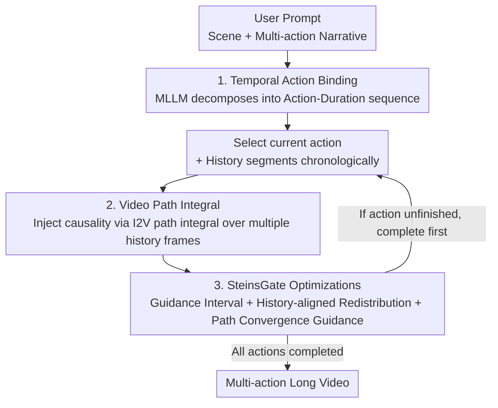

# SteinsGate: Injecting Causality into Diffusion Models with Path Integral for Long Video Generation

**Conference**: ICLR 2026  
**OpenReview**: [https://openreview.net/forum?id=8WS5nDWIWE](https://openreview.net/forum?id=8WS5nDWIWE)  
**Code**: None  
**Area**: Video Generation / Diffusion Models / Long Video  
**Keywords**: Long Video Generation, Temporal Causality, Path Integral, Autoregressive Video Continuation, Guidance at Inference Time

## TL;DR
This paper proposes the InstructVC framework and its inference-time instance, SteinsGate. It uses an MLLM to decompose long prompts into "action-duration" sequences for fine-grained temporal control and introduces a novel **Video Path Integral** to transform pre-trained TI2V diffusion models into "history-aware" autoregressive continuation models at inference time, generating coherent long videos with natural transitions across multiple actions.

## Background & Motivation

**Background**: Current mainstream video diffusion models (DiT architectures like Wan, CogVideoX, Mochi) can only generate short clips of a few seconds, far from the length required for real storytelling. Existing long video approaches fall into two categories: **temporal expanding** (expanding token capacity or frequency domain decomposition, e.g., FreeLong), which only provides marginal extensions; and **temporal decomposition** (splitting long videos into short segments), which includes temporal co-denoising (synchronous denoising of overlapping regions) and I2V-AR (autoregressive continuation using only the last frame of the previous segment).

**Limitations of Prior Work**: These methods **do not model temporal causality**. Co-denoising only enforces "correlation" between adjacent segments rather than "causality," where two segments are generated independently, potentially leading to conflicting motion directions in overlapping areas. I2V-AR only considers the last frame, discarding the motion dynamics of previous segments, which leads to reversed actions or temporal discontinuities. Furthermore, they only model local dependencies between adjacent segments, ignoring global causal planning, causing missing actions or incorrect sequences in multi-action scenarios.

**Key Challenge**: Videos are inherently **temporal and causal** sequences, but diffusion models treat videos as "3D images." Spatial local-to-global guidance techniques (e.g., Reconstruction Guidance) **cannot be migrated to the temporal domain**—even if the generated video perfectly reconstructs history frames, the continuation remains disconnected from history, indicating that the temporal structure is not correctly modeled.

**Goal**: Reformulate long video generation as a **translation task**—similar to text translation, generating the target video autoregressively according to the logical order of the source text, explicitly requiring temporal causality and continuity across actions. This is decomposed into two sub-problems: (1) fine-grained temporal control (mapping each action to a causal timeline with duration); (2) natural long-term simulation (sequential continuation, completing previous actions if unfinished).

**Key Insight**: I2V models possess an inherent **spatial-temporal decoupling** characteristic—injecting motion into the first frame and propagating spatial information forward. The authors propose that instead of using just one frame, one can **integrate the I2V paths of multiple history frames**. This allows trajectories consistent with history to enhance each other while inconsistent ones are diluted, propagating temporal information into the continuation.

**Core Idea**: Use "Temporal Action Binding (MLLM decomposition) + Video Path Integral (causality injection via path integral)" to add temporal causality to pre-trained diffusion models at **inference time**, enabling plug-and-play functionality without training.

## Method

### Overall Architecture

SteinsGate is an inference-time instance of the InstructVC framework. Given a user prompt $P=[c_{txt}, c_{img}, \{a_i\}_{i=1}^N]$ (scene description, optional first frame, and ordered action descriptions), the process consists of two stages: **Phase 1 (The Actor)** uses an MLLM to plan the prompt into an action script with durations (Temporal Action Binding). **Phase 2 (The Cinematographer)** autoregressively renders each action into video along the timeline (Causal Video Continuation). Causality in Phase 2 is achieved via the core Video Path Integral technology, supplemented by three engineering optimizations (collectively SteinsGate) for efficiency. The framework translates "textual narrative" into "video narrative" in causal order.

### Key Designs

**1. Temporal Action Binding: Decomposing long prompts into causal action sequences with durations using MLLM**

Addressing the pain point where "existing methods assume all prompts have equal duration, leading to skipped/repeated/incomplete actions," this paper uses an MLLM as the executor for temporal action binding. It expands and decomposes the user prompt into "Scene + Character Descriptions" plus a "sequence of action-duration pairs" $\{(a_i, d_i)\}$, decoupling vague actions into a globally causal sequence. To prevent MLLM hallucinations (linguistically sound but physically implausible actions that deviate from the TI2V base model's training distribution), **in-context learning** is employed. Examples from dense video captioning datasets (e.g., MinT) are provided to the MLLM to guide it using world knowledge. Assigning explicit durations—similar to holding a directional key in a game—reduces hallucinations and enables fine-grained temporal control.

**2. Video Path Integral: Propagating temporal causality by integrating I2V paths across multiple history frames**

This is the core of the paper. To model the joint distribution of a video sequence, the chain rule and a first-order Markov approximation yield $p(z_{1:N})\approx\prod_{i=1}^N p(z_i\mid z_{i-1})$. Since adjacent segments share an overlapping history $z_h$, this simplifies to $p_\theta(z_i\mid z_{i-1})\approx p_\theta(z_i\mid z_h)$. Treating this as a "spatial inverse problem" via Reconstruction Guidance (moving along the gradient $\nabla_{z_t}\log p(z_h|z_t)=\nabla_{z_t}\|z_h-\hat z_h\|_2^2$ to reconstruct history) fails because it reconstructs history but results in disjointed continuations. The proposed solution defines the video distribution generated by an I2V model starting from a historical frame as an **I2V Video Path**, and integrates the I2V vector fields of all history frames during multi-step sampling:

$$v_\theta(z_t, t\mid z_h)=\int_{i=0}^{H} w_t(v_\theta)\,\hat v_\theta(z_t,t\mid x_i)\,dx_i \approx \sum_{j=1}^{K} w_t(v_\theta)\,\hat v_\theta(z_t,t\mid x_j)$$

where $\{x_j\}_{j=1}^K$ is a subset of $H$ history frames sampled via Monte Carlo for efficiency. $\hat v_\theta$ is the predicted velocity after replacing the corresponding history segment in the generated trajectory with noisy ground-truth history $z_h^t$. The beauty lies in the **nested structure of time**: an I2V path starting from frame $x_j$ already implicitly contains the paths after $x_{j+1}$. By integrating over all history frames, trajectories consistent with the entire history (satisfying temporal causality) are reinforced, while inconsistent ones are diluted—structurally identical to path integrals in quantum physics. 

**3. SteinsGate Optimizations: Efficiency, alignment, and error reduction**

Video Path Integral requires multiple velocity calculations and introduces estimation errors in compositional generation. Three plug-and-play enhancements are added. **(a) Guidance Interval**: Path integral is applied only during high-noise stages ($t\le t_{mid}$, typically $t_{mid}=0.3$), while the late refinement stages use the last-frame I2V vector field, halving inference time. **(b) History-aligned Redistribution**: Different history frames have different overlap lengths. The authors use **Motion-Aware History Shifting** to weight frames based on movement similarity between the "predicted history trajectory" and "ground-truth history," $w_t(v_\theta(z_t,t\mid x_j))=\cos\text{-sim}\langle m^{v_\theta}_{j:H}, m^{z_H}_{j:H}\rangle$. **(c) Path Convergence Guidance**: Borrowing from AutoGuidance, the "last-frame I2V velocity (non-causal)" is treated as a weak model, and the "path integral result" as a strong model, using the difference $v_{pcg}=v_\theta(z_t\mid z_h)-v_\theta(z_t\mid x_{last})$ for weak-to-strong guidance. The final sampling velocity combined with CFG is:

$$v_\theta^*=\begin{cases} v_\theta^{last}+w_1 v_{pcg}+w_2\big(v_\theta(z_t\mid x_{last})-v_\theta(z_t\mid x_{last},\varnothing)\big) & t\le t_{mid}\\[4pt] v_\theta^{last}+w_2\big(v_\theta(z_t\mid x_{last})-v_\theta(z_t\mid x_{last},\varnothing)\big) & t> t_{mid}\end{cases}$$

## Key Experimental Results

### Main Results
Base model: WanVideo 2.1; Benchmark: InstructVC Benchmark (expanded from MinT, StoryBench, and VBench). Metrics: CSCV (Clip Similarity Coefficient of Variation), Motion Smoothness, Text-Image Alignment.

| Method | Type | CSCV↑ | Motion Smoothness↑ | Text-Image Align↑ |
|------|------|-------|--------------------|--------------------|
| DiTCtrl | Temporal Co-denoising | 0.76 | 0.93 | 0.31 |
| SkyReel-V2 | Training-based | 0.83 | 0.96 | 0.34 |
| MAGI-1 | Training-based | 0.82 | 0.96 | 0.33 |
| FIFO | Training-free | 0.71 | 0.89 | 0.29 |
| **SteinsGate** | **Inference-time (Ours)** | **0.82** | **0.97** | 0.32 |

SteinsGate, as a **training-free inference-time** method, achieves CSCV and Motion Smoothness scores comparable to expensive training-based diffusion-forcing models (SkyReel-V2, MAGI-1) and significantly outperforms other training-free methods.

### Ablation Study

| Configuration | CSCV↑ | Motion Smoothness↑ | Description |
|------|-------|--------------------|------|
| SteinsGate (Full) | 0.82 | 0.97 | Full model |
| w/o VPI | 0.74 | 0.94 | Removed path integral (reverts to I2V-AR); largest drop |
| w/o GI | 0.81 | 0.97 | Removed guidance interval; same performance, double inference time |
| w/o HR | 0.79 | 0.95 | Removed history-aligned redistribution |
| w/o PCG | 0.78 | 0.96 | Removed path convergence guidance |

### Key Findings
- **Video Path Integral is the primary performance driver**: Removing it (w/o VPI) drops CSCV from 0.82 to 0.74, proving that integrating over multiple history frames is key to injecting temporal causality.
- **Guidance Interval is a pure efficiency optimization**: Metrics remain nearly unchanged without it, but inference time doubles.
- **Temporal Action Binding determines temporal control**: Concatenating multi-action prompts with uniform durations (w/o Action Binding) leads to skipped actions and discontinuities.

## Highlights & Insights
- **Applying Quantum Physics Path Integrals to Video Diffusion**: The analogy of "constructive/destructive interference" to explain how integrating over history frames filters for causal trajectories is elegant and provides a computable implementation for the "nested structure of time."
- **Diagnosis of Spatial Guidance Limitations**: The authors explicitly identify that "perfect reconstruction of history frames $\neq$ correct temporal structure," a valuable negative observation that clarifies the fundamental limitation of treating videos as 3D images.
- **Completely Training-free and Plug-and-play**: It transforms any pre-trained TI2V model into a causal autoregressive continuator without additional training.

## Limitations & Future Work
- **Long-term Consistency**: The paper focuses on temporal causal continuity; maintaining long-range consistency (identity/style) still depends on the chosen context length.
- **Computational Overhead**: VPI requires repeated velocity calculations for $K$ history frames; despite GI, costs remain higher than simple I2V-AR.
- **Evaluation**: Heavily relies on proxy metrics (CSCV/CLIP); lacks large-scale human evaluation for complex narrative sequences.

## Related Work & Insights
- **vs Temporal Co-denoising (DiTCtrl/Gen-L-Video)**: They enforce "correlation" in overlaps; SteinsGate enforces "causality" via path integral, preventing motion direction conflicts.
- **vs I2V-AR**: It loses history dynamics; SteinsGate propagates temporal information from the entire history into the continuation.
- **vs Training-based Models (SkyReel-V2/MAGI-1)**: SteinsGate achieves comparable transition smoothness and motion quality without the cost of training.

## Rating
- Novelty: ⭐⭐⭐⭐⭐ 
- Experimental Thoroughness: ⭐⭐⭐⭐ 
- Writing Quality: ⭐⭐⭐⭐ 
- Value: ⭐⭐⭐⭐⭐ 

<!-- RELATED:START -->

## Related Papers

- [\[ICLR 2026\] Stable Video Infinity：用「误差回收」实现无限长视频生成](stable_video_infinity_infinite-length_video_generation_with_error_recycling.md)
- [\[ICLR 2026\] NarrLV: Towards a Comprehensive Narrative-Centric Evaluation for Long Video Generation](narrlv_towards_a_comprehensive_narrative-centric_evaluation_for_long_video_gener.md)
- [\[ICLR 2026\] Mixture of Contexts for Long Video Generation](mixture_of_contexts_for_long_video_generation.md)
- [\[ICLR 2026\] LongLive: Real-time Interactive Long Video Generation](longlive_real-time_interactive_long_video_generation.md)
- [\[ICLR 2026\] Dual-IPO: Dual-Iterative Preference Optimization for Text-to-Video Generation](dual-ipo_dual-iterative_preference_optimization_for_text-to-video_generation.md)

<!-- RELATED:END -->
