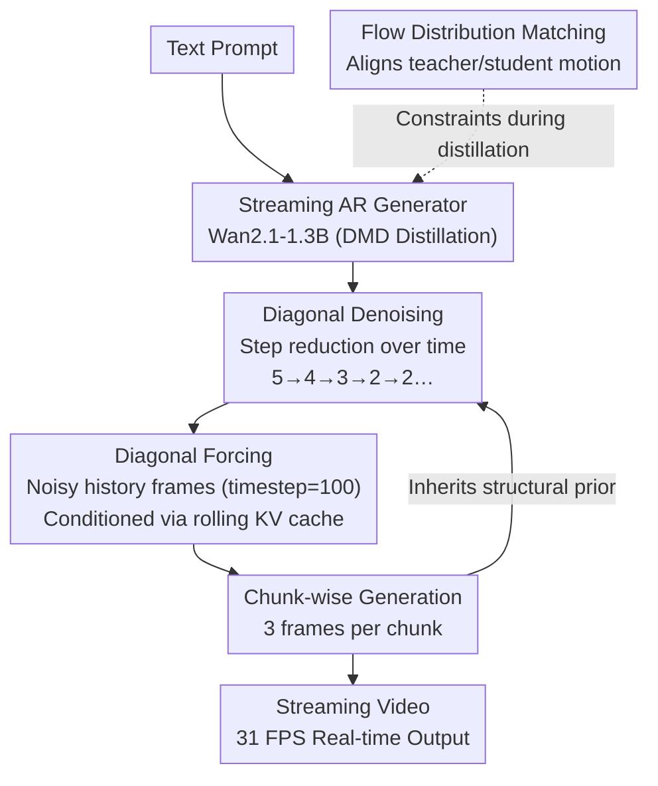

# Streaming Autoregressive Video Generation via Diagonal Distillation

**Conference**: ICLR 2026  
**arXiv**: [2603.09488](https://arxiv.org/abs/2603.09488)  
**Code**: [Project Page](https://SphereLab.ai/diagdistill)  
**Area**: Video Generation  
**Keywords**: Video Generation, Autoregressive Generation, Distillation, Streaming Generation, Real-time Video

## TL;DR

Diagonal Distillation (DiagDistill) achieves 277.3x acceleration in streaming autoregressive video generation, reaching 31 FPS real-time generation through a diagonal denoising strategy (more steps for early stages, fewer for later stages) and a flow distribution matching loss.

## Background & Motivation

1. **Background**: While diffusion models have made significant progress in video generation quality, the global bidirectional attention mechanism requires generating the entire video at once, making it unsuitable for streaming or real-time scenarios. Autoregressive (AR) models are naturally suited for streaming but require multiple denoising steps to ensure quality.

2. **Limitations of Prior Work**: Existing video distillation methods (e.g., CausVid, Self-Forcing) are mainly adapted from image distillation techniques, ignoring the specific characteristics of the temporal dimension. Reducing denoising steps leads to decreased motion coherence, long-sequence error accumulation, and oversaturation issues.

3. **Key Challenge**: In AR video generation, predicting the next chunk implicitly involves predicting the next noise level. This introduces exposure bias (training conditioned on clean frames while inference uses generated frames), causing quality to degrade progressively over time. Furthermore, if previous chunks have established structural priors, subsequent chunks should logically require fewer denoising steps, a property underutilized by existing methods.

4. **Goal**: Substantially reduce the latency of streaming video generation while maintaining video quality.

5. **Key Insight**: Leverage the temporal structure of AR generation—structural priors from early chunks can be "passed" to subsequent chunks. Design a non-uniform denoising step allocation strategy: "more at the beginning, fewer at the end."

6. **Core Idea**: Jointly optimize across both temporal and denoising dimensions using a diagonal denoising trajectory (starting with many steps and gradually reducing to 2) and flow distribution matching loss to achieve the optimal balance between quality and efficiency.

## Method

### Overall Architecture

DiagDistill uses Wan2.1-T2V-1.3B as the base model and trains a streaming AR generator under the DMD (Distribution Matching Distillation) framework. Videos are generated chunk by chunk (3 frames per chunk), with each chunk conditioned on generated history via a rolling KV cache. The key observation is the inherent "Time-Denoising Step" diagonal structure in AR generation: early chunks need more steps to establish structural foundations, while later chunks can inherit this prior and utilize fewer steps. By combining decreasing steps along the time axis, alignment of conditional frames with noise, and a motion distribution constraint, streaming generation achieves real-time speeds with minimal quality loss.

### Key Designs

**1. Diagonal Denoising: Inheriting Priors to Save Steps**

Allocating the same number of denoising steps to every chunk is suboptimal. Early chunks must build scene structure and appearance from scratch, whereas later chunks stand on the shoulders of well-processed history. DiagDistill generates the first three chunks using 5, 4, and 3 steps respectively, fixing subsequent chunks at 2 steps. This forms a "diagonal" trajectory along the time axis. Early stages solidify the visual foundation, and later stages inherit rich appearance info from neighbors, enabling clear results in just 2 steps. Ablations show that removing this strategy slightly improves temporal quality but degrades frame quality and text alignment, proving it trades minimal quality for nearly 2x throughput.

**2. Diagonal Forcing: Noisy Conditioning to Align Training and Inference**

AR generation's "next chunk prediction" implicitly involves "next noise level prediction," leading to exposure bias. Using clean frames for KV cache during training while using error-prone generated frames during inference results in time-progressive degradation and oversaturation. Diagonal Forcing addresses this by replacing clean outputs $\mathbf{X}_{k-1}$ with noisy versions $\tilde{\mathbf{X}}_{k-1} = \sqrt{\alpha_{k-1}}\,\mathbf{X}_{k-1} + \sqrt{1-\alpha_{k-1}}\,\bm{\epsilon}$ as conditions. On a scale of 0 to 1000, the optimal noise timestep is 100. Clean conditions (0 steps) cause the model to over-denoise subsequent chunks (oversaturation), while appropriate noise aligns with the reality of inference.

**3. Flow Distribution Matching: Restoring Motion in Low-Step Regimes**

Compressing steps often leads to attenuated motion magnitude. Standard DMD regression losses focus on frame appearance and ignore temporal dynamics, resulting in clear but "floaty" or static videos. DiagDistill introduces a flow distribution matching loss with gradient $\nabla_\phi\mathcal{L}_{\text{DMD}}^{\text{flow}}$, aligning teacher and student distributions on the motion flow field $\mathcal{F}(\mathbf{x})$. Motion features are extracted via a lightweight learnable module (difference of adjacent latents followed by convolution/MLP), avoiding external optical flow estimators. This is crucial for maintaining consistency in 2-step regimes.

### Loss & Training

The total loss combines spatial and flow terms: $\mathcal{L}_{\text{Total}} = \lambda_{\text{spatial}}\mathcal{L}_{\text{DMD}} + \mathcal{L}_{\text{reg}} + \gamma(\lambda_{\text{flow}}\mathcal{L}_{\text{DMD}}^{\text{flow}} + \mathcal{L}_{\text{reg}}^{\text{flow}})$, with $\lambda_{\text{spatial}}=4$ and $\lambda_{\text{flow}}=4$. During inference, a rolling KV cache (chunk size 3) is used, with memory usage fixed at 17.5GB regardless of video length.

## Key Experimental Results

### Main Results

VBench evaluation (5s video generation, single H100 GPU):

| Method | Throughput (FPS)↑ | First Frame Latency↓ | Speedup | Total Score↑ | Quality↑ | Semantic↑ |
|------|------------|---------|--------|------|------|------|
| Wan2.1 | 0.78 | 103s | 1× | 84.26 | 85.30 | 80.09 |
| CausVid | 17.0 | 0.69s | 149.3× | 81.20 | 84.05 | 69.80 |
| Self-Forcing | 17.0 | 0.69s | 149.3× | 84.31 | 85.07 | 81.28 |
| **Ours** | **31.0** | **0.37s** | **277.3×** | **84.48** | **85.26** | **81.73** |

### Ablation Study

| Configuration | Temporal Quality↑ | Frame Quality↑ | Text Alignment↑ | Total Score↑ |
|------|---------|--------|---------|------|
| w/o Diagonal Forcing | 92.1 | 60.1 | 26.9 | 83.58 |
| w/o Flow Loss | 92.5 | 60.8 | 27.8 | 84.18 |
| w/o Diagonal Denoising | 95.1 | 63.2 | 28.6 | 84.46 |
| **Full Method** | 94.9 | 63.4 | 28.9 | **84.48** |

### Key Findings

- DiagDistill achieves a further **1.88x speedup** over Self-Forcing (277.3x vs 149.3x) with improved quality.
- The optimal noise timestep for Diagonal Forcing is 100; too much noise blurs structure, too little causes oversaturation.
- Flow Loss is primarily effective in low-step denoising regimes.
- In 45s long video generation, DiagDistill significantly outperforms CausVid and Self-Forcing, which suffer from saturation artifacts.

## Highlights & Insights

- **Intuitive Efficiency**: The "more early, fewer late" strategy is a simple yet effective exploitation of AR temporal structure.
- **Innovative Solution for Exposure Bias**: Aligning training and inference through controlled noise injection.
- **Motion-Aware Distillation**: First use of explicit motion distribution alignment in video distillation.
- **High Practicality**: 31 FPS exceeds standard 16 FPS playback rate, enabling true real-time generation.

## Limitations & Future Work

- Currently based on Wan2.1-1.3B; performance on larger models requires verification.
- Fixed step reduction schedule (5/4/3/2...) might not be optimal for all scenes.
- Learnable motion module may be less precise than dedicated optical flow models.
- Potential for adaptive step allocation based on scene complexity.

## Related Work & Insights

- Builds upon CausVid and Self-Forcing, pushing streaming video generation to higher speeds.
- Extends the DMD framework naturally into the temporal dimension via flow matching.
- **Insight**: Video distillation requires specialized temporal considerations; image-based methods cannot be directly ported without loss of efficiency or quality.

## Rating

- Novelty: ⭐⭐⭐⭐ Innovative diagonal strategy and flow matching.
- Experimental Thoroughness: ⭐⭐⭐⭐ Comprehensive VBench metrics and long-video analysis.
- Writing Quality: ⭐⭐⭐⭐ Clear diagrams and intuitive explanations.
- Value: ⭐⭐⭐⭐⭐ High utility; 31 FPS represents a milestone for real-time generation.

<!-- RELATED:START -->

## Related Papers

- [\[CVPR 2026\] Reward Forcing: Efficient Streaming Video Generation with Rewarded Distribution Matching Distillation](../../CVPR2026/video_generation/reward_forcing_efficient_streaming_video_generation_with_rewarded_distribution_m.md)
- [\[ICLR 2026\] Towards One-Step Causal Video Generation via Adversarial Self-Distillation](towards_one-step_causal_video_generation_via_adversarial_self-distillation.md)
- [\[ICML 2026\] AAD-1: Asymmetric Adversarial Distillation for One-Step Autoregressive Video Generation](../../ICML2026/video_generation/aad-1_asymmetric_adversarial_distillation_for_one-step_autoregressive_video_gene.md)
- [\[ICLR 2026\] Flow Caching for Autoregressive Video Generation](flow_caching_for_autoregressive_video_generation.md)
- [\[CVPR 2025\] Teller: Real-Time Streaming Audio-Driven Portrait Animation with Autoregressive Motion Generation](../../CVPR2025/video_generation/teller_real-time_streaming_audio-driven_portrait_animation_with_autoregressive_m.md)

<!-- RELATED:END -->
