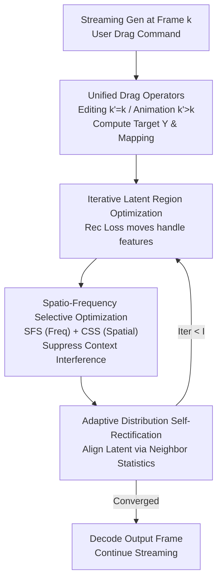

# Streaming Drag-Oriented Interactive Video Manipulation: Drag Anything, Anytime!

**Conference**: ICLR 2026  
**OpenReview**: [https://openreview.net/forum?id=UtL0hIjENO](https://openreview.net/forum?id=UtL0hIjENO)  
**Code**: https://github.com/junbao-zhou/DragStream  
**Area**: Video Generation / Interactive Video Editing / Diffusion Models  
**Keywords**: Streaming Video Generation, Dragging Operations, Autoregressive Diffusion, Training-free, Latent Space Drift

## TL;DR
This paper introduces the REVEL task—allowing users to "drag anything, anytime" during the streaming generation of autoregressive video diffusion models—and proposes DragStream, a training-free method that suppresses latent space drift caused by dragging accumulation via "Adaptive Distribution Self-Rectification" and mitigates context frame interference via "Spatio-Frequency Selective Optimization."

## Background & Motivation

**Background**: Autoregressive video diffusion models (VDMs) can generate videos frame-by-frame in a streaming manner, utilizing KV caches to accelerate inference. Simultaneously, dragging (drag) has become a mainstream signal for controlling video generation (e.g., DragVideo, SG-I2V, Tora) due to its fine-grained and intuitive interaction.

**Limitations of Prior Work**: Existing "streaming generation" and "drag control" pipelines are largely disconnected. Current dragging methods either only edit pre-generated offline video frames (DragVideo) or animate images along trajectories (SG-I2V, Tora), preventing user intervention during generation. Furthermore, the definition of dragging operations is inconsistent, often limited to translation without support for rotation or the ability to distinguish between editing a frame and generating subsequent frames from it. Direct fine-tuning of VDMs on large-scale dragging data is computationally prohibitive, requiring hundreds of H100 GPU hours.

**Key Challenge**: The root causes of difficulty in streaming dragging are attributed to two observations: 
1. **Latent Distribution Drift**: Dragging perturbs latent variables. In autoregressive generation, these perturbations accumulate, causing latent code statistics (mean, variance, extrema) to deviate from the original distribution, eventually leading to generation stagnation or unintended attribute changes (e.g., color or category). 
2. **Context Frame Interference**: Streaming relies heavily on visual cues from previous frames (KV cache). However, context features near handle points can mislead subsequent generation, resulting in artifacts like duplicated ears on a rabbit or ghosting on a car.

**Goal**: To enable users to perform dragging (translation, deformation, 2D/3D rotation) on arbitrary content during streaming generation without model fine-tuning or secondary training, while mitigating the aforementioned failure modes.

**Key Insight**: Instead of altering model weights, the method performs statistical correction on latent codes and selective utilization of context features within each iterative latent space optimization step during inference.

**Core Idea**: Unified streaming dragging into "Editing" and "Animation" operations. Use neighbor frame statistics to pull drifted latents back to the original distribution (ADSR) and selectively propagate context cues in both frequency and spatial domains (SFSO).

## Method

### Overall Architecture
DragStream addresses a scenario where a user observes frame $\Gamma_k$ and provides a drag command $U^k=\{E^k, C^k\}$, where $E^k$ is the handle region and $C^k$ contains the instruction. A key distinction is made: **Editing** ($k'=k$) re-denoises the current frame, while **Animation** ($k'>k$) uses perturbed features from the current frame to guide new frames.

The pipeline revolves around "Iterative Latent Region Optimization": noisy latent $z^{k'}_T$ is denoised to an intermediate step $z^{k'}_{T'}$, and reference features $F(z^{k'}_{T'})$ are extracted from the DiT denoiser. Based on user instructions, target positions $Y^{k'}_i$ and coordinate mappings $\Pi_{H^k_i\to Y^{k'}_i}$ are computed. A total loss $\mathcal{L}_{Tot}$ iteratively optimizes $z^{k'}_{T'}$ to move handle features to target positions while fixing non-editable regions. ADSR and SFSO are embedded within this optimization loop.

### Key Designs

**1. Unified Dragging Operators and Iterative Latent Region Optimization**  
The method unifies dragging into "Editing or Animation" supporting translation, deformation, and 2D/3D rotation. For handle region $H^k_i$, target masks and mappings are computed: $\mathrm{Rot}(H^k_i, c^k_i, \theta)$ for rotation or $\mathrm{Trans}(H^k_i, \vartheta)$ for translation. The optimization objective is:

$$\mathcal{L}_{Tot}=\underbrace{\|F(z^{k'}_{T'})*Y^{k'}_i - F_{ref}(z^{k}_{T'})[\Pi_{H^k_i\to Y^{k'}_i}]*Y^{k'}_i\|_1}_{\mathcal{L}_{Rec}} + \underbrace{\|F(z^{k'}_{T'})*M^{k'} - F_{init}(z^{k'}_{T'})*M^{k'}\|_1}_{\mathcal{L}_{Cst}}$$

where $\mathcal{L}_{Rec}$ reconstructs reference features at the target, and $\mathcal{L}_{Cst}$ preserves non-editable areas via mask $M^{k'}$.

**2. Adaptive Distribution Self-Rectification (ADSR)**  
To address Challenge 1 (latent drift), the method tracks the mean $\bar{\mu}_{T'}$ and standard deviation $\bar{\sigma}_{T'}$ of recent neighbor latents $\{z^i_{T'}\}_{i=k'-L_n-1:k'-1}$. After each iteration, the current latent is aligned:

$$\hat{z}^{k'}_{T'}=\frac{\mathrm{Iter\_optim}(z^{k'}_{T'}, U^k)-\mu^{k'}_{T'}}{\sigma^{k'}_{T'}}*\bar{\sigma}_{T'}+\bar{\mu}_{T'}$$

This ensures first- and second-order statistics remain consistent with "uncontaminated" neighboring frames, preventing attribute corruption.

**3. Spatio-Frequency Selective Optimization (SFSO)**  
To address Challenge 2 (context interference), SFSO operates in two domains. In the frequency domain, **Switchable Frequency Selection (SFS)** is used: context KV features are passed through a Butterworth filter, where the cutoff frequency $\omega$ is **randomly switched** from a candidate set $\{\omega_i\}$:

$$\{\bar{K}^k_{l_i}, \bar{V}^k_{l_i}\}=\mathrm{IFFT}(\mathrm{Butterw}(\mathrm{FFT}(\{\bar{K}^k_{l_i}, \bar{V}^k_{l_i}\}), \omega=\mathrm{Random}(\omega_1,...,\omega_N)))$$

In the spatial domain, **Criticality-driven Spatial Selection (CSS)** weights the gradient backpropagation using a Gaussian map $G^{k'}$ centered at the edit $(x_c, y_c)$:

$$z^{k'}_{T'}\leftarrow z^{k'}_{T'}-G^{k'}\frac{\partial \mathcal{L}_{Tot}}{\partial z^{k'}_{T'}},\quad G^{k'}[x,y]=\exp\!\left(-\Big(\tfrac{(x-x_c)^2}{2\sigma_x^2}+\tfrac{(y-y_c)^2}{2\sigma_y^2}\Big)\right)$$

This concentrates optimization on handle areas and prevents unnecessary background changes.

### Loss & Training
The method is entirely **training-free**. It optimizes purely through iterative latent space updates during inference. The core objective is $\mathcal{L}_{Tot} = \mathcal{L}_{Rec} + \mathcal{L}_{Cst}$. Hyperparameters include iteration count $I=4$ and CSS spread $\alpha=1$.

## Key Experimental Results

### Main Results
DragStream was compared against SG-I2V and DragVideo adapted for the REVEL task.

| Metric (↓) | SG-I2V | DragVideo | DragStream (Ours) |
|--------|--------|-----------|------|
| ObjMC | 44.19 | 49.69 | **23.05** |
| FVD | 936.89 | 561.45 | **552.39** |
| FID | 33.59 | 25.02 | **23.72** |
| DAI | 0.08 | 0.09 | **0.05** |

Ours shows significant improvements in motion control (ObjMC) and spatial accuracy (DAI) while maintaining superior image/video quality (FID/FVD).

### Ablation Study

| Configuration | Conclusion |
|------|------|
| w/o ADSR, SFSO | Performance drops significantly without core components. |
| w/ ADSR | Statistical correction recovers performance but lacks detail without SFSO. |
| w/ ADSR + SFS | Frequency selection alone is insufficient. |
| Full (ADSR+SFS+CSS) | Best performance across all metrics. |

### Key Findings
- **Efficiency**: With $I=4$, the overhead is only 0.13s per frame (0.30s total) on an H20 GPU.
- **Robustness**: ADSR successfully prevents object attribute changes (e.g., color shifts) during long-term dragging.
- **Frequency Switching**: Randomly switching $\omega$ performs better than fixed filters, as it prevents high-frequency artifacts while absorbing cross-band context.
- **Occlusions**: Leveraging VDM priors, DragStream handles occlusions and reappearances during streaming drags.

## Highlights & Insights
- **Task Formalization**: Successfully defines and unifies "Streaming Dragging" as a systematic task.
- **Statistical Realignment**: ADSR provides a simple yet effective way to handle cumulative drift in autoregressive models, which is applicable to other streaming tasks.
- **SFS Strategy**: Proves that "switching" frequencies is a clever trade-off for balancing context utility and interference.
- **Plug-and-Play**: No training required, making it highly practical for deployment with existing autoregressive VDMs.

## Limitations & Future Work
- **Physical Plausibility**: Drags that strongly violate physical laws or VDM priors (e.g., extreme stretching) may still fail.
- **Evaluation**: Lacks comparison with hypothetical "large-scale fine-tuned" drag models (though none currently exist for streaming).
- **Cumulative Errors**: While mitigated, long-term autoregressive drift remains an open problem for extremely long sequences.

## Related Work & Insights
- **vs. DragVideo**: DragStream adds streaming support, animation capabilities, and rotation operators.
- **vs. SG-I2V/Tora**: DragStream provides fine-grained control (shape/rotation) rather than just trajectory following.
- **vs. StreamDiffusion**: DragStream enables fine-grained local editing without task-specific training.

## Rating
- Novelty: ⭐⭐⭐⭐⭐ 
- Experimental Thoroughness: ⭐⭐⭐⭐ 
- Writing Quality: ⭐⭐⭐⭐ 
- Value: ⭐⭐⭐⭐⭐ 

<!-- RELATED:START -->

## Related Papers

- [\[ICLR 2026\] Geometry-aware 4D Video Generation for Robot Manipulation](geometry-aware_4d_video_generation_for_robot_manipulation.md)
- [\[ICLR 2026\] Streaming Autoregressive Video Generation via Diagonal Distillation](streaming_autoregressive_video_generation_via_diagonal_distillation.md)
- [\[ICLR 2026\] Learning Video Generation for Robotic Manipulation with Collaborative Trajectory Control](learning_video_generation_for_robotic_manipulation_with_collaborative_trajectory.md)
- [\[ICLR 2026\] MIMIC: Mask-Injected Manipulation Video Generation with Interaction Control](mimic_mask-injected_manipulation_video_generation_with_interaction_control.md)
- [\[ICLR 2026\] LongLive: Real-time Interactive Long Video Generation](longlive_real-time_interactive_long_video_generation.md)

<!-- RELATED:END -->
