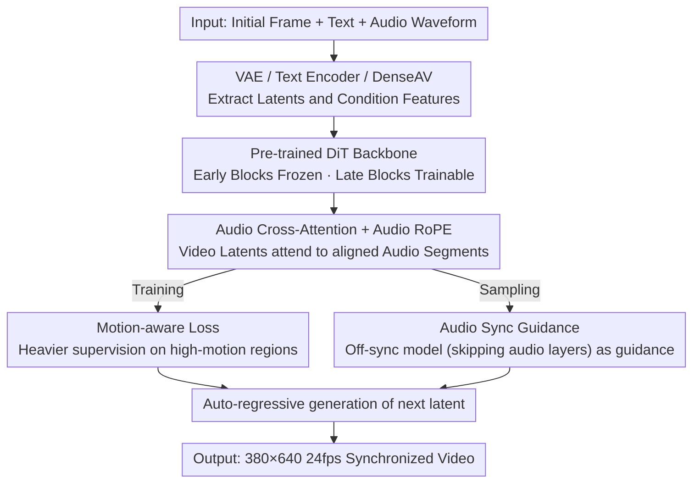

# Syncphony: Audio-to-Video Generation with Synchronized Visual Dynamics using Diffusion Transformers

**Conference**: ICLR 2026  
**OpenReview**: [https://openreview.net/forum?id=sG8dGZMaub](https://openreview.net/forum?id=sG8dGZMaub)  
**Code**: Project Page [https://jibin86.github.io/syncphony_project_page](https://jibin86.github.io/syncphony_project_page) (Commitment to open-source code, models, and evaluation tools)  
**Area**: Video Generation / Diffusion Models / Multimodal  
**Keywords**: Audio-to-Video Generation, Audio-Visual Synchronization, Diffusion Transformer, Motion-aware Loss, Sampling Guidance

## TL;DR
Syncphony inserts audio cross-attention into a pre-trained DiT video backbone, utilizing a "Motion-aware Loss" to strengthen supervision in high-motion regions and "Audio Sync Guidance" to amplify audio influence during sampling. It generates 380×640, 24fps videos precisely synchronized with audio and proposes CycleSync, a synchronization metric based on back-inferring audio from video.

## Background & Motivation
**Background**: Text-to-Video (T2V) and Image-to-Video (I2V) have progressed rapidly in image quality and temporal consistency, yet they struggle to precisely control "when an action occurs and at what rhythm." Text naturally lacks timestamps (e.g., "dog barking" does not specify count or rhythm), and images are static snapshots. Audio, however, shares the same timeline as video and naturally carries temporal cues—such as when a bowling ball hits the pins or when a machine gun fires—making it an ideal condition for temporally controllable video generation.

**Limitations of Prior Work**: Existing Audio-to-Video (A2V) methods exhibit coarse synchronization. One category relies on audio amplitude to modulate cross-attention weights (Lee et al.), but amplitude cannot convey semantic or temporal structures. Another category projects audio embeddings into text space before feeding them to T2V models (TempoTokens, Yariv); this indirect "audio $\to$ text $\to$ motion" mapping acts as a bottleneck for temporal expressiveness. AVSyncD integrates audio layers directly into a Stable Diffusion T2I backbone, but is limited by the spatial resolution and shallow temporal modeling of T2I, requiring training temporal layers from scratch (6fps, 256×256), leading to inconsistencies like flickering and saturation.

**Key Challenge**: Even with sufficient conditions, common MSE targets in diffusion/flow models are insufficient for learning precise motion timing and magnitude. MSE treats all spatio-temporal regions equally; a "delayed gunshot" or "insufficient impact magnitude" still yields low error if the overall frame remains close to the ground truth, causing models to misjudge misaligned predictions as successful.

**Goal**: To achieve precise synchronization between video motion and diverse audio while maintaining high visual quality, providing a reliable metric to measure synchronization in high-frame-rate, real-world scenarios.

**Key Insight**: ① Move away from indirect mapping by using cross-attention to **directly** inject audio features into the visual generation process; ② Leverage strong pre-trained video backbones (Pyramid Flow auto-regressive DiT) instead of training temporal layers from scratch; ③ Since MSE supervision is too uniform, intensify supervision in **regions with high ground truth motion**.

**Core Idea**: Add audio cross-attention with RoPE to a pre-trained DiT, focus learning signals on high-motion regions using a "Motion-aware Loss," and use an "off-sync model" (skipping audio layers) as sampling guidance to amplify audio influence.

## Method

### Overall Architecture
Syncphony receives three inputs: an initial frame, a text prompt, and an audio waveform. The initial frame is encoded into a latent variable $z_0$ via VAE, serving as the starting point for auto-regressive generation of subsequent video latents $\{z_l\}_{l=1}^{L}$. Text features are extracted by pre-trained encoders (T5/CLIP), and audio features $\{a_i\}$ are extracted by the DenseAV audio encoder. The backbone is an auto-regressive Diffusion Transformer that denoises and generates next-chunk video latents based on "previous chunks + text."

Crucially, the Transformer blocks are divided into two groups: **early blocks are frozen** (responsible for spatial structure and semantic fidelity), while **late blocks are trainable** (responsible for temporal dynamics and motion refinement). Text is injected via joint self-attention across all blocks, whereas audio cross-attention layers are **inserted only in the late blocks** before joint self-attention, allowing each video latent to attend to its temporally aligned audio segment for fine-grained synchronization. During training, a motion-aware loss weights errors toward high-motion regions; during sampling, Audio Sync Guidance amplifies audio-driven motion. Relative temporal information is injected via Audio RoPE.

### Key Designs

**1. Audio Cross-Attention + Audio RoPE: Embedding Audio Temporality directly into Motion**

To address the failure of indirect mapping to convey timing, Syncphony abandons amplitude modulation and audio-to-text projection. Instead, it inserts an audio cross-attention layer in the late Transformer blocks before joint self-attention: video latents act as queries, and audio segments act as keys/values. This allows each latent to directly attend to its temporally aligned local audio. To enforce "alignment," shared Rotary Positional Embeddings (Audio RoPE) are applied to both queries (video) and keys (audio), injecting relative temporal information into the attention mechanism. Aligning modalities in the relative position space explicitly encodes intervals between motion and sound events.

**2. Motion-aware Loss: Focusing Supervision on "Where it Moves"**

To solve the issue where MSE fails to penalize incorrect motion timing, the authors weight the loss based on ground truth motion magnitude. It is observed that differences between adjacent frame latents often correlate with audio events, even if motion is subtle in the original frames (e.g., machine gun fire). The loss is defined as a base term plus a motion-weighted term:

$$L = \|\hat{\epsilon}_t - \epsilon_t^{GT}\|^2 + \lambda \sum_{l=2}^{L} \left\|(\hat{\epsilon}_t^{(l)} - \epsilon_t^{GT(l)}) \odot (z_{clean}^{GT(l)} - z_{clean}^{GT(l-1)})\right\|^2$$

where the difference between adjacent ground truth frame latents $z_{clean}^{GT(l)} - z_{clean}^{GT(l-1)}$ acts as the "motion magnitude" weight ($\odot$ denotes element-wise multiplication), with $\lambda=1$. This setup heavily penalizes prediction errors in dynamic regions while leaving static regions unchanged, forcing the model to learn the correct timing and intensity of motion. A key design choice: **use ground truth motion magnitude rather than audio intensity as the weight**, recognizing that audio and motion are not always perfectly one-to-one (e.g., a lion moves before roaring). 

**3. Audio Sync Guidance (ASG): Amplifying Audio via the "Off-sync Model"**

Since audio cues are often weak, ASG runs two branches using the shared visual backbone during sampling: the **full model** with audio cross-attention enabled, and an **off-sync model** where audio layers are disabled. The authors found that the off-sync model's output is visually similar to the full model but lacks synchronization. Thus, the difference between the two **isolates the "synchronization component."** Adding this difference back to the full model with strength $w$ amplifies the audio impact:

$$\tilde{\epsilon}_\theta^w(z_t) = \epsilon_\theta(z_t) + w\left(\epsilon_\theta(z_t) - \epsilon_\theta^{\text{off-sync}}(z_t)\right)$$

Unlike standard classifier-free guidance (CFG), which requires training a null condition for audio, ASG **only skips the audio layers themselves** without dropping the audio condition, enhancing alignment **without additional training**. $w=2$ provides the best trade-off.

**4. CycleSync: Measuring Sync by Inferring Audio from Video**

Existing metrics (RelSync/AlignSync) often drop to 6fps (losing temporal resolution), or assume audio-visual peaks align perfectly (AV-Align), which fails in reality (e.g., a hammer moves before the hit). The authors propose CycleSync: feeding the generated video into a pre-trained video-to-audio (V2A) model to infer audio $\hat{a}=f_{v2a}(\hat{v})$, then comparing onset peak sets between the inferred and original audio. Given peak sets $A$ and $\hat{A}$ matched within a tolerance $\delta$ to find $I$ matches, the score is the IoU of the sets:

$$\text{CycleSync} = \frac{I}{|A| + |\hat{A}| - I}$$

This measures whether motion cues in the video are sufficient to reconstruct the temporal structure of the original audio.

### Loss & Training
The total loss is the motion-aware loss defined above ($\lambda=1$). The backbone uses the pre-trained Pyramid Flow Video model; only late blocks are fine-tuned and augmented with audio cross-attention. Videos are up to 5 seconds, 24fps, 380×640, with 16kHz audio. Training involves random clipping to improve generalization across diverse alignments. Training was performed using 4 RTX 3090 (24GB) GPUs.

## Key Experimental Results

### Main Results
Evaluated on AVSync15 and TheGreatestHits. FID/FVD measure visual quality, IT (CLIP) and IA (ImageBind) measure semantic alignment, and CycleSync measures synchronization. A user study with 150 videos covered Sync, Image Quality (IQ), and Frame Consistency (FC).

| Dataset | Model | FID ↓ | FVD ↓ | IA ↑ | CycleSync ↑ |
|--------|------|------|------|------|------|
| AVSync15 | AVSyncD | 9.2 | 491.5 | 35.23 | 16.38±1.38 |
| AVSync15 | Pyramid Flow (FT) | 8.5 | 294.6 | - | 12.34±1.14 |
| AVSync15 | **Ours** | **8.5** | **293.1** | **37.02** | **16.48±1.28** |
| AVSync15 | Groundtruth | - | - | 37.06 | 22.15±1.8 |
| TheGreatestHits | AVSyncD | 6.8 | 327.8 | 12.35 | 9.89±0.84 |
| TheGreatestHits | **Ours** | 6.7 | **166.2** | **13.83** | **16.18±1.26** |
| TheGreatestHits | Groundtruth | - | - | 14.68 | 15.99±1.5 |

Syncphony leads in synchronization accuracy while maintaining lower FID/FVD. Interestingly, on TheGreatestHits, CycleSync **surpasses the ground truth**, as generated motions are more focused on audio events than real-world background noise.

### Ablation Study

| Configuration | FID ↓ | FVD ↓ | CycleSync ↑ | Description |
|------|------|------|------|------|
| w/o Motion-aware Loss | 8.4 | 305.9 | 15.18±1.48 | Poor sync without weighting |
| Full w/o ASG | 8.5 | 299.1 | 15.31±1.49 | No sampling guidance |
| Full w/ ASG (w=2) | 8.5 | 293.1 | **16.48±1.28** | Best trade-off |
| Full w/ ASG (w=4) | 8.7 | 298.3 | 16.26±1.4 | Exaggerated motion, higher FVD |

### Key Findings
- **Motion-aware loss is the biggest contributor**: Removing it drops CycleSync significantly; it selectively amplifies learning signals at high-motion points to improve timing precision.
- **ASG guidance strength has a sweet spot**: $w=2$ provides optimal sync and quality; $w=4$ introduces over-exaggerated motions (e.g., exaggerated frog puffing), worsening FVD.
- **CycleSync validity**: CycleSync is far more sensitive to temporal shifts than previous metrics and correlates most highly with human preference.

## Highlights & Insights
- **"Off-sync model" guidance is clever**: By disabling only the audio layers, the model generates a visually similar but unsynchronized baseline. Their difference isolates the "sync component," allowing for amplified alignment without extra training.
- **Weighting by motion rather than audio**: This avoids the false assumption of "sound peak = motion peak," acknowledging that motion may precede or lag behind sound.
- **CycleSync's "cycle" logic**: Mapping generation results back to the condition space for comparison is a robust paradigm for cross-modal evaluation.

## Limitations & Future Work
- **Motion weighting does not explicitly distinguish audio-related motion**: It weights by all ground truth motion; more selective proxies could improve robustness in highly dynamic scenes.
- **Dependency on V2A model quality**: CycleSync's reliability is bounded by the pre-trained V2A model used for back-inference.
- **Focus on non-speech general motion**: Explicitly does not handle speech/lip-sync, making it complementary to talking head models.
- **Resolution/Duration constraints**: Limited by the Pyramid Flow backbone (380×640, 5 seconds).

## Related Work & Insights
- **vs AVSyncD**: AVSyncD trains from scratch on T2I backbones (low fps), leading to inconsistency; Syncphony uses pre-trained DiT backbones for better quality and uses ASG for training-free guidance.
- **vs TempoTokens**: They project audio to text (indirect, lossy); Syncphony uses direct cross-attention.
- **vs Spatiotemporal Skip Guidance**: While they skip visual layers for quality, Syncphony skips audio layers to isolate synchronization.

## Rating
- Novelty: ⭐⭐⭐⭐ 
- Experimental Thoroughness: ⭐⭐⭐⭐ 
- Writing Quality: ⭐⭐⭐⭐ 
- Value: ⭐⭐⭐⭐ 

<!-- RELATED:START -->

## Related Papers

- [\[ICLR 2026\] Neodragon: Mobile Video Generation Using Diffusion Transformer](neodragon_mobile_video_generation_using_diffusion_transformer.md)
- [\[ICLR 2026\] EchoMotion: Unified Human Video and Motion Generation via Dual-Modality Diffusion Transformer](echomotion_unified_human_video_and_motion_generation_via_dual-modality_diffusion.md)
- [\[ICLR 2026\] QuantSparse: Comprehensively Compressing Video Diffusion Transformer with Model Quantization and Attention Sparsification](quantsparse_comprehensively_compressing_video_diffusion_transformer_with_model_q.md)
- [\[ICLR 2026\] SANA-Video: Efficient Video Generation with Block Linear Diffusion Transformer](sana-video_efficient_video_generation_with_block_linear_diffusion_transformer.md)
- [\[ICLR 2026\] JavisDiT: Joint Audio-Video Diffusion Transformer with Hierarchical Spatio-Temporal Prior Synchronization](javisdit_joint_audio-video_diffusion_transformer_with_hierarchical_spatio-tempor.md)

<!-- RELATED:END -->
