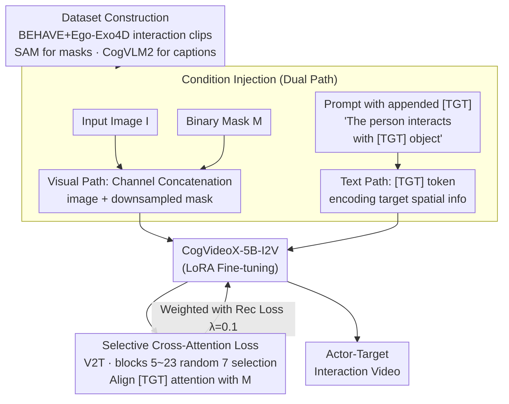

# Target-Aware Video Diffusion Models

**Conference**: ICLR 2026  
**arXiv**: [2503.18950](https://arxiv.org/abs/2503.18950)  
**Code**: [taeksuu.github.io/tavid](https://taeksuu.github.io/tavid/)  
**Area**: Video Generation / Human-Object Interaction  
**Keywords**: Video Diffusion Models, Target-Aware, Cross-Attention Loss, Human Interaction, Action Planning

## TL;DR
A target-aware video diffusion model is proposed that generates videos of actors interacting with a specified target using only an input image and a segmentation mask of the target object. The core innovation involves introducing a special [TGT] token and designing a selective cross-attention loss to focus the model on the target's spatial location, outperforming baselines in both target alignment and video quality.

## Background & Motivation
Video diffusion models have demonstrated significant capabilities in simulating complex scenes, but practical applications require precise control over content and motion. Existing controllable video generation methods often rely on dense structural or motion cues (depth maps, edge maps, optical flow, dragging, etc.) to guide actor movement. While effective for simple translations or viewpoint changes, these methods face fundamental difficulties in **actor-target interaction scenarios**, where providing structural guidance (e.g., how to reach for a cup on a table) is extremely challenging.

An additional motivation is to utilize the video diffusion model as a **high-level action planner**. Rather than treating the model as a "renderer" requiring dense motion input, this work positions it as a "planner" that generates plausible interaction sequences given only the target location. This is of significant importance for downstream applications such as robotic manipulation.

**Core Idea**: Use only a single segmentation mask to label the target object, allowing the video diffusion model's generative prior to autonomously infer reasonable interaction movements for the actor.

## Method

### Overall Architecture
This paper addresses the limitation of current controllable video generation methods that rely on dense cues. Since sketching frame-by-frame guidance for "reaching for a cup" is nearly impossible, this method takes an input image, a binary mask of the target object, and a text prompt to let the model infer the interaction.

**Mechanism**: The process begins by constructing a dataset of "non-contact to contact" interaction segments. During training, spatial information of the target is injected through **two parallel paths**: a visual path (mask concatenated with the image in the channel dimension) and a text path (a [TGT] token appended to the prompt). The base model is CogVideoX-5B-I2V, fine-tuned using LoRA. To ensure the model attends to the mask, a selective cross-attention loss is introduced to pull the attention map of the [TGT] token toward the mask. This loss is applied only to the most semantically aligned layers and attention regions.

### Key Designs

**1. Dataset Construction: Filtering and Auto-labeling Interaction Segments**
The [TGT] loss requires the supervision signal to contain a clear interaction process. The authors extracted 1,290 segments from BEHAVE and Ego-Exo4D. Each segment satisfies two conditions: the actor is present but not yet interacting with the target in the initial frame, and successful interaction occurs in subsequent frames. Masks are obtained via SAM, and captions are generated using CogVLM2.

**2. Mask Condition Injection: Pixels-level Target Perception**
A binary mask $M$ is downsampled and concatenated with the input image $I$ as an additional channel. To accommodate this, the input dimension of the image projection layer is expanded, with new weights **initialized to zero** to preserve the pre-trained generative priors during early training stages.

**3. [TGT] Token and Cross-Attention Loss: Spatial Info via Text**
The prompt is appended with "The person interacts with [TGT] object." The special token [TGT] encodes the target's spatial position. A cross-attention loss aligns the [TGT] attention map with the input mask:

$$\mathcal{L}_{\text{attn}} = \mathbb{E}\big[\,\|A(\mathbf{z}_t^0, [\text{TGT}]) - M\|_2^2\,\big]$$

The total objective is $\mathcal{L}_{\text{total}} = \mathcal{L}_{\text{rec}} + \lambda_{\text{attn}} \mathcal{L}_{\text{attn}}$ (where $\lambda_{\text{attn}} = 0.1$). During inference, the [TGT] token guides the model to utilize the spatial cues provided by the mask.

**4. Selective Cross-Attention Loss: Layer and Region Specificity**
Applying $\mathcal{L}_{\text{attn}}$ to all layers can contaminate those unrelated to spatial localization. Two filtering steps are used. **Block level**: Experiments showed blocks 5-23 (out of 42) align best with masks; 7 blocks are **randomly selected** from this range per training step. **Attention region**: The authors select V2T (video-to-text) cross-attention, as it **directly influences** video latent values through the dot product of values, whereas T2V is less effective.

### Loss & Training
The base model is frozen; only LoRA layers (rank=128, $\alpha=64$) and the expanded projection layer are updated. Training involves 2,000 steps using AdamW, a learning rate of 1e-4, and batch size 4, taking approximately 6 hours on 4x A100 GPUs. Inference uses a DPM solver with 50 steps and CFG=6.

## Key Experimental Results

### Main Results

| Method | Hum. Eval. ↑ | User Pref. ↑ | Contact Score ↑ | SS | BC | DD | MS |
|------|-------------|-------------|----------------|----|----|----|----|
| CogVideoX | 0.592 | 0.456 | 28.4% | 0.914 | 0.903 | 0.950 | 0.988 |
| CogVideoX w. data | 0.692 | 0.596 | 36.2% | 0.915 | 0.900 | 0.956 | 0.990 |
| Attn. Mod. | 0.613 | 0.508 | 22.2% | 0.878 | 0.887 | 0.827 | 0.984 |
| **Ours** | **0.896** | **0.892** | **Highest** | **0.938** | **0.914** | 0.956 | 0.905 |

### Ablation Study

| Configuration | Contact Score | Description |
|------|--------------|------|
| $\lambda_{\text{attn}} = 0.0$ | 0.688 | Identical to data-only fine-tuning; proves loss necessity |
| $\lambda_{\text{attn}} = 0.01$ | 0.756 | Insufficient improvement |
| $\lambda_{\text{attn}} = 0.1$ (Ours) | **0.896** | Optimal balance |
| $\lambda_{\text{attn}} = 1.0$ | 0.904 | Slightly higher contact but degrades video quality |
| Random Block Selection | 0.840 | Inferior to semantic selection |
| V2T Cross-Attn. (Ours) | **0.896** | Superior to T2V for influencing latents |

### Key Findings
- The cross-attention loss is critical for target awareness; without it, performance reverts to the data-only baseline.
- V2T cross-attention is the optimal bridge for spatial signals.
- Semantic block selection performs better than random or uniform selection.
- Masks provide crucial disambiguation when multiple objects of the same class are present.
- The model generalizes to non-human subjects (e.g., animals).

## Highlights & Insights
- **Minimal Control, Maximal Prior**: By using a single mask instead of dense trajectories, the model autonomously infers interactions, fully leveraging the diffusion model's generative capacity.
- **Elegant [TGT] Design**: Utilizing text tokens to carry spatial information avoids architectural changes while providing a strong training signal.
- **In-depth Selective Loss Analysis**: The systematic analysis of MM-DiT blocks and attention types offers a principled design rather than black-box tuning.
- **Downstream Potential**: Demonstrated capabilities in navigation+interaction and zero-shot 3D HOI motion synthesis highlight its potential as an "action planner."

## Limitations & Future Work
- Video quality is constrained by the open-source base model (CogVideoX).
- Training data features static cameras, leading to limited camera motion in generated videos.
- Small dataset size (1,290 clips); scaling may improve generalization.
- Limited support for simultaneous multi-target interactions.
- Physical accuracy (e.g., contact mechanics) may be insufficient for high-fidelity simulation.

## Related Work & Insights
- **Vs. ControlNet**: ControlNet requires per-frame dense conditions, whereas this method uses a single-frame mask for complex HOI.
- **Vs. DragDiffusion**: Dragging methods often fail during large motions or complex interactions.
- **Vs. Direct-a-Video**: Attention modulation without training often disrupts self-attention in MM-DiT, causing temporal inconsistency; this work's training-based approach is more stable.
- **Insight**: Video diffusion models inherently possess physical interaction priors; the challenge lies in unlocking them with minimal signaling (e.g., a single mask).

## Rating
- Novelty: ⭐⭐⭐⭐
- Experimental Thoroughness: ⭐⭐⭐⭐⭐
- Writing Quality: ⭐⭐⭐⭐⭐
- Value: ⭐⭐⭐⭐

<!-- RELATED:START -->

## Related Papers

- [\[ICLR 2026\] VMoBA: Mixture-of-Block Attention for Video Diffusion Models](vmoba_mixture-of-block_attention_for_video_diffusion_models.md)
- [\[ICLR 2026\] Vid2World: Crafting Video Diffusion Models to Interactive World Models](vid2world_crafting_video_diffusion_models_to_interactive_world_models.md)
- [\[ICLR 2026\] MoAlign: Motion-Centric Representation Alignment for Video Diffusion Models](moalign_motion-centric_representation_alignment_for_video_diffusion_models.md)
- [\[ICLR 2026\] Frame Guidance: Training-Free Guidance for Frame-Level Control in Video Diffusion Models](frame_guidance_training-free_guidance_for_frame-level_control_in_video_diffusion.md)
- [\[ICLR 2026\] LikePhys: Evaluating Intuitive Physics Understanding in Video Diffusion Models via Likelihood Preference](likephys_evaluating_intuitive_physics_understanding_in_video_diffusion_models_vi.md)

<!-- RELATED:END -->
