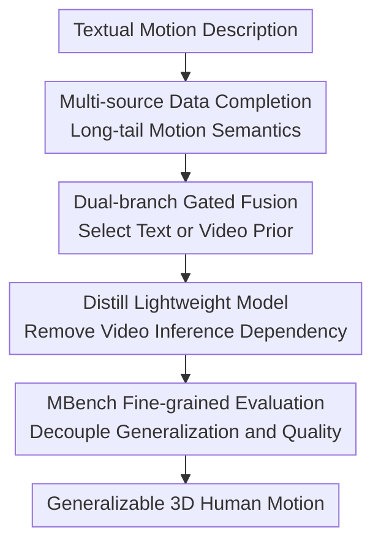

# The Quest for Generalizable Motion Generation: Data, Model, and Evaluation

**Conference**: ICLR 2026  
**OpenReview**: [https://openreview.net/forum?id=KNke6Pkq4o](https://openreview.net/forum?id=KNke6Pkq4o)  
**Code**: Available (The paper commits to releasing code, data, and the benchmark)  
**Area**: Video Generation / 3D Human Motion Generation  
**Keywords**: Text-to-Motion Generation, Human Motion Generation, Video Generation Priors, Multi-source Motion Data, Motion Evaluation  

## TL;DR
This paper addresses "generalizable 3D human motion generation" by simultaneously augmenting data, refining the model, and redesigning evaluation. It expands the long-tail motion coverage of MoGen using open-world semantic priors from ViGen, converts these priors into usable text-to-motion capabilities via a dual-branch gated DiT and a distilled version (ViMoGen-light), and validates generalization, alignment, and motion quality more precisely using MBench.

## Background & Motivation
**Background**: Text-to-3D human motion generation has seen a wave of methods such as MDM, MotionDiffuse, T2M-GPT, MoMask, and MotionLCM, with metrics like FID and R-Precision on standard benchmarks continuously improving. Most rely on optical MoCap or manually curated motion-text pairs like HumanML3D, KIT-ML, or AMASS/BABEL derivatives. Their advantages include clean movements and reliable body dynamics, with stable generation results for common indoor actions.

**Limitations of Prior Work**: The real bottleneck is not "generating a walking person" but rather the degradation of models when encountering long-tail, outdoor, professional, sporting, or composite behaviors. Standard MoCap data is costly and collected in restricted scenarios, with motion semantics concentrated on simple movements like walking, sitting, waving, or squatting. While web videos or video generation models cover rich behaviors like surfing, archery, acrobatics, and professional tasks, 3D motions extracted via visual MoCap suffer from jitter, foot sliding, and global trajectory drift.

**Key Challenge**: High-quality MoGen priors and open-world generalization priors from ViGen reside in different data sources. The former are physically plausible but semantically narrow, while the latter are semantically broad but contain noisy motion signals. Using video generation results directly as final motions leads to obvious quality issues, while training solely on MoCap fails to learn vast long-tail behaviors.

**Goal**: The authors decompose the problem into three tasks. First, construct a dataset containing both high-quality MoCap and long-tail video semantics. Second, design a model that determines for each sample whether to trust the text-to-motion branch or the video-motion reference branch. Third, establish an evaluation system that better reflects generalization capabilities and prompt alignment than traditional FID.

**Key Insight**: A key observation is that video generation models have already encountered extremely rich combinations in the "human behavior semantic space." For many motions unseen by MoGen, ViGen can generate a roughly aligned video. Even if the 3D motion extracted from this video is not clean, it provides a reference for "the approximate pose, temporal sequence, and which limbs are moving."

**Core Idea**: Use video generation models to provide long-tail semantics and coarse motion priors, use MoCap data to provide high-fidelity body dynamics, and merge or select between them via an adaptive dual-branch Diffusion Transformer.

## Method

### Overall Architecture
ViMoGen is not just a network module but a framework reorganized around generalization. It first constructs ViMoGen-228K, unifying optical MoCap, real-world video-extracted motions, and synthetic video-extracted motions into a unified SMPL-X representation. Then, it trains a flow-matching-based DiT model where text conditions, noisy motion tokens, and video motion tokens interact within gated blocks. Finally, MBench evaluates the model along three axes: generalization, text consistency, and motion quality.

During inference, the full ViMoGen first calls an offline text-to-video model based on the text prompt to generate a human motion video, then extracts reference motion tokens via visual MoCap. If a vision-language model (VLM) determines the video and text semantics are aligned, the Motion-to-Motion (M2M) branch is activated to refine the video motion into cleaner 3D motion. If the video prior is unreliable, it reverts to the Text-to-Motion (T2M) branch, generating motion directly from text and MoCap priors. To avoid mandatory video generation at inference, the authors also train ViMoGen-light, using the full ViMoGen as a teacher to generate synthetic motions and distilling generalization capabilities into a lightweight student model that depends only on text.

### Key Designs
**1. Multi-source Data Completion: MoCap for Quality, Video for Semantic Tail**

The primary contribution of ViMoGen-228K is pushing the training distribution from "small and clean" to "large and controllable." Instead of simply dumping all video-extracted motions into the training set, the authors categorize data into three types: 171,542 high-quality optical MoCap text-motion pairs, 41,971 real-video derived text-video-motion triplets, and 14,723 synthetic-video derived triplets. Optical MoCap provides stable dynamics and low-noise trajectories; real video supplements behaviors missing in MoCap (outdoor, sports, professional); and synthetic video proactively covers long-tail descriptions using controllable prompts.

The key is the distinct role of each source. Real videos are filtered from 10M-level human videos to retain only ~1% of clips suitable for visual MoCap, minimizing jitter and occlusion. Synthetic videos leverage ViGen’s controllability to ensure single-person, full-body, stable camera, and clean backgrounds. The paper treats the video generation model as a "motion semantic sampler" rather than unconditionally trusting every frame.

**2. Dual-branch Gated Fusion: Sample-wise Trust Assessment of Video Priors**

The core of ViMoGen is a flow-matching Diffusion Transformer. For a clean motion sequence $x_0 \in \mathbb{R}^{N \times D}$, noise $\epsilon \sim \mathcal{N}(0, I)$, and timestep $t \in [0,1]$, the forward interpolation is $x_t=(1-t)\epsilon+t x_0$. The model learns the velocity field $v_t=x_0-\epsilon$. The objective is to make $f_\theta(x_t,t,c)$ approximate this field by minimizing $\mathbb{E}[\lVert f_\theta(x_t,t,c)-v_t\rVert_2^2]$. Here, $c$ is a multimodal condition including text tokens and video motion tokens.

Each fusion block features shared self-attention and FFN, with ~66% of parameters shared between T2M and M2M branches. The difference lies in cross-attention. T2M attends to text embeddings (ideal for high-quality MoCap coverage), while M2M attends to video motion tokens (ideal for semantically correct but noisy long-tail behaviors). Inference uses a VLM for binary alignment checking: if aligned, M2M is used; otherwise, it reverts to T2M. This gated mechanism addresses the fact that video priors can be either valuable clues or sources of contamination.

During training, noisy ground-truth motion simulates visual MoCap errors to construct $z_{video}$ instead of calling video models online. Noise includes random corruption, jitter simulation, and temporal dropout, while unreliable global translations in video tokens are masked, forcing the M2M branch to focus on local pose dynamics.

**3. Distill Lightweight Model: Compressing Video Priors into Pure Text-to-Motion Models**

While the full ViMoGen has a high performance ceiling, its inference chain (T2V, visual MoCap, VLM, motion generation) is significantly more expensive than standard models. ViMoGen-light aims to retain the generalization gains while removing inference-time video dependence. The authors extract high-frequency verbs and expand them using LLMs to create 14,000 new prompts (e.g., breakdancing, jousting) rarely found in standard MoCap.

ViMoGen acts as a teacher to generate high-quality motions for these prompts, and ViMoGen-light acts as a student, learning these samples via the T2M branch and standard flow matching. This allows the student model to inherit open-world semantic coverage indirectly.

**4. MBench Fine-grained Evaluation: Decoupling Generalization, Alignment, and Quality**

Standard metrics often aggregate performance into FID or R-Precision, which hides two issues: a model might generate smooth motions that ignore long-tail prompts, or align well but suffer from severe foot sliding. MBench splits evaluation into three categories and nine dimensions: Motion Generalizability, Motion-Condition Consistency, and Motion Quality (temporal and frame-wise quality).

The generalization dimension focuses on open-world vocabulary; consistency uses VLMs to describe rendered motions and match them to labels; and quality quantifies jitter, foot floating, sliding, and penetration. Human preference labeling validates the correlation between these automated metrics and human judgment.

### Main Results
The main experiment compares ViMoGen and ViMoGen-light against several SOTA text-to-motion models on MBench. The key conclusion is that while the full ViMoGen leads significantly in consistency and generalization, ViMoGen-light achieves or nears strong baseline levels without video inference.

| Model | Motion-Condition Consistency ↑ | Motion Generalizability ↑ | Jitter Degree ↓ | Dynamic Degree ↑ | Foot Sliding ↓ | Conclusion |
|------|-------------------------------|----------------------------|-----------------|------------------|----------------|------|
| MDM | 0.42 | 0.51 | 0.0136 | 0.0376 | 0.0136 | Early diffusion model, average generalization |
| T2M-GPT | 0.39 | 0.38 | 0.0156 | 0.0349 | 0.0156 | Discrete token method weak on long-tail prompts |
| MotionLCM | 0.48 | 0.55 | 0.0218 | 0.0439 | 0.0202 | Strong baseline, but visible jitter/sliding |
| MoMask | 0.38 | 0.44 | 0.0147 | 0.0396 | 0.0147 | Strong on standard benchmarks, weak open semantics |
| MotionDiffuse | 0.44 | 0.42 | 0.0111 | 0.0289 | 0.0063 | Smooth motion, limited generalization |
| ViMoGen | 0.53 | 0.68 | 0.0108 | 0.0251 | 0.0064 | Strongest consistency and generalization |
| ViMoGen-light | 0.47 | 0.55 | 0.0129 | 0.0294 | 0.0051 | Retains strong generalization without video dependency |

Generalizability increases from MotionLCM's 0.55 to ViMoGen's 0.68. The lower Dynamic Degree in Ours is explained by the inclusion of complex but low-root-movement actions (e.g., tying shoes).

Ours also improves R-Precision and FID on HumanML3D when integrated into the MLD framework:

| Method | R-Precision Top-1 ↑ | R-Precision Top-2 ↑ | R-Precision Top-3 ↑ | FID ↓ | Multimodal Dist ↓ | MultiModality ↑ |
|------|---------------------|---------------------|---------------------|-------|--------------------|------------------|
| MLD | 0.481 | 0.673 | 0.772 | 0.473 | 3.196 | 2.413 |
| MotionLCM | 0.502 | 0.698 | 0.798 | 0.304 | 3.012 | 2.259 |
| MoMask | 0.521 | 0.713 | 0.807 | 0.045 | 2.958 | 1.241 |
| MLD + ViMoGen-light | 0.542 | 0.733 | 0.825 | 0.114 | 2.826 | 1.973 |

### Ablation Study
Ablation on branch selection supports the adaptive gated design:

| Branch Strategy | Motion-Condition Consistency ↑ | Motion Generalizability ↑ | Jitter Degree ↓ | Foot Sliding ↓ | Note |
|--------------|--------------------------------|----------------------------|-----------------|----------------|------|
| Video Generation Baseline | 0.51 | 0.58 | 0.0193 | 0.0161 | Useful semantics, poor quality |
| T2M Only | 0.46 | 0.54 | 0.0111 | 0.0039 | Best quality, insufficient tail semantics |
| M2M Only | 0.51 | 0.59 | 0.0145 | 0.0113 | Semantic gain, but carries noise |
| Adaptive Gating | 0.53 | 0.68 | 0.0108 | 0.0064 | Best overall performance |

Data composition ablation shows that systematic multi-source inclusion yields cumulative gains, particularly synthetic video data which significantly boosts generalization.

### Key Findings
- ViGen priors primarily enhance open-world semantic generalization rather than just smoothing motion.
- Adaptive gating is superior to fixed fusion because video priors are "hit or miss" depending on the prompt.
- The bottleneck for motion generation is "semantic coverage," making synthetic data highly effective despite small scale.
- ViMoGen-light offers a practical deployment path by retaining teacher knowledge with low inference cost.

## Highlights & Insights
- **ViGen as a Semantic Prior, Not the Final Answer**: Rather than a naive "video-to-skeleton" pipeline, Ours treats video as a corrigible reference.
- **Data Construction Strategy**: Balancing MoCap, real video, and synthetic video sources compensates for individual weaknesses.
- **Gating Addresses Real-world Errors**: The instance-based selection prevents video generation failures from polluting the final result.
- **Evaluation Value**: MBench provides a more diagnostic tool for the community than aggregated scores.

## Limitations & Future Work
- Currently limited to single-person motion without complex object/scene interaction.
- M2M still depends on the quality of visual MoCap; severe video distortions (e.g., during flips) remain hard to correct.
- Visual MoCap noise (foot contact) is mitigated but not fundamentally solved by physical modeling.
- Future directions include contact-aware MoCap and integrating physical constraints into the DiT.

## Related Work & Insights
- **Beyond pure data scaling**: Unlike Motion-X, Ours focuses on the model-level logic of how to process noisy multi-source data.
- **Beyond distribution learning**: Compared to MDM/MoMask, Ours explicitly integrates open-world priors instead of just fitting a fixed MoCap dataset.
- **Distillation efficiency**: Offers a middle ground between expensive video-augmented models and narrow MoCap-only models.

## Rating
- Novelty: ⭐⭐⭐⭐⭐  
- Experimental Thoroughness: ⭐⭐⭐⭐⭐  
- Writing Quality: ⭐⭐⭐⭐☆  
- Value: ⭐⭐⭐⭐⭐  

<!-- RELATED:START -->

## Related Papers

- [\[ICLR 2026\] Phantom-Data: Towards a General Subject-Consistent Video Generation Dataset](phantom-data_towards_a_general_subject-consistent_video_generation_dataset.md)
- [\[ICML 2025\] Data-Juicer Sandbox: A Feedback-Driven Suite for Multimodal Data-Model Co-development](../../ICML2025/video_generation/data-juicer_sandbox_a_feedback-driven_suite_for_multimodal_data-model_co-develop.md)
- [\[ICLR 2026\] NarrLV: Towards a Comprehensive Narrative-Centric Evaluation for Long Video Generation](narrlv_towards_a_comprehensive_narrative-centric_evaluation_for_long_video_gener.md)
- [\[ICLR 2026\] VideoPhy-2: A Challenging Action-Centric Physical Commonsense Evaluation in Video Generation](videophy-2_a_challenging_action-centric_physical_commonsense_evaluation_in_video.md)
- [\[ICLR 2026\] Lumos-1: On Autoregressive Video Generation with Discrete Diffusion from a Unified Model Perspective](lumos-1_on_autoregressive_video_generation_with_discrete_diffusion_from_a_unifie.md)

<!-- RELATED:END -->
