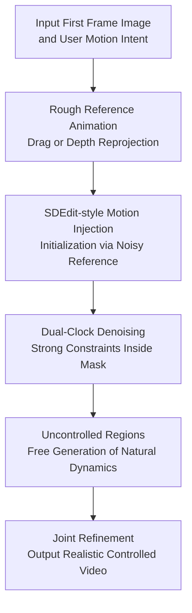

# Time-to-Move: Training-Free Motion-Controlled Video Generation via Dual-Clock Denoising

**Conference**: ICLR2026  
**OpenReview**: [https://openreview.net/forum?id=OxO9OSYVw5](https://openreview.net/forum?id=OxO9OSYVw5)  
**Code**: TBD  
**Area**: Video Generation  
**Keywords**: Motion-Controlled Video Generation, Image-to-Video Diffusion, Training-Free Control, Dual-Clock Denoising, Appearance Control

## TL;DR
Time-to-Move treats rough animations obtained via dragging or depth re-projection as motion sketches. By anchoring appearance using the first frame and employing different noise clocks for controlled and uncontrolled regions during sampling, it achieves precise motion and pixel-level appearance control without training or modifying the backbone.

## Background & Motivation
**Background**: Diffusion-based video generation has reached high levels of visual quality and temporal consistency. Image-to-Video (I2V) models further allow single-frame input to fix the identity of subjects and scenes. For users wanting to "make this image move," I2V is closer to real creative workflows than text-to-video since the appearance is already defined by the first frame, requiring the model only to complement the subsequent dynamics.

**Limitations of Prior Work**: The primary difficulty lies in motion control. Text prompts like "a boat moving right" or "camera moves forward" struggle to precisely specify which part moves, where it moves, along what path, and how the background should naturally respond. Existing methods based on trajectories, optical flow, bboxes, or motion tokens usually require fine-tuning for specific video generators, involving high computational costs and requiring re-adaptation for each new I2V backbone.

**Key Challenge**: Users need a control interface that is both precise and lightweight. Precision implies that controlled regions must adhere strictly to specified motions; lightweight means no retraining per backbone; and realism requires that non-specified regions do not remain mechanically static but generate natural wakes, occlusions, reflections, or camera parallax. Satisfying all three with a single control strength is difficult.

**Goal**: The authors aim to construct a training-free, plug-and-play sampling process that allows any I2V diffusion model to understand rough motion references. This process needs to support local object motion, camera motion, and appearance changes (color, shape, or object insertion) during movement.

**Key Insight**: Borrowing from SDEdit, rough editing results do not need to be realistic; as long as they are injected at the appropriate noise level, they can serve as structural priors to guide generation. In video, a rough reference can act as a "motion sketch." However, since constraint strengths differ across regions in a video, a regional sampling mechanism more granular than a single SDEdit timestep is required.

**Core Idea**: Use a coarsened reference animation injected with noise as the motion initialization. Use the first-frame I2V conditioning to preserve identity, then use dual-clock denoising to enforce strong alignment within the mask and weak constraints outside the mask to generate natural dynamics.

## Method
The approach of Time-to-Move is restrained: it neither trains control networks nor modifies model architectures. It only adjusts how sampling is initialized and how controlled regions are blended at each step. It decomposes user control into three inputs: a first frame $I$, a rough reference video $V^w$, and per-frame binary masks $M$. The output $x_0$ preserves the identity of the first frame while following user-specified motion.

### Overall Architecture
The workflow can be understood as "creating a crude but clear animation first, then letting the I2V model 'clean' it into a realistic video." Users generate a warped reference video through cut-and-drag, rotation/scaling, color modification, or depth-estimated camera re-projection. This reference video often contains tears, holes, and frozen backgrounds, but it clearly informs the model of object locations, camera paths, and pixels to be preserved or altered.

TTM then adds noise to the reference video based on a weak constraint clock $t_{weak}$ and starts reverse diffusion. During the stage where $t_{strong} \le t < t_{weak}$, pixels inside the mask are replaced at each step with the reference video version at the same noise level, while regions outside are left for the model to denoise freely. Upon reaching $t_{strong}$, replacement stops, and the entire video is refined jointly to eliminate seams between foreground and background.

The key to this framework is the differing roles of the first frame and the rough video. The first frame anchors identity, texture, and overall appearance; the rough video handles geometry, motion paths, and optional pixel-level appearance changes. This allows the model to leverage I2V generation priors to transform even very crude reference animations into natural videos.

### Key Designs
**1. Rough Reference Animation: Turning User Intent into Motion Sketches**

TTM does not require high-quality reference videos. It accepts "interactively produced rough animations." For local object control, users select a target in the first frame to get an initial mask $M_0$, then drag this area to form per-frame masks $M$ and trajectories. The system renders the foreground sprite from the first frame onto the background following the transformation (translation, rotation, scale), with holes filled using nearest-neighbor methods. For camera control, the system uses monocular depth estimation to back-project the first frame as a point cloud and re-projects it into a sequence according to the target camera path.

**2. SDEdit-style Motion Injection: Defining Early Dynamics via Noisy References**

The paper transfers SDEdit from image editing to video motion control. SDEdit's intuition is that adding noise to a rough edit up to a certain timestep and then denoising allows the model to retain the rough layout while adding realistic details. TTM applies this to video: adding noise to the warped video $V^w$ up to $t^*$, using $x_{t^*} \sim q(x_{t^*} \mid V^w)$ as the starting point for sampling. Using an I2V backbone allows the clean first frame $I$ to act as a condition, formulated as $x_0 \sim p_\theta(x_0 \mid x_{t^*}, I)$, ensuring identity preservation.

**3. Dual-Clock Denoising: Strong Following for Controlled Regions, Freedom for Others**

A single timestep imposes a trade-off. Too little noise causes the video to stick too closely to the rough reference (frozen backgrounds), while too much noise allows for natural generation but might cause the object to drift. TTM's dual-clock denoising splits this: $t_{strong}$ for strong alignment inside the mask and $t_{weak}$ for weak constraints outside.

The update is formulated as:

$$
x_{t-1} \leftarrow (1-M) \odot \hat{x}_{t-1}(x_t, t, I) + M \odot x^w_{t-1}.
$$

Where $\hat{x}_{t-1}$ is the I2V denoiser prediction and $x^w_{t-1}$ is the noisy version of the warped reference. Between $t_{strong} \le t < t_{weak}$, the mask is continuously overwritten by the reference version to ensure motion following, while the exterior is not, allowing for natural background movement and occlusions.

**4. Joint Motion and Appearance Control via Full-Frame Conditioning**

Many motion control methods use sparse points or bboxes, which struggle to describe changes in color, shape, or new objects. Since TTM's reference signal consists of full video frames, masks can include pixel-level appearance instructions. The paper demonstrates examples like a chameleon changing color from green to purple as it moves. Because the dual-clock enforces reference signal preservation in the controlled area, the model binds appearance and motion changes to the same object.

### Loss & Training
TTM has no training loss. It uses no new training data, fine-tunes no LoRAs, trains no ControlNets, and requires no learned motion encoders. All control occurs during the inference sampling stage.

The only tunable parameters are a few sampling hyperparameters, primarily $t_{weak}$ and $t_{strong}$. The paper uses $(t_{weak}, t_{strong}) = (36, 25)$ for SVD and $(46, 41)$ for CogVideoX. Efficiency is nearly identical to standard I2V sampling as it does not add model passes or re-sampling loops.

## Key Experimental Results

### Main Results
The paper evaluates TTM across three settings: object motion, camera motion, and joint motion-appearance editing.

| Setting | Method | Training-free | Key Motion Metric | Visual Quality | Conclusion |
| :--- | :--- | :--- | :--- | :--- | :--- |
| MC-Bench / SVD | DragAnything | No | CTD 10.645 | Imaging 0.554 | Strong dynamics but obvious artifacts |
| MC-Bench / SVD | SG-I2V | Yes | CTD 5.796 | Imaging 0.621 | Low error but often introduces background co-motion |
| MC-Bench / SVD | TTM | Yes | CTD 7.967 | Imaging 0.617 | Comparable or superior to trained methods |
| MC-Bench / CogV | GWTF $\gamma=0.5$ | No | CTD 27.844 | Imaging 0.539 | Distorts under large motion |
| MC-Bench / CogV | TTM | Yes | CTD 13.665 | Imaging 0.579 | Better motion following and quality |

In the SVD group, TTM's quality matches MotionPro while producing fewer artifacts than DragAnything. In the Case of CogVideoX, TTM significantly reduces CoTracker distance (CTD) compared to GWTF while improving consistency and imaging quality.

### Ablation Study
| Configuration | CoTracker distance ↓ | Dynamic degree ↑ | Imaging quality ↑ | Description |
| :--- | :---: | :---: | :---: | :--- |
| Single clock $t_{weak}, t_{weak}$ | 27.316 | 0.265 | 0.623 | Weak constraints, poor motion following |
| Single clock $t_{strong}, t_{strong}$ | 5.528 | 0.353 | 0.620 | Strong mask fit, but background tends to freeze |
| RePaint style $t_{weak}, 0$ | 2.923 | 0.404 | 0.576 | High trajectory accuracy, but lacks overall realism |
| TTM Dual-Clock | 7.967 | 0.427 | 0.617 | Best trade-off between fit, dynamics, and quality |

### Key Findings
- SDEdit alone is insufficient for video because a single noise strength cannot satisfy both foreground control and natural background response.
- RePaint-style continuous masking achieves extremely low trajectory error but degrades visual quality; joint refinement is necessary.
- TTM is robust to mask errors (erosion/dilation), making it suitable for rough user annotations.
- TTM is compatible with multiple backbones (SVD, CogVideoX, WAN 2.2), demonstrating its status as a general sampling strategy.

## Highlights & Insights
- Rough animations are sufficient as control signals. TTM leverages intuitive user interactions rather than learning complex latent motion representations.
- Dual-clock denoising converts SDEdit's uniform strength into spatially heterogeneous strength, effectively solving the "follow vs. generate" conflict.
- Appearance and motion control are naturally unified via full-frame references.
- Plug-and-play sampling methods are more sustainable in a fast-evolving ecosystem than training-heavy modules requiring constant re-adaptation.

## Limitations & Future Work
- Hyperparameters ($t_{weak}$, $t_{strong}$) still need per-backbone selection, though the stable range is wide.
- Identity preservation relies on the visibility of the first frame; it struggles with large occlusions or newly appearing content.
- Heavy reliance on monocular depth for camera control; errors in depth estimation propagate to the reference video and the final output.
- Future work could include soft masks, continuous noise schedules, or multi-object clocks for finer control over shadows and reflections.

## Related Work & Insights
- **vs SDEdit**: TTM extends the idea to video and addresses regional requirement differences.
- **vs GWTF**: While both target backbone-agnostic control, TTM is training-free and uses explicit frames, making it easier to control appearance and local movement.
- **vs SG-I2V**: TTM avoids the background co-motion issues often found in attention-replacement methods by using explicit reference videos and regional denoising.

## Rating
- Novelty: ⭐⭐⭐⭐ Simple but pinpoint accuracy in addressing the core video control conflict.
- Experimental Thoroughness: ⭐⭐⭐⭐ Coverage of multiple tasks and backbones.
- Writing Quality: ⭐⭐⭐⭐ Clear logic and helpful visualizations.
- Value: ⭐⭐⭐⭐⭐ Highly practical for real-world creative applications due to its training-free nature.

<!-- RELATED:START -->

## Related Papers

- [\[CVPR 2026\] FlowMotion: Training-Free Flow Guidance for Video Motion Transfer](../../CVPR2026/video_generation/flowmotion_training-free_flow_guidance_for_video_motion_transfer.md)
- [\[ICLR 2026\] Dual-IPO: Dual-Iterative Preference Optimization for Text-to-Video Generation](dual-ipo_dual-iterative_preference_optimization_for_text-to-video_generation.md)
- [\[ICLR 2026\] LightCtrl: Training-free Controllable Video Relighting](lightctrl_training-free_controllable_video_relighting.md)
- [\[ICLR 2026\] EchoMotion: Unified Human Video and Motion Generation via Dual-Modality Diffusion Transformer](echomotion_unified_human_video_and_motion_generation_via_dual-modality_diffusion.md)
- [\[ICML 2026\] MotiMotion: Motion-Controlled Video Generation with Visual Reasoning](../../ICML2026/video_generation/motimotion_motion-controlled_video_generation_with_visual_reasoning.md)

<!-- RELATED:END -->
