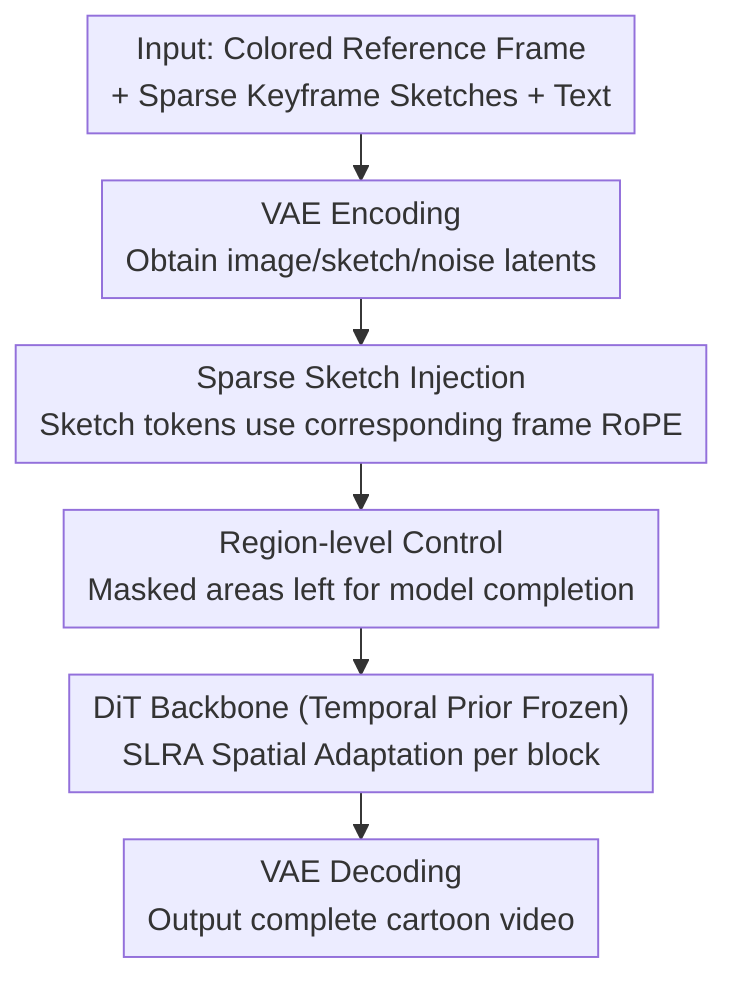

# ToonComposer: Streamlining Cartoon Production with Generative Post-Keyframing

**Conference**: ICLR 2026  
**OpenReview**: [https://openreview.net/forum?id=28VE0XXyAa](https://openreview.net/forum?id=28VE0XXyAa)  
**Paper**: [Project Page](https://lg-li.github.io/project/tooncomposer)  
**Code**: See project page (Repository not yet public)  
**Area**: Video Generation / Diffusion Models  
**Keywords**: Cartoon Generation, Post-keyframing, Sparse Sketch Injection, DiT Adaptation, Low-rank Adapter

## TL;DR
ToonComposer merges the traditionally fragmented "inbetweening" and "colorization" stages of cartoon production into a unified generative "post-keyframing" stage. With only one colored reference frame and a minimal set of keyframe sketches, it leverages a DiT video foundation model to directly generate high-quality cartoon videos, surpassing prior two-stage methods in quality, motion consistency, and efficiency.

## Background & Motivation
**Background**: Traditional cartoon/animation production consists of three stages: keyframing, inbetweening, and colorization. While keyframing involves artistic creativity, inbetweening and colorization are highly repetitive and labor-intensive—requiring hundreds of frames to be drawn for just a few seconds of animation. Recent generative models (ToonCrafter, AniDoc, LVCD, etc.) have begun to automate these steps.

**Limitations of Prior Work**: Existing methods suffer from significant drawbacks. Inbetweening methods (ToonCrafter) struggle to interpolate large-scale motions from sparse sketches, often requiring dense keyframes for fluid movement. Colorization methods (AniDoc, LVCD) require **frame-by-frame** sketches, which remains a massive workload for artists. More critically, these steps are treated as **two independent sequential stages**; errors from the first stage (inaccurate sketches) accumulate into the colorization stage, leading to artifacts and quality degradation.

**Key Challenge**: Inbetweening and colorization are highly interdependent—both essentially involve searching and interpolating based on **correspondences** between keyframes and reference frames. Forcing them into separate steps creates both redundancy (requiring dense sketches) and cross-stage error accumulation.

**Goal**: To complete inbetweening and colorization simultaneously within a unified generative stage. This allows the model to jointly utilize information from keyframe sketches and colored reference frames to (1) support sparse inputs (at minimum, one sketch and one color frame), (2) avoid cross-stage error accumulation, and (3) free artists to focus solely on keyframe design.

**Key Insight**: Directly reuse the strong generative priors of modern video foundation models (e.g., Wan 2.1). However, applying such models to post-keyframing introduces two new challenges: ① Foundation models typically support only **weak conditions** like text or an initial frame and lack mechanisms for precisely injecting sparse sketches at **specific temporal positions**; ② Previous cartoon domain adaptation (e.g., ToonCrafter) relied on the **structural decoupling** of spatial and temporal layers in UNets (tuning spatial while freezing temporal). Modern DiTs use **fully coupled spatio-temporal attention**, causing layer-wise freezing strategies to fail and potentially destroying pre-trained temporal motion priors during fine-tuning.

**Core Idea**: Propose the "post-keyframing" paradigm equipped with two key components: a **Sparse Sketch Injection mechanism** (pairing sketches with RoPE encodings at corresponding temporal positions within the token sequence for precise timestamp control) and a **Spatial Low-Rank Adapter (SLRA)** (restricting adaptation to the spatial dimension to update cartoon appearance without disturbing temporal priors).

## Method

### Overall Architecture
ToonComposer uses an Image-to-Video (I2V) DiT foundation model (Wan 2.1, 1.3B / 14B versions) as its backbone. It formalizes the post-keyframing task as follows: given a colored reference frame $f_1$ and a sketch $s_j$ at temporal position $j$, directly generate a $K$-frame cartoon video $\{\hat f_k\}_{k=1}^{K} = G_\theta(f_1, s_j, e_{\text{text}})$. The pipeline completes the final product in a **single inference pass**, rather than the "dense sketch interpolation followed by colorization" two-stage approach of previous methods.

On the input side, the colored reference frame and sketches are processed via a VAE Encoder into conditional image/sketch latents, and the noisy video latent is prepared. Sketches are merged into the token sequence via sparse sketch injection and fed into $N$ stacked DiT Blocks. Each DiT Block includes an SLRA residual branch alongside the original spatio-temporal self-attention, responsible for spatial adaptation to the cartoon domain, while the frozen backbone retains the temporal prior. Finally, the output is projected and decoded via a VAE Decoder. Only the projection heads for sparse sketch injection, the SLRA, and minor mapping layers are trainable; the backbone remains largely frozen.

### Key Designs

**1. Post-Keyframing Paradigm: Merging Inbetweening and Colorization**

To address the root cause of error accumulation and the requirement for dense sketches, the authors define a unified post-keyframing stage. The model simultaneously consumes colored reference frames and sparse keyframe sketches to perform joint motion interpolation and colorization. This is based on the mechanism that both steps involve searching/interpolating along correspondences. The benefits are bidirectional: joint utilization of sketch and color info prevents cross-stage error propagation, and the model can function with as little as one sketch and one color frame, significantly reducing drawing requirements.

**2. Sparse Sketch Injection: Precise Control at Specific Timestamps**

Standard I2V DiTs concatenate conditional images along the **channel dimension**, which is a weak condition that cannot specify "this sketch belongs to frame $j$." Ours utilizes **sequence-dimension** injection: an extra projection head encodes the sketch latent into a compatible token $s'_j$, followed by **positional encoding mapping**. The sketch token directly "borrows" the RoPE encoding of the $j$-th video frame token, carrying a temporal identity during attention. The forward pass is:

$$\hat\epsilon = \epsilon_\theta\Big(\big[\{z_k^{(t)}\}_{k=1}^{K},\ \text{pad}(\{f'_{ic}\}_{c=1}^{C})\big]_c,\ \{s'_{in}\}_{n=1}^{N}\Big]_s,\ e_{\text{text}},\ t\Big),$$

where $\{s'_{in}\}_{n=1}^{N}$ represents $N$ sketches and $\{f'_{ic}\}_{c=1}^{C}$ represents $C$ color frames. This design naturally supports multi-sketch/multi-reference inputs at any temporal position. Ours also introduces a **position-aware residual** with a tunable intensity $\alpha$. Lowering $\alpha$ from 1.0 to 0.5 during inference allows the model to slightly deviate from the sketch (e.g., for more natural mouth movements), providing a balance between fidelity and coherence.

**3. Spatial Low-Rank Adapter (SLRA): Cartoon Appearance without Motion Disturbance**

Since DiT's 3D attention intertwines spatial and temporal representations, full fine-tuning disrupts the temporal prior. SLRA adds a low-rank residual branch **constrained to the spatial dimension** for each self-attention module:

$$h_{\text{res}} = \big[\text{attn}_{\tilde W}\big([h W_{\text{down}}]_{\text{reshape}}\big) W_{\text{up}}\big]_{\text{resume}},$$

where $W_{\text{down}}\in\mathbb{R}^{D\times D'}$ and $W_{\text{up}}\in\mathbb{R}^{D'\times D}$ are trainable matrices. The **reshape** operation rearranges tokens into $\mathbb{R}^{(K+N)\times(H\times W)\times D'}$, ensuring the internal attention is computed **independently across the spatial dimension $H\times W$ for each frame**. This explicitly limits information propagation to the spatial domain, leaving the temporal dimension intact.

**4. Region-level Control: Supporting Spatially Sparse Sketches**

Artists may wish to sketch only the foreground. Masking out the background in a sketch might lead the model to generate flat, detail-free regions. Region-level control treats blank areas as "to be completed by context." During training, a random mask $m_{in}\in\{0,1\}^{H\times W}$ is applied to sketches, and the mask is concatenated as an extra channel: $\tilde s'_{in}=[E(s_{in}),\,m_{in}]_c$. This forces the model to learn to reconstruct reasonable content in masked regions based on surrounding context and text.

### Loss & Training
The model is trained using Rectified Flow to predict the velocity $v_t$ at time step $t$ sampled from a logit-normal distribution. Let $x_{in}$ be the input tokens and $z_0$ the clean video latent; the objective is to minimize the velocity prediction error:

$$\mathcal{L}=\mathbb{E}_{z_0,\eta,t}\big[\,\|v_t-\epsilon_\theta(x_{in},e_{\text{text}},t)\|_2^2\,\big].$$

Backbones are Wan 2.1 (1.3B and 14B), trained on the self-built PKData for 10 epochs with a batch size of 16 using AdamW and ZeRO stage-2.

## Key Experimental Results

### Main Results
Evaluation was conducted on a synthetic benchmark (algorithm-generated sketches from cartoon frames with ground truth) and **PKBench** (30 original scenes with sketches hand-drawn by professional artists).

Synthetic Benchmark (lower LPIPS/DISTS and higher CLIP/Consistency are better):

| Method | LPIPS↓ | DISTS↓ | CLIP↑ | Subject Consist.↑ | Motion Smooth.↑ | Aesthetic↑ |
|------|--------|--------|-------|-----------|-----------|-----------|
| AniDoc | 0.3734 | 0.5461 | 0.8665 | 0.9067 | 0.9798 | 0.4962 |
| ToonCrafter | 0.3830 | 0.5571 | 0.8463 | 0.8075 | 0.9550 | 0.5035 |
| **Ours (1.3B)** | **0.1698** | 0.1097 | 0.9292 | 0.9243 | 0.9889 | 0.5576 |
| **Ours (14B)** | 0.1785 | **0.0926** | **0.9449** | **0.9451** | 0.9886 | **0.5999** |

Real Hand-drawn Benchmark (PKBench):

| Method | Subject Consist.↑ | Motion Smooth.↑ | Background Consist.↑ | Aesthetic↑ |
|------|-----------|-----------|-----------|-----------|
| AniDoc | 0.9456 | 0.9842 | 0.9664 | 0.6611 |
| ToonCrafter | 0.8567 | 0.9674 | 0.9343 | 0.6822 |
| **Ours (14B)** | **0.9509** | **0.9910** | **0.9681** | **0.7345** |

### Ablation Study
Comparison of adaptation strategies:

| Config | Scope | Use Attn | LPIPS↓ | DISTS↓ | CLIP↑ |
|------|----------|----------|--------|--------|-------|
| **SLRA (Ours)** | Spatial | Yes | **0.1874** | **0.0955** | **0.9634** |
| TO (Temporal only) | Temporal | Yes | 0.1956 | 0.1109 | 0.9581 |
| LoRA | Mixed | No | 0.1922 | 0.1082 | 0.9628 |

### Key Findings
- **Positional Encoding Mapping is critical**: Removing it (losing temporal identity for sketch tokens) causes DISTS to degrade from 0.0955 to 0.1659, the most significant drop among ablations.
- **Spatial constraints outperform mixed adaptation**: SLRA is superior to LoRA and temporal-only adaptation. Restricting updates to the spatial dimension is more effective than increasing parameter counts via standard LoRA for cartoon adaptation.
- **Channel concatenation fails**: Replacing sequence-dimension injection with traditional channel concatenation significantly degrades LPIPS (0.1874 → 0.2534) as it disrupts the pre-trained latent structure.

## Highlights & Insights
- **Unified Understanding**: By recognizing that inbetweening and colorization both rely on correspondence interpolation, the authors consolidate them into a single stage, eliminating error accumulation.
- **SLRA as a DiT-era Tool**: SLRA provides a way to replicate the "spatial-only tuning" of the UNet era within fully-coupled DiT architectures. This reshape-based constraint can be generalized to other DiT adaptation tasks.
- **Dual Sparsity**: Complementing temporal sparsity (sparse keyframes) with spatial sparsity (region-level control) maximizes efficiency for the artist.

## Limitations & Future Work
- Heavy reliance on the pre-trained temporal prior of the foundation model (Wan 2.1).
- The synthetic-to-real gap persists as training data relies on algorithmically generated sketches.
- High inference costs for the 14B model, specifically regarding VRAM for long videos.

## Related Work & Insights
- **vs ToonCrafter**: ToonCrafter is UNet-based and uses a two-stage approach; Ours operates on DiT and uses a unified stage to handle large motions with sparse sketches.
- **vs AniDoc / LVCD**: These require **dense per-frame sketches**; Ours functions with sparse keyframes.
- **vs LoRA / ControlNet**: Traditional adapters often ignore the need to isolate spatial and temporal changes in video models; SLRA provides a more surgical approach for video domain adaptation.

## Rating
- Novelty: ⭐⭐⭐⭐⭐ 
- Experimental Thoroughness: ⭐⭐⭐⭐ 
- Writing Quality: ⭐⭐⭐⭐⭐ 
- Value: ⭐⭐⭐⭐⭐ 

<!-- RELATED:START -->

## Related Papers

- [\[ICLR 2026\] Generative View Stitching](generative_view_stitching.md)
- [\[ICLR 2026\] Arbitrary Generative Video Interpolation](arbitrary_generative_video_interpolation.md)
- [\[CVPR 2026\] LinVideo: A Post-Training Framework towards O(n) Attention in Efficient Video Generation](../../CVPR2026/video_generation/linvideo_a_post-training_framework_towards_on_attention_in_efficient_video_gener.md)
- [\[ICLR 2026\] Light-X: Generative 4D Video Rendering with Camera and Illumination Control](light-x_generative_4d_video_rendering_with_camera_and_illumination_control.md)
- [\[ICLR 2026\] SimpleGVR: A Simple Baseline for Latent-Cascaded Generative Video Super-Resolution](simplegvr_a_simple_baseline_for_latent-cascaded_generative_video_super-resolutio.md)

<!-- RELATED:END -->
