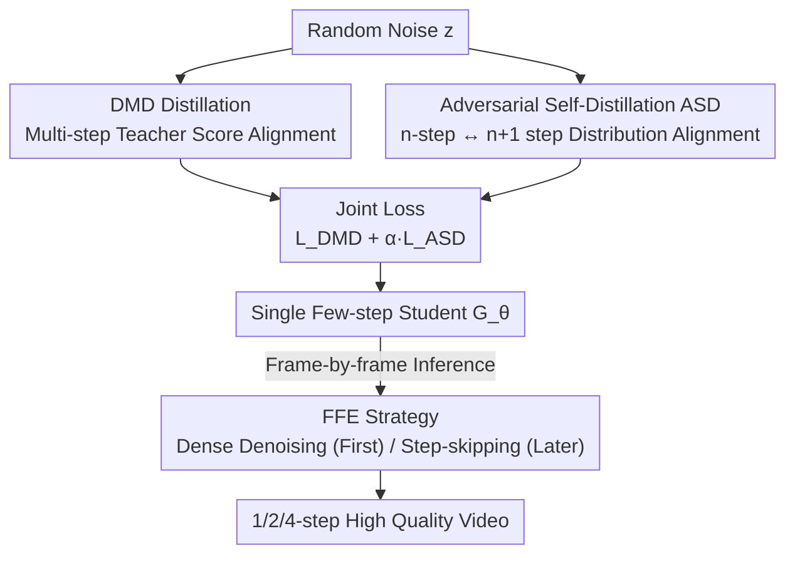

# Towards One-Step Causal Video Generation via Adversarial Self-Distillation

**Conference**: ICLR 2026  
**OpenReview**: [https://openreview.net/forum?id=P3O0fNmnWa](https://openreview.net/forum?id=P3O0fNmnWa)  
**Code**: https://github.com/BigAandSmallq/SAD.git (Available)  
**Area**: Video Generation / Diffusion Models / Distillation Acceleration  
**Keywords**: Causal video generation, Distillation, Adversarial Self-Distillation, Few-step inference, First-frame enhancement

## TL;DR
Addressing the quality collapse of causal video diffusion models during 1~2 step few-step generation, this paper proposes Adversarial Self-Distillation (ASD) within the DMD distillation framework. By using a discriminator to align the distributions of $n$-step and $n+1$-step outputs from the student model, and combining this with a First Frame Enhancement (FFE) strategy during inference, a single distilled model maintains high quality across 1/2/4-step settings, surpassing Prev. SOTA on VBench.

## Background & Motivation
**Background**: Currently, high-quality video generation follows two main paths. Diffusion models use bidirectional attention to denoise entire video segments, ensuring good temporal consistency but requiring joint synthesis of the whole sequence, which precludes frame-by-frame interaction. Autoregressive models generate frames sequentially and support causal interaction but suffer from error accumulation due to heavy reliance on preceding frames. Recent hybrid paradigms (CausVid, Self Forcing, etc.) model time autoregressively and space via diffusion, balancing the advantages of both but inheriting the efficiency bottleneck of multi-step iterative denoising—every frame generated requires multiple denoising steps, leading to slow inference.

**Limitations of Prior Work**: Distillation is the mainstream method for accelerating diffusion by compressing a multi-step teacher into a few-step student. However, existing distillation objectives primarily align the "few-step student" directly with the predictive distribution of the "multi-step teacher." When the student runs only 1~2 steps, the semantic and statistical gap between it and the multi-step teacher becomes excessively large, making direct alignment training extremely unstable and leading to sharp quality degradation. In other words: **the fewer the steps, the larger the gap to bridge**, which is the fundamental difficulty of few-step distillation.

**Key Challenge**: The supervision signal only has "the distant multi-step teacher" as an anchor; when the student's step jump is too large, this anchor becomes an unstable pull. Furthermore, a student distilled via DMD is typically optimal only for a fixed number of steps (e.g., a 4-step model only excels at 4 steps), requiring re-distillation for different step counts, which lacks flexibility.

**Goal**: (1) Achieve usable quality for few-step (especially 1-step) causal video generation; (2) Enable a single model to flexibly support various inference steps, avoiding repetitive distillation for each step count.

**Key Insight**: The authors observe that rather than forcing the student to reach for the "distant teacher," it is better to first align the student with "itself nearby." The distribution gap between $n$ steps and $n+1$ steps is much smaller, providing an additional supervision signal that is both smooth and informative (containing both teacher-derived global knowledge and the student's own locally consistent behavior). Another observation is that the first frame in causal generation lacks any context and is most sensitive to quality, while subsequent frames possess higher redundancy and can afford fewer steps.

**Core Idea**: Replace the single "student-teacher" alignment with "$n$-step $\leftrightarrow$ $n+1$-step" Adversarial Self-Distillation, combined with a non-uniform inference strategy of "heavy denoising for the first frame, step-skipping for subsequent frames."

## Method

### Overall Architecture
The method consists of **training** and **inference** pipelines. During training, the student builds upon standard DMD distillation (supervised by the multi-step teacher's score) by introducing self-supervision: the same student model generates two results using $n$ and $n+1$ steps respectively. These are noise-augmented and fed into a discriminator $D_n$, where a Relativistic Paired GAN objective aligns the distributions of these adjacent steps, allowing ASD and DMD losses to jointly optimize the generator. The generator $G_\theta$, the teacher assistant (score estimator), and the discriminator $D_n$ are updated alternately. During inference, instead of applying the same steps to all frames, First Frame Enhancement (FFE) allocates dense denoising ($\ge 4$ steps) to the first frame and aggressive step-skipping (1~2 steps) to subsequent frames. Ultimately, a single distilled model flexibly supports 1/2/4-step settings.

### Key Designs

**1. Adversarial Self-Distillation (ASD): Replacing Distant Teacher Alignment with Adjacent Step Self-Alignment**

This design specifically targets the instability caused by the large gap between 1~2 step students and multi-step teachers. Instead of only forcing the student to approximate the teacher, the same student model generates $G^n_\theta(z_1)$ and $G^{n+1}_\theta(z_2)$. These outputs are noise-augmented and classified by discriminator $D_n$ using a Relativistic Paired GAN (RpGAN) objective to make their distributions indistinguishable. The ASD loss is:

$$L_{\text{ASD}}(\theta,\psi)=\mathbb{E}_{z_1,z_2}\big[f\big(D^n_\psi(\Psi(G^n_\theta(z_1)))-D^n_\psi(\Psi(G^{n+1}_\theta(z_2)))\big)\big],$$

where $f(t)=-\log(1+e^{-t})$, $\Psi$ denotes the noise process, the generator $G^n_\theta$ maximizes this loss, and the discriminator $D^n_\psi$ minimizes it. During training, $n \in \{1, \dots, N\}$ is randomly sampled to constrain the model across all adjacent step pairs. The final generator is optimized via $L_{\text{total}}=L_{\text{DMD}}+\alpha\cdot L_{\text{ASD}}$.

This is effective for two reasons: First, the distribution gap between adjacent steps is much smaller than the "few vs. many" gap, resulting in smoother supervision and stabler training. Second, the $n$-step student receives both global knowledge from the teacher's trajectory and locally consistent behavior from the $n+1$-step self-output, making the signal more informative. The discriminator implementation is efficient: different $n$ values for $D_n$ share a backbone (reusing the frozen fake score function) and only treat the $n$-th dimension output logit as the discriminant output, adding almost no parameters.

**2. Unified Step Single Model: One Distillation for Multiple Inference Steps**

A weakness of DMD is its lack of flexibility—distilled students are usually optimal only for a fixed step count. Because ASD constrains consistency across "any adjacent step pair," it naturally allows a single student to remain self-consistent under 1, 2, or 4 steps. This means a single model can dynamically switch step counts during deployment based on resource or latency requirements (speed-quality tradeoff) without needing repetitive re-distillation. This property is a direct byproduct of the ASD cross-step alignment objective.

**3. First Frame Enhancement (FFE): Non-uniform Budget for the Critical First Frame**

This design addresses the error propagation issue inherent in causal generation. By analyzing the cosine similarity matrix of predicted $\hat{x}_0$ at different denoising steps, the authors found that the first frame exhibits low similarity between steps, indicating that every denoising step is critical and information is non-redundant. Conversely, subsequent frames show high inter-step similarity, making them suitable for few-step prediction. This occurs because the first frame has no context and must synthesize the initial state from scratch; any flaws propagate throughout the causal chain.

FFE allocates dense denoising (at least 4 steps) to the first frame and skips steps for subsequent frames (1~2 steps). This concentrates the computational budget where it matters most to preserve fidelity while keeping the average step count extremely low. FFE is particularly crucial for 1-step generation.

### Loss & Training
The generator is jointly optimized with $L_{\text{total}}=L_{\text{DMD}}+\alpha\cdot L_{\text{ASD}}$. The teacher assistant (TA) model is fine-tuned on student-generated data using the standard diffusion denoising loss $L^\phi_{\text{gen}}=\lVert\epsilon^\phi_{\text{gen}}(x_t,t)-\epsilon\rVert_2^2$. The discriminator is updated with the ASD loss. These three components are trained alternately. The backbone is Wan2.1-T2V-1.3B (Flow Matching), utilizing the asymmetric initialization protocol from CausVid to stabilize early causal training. The adversarial objective uses RpGAN + R1/R2 regularization (following R3GAN). A 4-denoising step schedule is used for training, with step-skipping strategies applied during inference.

## Key Experimental Results

### Main Results
Comparison on VBench with open-source T2V models of similar parameter sizes and resolutions. $n^*$ denotes $n$ steps with FFE; † denotes versions retrained for 1/2-step settings.

| Setup | Model | Denoising Steps | Total | Quality | Semantic |
|-------|-------|-----------------|-------|---------|----------|
| Multi-step | Wan2.1 | 50 | 84.26 | 85.30 | 80.09 |
| Multi-step | SkyReels-V2 | 30 | 82.67 | 84.70 | 74.53 |
| 4-step | CausVid | 4 | 81.20 | 84.05 | 69.80 |
| 4-step | Self Forcing | 4 | 84.31 | 85.07 | 81.28 |
| 4-step | **Ours** | 4 | **84.38** | 85.16 | 81.25 |
| 2-step | Self Forcing† | 2 | 83.49 | 84.20 | 80.62 |
| 2-step | **Ours** | $2^*$ | **84.32** | 85.15 | 81.02 |
| 1-step | Self Forcing† | 1 | 80.62 | 81.19 | 78.35 |
| 1-step | **Ours** | $1^*$ | **83.89** | 84.55 | 81.24 |

**Gain**: Under the 1-step setting, Ours outperforms the retrained Self Forcing by **3.27** points in total score. Using approximately 8%/13% of the denoising steps of Wan2.1/SkyReels, it achieves superior visual effects. In user studies, 1-step and 2-step Ours achieved preference rates of **96%** and **62%** against Self Forcing.

### Ablation Study
Itemized ablation under 2-step and 1-step generation (steps without FFE refer to uniform steps):

| ASD | FFE | 1-step Total | 1-step Semantic | 2-step Total |
|-----|-----|--------------|-----------------|--------------|
| × | × | 78.13 | 69.31 | 82.61 |
| ✓ | × | 80.65 | 76.15 | 83.28 |
| × | ✓ | 83.04 | 79.95 | 83.80 |
| ✓ | ✓ | 83.89 | 81.24 | 84.32 |

### Key Findings
- **ASD Contribution**: 1-step Total score +2.52, Semantic +6.84, showing that adjacent step alignment significantly stabilizes few-step training.
- **FFE Contribution**: 1-step Total score +4.19, Semantic +10.64. FFE alone allows 1-step quality to exceed original 2-step quality—confirming that the "first frame is the source of error propagation."
- **Complementarity**: ASD modifies training while FFE modifies inference; their combination is optimal across all steps. Qualitatively, variants without ASD show background drift or blurriness at 5s in the $2^*$ setting and severe blurriness by 2.5s in the $1^*$ setting.

## Highlights & Insights
- **"Align with self nearby" rather than "distant teacher"**: Shifting the distillation anchor from a remote teacher to the model's own adjacent-step output is a simple but effective perspective—it provides smaller distribution gaps and smoother supervision.
- **Cross-step alignment grants step-agnostic models**: By constraining any adjacent step pair, flexibility across multiple step counts becomes a free byproduct, saving engineering effort on repeated distillations.
- **Quantifying the first frame's criticality**: FFE is not a guess; it is justified by $\hat{x}_0$ inter-step cosine similarity, proving low redundancy in the first frame and high redundancy in later frames.
- **Zero-parameter discriminator scaling**: Sharing backbones for different $D_n$ and reusing frozen fake scores saves both parameters and computation.

## Limitations & Future Work
- Experiments were conducted only on the Wan2.1-1.3B backbone and VBench benchmark; scalability to larger models or longer videos remains unknown.
- Fixing the first frame to at least 4 steps is empirical; the step allocation is manual rather than adaptive, which may not be optimal for simple scenes.
- ASD introduces a discriminator and adversarial training, increasing complexity and risk of instability compared to pure DMD. Sensitivity to the hyperparameter $\alpha$ was not fully discussed.

## Related Work & Insights
- **vs. DMD / DMD2**: DMD aligns few-step students to multi-step teachers. Ours uses DMD as a base but adds $n \leftrightarrow n+1$ adversarial self-alignment, solving instability at extreme few-steps and the fixed-step limitation.
- **vs. ADD / UFOGen / SDXL-Lightning / LADD**: These either approximate real data or align intermediate states. Ours aligns adjacent outputs of the student itself, providing a different supervision source and inherent step flexibility.
- **vs. Self Forcing / CausVid**: Ours uses the Self Forcing training paradigm and CausVid initialization as a foundation but significantly outperforms their few-step versions through ASD+FFE.

## Rating
- Novelty: ⭐⭐⭐⭐ Shifting the distillation anchor to adjacent steps is a fresh perspective that naturally provides step flexibility.
- Experimental Thoroughness: ⭐⭐⭐⭐ VBench multi-step comparisons + user studies + clear ablations, though backbones are limited.
- Writing Quality: ⭐⭐⭐⭐ Clear motivation, with Figures 1 and 4 effectively visualizing core intuitions.
- Value: ⭐⭐⭐⭐ Single-model multi-step support and usable 1-step generation make this highly practical for real-time video applications.

<!-- RELATED:START -->

## Related Papers

- [\[ICML 2026\] AAD-1: Asymmetric Adversarial Distillation for One-Step Autoregressive Video Generation](../../ICML2026/video_generation/aad-1_asymmetric_adversarial_distillation_for_one-step_autoregressive_video_gene.md)
- [\[ICLR 2026\] Streaming Autoregressive Video Generation via Diagonal Distillation](streaming_autoregressive_video_generation_via_diagonal_distillation.md)
- [\[ICLR 2026\] Realtime Video Frame Interpolation Using One-Step Diffusion Sampling](realtime_video_frame_interpolation_using_one-step_diffusion_sampling.md)
- [\[AAAI 2026\] Phased One-Step Adversarial Equilibrium for Video Diffusion Models](../../AAAI2026/video_generation/phased_one-step_adversarial_equilibrium_for_video_diffusion_models.md)
- [\[ICML 2025\] Diffusion Adversarial Post-Training for One-Step Video Generation](../../ICML2025/video_generation/diffusion_adversarial_post-training_for_one-step_video_generation.md)

<!-- RELATED:END -->
