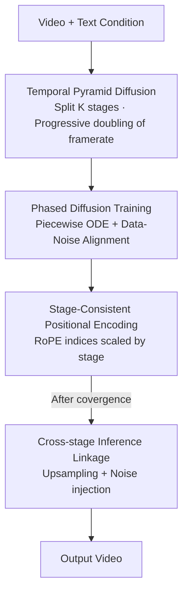

# TPDiff: Temporal Pyramid Video Diffusion Model

**Conference**: ICLR 2026  
**OpenReview**: [https://openreview.net/forum?id=Eg3KqoI9tS](https://openreview.net/forum?id=Eg3KqoI9tS)  
**Area**: Video Generation / Diffusion Models  
**Keywords**: Video Diffusion, Temporal Pyramid, Training Acceleration, Data-noise Alignment, Phased Diffusion

## TL;DR
TPDiff divides the denoising process of video diffusion into multiple stages, progressively doubling the framerate along the denoising path (with full framerate only in the final stage). Combined with a "phased diffusion" training method that uniformly supports DDIM and flow matching, it reduces training costs by approximately 50% and accelerates inference by 1.5× without degrading generation quality.

## Background & Motivation
**Background**: State-of-the-art video diffusion models (e.g., Sora, Kling) utilize DiT and attention to jointly model spatio-temporal distributions. While effective, the attention mechanism has quadratic complexity relative to sequence length. The long sequences inherent in video lead to extremely high training and inference costs, which continue to escalate with the demand for longer videos.

**Limitations of Prior Work**: Existing efficiency-oriented approaches have significant drawbacks. Cascaded frameworks (Show-1, Lavie) model at low resolution first and then perform super-resolution, which accumulates errors and significantly slows down inference. SimDA replaces attention with 3D convolutions for speed but sacrifices the scalability of attention. Recent work like Pyramid Flow proposes a "spatial pyramid"—using low resolution in early denoising steps and gradually increasing to full resolution. While conceptually sound, it was only validated on flow matching, uses autoregressive generation that slows inference, and ignores the **temporal dimension** pyramid.

**Key Challenge**: Video is a highly redundant modality (minimal differences between adjacent frames), and the reverse diffusion process is inherently entropy-decreasing. In the early stages of denoising, the latent signal-to-noise ratio (SNR) is low, information content is minimal, and temporal relationships are weak. Consequently, maintaining a full framerate during early denoising is computationally wasteful. However, vanilla diffusion frameworks are locked into a "fixed framerate throughout" structure, failing to exploit this redundancy.

**Goal**: (1) Allow the framerate to increase progressively during denoising, reaching full framerate only in the final stage; (2) Develop a method to uniformly support multi-stage model training for different diffusion forms (DDIM/flow matching); (3) Ensure no degradation in generation quality.

**Key Insight**: Since redundancy primarily exists in the temporal density of frames and early denoising does not require fine temporal detail, the "spatial pyramid" concept is extended to the temporal axis—creating a **Temporal Pyramid**. A single model is used to handle different framerates, avoiding the need for additional temporal interpolation networks required by older methods.

**Core Idea**: The diffusion process is segmented into $K$ stages along the time axis, with the framerate doubling per stage. This is unified into a solvable piecewise probability flow ODE problem through "phased diffusion + data-noise alignment."

## Method

### Overall Architecture
TPDiff takes text or image conditions as input and outputs a video. Unlike vanilla video diffusion with a fixed framerate, it progressively increases the framerate along the denoising direction. The denoising process is divided into $K$ stages $\{[t_k, t_{k-1})\}$, where the framerate in the $k$-th stage is reduced to $\frac{1}{2^{k-1}}$ of the original. Only the final stage runs at full framerate, significantly compressing average sequence length and reducing quadratic attention costs.

The pipeline addresses four engineering problems: training a single model across stages with different framerates (phased diffusion); unifying different diffusion forms (DDIM curved ODE vs. flow matching linear path) via data-noise alignment for piecewise ODE approximation; resolving positional index misalignment after upsampling (stage-consistent positional encoding); and ensuring seamless transitions during inference (cross-stage inference).

### Key Designs

**1. Temporal Pyramid Diffusion: Progressive framerate doubling reaching full rate only at the end**

This component addresses the observation that early denoising does not require full framerates. The denoising process is partitioned into $K$ stages $\{[t_k,t_{k-1})\}_{k=K}^{1}$, where the $k$-th stage uses a framerate of $\frac{1}{2^{k-1}}$. The framerate is lowest when denoising begins (high entropy, low SNR) and increases as $t$ approaches 0. When entering a new stage, new frames are initialized via temporal interpolation of existing frames. Crucially, a **single model** learns the data distribution across all stages, unlike Lavie or Show-1 which require separate temporal interpolation networks. This reduces the average attention cost for a video of length $T$ from $T^2$ to approximately $\frac{1}{3}(T^2+(\frac{T}{2})^2+(\frac{T}{4})^2)\approx 0.44T^2$, nearly halving the cost for both training and inference.

**2. Phased Diffusion Training: Unifying diffusion forms via piecewise probability flow ODE and data-noise alignment**

Vanilla diffusion does not natively support multi-stage training. The challenge lies in obtaining the "intra-stage target" (e.g., $\epsilon$ in DDIM, $\frac{dx_t}{dt}$ in flow matching) and the intra-stage intermediate latent $x_t$. The authors utilize a unified form $x_t=\gamma_t x_0 + \sigma_t \epsilon$ to abstract both frameworks. Using DPM-Solver, they express the intermediate latent relative to the stage starting point $\hat{x}_{s_k}$:

$$x_t = \frac{\gamma_t}{\gamma_{s_k}}\hat{x}_{s_k} - \gamma_t \int_{\lambda_{s_k}}^{\lambda_t} e^{-\lambda}\epsilon(x_{t_\lambda},t_\lambda)\, d\lambda$$

The integral of $\epsilon$ is typically not constant and lacks a closed-form solution. The proposed solution is **data-noise alignment**: before training, a target noise distribution is pre-assigned to each video. Hungarian matching (`scipy.optimize.linear_sum_assignment`) minimizes the total distance between video and noise pairs, restricting noise sampling to a narrow range. This makes the ODE path approximately deterministic during training, allowing $\epsilon_k$ within a stage to be treated as a constant:

$$\epsilon_k = \frac{\frac{\hat{x}_{e_k}}{\gamma_{e_k}} - \frac{\hat{x}_{s_k}}{\gamma_{s_k}}}{\frac{\sigma_{e_k}}{\gamma_{e_k}} - \frac{\sigma_{s_k}}{\gamma_{s_k}}}$$

This allows loss calculation and optimization similar to vanilla diffusion. Since the derivation does not restrict $\gamma_t$ and $\sigma_t$, it applies to both DDIM (substituting $\gamma_t=\sqrt{\bar\alpha_t},\sigma_t=\sqrt{1-\bar\alpha_t}$) and flow matching. Notably, $\epsilon_k$ points toward the **end of the current stage** rather than the final target, shortening the distance and accelerating convergence.

**3. Stage-Consistent Positional Encoding: Ensuring consistent RoPE indices for the same frame across stages**

RoPE is used for positional encoding, but naive application causes issues: after upsampling in each stage, frame indices are rearranged, causing misalignment of positional encodings for the same frame across stages. This often results in the model only generating small-scale motions. The fix involves multiplying each frame index by a **stage-dependent scaling factor**. Given $m$ stages, the encoding for the $n$-th frame in stage $i$ is:

$$PE_i(n) = \begin{cases} \text{RoPE}(n\cdot 2^{(m-i)}), & n>1 \\ \text{RoPE}(n), & \text{otherwise} \end{cases}$$

The first frame of each stage is shared and remains unscaled. This alignment allows the model to capture large-scale movements, significantly improving temporal dynamic degree.

**4. Cross-stage Inference Linkage: Connecting adjacent stages via upsampling and noise injection**

After training, each stage uses a standard sampler for the reverse ODE. To maintain continuity at stage transitions, the endpoint $\hat{x}_{e_k}$ is upsampled along the temporal dimension to double the framerate. It is then scaled and injected with additional random noise to match the distribution of the next stage's starting point $\hat{x}_{s_{k-1}}$:

$$\hat{x}_{s_{k-1}} = \frac{\sqrt{2}\gamma_{s_k}}{\sigma_{s_k}+\sqrt{2}\gamma_{s_k}}\,\text{Up}(\hat{x}_{e_k}) + \frac{\sqrt{2}\sigma_t}{2}n',\quad n'\sim\mathcal{N}\!\left(0,\begin{bmatrix}1&-1\\-1&1\end{bmatrix}\right)$$

This step ensures distributional alignment between adjacent stages, preventing discontinuities at framerate switch points.

### Loss & Training
The training objective is consistent with vanilla diffusion, substituting targets with intra-stage variables: $\ell=\|v_\theta(x_t)-v_k\|^2$ for flow matching and $\ell=\|\epsilon_\theta(x_t)-\epsilon_k\|^2$ for DDIM. Stages $k$, intra-stage timesteps $t$, and aligned noise $\epsilon'$ are randomly sampled to compute the loss. Experiments used 3 stages with uniform partitioning, trained on NVIDIA H100s.

## Key Experimental Results

Implementations were performed for DDIM (SD1.5 expanded via AnimateDiff) and flow matching (MiniFlux fine-tuned as MiniFlux-vid), with LoRA validation on pretrained Wan. Datasets include OpenVID1M, with quality assessed via VBench and efficiency via FVD vs. GPU-hour curves.

### Main Results (VBench Total Score)

| Model | Params | Framework | Total ↑ | Description |
|------|--------|------|---------|------|
| AnimateDiff | 1.8B | vanilla | 80.27 | Baseline |
| AnimateDiff - Ours | 1.8B | TPDiff | **80.76** | Improvement with same architecture |
| MiniFlux-vid - Vanilla | 9B | vanilla | 81.54 | Baseline |
| MiniFlux-vid - Ours | 9B | TPDiff | **81.95** | Significant gain in temporal metrics |
| Wan | 1.3B | vanilla | 84.26 | Pre-trained model |
| Wan - Ours | 1.3B | TPDiff(LoRA) | **84.33** | Generalization via LoRA tuning |

Training speedup reached 2.11× for DDIM and 2.16× for flow matching; inference speedup was approximately 1.5×.

### Inference Efficiency (Table 3, Timesteps=30)

| Model | Method | Latency(s) ↓ | Speedup |
|------|------|-----------|------|
| MiniFlux-vid | Vanilla | 20.79 | — |
| MiniFlux-vid | Ours | 12.18 | 1.71× |
| AnimateDiff | Vanilla | 6.01 | — |
| AnimateDiff | Ours | 4.04 | 1.49× |
| Wan | Vanilla | 50.52 | — |
| Wan | Ours | 27.76 | 1.82× |

### Ablation Study (Table 2, TS = VBench Total Score)

| Configuration | Alignment | TS ↑ | Training Speedup | Inference Speedup |
|------|------|------|----------|----------|
| 3 Stages 1-1-1 (Default) | Yes | 80.76 | 2.16× | 1.49× |
| 3 Stages 1-1-1 | No | 79.16 | 1.75× | 1.49× |
| 4 Stages 1-1-1-1 | Yes | 80.14 | 1.82× | 1.65× |
| 3 Stages 1-1-2 (Late heavy) | Yes | **80.94** | 1.62× | 1.36× |
| Downsampling 4-2 (Early) | Yes | 80.65 | 2.01× | 1.54× |

### Key Findings
- **Data-noise alignment is critical**: Removing alignment drops TS from 80.76 to 79.16 and training speedup from 2.16× to 1.75×, proving its role in stabilizing piecewise trajectories.
- **Late-stage refinement is vital**: Allocating more steps to the final stage (1-1-2) achieved the highest TS (80.94), whereas focusing on early stages (2-1-1) decreased quality.
- **Efficiency Trade-off**: Increasing stage count (4 or 5) speeds up inference (up to 1.74×) but slows training convergence. Aggressive downsampling (rate=4) yields the fastest inference (1.79×) but sacrifices temporal fidelity.
- **Zero-shot Long Video Extrapolation**: Models trained on fixed lengths can generate longer videos without retraining, likely because the frame-rate-variable training exposes the model to diverse temporal trajectories.

## Highlights & Insights
- **Temporal Axis Extension**: While Pyramid Flow operates on spatial resolution, TPDiff identifies that video redundancy lies in frame intervals and weak early temporal relations, implementing the pyramid on the temporal axis.
- **Closed-form Piecewise ODE**: Data-noise alignment via `linear_sum_assignment` stabilizes the ODE path, making it approximately deterministic and solvable in closed-form with near-zero overhead.
- **Universal Framework**: The derivation does not restrict $\gamma_t, \sigma_t$, allowing it to cover both DDIM and flow matching, making it plug-and-play for various video generation frameworks.
- **Transferable logic**: The concept of progressively increasing resolution or density during denoising can extend to other high-redundancy modalities like audio, 3D, or point clouds.

## Limitations & Future Work
- **Approximated Inter-stage Linkage**: Cross-stage upsampling and noise injection rely on simplified assumptions (e.g., nearest-neighbor upsampling). More complex interpolation may be needed to prevent artifacts in some scenarios.
- **Manual Stage Configuration**: Hyperparameters like the number of stages and step allocation require manual tuning and lack an automated selection mechanism.
- **Limited Quality Gains**: While efficiency improves significantly, the absolute quality gains (VBench +0.1~0.5) are modest and heavily dependent on the base model's capacity.

## Related Work & Insights
- **vs. Pyramid Flow**: Pyramid Flow uses spatial pyramids, is restricted to flow matching, and lacks data-noise alignment, leading to higher variance. TPDiff uses temporal pyramids, supports multiple diffusion forms, and is faster via non-autoregressive inference.
- **vs. Cascaded Frameworks (Show-1 / Lavie)**: These rely on separate super-resolution or interpolation networks, which accumulate errors. TPDiff uses a single model for all framerates.
- **vs. SimDA**: SimDA replaces attention to gain efficiency at the cost of scalability; TPDiff retains attention architecture but reduces sequence length.

## Rating
- **Novelty**: ⭐⭐⭐⭐⭐ High. Successfully adapts the pyramid concept to the temporal axis for video denoising with a unified piecewise ODE derivation.
- **Experimental Thoroughness**: ⭐⭐⭐⭐ Solid. Covers multiple base models and ablation studies, though direct comparison with Pyramid Flow under identical settings is limited.
- **Writing Quality**: ⭐⭐⭐⭐ Clear motivation and rigorous derivation.
- **Value**: ⭐⭐⭐⭐⭐ Significant. Halving training costs and improving inference speeds while maintaining quality is highly practical for the field.

## Related Papers

- [\[ICLR 2026\] Model Already Knows the Best Noise: Bayesian Active Noise Selection via Attention in Video Diffusion Model](model_already_knows_the_best_noise_bayesian_active_noise_selection_via_attention.md)
- [\[ICLR 2026\] Lumos-1: On Autoregressive Video Generation with Discrete Diffusion from a Unified Model Perspective](lumos-1_on_autoregressive_video_generation_with_discrete_diffusion_from_a_unifie.md)
- [\[ICLR 2026\] JavisDiT: Joint Audio-Video Diffusion Transformer with Hierarchical Spatio-Temporal Prior Synchronization](javisdit_joint_audio-video_diffusion_transformer_with_hierarchical_spatio-tempor.md)
- [\[ICLR 2026\] QuantSparse: Comprehensively Compressing Video Diffusion Transformer with Model Quantization and Attention Sparsification](quantsparse_comprehensively_compressing_video_diffusion_transformer_with_model_q.md)
- [\[ICLR 2026\] Any-to-Bokeh: Arbitrary-Subject Video Refocusing with Video Diffusion Model](any-to-bokeh_arbitrary-subject_video_refocusing_with_video_diffusion_model.md)

<!-- RELATED:END -->

<!-- RELATED:START -->

## Related Papers

- [\[ICLR 2026\] Any-to-Bokeh: Arbitrary-Subject Video Refocusing with Video Diffusion Model](any-to-bokeh_arbitrary-subject_video_refocusing_with_video_diffusion_model.md)
- [\[ICLR 2026\] Pusa V1.0: Unlocking Temporal Control in Pretrained Video Diffusion Models via Vectorized Timestep Adaptation](pusa_v10_unlocking_temporal_control_in_pretrained_video_diffusion_models_via_vec.md)
- [\[ICLR 2026\] The Quest for Generalizable Motion Generation: Data, Model, and Evaluation](the_quest_for_generalizable_motion_generation_data_model_and_evaluation.md)
- [\[ICLR 2026\] TS-Attn: Temporal-wise Separable Attention for Multi-Event Video Generation](ts-attn_temporal-wise_separable_attention_for_multi-event_video_generation.md)
- [\[ICLR 2026\] Model Already Knows the Best Noise: Bayesian Active Noise Selection via Attention in Video Diffusion Model](model_already_knows_the_best_noise_bayesian_active_noise_selection_via_attention.md)

<!-- RELATED:END -->
