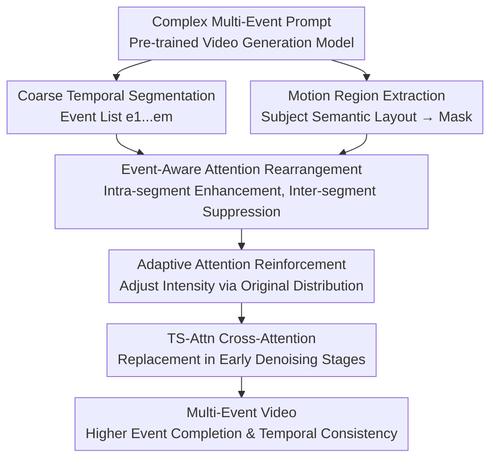

# TS-Attn: Temporal-wise Separable Attention for Multi-Event Video Generation

**Conference**: ICLR2026  
**OpenReview**: [https://openreview.net/forum?id=QixNhagZ9t](https://openreview.net/forum?id=QixNhagZ9t)  
**Code**: https://github.com/Hong-yu-Zhang/TS-Attn  
**Area**: Video Generation / Multi-Event Video Generation  
**Keywords**: Multi-Event Video Generation, Temporal Alignment, Cross-Attention, Training-Free Control, Text-to-Video  

## TL;DR
TS-Attn proposes a training-free temporal-wise separable cross-attention mechanism that redistributes attention between motion regions and event-specific words during the early denoising stage of pre-trained video generation models, simultaneously improving multi-event completion, temporal order, and video consistency within a single complex prompt inference.

## Background & Motivation
**Background**: Text-to-Video (T2V) models over the past two years have become capable of generating high-quality, stable short videos, particularly excelling in descriptions of single actions or scenes. With advancements in DiT, 3D attention, and large-scale video datasets, base models such as Wan, CogVideoX, and HunyuanVideo can process longer and more complex natural language prompts. Consequently, multi-event video generation appears to be a natural extension: users expect a single sentence describing "A happens first, then B, and finally C," and the model directly generates the complete video.

**Limitations of Prior Work**: The primary difficulty lies in the fact that "multi-event" is more than just a longer prompt. Existing methods generally follow two paths: one decomposes complex descriptions into multiple short prompts, generating segments sequentially and stitching them together. This ensures each action is accurate but often leads to subject drift, background jumps, and inference time that multiplies with the number of events. Other methods feed the entire complex prompt to the model once; while the global scene is more coherent, events are often missing, the action sequence is disordered, or "temporal hallucinations" occur where multiple verbs act on the same frame simultaneously.

**Key Challenge**: This paper attributes the problem to temporal mismatch and event coupling within cross-attention. For a prompt containing multiple actions, video tokens in different time segments should ideally attend to their corresponding events. However, vanilla cross-attention often causes multiple action words to respond to the same set of motion regions simultaneously, or prevents the subject region of the current frame from correctly aligning with the intended action. Consequently, while the model reads the global prompt, it fails to implement "which action should act on which region at what time" during the denoising process.

**Goal**: The authors aim to retain the global consistency provided by single-prompt inference while introducing the action controllability characteristic of multi-prompt methods. Specifically, the method addresses three sub-problems: identifying the motion-related subject regions in each frame; binding video tokens from different time segments to their corresponding event words; and preventing this attention intervention from being too rigid, which could destroy background consistency or cause unnatural transitions.

**Key Insight**: The authors observe that video motion information is primarily formed during the early stages of denoising, and cross-attention already implicitly links subjects, actions, and text tokens. Rather than retraining the model or training additional temporal annotation data, it is more effective to directly rewrite the early cross-attention logits during inference to ensure motion regions focus more on contemporary event words and suppress interference from others.

**Core Idea**: TS-Attn replaces the original cross-attention in early denoising stages with a "motion region mask + event-aware attention modulation," injecting event conditions from multi-event prompts along the temporal dimension to provide a clearer sense of event order within a single generation pass.

## Method

### Overall Architecture
TS-Attn is a plug-and-play attention mechanism that does not modify model weights or require retraining. It operates within the cross-attention layers of pre-trained video generation models and primarily acts during early denoising steps. It extracts motion-related regions based on the semantic layout of subject tokens and applies event-aware attention bias and reinforcement to video tokens within these regions according to the event list and coarse temporal segments.

Overall, the input is a complex prompt containing multiple events along with video queries and text keys from the current denoising stage. The output remains a cross-attention map, but the attention distribution within motion regions is rearranged so that "current time segments focus more on current events, while the influence of other events is weakened." This avoids the stitching costs of multi-segment inference while preserving the global consistency of single-prompt generation.

Temporal segmentation itself is not the primary contribution. The paper experiments with user input, GPT-4o-mini planning, and uniform segmentation, finding minimal differences in results. This suggests that TS-Attn only requires coarse-grained event intervals rather than frame-accurate timestamps. The default implementation uses GPT-4o-mini to parse events and intervals from the prompt, but uniform segmentation also works if no external API is available.

### Key Designs
**1. Motion Region Extraction (MRE): Modifying attention only in subject regions carrying motion**

Multi-event mismatch typically occurs near the moving subjects; not all tokens in the entire frame need to be forcibly rewritten. TS-Attn first uses a subject word $s$ from the prompt to index its corresponding text token in cross-attention and projects the similarity between video query $Q \in \mathbb{R}^{N \times d}$ and text key $K \in \mathbb{R}^{M \times d}$ into a subject semantic map $A_s$: $A_s = \mathrm{Mean}(I_s(QK^\top / \sqrt{d}))$. Here, $I_s(\cdot)$ denotes extracting attention positions related to the subject word, and $A_s$ represents which video tokens are attending to that subject.

Subsequently, the method uses the mean of $A_s$ as an adaptive threshold to obtain a binary motion region mask $M_s = F_K(I(A_s \ge \mathrm{Mean}(A_s)))$, where $F_K$ is an erosion operation with a kernel size of 3 to remove scattered noise and tighten boundaries. The key to this design is not extracting an exact foreground, but restricting subsequent attention modulation to subject motion regions: applying strong bias to background tokens would cause flickering or scene jumps, whereas adjusting only subject regions corrects "where the action should fall" without rewriting the entire video.

**2. Event-aware Attention Rearrangement (EAR): Aligning temporal video tokens with corresponding events**

After obtaining the event list $[e_1, e_2, ..., e_m]$ and corresponding video query segments $[Q_1, Q_2, ..., Q_m]$, TS-Attn applies a bias to the motion region video tokens in the $i$-th time segment: a positive bias for text tokens of the current event $e_i$ and a negative bias for text tokens of other events $e_j, j \ne i$, leaving background or context words untouched. The positive and negative biases are defined as $b_i^+ = \max(Q_iK^\top) - \mathrm{mean}(Q_iK^\top)$ and $b_i^- = \min(Q_iK^\top) - \mathrm{mean}(Q_iK^\top)$, which are then written into $B(Q_i, K)$ based on token membership.

The advantage of this bias is its soft nature: instead of masking non-current events entirely, it widens the gap in the original attention logits. In multi-event videos, when an action transitions between segments, the frame must retain the subject, background, and semantic context; hard cuts make videos look like stitched clips. TS-Attn's rearrangement increases the competitiveness of the "current action word" within motion regions while reducing crosstalk from other action words, making it more suitable for continuous motion and physical transitions.

**3. Adaptive Attention Reinforcement: Stronger intervention for flatter original distributions**

Attention rearrangement alone is insufficient because the intensity of original attention distributions varies significantly across prompts, models, and layers. If a current event word is already prominent, excessive amplification is unnecessary; if the distribution is flat and action words are mixed together, a stronger bias is required. TS-Attn introduces a reinforcement factor $R(Q, K)$ by first calculating an original attention probe $p_i = \mathrm{Softmax}(Q_iK^\top / \sqrt{d})$, then normalizing it to $p_i' = (p_i - p_i^{\min}) / (p_i^{\max} - p_i^{\min} + \epsilon)$.

For the current event, the reinforcement factor is $r_i^+ = r_{\min} + (1 - p_i') \cdot (r_{\max} - r_{\min})$; for other events, the negative factor is $r_i^- = r_{\min} + p_i' \cdot (r_{\max} - r_{\min})$. The paper sets $r_{\min}=1, r_{\max}=1.5$. Intuitively, if current event attention is weak, it receives a larger positive boost; if non-current events are strong in this segment, they are suppressed more aggressively. The final modulation is $A = \mathrm{softmax}((QK^\top + M_s \odot R(Q,K) \odot B(Q,K))/\sqrt{d})$, where $M_s$ ensures changes only occur in motion regions.

**4. Multi-subject Cumulative Modulation: Binding each subject to its own event sequence**

The main text focuses on single subjects for clarity, but the appendix provides an extension for multi-subjects. For a list of subjects $[s_1, s_2, ..., s_m]$ in a prompt, TS-Attn extracts the motion mask $M_{s_i}$ for each subject and generates $B_{s_i}(Q,K)$ and $R_{s_i}(Q,K)$ based on the subject's corresponding events. Finally, the modulation terms for all subjects are summed and added to the logits: $A = \mathrm{softmax}((QK^\top + \sum_i M_{s_i} \odot R_{s_i}(Q,K) \odot B_{s_i}(Q,K))/\sqrt{d})$.

This extension allows the method to handle not only single-subject multi-action scenarios (e.g., "a cat watches, then dips, then takes out") but also complex scenes where multiple subjects perform different events. Implementation-wise, the authors emphasize that they do not repeatedly compute the entire attention matrix for each subject, but rather construct biases by indexing required positions, ensuring that overhead for multi-subject scenes remains close to the single-subject version.

### A Complete Example
Consider the prompt: "a cat watches a bowl, then dips its paw into the water, then takes it out." Standard cross-attention might cause "watch," "dips," and "takes out" to respond simultaneously to the cat's region in middle frames, leading to ambiguous motion: the cat moves nearby but without a clear sequence.

TS-Attn first derives a motion region mask for the cat from the attention map of the subject word "cat." Then, the temporal segmentation module coarsely divides the video into three segments for each action. During early denoising, video tokens in the cat's region in the first segment receive a positive bias toward the "watch" token while suppressing "dips" and "takes out." The second and third segments similarly enhance their respective event words. Since background and scene words are not forcibly cut, the video maintains consistency (same cat, same bowl, continuous scene) while action conditions are temporally re-bound.

### Loss & Training
TS-Attn introduces no new loss functions and does not update model parameters. It is a purely inference-time cross-attention replacement mechanism applied during the early denoising stage, based on the observation that motion information is primarily formed early. In T2V experiments, TS-Attn is applied to the first 20% of denoising steps; in I2V experiments, it is applied to the first 40% to enhance action control under image conditions.

Basic inference configurations follow the original model settings, including denoising steps, scheduler, and resolution. Experiments cover different architectures like CogVideoX, Wan2.1, and Wan2.2, demonstrating that the method relies on a universal cross-attention interface rather than model-specific training tricks. Temporal segmentation defaults to GPT-4o-mini (taking ~2.65s); however, the paper verifies that uniform segmentation performs similarly, providing flexibility in segmentation strategy costs.

## Key Experimental Results

### Main Results
The paper primarily evaluates multi-event T2V on StoryEval-Bench, which contains 423 prompts covering humans, animals, objects, retrieval, creative, easy, and hard categories, each with 2-4 events. Evaluation uses GPT-4o and LLaVA-OV-Chat-72B, focusing on event completion, temporal accuracy, and subject consistency.

| Model / Configuration | Human | Animal | Object | Retrieval | Creative | Easy | Hard | Average |
|--------|------:|------:|------:|------:|------:|------:|------:|------:|
| Wan2.2-A14B | 51.2% | 46.7% | 44.9% | 54.8% | 34.8% | 60.3% | 34.0% | 48.3% |
| Ours (Wan2.2-A14B + TS-Attn) | 60.4% | 53.6% | 52.0% | 63.0% | 45.3% | 70.5% | 44.3% | 56.2% |
| Wan2.1-14B | 41.4% | 37.2% | 31.9% | 45.2% | 21.9% | 53.8% | 24.6% | 37.6% |
| Ours (Wan2.1-14B + TS-Attn) | 54.7% | 50.0% | 45.1% | 62.1% | 35.2% | 64.5% | 38.7% | 50.2% |
| CogVideoX-5B | 17.1% | 16.4% | 14.0% | 16.0% | 7.4% | 35.4% | 4.6% | 16.4% |
| Ours (CogVideoX-5B + TS-Attn) | 28.0% | 25.4% | 21.7% | 32.9% | 13.9% | 45.7% | 9.9% | 25.8% |

For I2V, the authors constructed StoryEval-Bench-I2V: using GPT-4o to rewrite prompts as initial state descriptions and synthesizing the first frame with Qwen-Image, resulting in 423 image-text pairs.

| Model / Configuration | Human | Animal | Object | Retrieval | Creative | Easy | Hard | Average |
|--------|------:|------:|------:|------:|------:|------:|------:|------:|
| Wan2.2-I2V-A14B | 48.4% | 49.3% | 43.1% | 50.3% | 34.4% | 57.8% | 39.1% | 47.5% |
| Ours (Wan2.2-I2V-A14B + TS-Attn) | 58.3% | 53.2% | 50.4% | 63.0% | 36.5% | 64.0% | 43.8% | 54.4% |
| Wan2.1-I2V-14B | 43.8% | 33.9% | 36.0% | 42.1% | 29.8% | 44.4% | 31.9% | 37.0% |
| Ours (Wan2.1-I2V-14B + TS-Attn) | 46.0% | 38.8% | 43.3% | 44.9% | 32.0% | 54.2% | 32.6% | 42.6% |
| CogVideoX-I2V-5B | 21.0% | 18.8% | 17.5% | 23.3% | 10.0% | 35.8% | 9.9% | 19.6% |
| Ours (CogVideoX-I2V-5B + TS-Attn) | 28.2% | 28.8% | 23.5% | 35.1% | 16.5% | 44.3% | 15.9% | 28.3% |

### Ablation Study
| Configuration | Wan2.2-A14B Avg | Wan2.1-14B Avg | CogVideoX-5B Avg | Description |
|------|------:|------:|------:|------|
| Baseline | 48.3% | 37.6% | 16.4% | Original cross-attention without temporal modulation |
| + EAM | 51.9% | 46.4% | 22.9% | Event-aware modulation only; shows clear event response Gain |
| + EAM & MRE | 56.2% | 50.2% | 25.8% | Full TS-Attn; MRE avoids background interference |

A detailed ablation of EAM sub-modules shows that attention rearrangement is the core contribution. Using Wan2.2-A14B, removing rearrangement drops Avg to 49.4% (near baseline event enhancement), while removing reinforcement drops it to 53.5%. This indicates that temporal reallocation of event attention is paramount, while reinforcement serves as adaptive calibration.

| Configuration | Wan2.2 Easy | Wan2.2 Hard | Wan2.2 Avg | CogVideoX Easy | CogVideoX Hard | CogVideoX Avg |
|------|------:|------:|------:|------:|------:|------:|
| w/o Attention Rearrangement | 63.1% | 36.8% | 49.4% | 38.2% | 5.9% | 18.8% |
| w/o Attention Reinforcement | 67.4% | 41.2% | 53.5% | 41.8% | 8.4% | 23.6% |
| TS-Attn | 70.5% | 44.3% | 56.2% | 45.7% | 9.9% | 25.8% |

### Key Findings
- TS-Attn is effective across different model scales and architectures. Wan2.1-14B scores on StoryEval-Bench rose from 37.6% to 50.2%, and CogVideoX-5B from 16.4% to 25.8%, proving it is not just a prompt trick for specific models.
- Motion Region Extraction is critical for stability. While EAM alone improves performance, adding MRE raised Wan2.2-A14B from 51.9% to 56.2%, preventing background flickering and abrupt scene changes.
- Inference efficiency is a major advantage. On an A100, Wan2.2-A14B takes 846s; adding TS-Attn increases this to 863s (~2% overhead). In contrast, MEVG and DiTCtrl on the same base take 2453s and 2749s respectively due to multi-segment inference.
- Accurate temporal segmentation is not mandatory. Uniform, manual, and GPT-4o-mini segmentation yielded 55.3%, 56.8%, and 56.2% Avg on Wan2.2-A14B respectively. Soft attention redistribution tolerates coarse or overlapping intervals.

## Highlights & Insights
- The most valuable insight of this paper is pinpointing multi-event failures as "temporal coupling between event words and motion regions" rather than general long-prompt misunderstood. This diagnosis leads to a direct solution: rearranging cross-attention logits without retraining.
- TS-Attn intervention is restrained. It does not apply hard masks to the entire latent but finds subject motion regions and applies soft biases to event words, preserving scene and subject consistency better than multi-prompt stitching.
- Being training-free is a significant practical advantage. Multi-event generation is often limited by a lack of timestamped high-quality data. By bypassing data construction and post-training costs, TS-Attn acts as a highly portable plugin for open-source models.
- The temporal segmentation experiment is enlightening: precise frame-level timestamps are not the bottleneck. Telling the model roughly which event corresponds to which segment is sufficient for significant gains.
- This logic could be transferred to other tasks like multi-step image editing, multi-object video editing, or embodied AI video generation, where region-constrained and temporal-rearranged conditions are applicable.

## Limitations & Future Work
- TS-Attn relies on the parsability of subjects and events in prompts. It may struggle with omitted subjects, complex pronouns, shared actions between multiple subjects, or vague event boundaries.
- Since it modulates cross-attention, its performance is bound by the base model's capacity. It cannot "invent" actions or physical interactions the model hasn't learned; it only makes existing knowledge more precise.
- Motion masks derived from subject attention maps are not true video segmentations. Precision may suffer with small subjects, heavy occlusion, or semantic mixing of background and subject.
- Evaluations rely on GPT-4o / LLaVA verifiers and manual observation. Automatic evaluation of event completion and temporal order remains subject to the limitations of the vision-language models used.
- Future work could integrate TS-Attn with object tracking or self-supervised motion estimation for more reliable subject-event binding, or investigate cross-clip propagation for long-form video.

## Related Work & Insights
- **vs MEVG / DiTCtrl**: These belong to the multi-prompt/multi-segment inference paradigm. While they improve controllability, inference time increases drastically, and consistency is harder to maintain. TS-Attn achieves better efficiency and consistency via single-prompt inference.
- **vs VideoTetris / TALC**: These emphasize local/global cross-attention or temporal captioning. However, hard conditions or local segments can disrupt pre-trained latent distributions in zero-shot settings. TS-Attn's soft rearrangement is more lightweight and natural.
- **vs MinT / ShotAdapter**: These rely on timestamped data or post-training. TS-Attn is easier to migrate to new models but its upper bound is limited by the base model's intrinsic motion generation capabilities.
- **vs Direct Generation**: Base models with full prompts maintain scene consistency but often miss events. TS-Attn acts as a temporal attention router to prevent event words from clashing throughout the entire video sequence.

## Rating
- Novelty: ⭐⭐⭐⭐ Training-free attention control is not new, but the combination of motion regions, temporal events, and adaptive rearrangement for multi-event T2V is well-motivated and effective.
- Experimental Thoroughness: ⭐⭐⭐⭐ Covers T2V/I2V across multiple models and metrics. Could benefit from more rigorous human evaluation to supplement automatic verifiers.
- Writing Quality: ⭐⭐⭐⭐ Clear structure with direct mapping between formulas and modules. Appendix supplements multi-subject handling and I2V benchmarks.
- Value: ⭐⭐⭐⭐⭐ High practical value as a low-overhead, training-free plugin for existing video generation models, offering a clear path for temporal attention control.

<!-- RELATED:START -->

## Related Papers

- [\[CVPR 2026\] SwitchCraft: Training-Free Multi-Event Video Generation with Attention Controls](../../CVPR2026/video_generation/switchcraft_training-free_multi-event_video_generation_with_attention_controls.md)
- [\[CVPR 2026\] TempoControl: Temporal Attention Guidance for Text-to-Video Models](../../CVPR2026/video_generation/tempocontrol_temporal_attention_guidance_for_text-to-video_models.md)
- [\[CVPR 2025\] Mind the Time: Temporally-Controlled Multi-Event Video Generation](../../CVPR2025/video_generation/mind_the_time_temporally-controlled_multi-event_video_generation.md)
- [\[ICLR 2026\] Astraea: A Token-wise Acceleration Framework for Video Diffusion Transformers](astraea_a_token-wise_acceleration_framework_for_video_diffusion_transformers.md)
- [\[ICLR 2026\] DSA: Efficient Inference For Video Generation Models via Distributed Sparse Attention](dsa_efficient_inference_for_video_generation_models_via_distributed_sparse_atten.md)

<!-- RELATED:END -->
